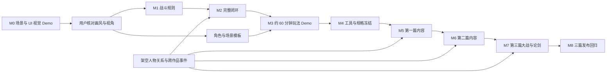

# 武侠世界：开发计划与交付标准

版本：0.6 · 日期：2026-09-23 · 状态：计划草案，所有开发任务尚未开始  
设计依据：[游戏架构与系统设计](./ARCHITECTURE.md) · [三篇剧情与任务](./STORY.md)

## 1. 交付策略

按用户确定的顺序开发：**先展示场景与 UI，核对画风和视角；风格认可后，再交付约 60 分钟“相遇—成长—战斗—选择”Demo。** 所有交付仅面向 Windows x64。

所有金庸角色生活在同一个架空年代。不同作品人物的合作、冲突和战斗必须进入第二阶段的实际体验，不以按小说或年代切换世界的方式隔离人物。

**角色年龄与身份须符合各自小说主要剧情阶段。** 为每位角色记录来源作品、版本、主要剧情阶段锚点、年龄依据与身份；原著岁数不明确时使用有依据的范围。世界年表、门派共存及事件安排服从这一基线，不能因时间兼容而将角色改成不符合主要剧情的年龄或身份。

### 1.1 两阶段 Demo 与后续路线

| 交付 | 对应里程碑 | 玩家可以检查什么 | 完成边界 |
|---|---|---|---|
| 第一阶段：场景与 UI 视觉 Demo | M0 | 高清画风、地图细节、人物比例、探索与战斗视角、所有主要界面 | 可点击切换的 Windows 展示包，固定样例数据即可 |
| 第二阶段：约 60 分钟玩法 Demo | M1–M3 | 跨作品人物相遇、成长、回合战斗、选择及其后果 | 一段从开场到事件结局的可玩闭环，含基本存读档、主线对白全配音与关键战斗语音 |
| 后续：三篇完整 1.0 | M4–M8 | 同一架空世界中的 18 章主线、最终大战、华山论剑和爱情结局 | 暂估主线 27–36 小时、含探索与支线 45–60 小时；第二阶段完成后重估 |

M1 的战斗原型与 M2 的系统闭环是第二阶段内部步骤。第一阶段交付后，依据用户的画风/视角反馈修订并得到认可，才进入第二阶段。长期系统与内容规模不构成第一阶段验收前提。

角色配音采用 AI 生成与人工试听修整，开发期生成后随 Windows 包离线发布。第一阶段可附少量音色小样；第二阶段主线对白全配音；三篇主线及关键恋爱节点维持全配音，其他支线和普通 NPC 按产能扩展。供应商先做小样比较，尚未绑定，具体架构见[架构文档第 10.5 节](./ARCHITECTURE.md#105-音频与-ai-角色配音)。

### 1.2 第一阶段：场景与 UI 展示清单

Demo 打开后提供场景目录，每个页面可直接进入、返回和重复预览，不需要先跑教程、打怪或解锁剧情。目标是 10–15 分钟内浏览主要画面，不设置剧情时长要求。

| 页面 / 场景 | 展示重点 | 最小交互 |
|---|---|---|
| 主菜单与存档页 | 标题、背景、菜单层级、存档卡片 | 切换菜单、查看固定槽位示例 |
| 江湖大地图与交通面板 | 山川城镇、路线、标记、目的地与坐骑/载具信息 | 缩放、选点、切换骑马/马车/渡船预览 |
| 城镇 / 街道探索 | 斜俯视、建筑比例、人物大小、探索 HUD | 镜头平移或短距离移动、显示交互提示 |
| 客栈 / 室内探索 | 遮挡、室内构图、近景材质与灯光 | 镜头平移、遮挡预览或选中交互物查看提示 |
| 山路 / 野外探索 | 植被、山石、前后层次与路径辨识 | 镜头平移、目标提示预览 |
| 人物对话 | 不同作品人物同场、立绘、姓名、文本、选项 | 切换几句样例台词及选中状态 |
| 回合战斗 | 独立侧视、双方比例、站位、行动条、技能栏、状态 | 选招选目标、播放一段攻击/受击短预览、切换胜负结算面板 |
| 角色 / 武学 / 成长 | 属性层级、招式说明、装配和升级反馈 | 切换角色、页签、技能详情及固定前后对比 |
| 背包 / 装备 / 商店 | 道具图标、分类、装备对比、交易面板 | 切页、选择物品、切换比较状态 |
| 任务 / 关系 / 见闻 | 目标说明、人物关系与已知信息层级 | 切换条目和详情 |
| 暂停 / 设置 | 文字大小、音量、分辨率选项与返回路径 | 页面切换，文字大小预览，展示选中/禁用状态 |

实现量限制：3 个代表性探索布景（城镇、客栈、山路）、1 张大地图、1 个战斗布景，加上可复用的菜单面板。探索场景可只制作一个镜头范围，先不铺成长地图。立绘、探索形象和战斗形象至少用一套完整人物样板核对一致性；跨作品同场构图用少量展示角色即可，不要求全部角色动作集。

交付物：Windows 可运行包、场景目录、关键页面截图、简短操作说明及画风/视角反馈记录。截图方便核对，但不替代可切换的实际展示包。

可附带 3 位角色、每人约 3–5 句 AI 配音小样，在对话页试听音色和情绪。此项为 P1，不增加完整配音工具链前置要求；未完成的声音小样移至 M1，不延后视觉 Demo 交付。

不要求真实战斗计算、敌方 AI、任务链、成长结算、自动寻路、旅行扣费、存档迁移、完整四方向动画或复杂内容编辑器。样例值和预设结果在说明中标注；画面质量应接近目标风格，不能靠占位方块验收画风。

### 1.3 第二阶段：约 60 分钟玩家旅程

玩法 Demo 使用[第一篇《众路归潮》的第一章“江南会客”](./STORY.md#21-第一章江南会客完整-demo-流程)：令狐冲、黄蓉和萧峰因同一封求援书相聚，主角介入调查假信，并在芦湾旧渡共同救人。第一章完成后提供明确的事件收束和第二章线索；其余 17 章不进入这一小时 Demo 的制作范围。陆青禾与主角建立可信的友情起点，恋爱承诺留到后续篇章充分铺垫。

| 时间段 | 玩家体验 | 验证的问题 |
|---|---|---|
| 0–5 分钟 | 在芦湾醒来，遇陆青禾，进入客栈并记录旧渡石痕 | 快速说明主角处境，区分亲见事实与猜测 |
| 5–15 分钟 | 与令狐冲、黄蓉和萧峰围绕求援书核对纸张、水位和船牌 | 三人有共同事件动机，也有不同判断 |
| 15–25 分钟 | 选择一位人物的基础战术教学，可短切磋；可接失踪渡工支线 | 成长方案在战斗中有可见作用 |
| 25–35 分钟 | 选择主要同行者，乘渡船前往芦湾旧渡 | 旅行、人物行程和队伍安排衔接 |
| 35–50 分钟 | 识破唐守亭的陷阱，解锁水门并救人；另一部作品人物加入机制战 | 跨作品人物实际协作，救援目标影响出招 |
| 50–60 分钟 | 选择公开或密封转信副页，看到获救名单、人物评价和第二章线索并保存 | 两种结果都可继续主线，选择有即时与后续反馈 |

目标首次游玩约 60 分钟，允许阅读与探索差异；不靠重复战斗凑时长。原著素材与原创事件分别标记，不把人物对战结果当成原著结论。

### 1.4 第二阶段内容清单

| 类别 | 目标数量 | 说明 |
|---|---|---|
| 大地图 | 1 张，3–4 个目的地节点 | 同一世界，至少一条交通路线可用 |
| 小地图 | 3–4 张 | 复用并扩展第一阶段城镇、客栈、山路；按事件需要补充终点 |
| 战斗背景 | 1–2 套 | 复用已确认的战斗构图 |
| 经典人物 | 3 位，来自至少 2 部作品 | 有实质互动；暂定组合来自 3 部作品 |
| 可操作队伍 | 主角 + 最多 3 位伙伴 | 事件中至少有 2 位来自不同作品的角色同场参战，可暂时同行 |
| 其他 NPC | 3–5 位 | 只服务本事件与必要探索 |
| 敌人 | 2–3 类 + 1 名机制首领 | 不用大量敌人美术撑场 |
| 成长内容 | 等级 1–8；8–12 招、3 门内功、1–2 门轻功 | 能体验剑术、拳掌、内功辅助三种基础方案 |
| 任务 | `quest.main.01.jiangnan_guest` + `quest.side.01.missing_ferryman` | 1 次副页保管选择，改变关系、后续查证和路线戒备；陆青禾关系线只埋伏笔 |
| 战斗 | 3–4 场 | 短教学/切磋、机制战、结局战；可选内容不重复凑数 |
| 交通 | 徒步 + 骑乘或渡船的一种完整实现 | 第一阶段可预览更多交通 UI，真实功能逐步补齐 |
| 物品 | 10–15 个定义 | 招式与成长演示需要的装备、消耗品和任务物品 |
| 结局 | 旧渡救援同一终点、2 种副页保管反馈 | 局部分歧后汇合；三种第一篇处置和三种最终结局均属后续制作 |
| AI 配音 | 主线实际发言的所有可达分支 + 关键战斗语音 | 包括主角写定发言；逐句人工审核。UI、任务日志、可选支线不计入本阶段必配范围 |

资料与数量围绕这一小时的体验收敛。完整世界后续按地域、势力和事件扩展，所有角色始终属于同一个架空年代。

## 2. 人力、工期与估算方法

### 2.1 基准团队

| 职责 | 投入建议 | 主要责任 |
|---|---|---|
| 技术负责人 / 玩法程序 | 1 人全职 | 架构、战斗、存档、构建 |
| 客户端 / 工具程序 | 1 人全职 | 地图、UI、内容工具、集成 |
| 场景 / UI 美术 | 1 人全职 | 场景模板、地图制作、界面 |
| 角色 / 动画美术 | 1 人全职 | 人设、立绘、骨骼、招式动作 |
| 剧情 / 系统策划 | 1 人全职或由主创承担 | 原著资料、任务、数值和关卡 |
| 测试与音频支持 | 0.5–1 人阶段投入 | 回归、试玩组织、AI 音色筛选、对白试听剪辑、声音制作 |

基准为 4–6 人可覆盖上述职责，允许兼任，但不能把同时发生的多个全职工作当成同一个人的产能。大量高清角色和场景制作是主要排期约束。

### 2.2 时间基线

按正式启动后的相对周数计算；T0 是开始第一阶段 M0 的第一周，不强行假定今天就有完整团队开工。

| 里程碑 | 基准周次 | 阶段长度 | 主要产物 |
|---|---|---|---|
| M0：第一阶段视觉 Demo | W1–W2 | 2 周 | 可切换场景和主要 UI 的 Windows 展示包，交用户核对画风与视角 |
| M1：第二阶段内部战斗原型 | W3–W6 | 4 周 | 可重放的战斗、三种基础方案、首领原型 |
| M2：第二阶段内部系统闭环 | W7–W10 | 4 周 | 地图旅行、对话任务、成长和可靠存档 |
| M3：第二阶段玩法 Demo 交付 | W11–W16 | 6 周 | 约 60 分钟跨作品相遇—成长—战斗—选择及试玩报告 |
| M4：三篇内容工具与排产 | W17–W22 | 6 周 | 编辑工具、三篇任务图、恋爱状态与多人物事件调度验证 |
| M5：第一篇内容完成 | W23–W42 | 20 周 | 《众路归潮》六章、18 条支线和三种篇末处置 |
| M6：第二篇内容完成 | W43–W62 | 20 周 | 《烽火未起》六章、8 条支线、恋爱关系与大战前局势 |
| M7：第三篇与全篇 Alpha / Beta | W63–W86 | 24 周 | 《华山前夜》六章、8 条支线、最终大战、论剑五席和返现代结局 |
| M8：发行质量收尾 | W87–W96 | 10 周 | 三篇回归、候选发布包、档案兼容与发布资料 |

以上周次是假定第一阶段顺利通过风格核对的工作量基线；用户核对及画风调整时间另计，M1 必须在认可后开始，后续日期随之顺延。

三篇合计暂以 96 周为工作量基线，另预留 12–24 周用于高清资产返工、感情分支配音、招募磨合、兼容性与外部依赖，故 1.0 初步范围为 **108–120 周，约 25–28 个月**。这是扩充故事后的重新估算，需在 M3 和 M5 用真实资产、对白与关卡产能重新校准，不能解读成按当前空仓库状态已经承诺的发行日期。

- 第一阶段小团队估算 1–2 周，若需完全新制高清资产及多轮调风格，预留至 3–4 周；这是独立的首次交付，不等到 W16。
- 第二阶段在画风认可后约 14 周，预留至 16–18 周；M1–M3 是内部拆分，不增加用户必须先验收的交付层级。
- 单人全职、配合必要美术外包：第一阶段约 2–4 周，第二阶段在认可后约 4–6 个月；三篇完整 1.0 不能沿用此前单篇 24–36 个月估算，需在第一篇完成后按实际产能单独重估。
- 兼职开发先按每周可投入工时重算任务容量，不直接使用上述日历工期。
- 4–6 人 × 约 22 个基线月，为约 88–132 人月量级；含缓冲可能超过 100–160 人月。该范围只是资源规划，不是报价。

费用估算采用“各岗位实际人月成本 × 投入月数 + 美术/音频外包报价 + 工具/设备 + 内容授权 + 发行与测试支出 + 预备金”。M0 拿到视觉样板实际工时、M1 拿到完整动作实际工时后再细化金额预算，不在没有报价时给出虚假的精确总价。

配音预算单列“实际请求字符/时长 × 当前计价 + 音色创建费用 + 候选与返工费用 + 人工试听剪辑工时”。约 60 分钟游戏体验不等于 60 分钟语音，需统计分支台词量及实际成品时长。M1 小样记录通过率、重生成次数和每分钟成品工时，M3 按台词锁定后的数量复算；现有时间基线纳入音频岗位工作，但未测产能前不保证增加配音后工期完全不变。

### 2.3 关键路径

美术、资料整理和音频可与程序推进并行，但批量角色不能在骨骼规格未验证前开工，主线分支不能在任务状态与存档规则未确定前大量堆积。

## 3. 分阶段工作包

任务优先级：P0 是本阶段通关条件；P1 是本阶段期望完成、必要时可顺延的项目。负责人为职责，不是已指定的具体人员。

### M0：第一阶段场景与 UI 视觉 Demo，W1–W2

**目标：尽快交出可看的、可切换的展示包，让用户确认画风与视角。** 页面范围按第 1.2 节执行，完整游戏系统不进入本里程碑。

| 任务 | 优先级 | 负责人 | 交付物 / 完成判据 |
|---|---|---|---|
| M0-01 展示工程 | P0 | 客户端 | 最小 Godot .NET 工程、场景目录、页面切换和返回 |
| M0-02 Windows 导出 | P0 | 技术 | Windows x64 包在目标设备启动；记录引擎和 SDK 组合 |
| M0-03 三类探索布景 | P0 | 场景美术、客户端 | 城镇、客栈、山路的高清镜头与 HUD，有限平移或移动 |
| M0-04 人物与战斗画面 | P0 | 角色美术、客户端 | 完整人物视觉样板、跨作品同场构图、侧视战斗及一段短动作预览 |
| M0-05 主要 UI | P0 | UI、客户端 | 第 1.2 节所有主要界面可进入，使用固定示例内容 |
| M0-06 风格参数与资料 | P0 | 美术、主创 | 字体、配色、比例、镜头参数；展示人物的原著主要剧情阶段、年龄依据和身份档案，作为外形及音色依据 |
| M0-07 交付核对 | P0 | 主创 | 展示包、截图、操作说明；收集用户意见并修订画风和视角 |
| M0-08 角色声音小样 | P1 | 音频、主创 | 3 位角色各约 3–5 句 AI 配音试听；可顺延至 M1，不阻塞画风核对 |

验收关卡：

- 展示包在 Windows 启动；用户能从目录直接访问所有主要画面，不需要玩完前置流程。
- 实际游戏画面中核对高清材质、人物比例、场景视角、战斗视角、立绘一致性及文字可读性。
- 展示角色的外形与年龄感符合其原著主要剧情阶段，身份称谓与档案一致；如附配音，音色年龄感也按同一基线检查。不得因共同世界年表冲突而改龄。
- 页面切换、页签、物品/技能选择、关闭返回均可用；样例按钮展示选中、悬停及禁用状态。
- 1080p 和 1440p 检查布局与文字；4K 先检查清晰度和缩放，不要求完整游戏性能压测。
- 简化动画可以采用关键帧或预设播放；完整骨骼、全部角色方向和技能动作放到第二阶段。
- 用户认可画风与视角后进入 M1；仍有意见则继续修改此展示包，不先批量制作剧情和角色资产。

本阶段不建立战斗模拟器、不做伤害平衡、不要求任务可通关或存档可用。界面中的升级、结算和交易用固定状态演示，不能在进度记录里标记对应玩法已完成。

### M1：第二阶段内部——战斗与成长原型，W3–W6

**目标：让玩家不依赖美术包装也能感到策略差异。**

| 任务 | 优先级 | 负责人 | 依赖及交付 |
|---|---|---|---|
| M1-01 战斗状态模型 | P0 | 玩法程序 | 依赖 M0 风格认可；建立规则类库及角色、阵位、轮次、命令与事件 |
| M1-02 属性与伤害 | P0 | 玩法、系统策划 | 固定计算层顺序、边界测试、伤害示例核对 |
| M1-03 行动与效果 | P0 | 玩法程序 | 攻击、防御、调息、药品、换位、撤退、状态持续期 |
| M1-04 确定性与日志 | P0 | 玩法程序 | 固定随机算法、命令重放、状态哈希 |
| M1-05 招式与装配 | P0 | 系统策划、工具程序 | 8–12 招基础数据及 3 种可区分方案 |
| M1-06 AI 与首领 | P0 | 玩法、关卡策划 | 2–3 类普通行为 + 1 名带明确预兆的首领 |
| M1-07 战斗表现连接 | P0 | 客户端、动画美术 | 正式动作管线与事件驱动画面，替换预设结果，接入队列、预览、日志和倍速 |
| M1-08 模拟工具初版 | P1 | 工具程序 | 批次跑战斗，输出轮数、胜负和资源曲线 |
| M1-09 音色选型与制作规范 | P0 | 音频、剧情 | MiniMax、ElevenLabs 作为候选，以同组台词比较并选定主供应商；建立角色音色档案和专名发音词典，记录成本与试听结果 |

验收关卡：

- 同一状态与命令序列重复执行 100 次，最终哈希一致；不同 Windows 测试设备上的相同数据也一致。
- 1 倍、2 倍和跳过动画得到相同战果；过程中切出窗口不会多扣资源或多执行行动。
- 4 对 6 战斗能正常结束；双重死亡、目标失效、被控、资源不足、反应链上限均有测试。
- 三种方案都能在同等成长预算下通过至少一种适合自己的挑战；差异能被玩家用自己的话解释。
- 内部试玩发现的“永远普攻即可”“无限控制”“无限回内”必须在进入 M2 前处理。

### M2：第二阶段内部——探索、任务、旅行和存档闭环，W7–W10

**目标：能完整经历一次“探索—相遇—战斗—成长—旅行—保存”。**

| 任务 | 优先级 | 负责人 | 依赖及交付 |
|---|---|---|---|
| M2-01 地图框架 | P0 | 客户端 | 扩展已认可的 M0 布景，先打通 3 张可探索地图 |
| M2-02 大地图与交通 | P0 | 客户端、玩法 | 路线条件、骑乘或渡船一种完整实现、时间和费用、失败回滚 |
| M2-03 对话图执行 | P0 | 工具、剧情 | 条件、选项、效果、文本表和立绘连接 |
| M2-04 任务状态机 | P0 | 玩法、剧情 | 1 条主线、1 条分支；奖励幂等、互斥结局 |
| M2-05 角色与物品 | P0 | 玩法、客户端 | 背包、装配、升级、修炼、简单商店 |
| M2-06 关系与伙伴 | P0 | 玩法、剧情 | 跨作品人物会面、临时组队、信任变化、事件占用与离队状态保留 |
| M2-07 保存与迁移 | P0 | 技术 | 基本槽位、备份、校验和损坏恢复；本阶段产生版本变更时提供迁移样本 |
| M2-08 内容编译校验 | P0 | 工具程序 | Schema、ID、引用、资源路径、出生点检查 |
| M2-09 语音资产与播放 | P0 | 工具、客户端、音频 | 稳定台词 ID、生成清单、审核状态、增量重生成；接入本地播放、字幕、重播、跳过、独立音量及缺音降级 |
| M2-10 人物剧情锚点审核 | P0 | 剧情、主创 | 补齐登场人物的主要剧情阶段、年龄/身份依据、已知经历与关系；审核跨作品事件不会通过改龄或改换核心身份解决年代冲突 |

验收关卡：

- 新游戏走完主线、回到安全点保存、退出、重新启动后读取，任务与物品一致。
- 连续点击传送、加载失败、目标地图缺失时不重复扣费；故障恢复后仍能旅行。
- 重复消费同一场战斗结算、重复进入对话完成节点，不重复领取奖励。
- 人为中断写档或损坏当前槽位后能恢复上一份有效备份；不覆盖最后有效文件。
- 室内与室外往返、人物离队、重进地图不会刷新一次性宝箱或复活剧情移除的 NPC。
- 战斗失败、撤退、任务失败都有可继续的路径，不留下无法操作的世界状态。

### M3：第二阶段约 60 分钟玩法 Demo，W11–W16

**目标：给出足以判断项目是否值得继续扩大的完整体验。**

| 任务 | 优先级 | 负责人 | 交付 |
|---|---|---|---|
| M3-01 事件地图完成 | P0 | 场景美术、关卡 | 3–4 张地图完成光影、碰撞、遮挡与交互点 |
| M3-02 人物与动作 | P0 | 角色、动画 | 本 Demo 所需人物与动作达到第一阶段确认的视觉标准 |
| M3-03 任务与人物事件 | P0 | 剧情策划 | 第一章主线、失踪渡工可选支线、三侠互动、旧渡机制战与两种副页反馈；完成保底线索和人物占用配置 |
| M3-04 三流派完整化 | P0 | 系统策划 | 武学、内功、轻功、成长及洗点闭环 |
| M3-05 UI 和输入 | P0 | 客户端、UI | 完整菜单、日志、焦点、快捷键、字体缩放 |
| M3-06 音频与 AI 角色配音 | P0 | 音频、剧情、客户端 | 主线所有可达分支对白全配音、关键战斗语音、环境及交互声音；逐句审核、字幕核对与游戏内混音 |
| M3-07 性能整治 | P0 | 技术 | 典型探索和 4 对 6 战斗达到玩法 Demo 性能目标 |
| M3-08 试玩与修订 | P0 | 主创、测试 | 两轮 6–10 人试玩，记录问题并完成一轮修订 |

验收关卡：

- 完成第 1.4 节内容清单，关键场景不保留明显占位图、调试文案或缺失动画。
- 首次进入的测试玩家中，至少 80% 能在无需现场解释的情况下完成第一场非教程战斗和第一次旅行；样本较小，只作为问题发现门槛。
- 大多数测试者能指出至少两种可用战术，且愿意尝试另一套武学或另一种关系选择。
- 至少两部作品的角色直接互动并同场参战；玩家选择实际改变助阵、关系或后续反馈。
- 分别以令狐冲、黄蓉、萧峰作为主要同行者完成旧渡战；另一部作品人物都能加入实际战斗，三条路径均取得签押副页并到达同一事件终点。
- 完成或不接失踪渡工支线、公开或密封副页都能保存并开启第二章线索；救出者名单、人物评价与下一章查证提示按选择变化。
- 登场人物的年龄、身份、外形、音色和已有经历符合所选原著主要剧情阶段；后续身份或关系变化有明确游戏事件依据，不混用同一人物不同年龄阶段的设定。
- 同一场景在 1080p、1440p、4K 输出下检查清晰度、文字、遮挡和安全区，记录截图。
- 连续 2 小时及 100 次切图无阻断异常；存档恢复和旧档迁移回归通过。
- 主线所有可达分支的必配台词覆盖率为 100%，包括主角已写定发言；没有未审核、漏音、错配角色或文本变更后未更新的语音。关键战斗语音清单完成。
- 人名、地名和武学名发音正确，角色情绪与音色一致，字幕与音频匹配；离线播放、跳过、重播、语音音量和缺音降级均通过。重播不重复执行奖励或其他对话效果。
- 没有会阻止主线继续的缺陷；遗留问题按严重级别和修复责任人登记。

若战斗和跨作品人物互动仍不能成立，下一周期继续迭代第二阶段 Demo。不得以新增更多地图代替解决核心体验问题。

### M4：系统补全与内容工具，W17–W22

**目标：把“做一段”转为“能稳定制作多段”。**

| 任务 | 优先级 | 负责人 | 交付 |
|---|---|---|---|
| M4-01 内容编辑工具 | P0 | 工具程序 | Godot 编辑器面板或小型独立工具，支持校验、定位错误和预览 |
| M4-02 模板库 | P0 | 关卡、美术、剧情 | 城镇/野外/室内地图模板，任务及人物事件模板 |
| M4-03 成长系统补全 | P0 | 玩法、系统策划 | 经脉分支、羁绊、师承条件、伙伴追赶与经济消耗 |
| M4-04 多人物事件调度 | P0 | 玩法、剧情 | 复用角色的并行任务、事件占用、跨作品羁绊和冲突分支验证 |
| M4-05 三篇内容排产 | P0 | 主创、全组 | 将 18 章与 34 条支线拆成分篇任务图、地图表、角色占用表、对白/配音清单、资产报价与责任分配；核定经典人物的成年阶段与原有关系依据 |
| M4-09 恋爱状态与篇章迁移 | P0 | 玩法、剧情、测试 | 验证友情、单人/复数恋爱、坦白与退出；三种第一篇处置均可进入第二篇，篇章切换不丢成长和角色位置 |
| M4-06 输入与设置补全 | P1 | 客户端 | 手柄原型、可重绑定按键、更多分辨率与音频设置 |
| M4-07 诊断与回归工具 | P0 | 技术、测试 | 测试存档生成、战斗重放、缺陷附带版本与日志 |
| M4-08 配音覆盖扩展 | P0 | 剧情、音频、主创 | 持续覆盖主线，以 Demo 的实际产能排定伙伴支线、普通 NPC 和环境对话配音清单、费用及工时 |

多人物事件调度必须验证：同一角色不重复入队或同时出现在两处；角色参与一个事件时，其他相关事件能等待、替换参与者或合理改写；事件结束后正确释放占用，关系与物品归属在各区域保持一致。

内容生产验收：策划用已有原语完成一个 10–15 分钟支线，程序不新增专属脚本；美术使用地图模板完成一个新区域，既有存档和导入规则无须改写。若工具建设超过实际收益，优先使用结构化表单和 JSON，不为好看而制作大型节点编辑器。

### M5：第一篇内容生产，W23–W42

**目标：完成《众路归潮》可独立收束、又能进入第二篇的六章。**

| 阶段 | 周次 | 工作与退出条件 |
|---|---|---|
| 前半篇 | W23–W30 | 第一至第三章正式化，相关地域与伙伴任务按批次验收；新场景和角色入库 |
| 后半篇 / Alpha | W31–W38 | 第四至第六章、18 条支线及三种篇末处置可走通；北方付款线索可进入第二篇 |
| 第一篇平衡 | W39–W42 | 核对证据保底、人物占用、恋爱伏笔与三种处置对第二篇的差异；不靠加血量撑时长 |

第一篇生产目标（沿用原先单篇规模，作为 M5 的分篇预算）：

| 内容 | 第一篇目标量（包含第二阶段 Demo） |
|---|---|
| 大地图 | 1 张统一江湖地图，约 10–12 个目的地节点 |
| 小地图 | 18–24 张，含室内；共享基础套件但要有独特布局与事件 |
| 战斗背景 | 6–8 套，允许光照与天气变体 |
| 主角与可同行伙伴 | 主角 + 6–8 位伙伴候选；同时出战最多 4 人 |
| 经典人物 | 8–12 位有实质事件的互动人物，可与伙伴重叠计数 |
| 其他 NPC | 约 25–35 位具名角色，允许共用路人动作模板 |
| 敌人视觉原型 | 10–14 类，包含 4–6 名具有专属机制的首领 |
| 武学 | 30–40 个主动招式、8–10 门内功、4–6 门轻功 |
| 任务 | 《众路归潮》6 章主线、18 条支线（10 条地域任务 + 4 条各两步的伙伴关系线） |
| 剧情文本 | 暂估 8–12 万中文字，M3 后按实际阅读时长校准 |
| AI 配音 | 主线对白全覆盖，支线和其他对白范围按 M4 清单；不把全部剧情文字字数直接当作配音字数 |
| 战斗遭遇 | 25–35 场设计战斗，包含可选切磋与支线；不以重复刷怪延长主线 |
| 篇末状态 | 1 条主轴的 3 种账簿阶段处置，全部进入第二篇 |

第一篇按[剧情文档](./STORY.md)组织六章：江南会客、两封真信、山门借道、北路断信、归潮旧石、众路公证。四条伙伴线分别围绕令狐冲、黄蓉、萧峰和陆青禾；篇末可选择公议开路、托管守路或焚私断链。剧情文档给出事件设计和任务 ID，正式对白、人物档案、关卡脚本及配音清单仍需在对应内容批次制作。

验收：第一篇六章主线和 18 条支线均有可达路径；三种篇末处置可从合适的新档/测试档到达并进入第二篇。放弃任意可选支线、失去可选证人或选择任一第一章同行者均不锁死主线；三种状态的事实、唯一物、人物所在地和篇末对白在读档后保持一致。每种推荐流派在同等预算下至少有一条可行通关路径；剧情人物的年龄与初始身份符合其原著主要剧情阶段，行踪、师承及后续变化与已发生事件保持一致，不为时间兼容改龄或改换核心身份。

### M6：第二篇内容生产，W43–W62

**目标：让《烽火未起》的失信、粮荒与人物关系变化成为可玩的后果，而非几段过场说明。**

- 制作第七至第十二章及 8 条地域支线；第一篇三种处置各有可见差异，最终均能获取顾闻策的关键罪证并进入第三篇。
- 制作沈槐受胁迫改账、白河两军对峙和公共仓被毁等关键场景；玩家能改变救出者与补给，不能让悲剧被一个高数值选项全部抵消。
- 为六名成年女性角色制作友情与恋爱前半段，原有伴侣关系的变化须有双方独立场景；建立第二段恋情前提供坦白和个人同意的选择。
- 完成第二篇主线及关键恋爱节点配音、可达性测试和人物原著阶段复核。

退出条件：第七至第十二章可通关，8 条支线均有可达完成与明确失败/放弃结果；无恋人、单恋人与复数恋人存档都能进入第三篇，白河两种行动顺序不会卡住大战准备。

### M7：第三篇、大战与全篇 Alpha / Beta，W63–W86

**目标：完成《华山前夜》的战区大战、华山新五绝和三种最终结局。**

| 阶段 | 周次 | 工作与退出条件 |
|---|---|---|
| 大战前半 | W63–W70 | 第十三至第十五章、8 条地域支线和江南客栈失去后的关系场景 |
| 战区与决战 / Alpha | W71–W78 | 第十六至第十七章的多战区状态、真实小队机制战、顾闻策结局及战后安置 |
| 论剑与结局 / Beta | W79–W86 | 第十八章五席选拔、玩家参赛/旁观、留江湖两种路线与独自返现代；跨三篇存档回归 |

三篇 1.0 暂定总量：18 章主线、34 条可选支线、六名成年女性角色的友情与可达恋爱路线、三种最终状态；小地图约 42–54 张、战斗背景约 15–18 套、设计战斗约 60–80 场、剧情文字约 28–40 万中文字。后三项是排产上限假设，须在 M3 和 M5 按实际制作时间校准，不能把数字当成填充任务。主线对白与关键恋爱节点全配音；其余支线配音范围在 M4 按产能确定。

验收：三篇 18 章、34 条支线及三种最终结局从合适的新档和节点档可达；不同第一篇处置、第二篇救援顺序、第三篇作战次序都能完成大战。华山论剑在主角参赛、旁观和返现代路线中均评出五个有记录的席位；留江湖与返现代的恋爱告别、人物位置、唯一物和存档状态一致。普通难度无恋人存档也能通关，复数恋人不产生重复人物或无限战力增益。

叙事验收逐章检查“人物想要什么、与谁冲突、玩家在何处选择、付出什么代价、后续何时兑现”；没有这五项的章节不能只靠更多战斗或对白量算完成。大战前必须已见顾闻策的货仓、私兵、粮价操纵和救援理念；华山五席必须有实际切磋记录；返现代的条件、只许主角一人通过的限制与情感代价须在终章前铺垫。六条恋爱路线各有至少四个情感节点和可保留的友情结局，黄蓉、任盈盈、阿朱的原有关系变化要包含当事双方的独立场景。试玩记录玩家是否理解关键冲突、是否记得自己选择造成的后果，以及告别与结局是否可信；有普遍困惑时修改铺垫与演出，不只补解释性任务文字。

### M8：发行质量收尾，W87–W96

**目标：把能通关的版本变成可以交给普通玩家的版本。**

- 修复阻断、崩溃、丢档、重复奖励、严重显示和输入问题。
- 在 Windows 实际目标设备运行发行包；签名、安装、卸载和首次启动按发行渠道要求准备。
- 验证旧版存档迁移、长时间游玩、频繁切图、最复杂战斗、字体放大和极端背包数据。
- 完成字幕、输入设置、清晰度、画面档位与声音设置的回归；核对必配台词清单、音频审核状态和文本版本一致性，在断网环境验证所有正式语音可播放。
- 完成内容来源、可用范围、第三方许可说明、制作名单及发行材料的整理。
- 准备候选包、版本号、校验信息、更新说明、已知问题及回退方案。
- 发布渠道和实际公开发布由项目后续发行安排决定；本轮交付只包含规划文档。

退出条件：无已知 P0/P1 缺陷；核心性能目标满足或有清晰的硬件要求调整；所有正式内容可达；保存恢复通过；正式包与测试通过的版本一致。

## 4. 第一阶段前两周安排

这两周只服务视觉 Demo，先把用户需要看的画面做齐。若美术返工或风格调整需要更多时间，继续调整 M0，不自动进入玩法开发。

| 工作日 | 程序 / 集成 | 视觉制作 | 当天可检查的结果 |
|---|---|---|---|
| D1 | 最小 Godot 工程、场景目录与 Windows 导出 | 明确高清画风、人物比例和视角草案 | 展示框架可启动 |
| D2 | 探索视口与短距离镜头控制 | 城镇背景、主角探索形象 | 第一张探索画面 |
| D3 | 布景切换、HUD 与交互提示 | 客栈和野外代表镜头 | 三类探索构图 |
| D4 | 对话面板、选项状态 | 跨作品人物立绘与同场构图 | 可点击对话样板 |
| D5 | 战斗面板和预设短动作播放 | 侧视战斗布景、人物、攻击特效样板 | 探索与战斗视角可直接对比 |
| D6 | 大地图缩放、节点选择、交通面板 | 大地图与载具 UI | 地图与交通预览 |
| D7 | 角色/武学/背包/装备/商店共用面板 | 图标、字体与面板修整 | 成长与物品界面齐备 |
| D8 | 任务/关系/见闻、主菜单、设置和存档示例 | 各页面细节统一 | 主要界面目录齐备 |
| D9 | Windows 运行、分辨率与导航检查 | 文字、遮挡和比例调整 | 无导航阻断的展示包 |
| D10 | 打包、截图与操作说明 | 整理待核对的画风和视角项 | 第一阶段交付用户核对 |

没有 Windows 测试设备时，导出包可以先制作，但 Windows 实际运行验收保持未完成。开发主机的操作系统不等于支持平台；当前没有其他平台适配、签名、公证或发布工作。

## 5. 美术与内容生产管理

### 5.1 每件资产的生命周期

`需求卡 → 概念草图 → 风格确认 → 分层制作 → 动画/导出 → 引擎集成 → 实机验收 → 入库`

需求卡至少包含：资产 ID、地域、来源作品、角色/场景用途、视角、屏幕尺寸、源文件规格、动作与表情清单、允许复用范围、来源、负责人及验收状态。角色视觉与音色资产另附主要剧情阶段锚点、年龄依据和身份，作为制作与审核的共同基线。

- 场景不是只有背景图，还包括遮挡层、碰撞、寻路、交互物与音频区域。
- 人物不是只有立绘，还包括探索方向、战斗动作、头像、表情与受击反馈。
- 完成定义以集成运行结果为准；源文件画完但没有进入游戏不算完成。
- 每周检查资产数量、返工率和平均制作工时，更新剩余产能估算。
- 地图套件、路人动作和通用特效可以复用；关键人物面部和标志性武器不能随意互换。

### 5.2 第二阶段玩法 Demo 资产台账

| 资产组 | 需要列出的最小项目 | 完成条件 |
|---|---|---|
| 主角 | 设定图、探索 4 向、战斗动作、头像、对话立绘 | 三个界面中的人物外观一致 |
| 本事件所需伙伴 | 同上；各自至少一种有辨识度的招式 | 可区分武器、动作和战斗角色 |
| 经典人物 | 经资料核对的形象要点、立绘、所需场景或战斗动作 | 行为与视觉不违背人物档案 |
| 3–4 张地图 | 背景分层、交互点、遮挡、落点与路径 | 主线可走通，入口可见，无卡点 |
| 2–3 类敌人与首领 | 探索或遭遇展示、战斗动作与状态反馈 | 机制预兆和招式范围易辨识 |
| UI | HUD、对话、战斗、背包、成长、地图、关系、设置、存档 | 鼠标与键盘均可操作 |
| 音频 | 地图/战斗音乐、环境、命中/格挡/破绽、菜单反馈 | 音量平衡，无缺音或叠播失控 |
| AI 角色配音 | 音色档案、逐句台词清单、发音词典、审核母带、运行时音频 | 主线全部分支必配台词及关键战斗语音完成，声音、字幕与角色对应正确 |

上述完整资产台账适用于第二阶段。第一阶段只要求第 1.2 节的代表性布景、展示人物及界面；资料整理按“展示或事件是否马上会用到”排序。

### 5.3 AI 配音制作流程

1. **音色小样**：使用固定台词集测试平静交谈、情绪变化、长句和武侠专名。选定原创合成音色或可用音色库，记录角色、供应商、模型标识、音色 ID、参数及可用范围。
2. **台词锁定**：每个说话节点分配稳定 `line_id`，记录角色、字幕、情绪和发音标注；分支对白也进入清单。主线文本与音色确认后再批量生成。
3. **生成与审核**：AI 生成候选，由音频与剧情人员试听，处理错读、情绪不当、杂音、截断和音色漂移；选定母带并标记审核通过。
4. **游戏内集成**：修剪静音、统一响度、导出音频，绑定台词 ID；连贯试听完整对话及混音，检查字幕和跳过操作。
5. **变更维护**：修改文本、发音词典、音色或参数时，标记受影响资产并增量重生成。保留已审核成品及生成记录，避免构建或模型更新时无意换声。

配音完成以游戏内播放和人工审核为准，不能把“API 返回成功”视为成品。第一阶段只做小样，第二阶段再建立批处理工具；密钥只存在于制作环境，不进入仓库与游戏包。

## 6. 测试、平衡与质量标准

第一阶段按 M0 的视觉、导航和 Windows 运行标准验收。以下战斗、事务和存档标准从第二阶段对应功能开始实施，不作为视觉 Demo 的完成门槛。

### 6.1 第二阶段起持续保留的回归场景

| 编号 | 场景 | 应保证的结果 |
|---|---|---|
| T01 | 同速角色排序、死亡后轮到其行动 | 次序稳定，死亡者不会行动 |
| T02 | 持续效果同时使双方最后角色倒下 | 结果按规则一致，不受动画先后影响 |
| T03 | 点穴、驱散、免控、反应同时出现 | 持续期正确，无无限控制或反击 |
| T04 | 满血治疗、内力不足、目标在提交前失效 | 拒绝或修正行为明确，不无故扣费 |
| T05 | 连点旅行、途中遇敌、目标加载失败 | 单次扣费、状态回滚或继续正确 |
| T06 | 战斗奖励、任务奖励事件重复处理 | 奖励只发一次 |
| T07 | 写档中断、校验失败、迁移失败 | 最后有效档可恢复，不静默丢物品 |
| T08 | 跨作品组队、角色被两个事件需要、离队后返回 | 无重复角色，占用正确释放，关系与世界状态一致 |
| T09 | 100 次切图、反复开关 UI | 无持续内存增长或重复信号订阅 |
| T10 | 字体放大、窗口比例变化、键盘操作 | 无关键文字遮挡或焦点死路 |
| T11 | 分支选择后读档、放弃支线、移除 NPC | 主线不锁死，任务状态和人物位置合理 |
| T12 | 调速、跳过动画、窗口失焦 | 战果不变，输入与音频可恢复 |
| T13 | 断网播放、缺失或损坏音频、快速切换台词 | 本地语音可播放；缺音可继续看字幕；旧回调不误推进新台词 |
| T14 | 重播、静音、暂停、切场景和倍速战斗 | 不重复触发剧情效果，语音可正确暂停或停止，战斗喊声不失控叠播 |
| T15 | 修改台词、音色档案或发音词典后构建 | 过期音频可定位；未审核或缺失的必配对白阻止配音验收通过 |
| T16 | 人物外形、身份称谓、音色或跨作品前史改动 | 数据检查锚点引用和字段；人工核对年龄、身份及经历符合原著主要剧情阶段，无为兼容年表而改龄 |
| T17 | 第一章三种同行者、支线完成/未接、副页公开/密封 | 均可救人并取得签押副页；跨作品人物实际参战，选择反馈及存档一致 |
| T18 | 第三章任一救援优先级、第五章任一石室结果、任意可选证人缺席 | 保底底账与公事罪证可得，第一篇三种处置可选，不出现重复人物或唯一物 |
| T19 | 第一篇三种账簿处置切入第七章、第二篇两种白河救援次序切入第十三章 | 篇章、任务、人物位置、物品与成长连续；旧地区可返回且过期支线有明确状态 |
| T20 | 无恋人、单恋人、复数恋人、未坦白或已坦白回返意向 | 各角色有独立同意、拒绝、暂离与告别状态；不产生重复角色、隐藏恋情自动成立或无限合击增益 |
| T21 | 大战两种作战次序、主角参赛/旁观论剑、三种最终结局 | 战区可达，五席名单始终为五人并与战斗记录一致；返现代不触发普通旅行系统 |

### 6.2 平衡验证

- 建立固定成长预算、固定装备预算、固定对手的测试集，不能用不同等级比较流派强弱。
- 首先由人工制定每种流派的基本策略，再用批量模拟观察趋势；弱 AI 的失败不能直接说明玩家流派无用。
- 每轮数值改动比较胜率、平均轮数、药品消耗、内力压力、控制覆盖率与失败原因。
- 若一种策略在大多数场景同时更安全、更快、更省资源，应检查机会成本和敌人机制；不只削伤害。
- Boss 难度来自信息、资源与时机选择，避免隐藏必败、无提示秒杀和过长血条。
- 加入故事/标准/挑战难度时，优先调敌人策略、容错与资源供给，并明确差异；不影响主线内容可达性。

### 6.3 缺陷分级

| 等级 | 示例 | 发布原则 |
|---|---|---|
| P0 | 丢档、必现崩溃、无法启动、大范围状态损坏 | 立即处理，阻止交付 |
| P1 | 主线卡死、核心系统不可用、重大重复奖励 | 阻止里程碑和发行交付 |
| P2 | 可绕过的支线问题、局部严重显示或性能问题 | 评估影响，明确修复周期 |
| P3 | 轻微穿模、错字、非关键布局问题 | 汇总修整，不无限延期主里程碑 |

缺陷报告包含构建版本、平台、最小复现步骤、相关存档、随机种子或命令日志。无需记录测试者个人身份信息。

## 7. 风险与应对

| 风险 | 早期信号 | 应对与影响 |
|---|---|---|
| 全部小说范围失控 | 需求持续增加人物/门派却没有删项 | 按地域和事件排期；同代共存不等于首版必须实装所有角色 |
| 架空关系自相矛盾 | 统一年表要求角色改龄、改换核心身份或混用不同人生阶段 | 原著主要剧情年龄与身份优先；调整跨作品年表、事件连接和共存说明，不以原著年代禁止相遇 |
| 高清资产产能不足 | 一个角色样板多次返工，动作始终纸片化 | M0 先确认画风，M1 验证完整动作再批产；优先减少角色数和动作变体 |
| C# / SDK / 导出组合有问题 | 编辑器可跑但导出崩溃 | M0 Windows 展示包验证；选择可证实的版本组合 |
| 架构过度建设 | 视觉 Demo 之前就搭建大量玩法工具 | M0 只做展示；M1–M3 再建设支撑一小时体验的最小系统 |
| 战斗只有堆数值 | 普攻和单一套路解决全部遭遇 | M1 通过三流派与首领机制验证，不等待更多内容 |
| 剧情分支爆炸 | 每次选择都拆出新地图和整段主线 | 主要采用局部差异与汇合节点，保留少数关键不可逆选择 |
| 三篇剧情量与配音超出产能 | 第二篇开始对白、关系分支和场景工时持续超出 M5 基线 | M3、M5 按实际产能重估；先减少重复场景和低作用支线，保留三篇冲突、爱情节点、大战与华山终局 |
| 爱情线缺少可信变化 | 原有伴侣突然消失、靠送礼表白、复数恋人互不知情 | 为每位当事人写独立抉择与拒绝路径；同场对白及返回现代告别进入试玩与状态测试 |
| 存档后期难以兼容 | ID 频繁改名，保存节点路径 | 稳定 ID、版本迁移与固定旧档样本从 M2 开始 |
| 跨作品联动停留在摆角色 | 人物同场却互不影响剧情和战斗 | 第二阶段至少一场事件与实际战斗由跨作品互动驱动，验收选择后果 |
| AI 配音错读或人物声音漂移 | 同一角色跨句音色变化，专名读错或情绪失真 | 固定音色档案、发音词典及人工逐句试听；不合格句局部重生成 |
| 配音返工或供应商变化 | 剧本频繁修改，模型更新、音色不可用或费用超预期 | 台词定稿后批量生成，保留已审核音频与元数据；增量重做受影响句，按实测产能重估排期 |
| 发行内容可用范围未确认 | 关键人物/字体/配乐来源无记录 | 台账前置，发行前完成确认；不擅自把本项目改成另一套原创世界 |
| 优化推迟导致重画 | 单图占用接近全部纹理预算 | 持续测纹理与峰值内存，分块和裁剪从样片执行 |

## 8. 范围调整规则

每次新增需求回答四件事：它改善哪一段玩家体验、影响哪些系统、增加多少内容资产、替换哪项现有工作。未完成评估的想法进入后续清单，不直接进入当前里程碑。

延期时按以下顺序缩减：

1. 额外表情、天气变体、非必要过场和超出已承诺清单的路人/环境配音；保留第二阶段主线对白全配音与关键战斗语音。
2. 重复功能的装备、普通 NPC、支线和地图数量。
3. 额外地域、门派和战斗流派；保留跨作品人物联动。
4. 各篇额外任务与场景变体；必须保留三篇连续因果、最终大战、华山新五绝、可达返现代结局，以及友情与爱情主线的完整铺垫。

第一阶段必须保留主要场景与 UI 的高清风格核对。第二阶段及后续必须保留：高清且统一的画面、跨作品人物的可信互动与战斗、大小地图旅行、回合制策略、多种有效成长方案、可靠存档及完整事件结局。不能为了赶进度把用户的核心要求降为像素风或纯文字战斗。

## 9. 日常协作与完成定义

- 每周提供可运行构建及一次短演示；每两周做一次实际试玩与任务调整。
- 程序、剧情和美术都提交可评审产物；重要系统或世界规则变更更新架构决策记录。
- 第一阶段页面完成定义：目标风格画面齐备、样例交互可用、导航正常、用户意见已记录；不得等同于对应玩法完成。
- 第二阶段功能完成定义：行为符合设计、相关异常路径已处理、需要的测试通过、资源集成完毕、无阻断缺陷、文档同步。
- 内容的完成定义：资料核对，角色年龄与身份符合原著主要剧情锚点，人物动机成立，条件和奖励正确，相关分支可到达，运行中无缺图缺音，资产来源入账；必配对白的文本与音频版本一致，并经人工试听及游戏内验收。
- 记录实际耗时、返工原因和遗留问题；不以提交次数、代码行数或素材张数代替进度。
- M3 与 M5 后根据真实资产、对白、配音和试玩产能重新估算 M4–M8；估算变化要说明原因及范围影响。

## 10. 下一步的默认执行顺序

下一轮实现从 M0 的场景与 UI 展示工程开始，制作第 1.2 节的各类画面并导出 Windows 展示包。用户核对画风、视角和人物比例，调整完成并获认可后，再进入约 60 分钟玩法 Demo。

| 项目 | 当前决定 | 当前需要核对的部分 |
|---|---|---|
| 世界组织 | 所有角色生活在同一个架空年代，保持各自小说主要剧情的年龄与身份 | 先确定人物剧情锚点，再细化兼容其身份的世界前史、门派共存与跨作品事件 |
| 交付顺序 | 场景与 UI 视觉 Demo → 用户认可 → 约 60 分钟玩法 Demo | 第一阶段先验证画面，不提前堆完整玩法 |
| 画面视角 | 暂定斜俯视探索 + 独立侧视战斗 | 在第一阶段直接预览，由用户反馈调整 |
| 事件入口 | 《众路归潮》第一章“江南会客”，三侠因假求援书相遇并共同救人 | 制作前完成人物原著阶段核验、正式对白和可玩节奏验证 |
| 队伍 | 主角 + 最多 3 位伙伴 | 队伍在探索、战斗与菜单中的显示密度 |
| 目标平台 | 仅 Windows x64 | Windows 包启动、画面和交互验收 |
| 角色配音 | AI 制作、人工审核、离线播放；第二阶段主线对白全配音 | 第一阶段可试听少量小样，M1 确定音色与供应商，M3 验收覆盖和质量 |
| 开发规模 | 小团队基线，提供个人估算 | 实际人数与资产产能确定后重估 |

第一阶段的成功标准是用户能看清各类场景与 UI，并认可画风和视角；第二阶段的成功标准是这一小时的跨作品江湖体验让玩家愿意继续探索。
