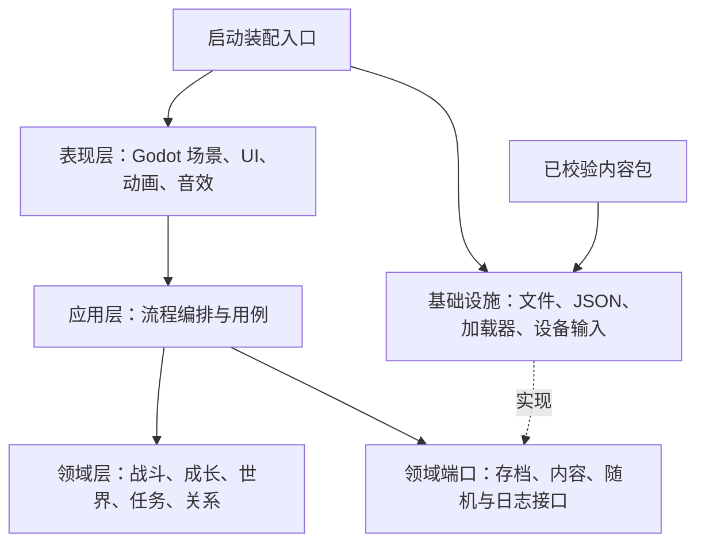

# 武侠世界：游戏架构与系统设计

版本：0.8 · 日期：2026-09-26 · 状态：探索式剧情设计基线；M0 展示工程实现中

配套文档：[剧情与任务设计](./STORY.md) · [开发计划](./DEVELOPMENT_PLAN.md)

## 1. 项目定位与已作出的决策

制作一款以金庸小说人物、门派和武学为基础的**高清 2D 单机武侠回合制 RPG**。所有角色生活在同一个架空年代，不同作品人物之间的相遇、合作、冲突与战斗是核心卖点。玩家扮演从现代穿越而来的普通人，在探索、结识人物、学习武学和参与江湖事件的过程中，形成自己的武学流派与人物关系。

核心体验是“进入群侠同世的江湖，见证不同作品人物碰撞，与他们建立关系，并用自己练成的武功参与其中”。地图规模、招式数量与数值上限都服务于这个体验。

| 项目 | 本版决策 | 决策理由 |
|---|---|---|
| 引擎 | Godot 4.7.2 .NET 稳定版 | 原生 2D 工作流适合分区地图，场景编辑与桌面发布链路完整 |
| 语言 | C#；编辑器工具必要时使用少量 GDScript | 战斗、任务、存档可形成独立且可测试的规则库 |
| 运行时 | 优先 .NET 10 LTS；M0 验证引擎及导出兼容性 | 覆盖预计开发周期；版本组合验证是开工关卡 |
| 目标平台 | 仅 Windows x64 | 所有 Demo、测试与发行包均按 Windows 排期 |
| 游戏模式 | 离线单人，本地存档 | 不依赖服务器，不让网络问题进入核心玩法 |
| 画面 | 斜俯视高清手绘场景，正常比例人物，独立侧视战斗场景 | 保持武侠绘画质感，同时控制角色动作制作量 |
| 地图 | 江湖大地图 + 可探索的小地图 + 独立战斗场景 | 场景间加载，支持驿站、骑乘、马车、渡船与剧情传送 |
| 战斗 | 明确轮次、速度排序、队伍站位和武学组合 | 可预判、可规划，兼顾传统回合制与配队深度 |
| 队伍 | 主角 + 最多 3 位伙伴；敌方最多 6 人 | 控制战斗节奏、画面密度与资产成本 |
| 叙事 | 全角色同处一个架空年代，统一江湖中的跨作品事件 | 保留人物辨识度，创造原作中不曾发生的相遇与交锋 |
| 角色年龄与身份 | 原则上保持各自小说主要剧情阶段的年龄与身份；阿青采用明确标注的原著故事后原创延伸阶段，以 18 岁登场 | 年代融合不得改变原著人生阶段；阿青的本作年龄不得冒称原著事实 |
| 角色配音 | AI 生成 + 人工试听修整，开发期生成并随包发布 | 固定角色音色，离线播放，降低对白迭代成本 |
| 内容生产 | 稳定 ID、数据配置、场景模板、内容校验器 | 新增武学、任务和地图无需复制系统代码 |
| 第一阶段交付 | 可切换场景与 UI 的视觉 Demo（M0） | 先让用户核对画风、人物比例、探索/战斗视角和界面布局 |
| 第二阶段交付 | 约 60 分钟“相遇—成长—战斗—选择”Demo（M1–M3） | 画风与视角获用户认可后，再实现真实玩法闭环 |

Godot 4.7.2 的发行信息见[官方归档](https://godotengine.org/download/archive/4.7.2-stable/)。使用 C# 需要 .NET 版编辑器与独立 SDK；当前官方文档说明 Godot 4 C# 不支持 Web 导出，因此浏览器版不在本路线内，详见 [C# 官方说明](https://docs.godotengine.org/en/stable/tutorials/scripting/c_sharp/c_sharp_basics.html)。.NET 10 的支持周期见 [Microsoft 官方支持政策](https://dotnet.microsoft.com/en-us/platform/support/policy/dotnet-core)。以上是选型依据，不代表已经在本仓库完成兼容性测试。

### 1.1 本轮规划的默认假设

- 首发简体中文、键鼠操作；架构保留文本本地化和输入映射，手柄完整适配进入后续阶段。
- 买断式内容结构，不设计抽卡、体力付费或日常签到；实际发行方式后续确定。
- 1.0 规划三篇连续故事，共 18 个短主线关口，必做主线暂估 16–20 小时、主动探索与支线合计约 40–55 小时；46 条可选任务分布在地区、门派与伙伴线上。M3、M5 后按实际内容产能重估。
- 所有角色在设定上属于同一个世界；制作按地域和事件批次扩展，不按原著年代隔离，也不要求第一版就实装所有角色。
- 团队按 4–6 人的小团队估算；个人开发方案见开发计划。
- 角色、故事、配乐、字体与美术的来源及可用范围进入资产台账；公开发行所需内容授权是发行准备项，目前状态未确认。

### 1.2 暂不进入首发范围

联网联机、无缝大世界、实时动作战斗、完整物理模拟、自由建造、程序生成主线、运行时在线生成配音、macOS、Linux、移动端、主机平台及开放式模组市场。预留清晰边界即可，不提前建设这些系统。角色 AI 配音按第 10.5 节分阶段建设。

### 1.3 两次 Demo 的实施边界

| 阶段 | 必须交付 | 允许简化 | 暂不实现 |
|---|---|---|---|
| 第一阶段：视觉 Demo，M0 | Windows 可运行展示包；场景目录可直接切换大地图、城镇、客栈、野外、战斗、对话及各主要菜单；高清人物和短动作预览 | 固定样例数据、预设状态切换、有限镜头平移；页面可复用布局 | 真实战斗计算、AI、任务链、成长结算、旅行扣费、存档与完整内容工具 |
| 第二阶段：玩法 Demo，M1–M3 | 约 60 分钟跨作品相遇、学习成长、回合战斗与选择后果；基本旅行及可靠保存 | 有限区域、少量人物、一个完整事件与局部分支 | 全世界实装、全部武学、长篇主线与发行级内容规模 |

第一阶段重点是实际游戏构图：探索与战斗都能直接预览，角色大小、地图细节、文字和 UI 同屏核对。视觉样板须接近目标画风；可简化交互逻辑，不能用粗糙占位画面替代风格验收。范围与页面清单见开发计划第 1.2 节。

第一阶段使用独立 `PreviewSession` 和样例数据驱动 UI；正式规则由第二阶段的应用服务接入相同显示模型，避免假数据逻辑混入战斗或存档。场景切换目录仅用于展示包。后文的完整战斗、任务、旅行事务、存档及自动化规格均属于第二阶段或后续建设，不是 M0 的前置条件。

M0 交付后收集用户对画风与视角的意见；修改展示包并得到认可，再进入 M1。不会在风格尚未确定时先制作整小时剧情和批量角色动作。

## 2. 世界观与叙事规则

### 2.1 原著元素与架空改编的边界

世界设定采用**群侠同世的架空江湖**。角色原则上以各自小说主要剧情中的年龄和身份共同生活在本世界；年代融合是世界设定前提，不能通过让角色变老、变年轻或改变核心身份来实现。阿青是单独注明的改编：本作选择《越女剑》故事结束后的原创延伸阶段，以 18 岁登场，原著故事阶段约十六七岁仍照实记录；其已知经历与牧羊、竹棒身份不得抹去。原著提供人物性格、门派气质、武学特色与关系素材；游戏重新组织世界年表、地理势力和跨作品事件，使人物可以自然相遇。

| 内容层 | 规则 |
|---|---|
| 原著参考 | 记录人物性格、说话方式、武学和代表性关系，作为人物辨识依据 |
| 角色基线 | 为每位角色选定所属小说的主要剧情阶段，锁定对应年龄、身份、已有经历与关系；阿青另记原著故事后 18 岁延伸阶段，人物档案不得把两阶段混为原著事实 |
| 架空设定 | 在角色基线之上组织共同世界、门派共存方式与跨作品关系；除阿青已明示的故事后原创延伸阶段外，改编不得突破主要剧情阶段的年龄和身份约束 |
| 跨作品事件 | 将不同作品人物的目标、立场与武学碰撞写成原创剧情，支持合作、论武、冲突与对战 |
| 玩家介入 | 主角的选择改变人物关系、事件走向和战斗条件，不预设必须复现原著结局 |
| 世界结果 | 一个持续演化的世界状态记录所有已发生事件，不为不同作品另开平行存档 |

**年龄与身份是硬约束，阿青另有明示的原著故事后改编阶段。** 每位角色先确定“原著主要剧情阶段锚点”；阿青须同时记录原著阶段与本作 18 岁延伸阶段，再据此设计外形、对白、配音、武学和人物关系：

- 锚点原则上必须落在所属小说的主要剧情中，不能为了兼容其他角色改取不符合主要剧情的幼年、暮年或身后历史形象。阿青单列原著故事阶段与故事后 18 岁延伸阶段，后者属于本作改编，不伪称原著锚点。
- 主要剧情跨度较大时，档案明确采用哪一段、对应什么身份。原著未给出精确岁数时，记录有依据的年龄范围或年龄段及其来源，不编造精确年龄。
- 同一角色在多部小说中出现时，选定一部及其主要剧情阶段作为本作基线，沿用一个 `CharacterId`；不能把年轻时的外形与晚年才取得的身份、经历无说明地拼接。
- 年龄、门派身份、师承辈分、重要亲缘和已发生经历共同核对。角色不能预先知道锚点之后才发生的原著事件；其后在本作中的成长和身份变化，必须由实际游戏剧情产生并记录。
- 跨作品年代、传承年数或历史先后无法同时成立时，以主要剧情年龄与身份为优先，记录统一世界的架空共存约定，调整跨作品年表及事件连接方式。不得以时间兼容为由改龄、取消核心身份或重写使该身份成立的关键经历；也不要求从现实出生年份推算角色在共同世界的年龄。
- 人物模型、立绘、语气和 AI 音色的年龄感均须与所选阶段一致；阿青使用本作 18 岁延伸阶段的成年表现。首期不以跨章节时间跳跃或自动老化迫使其他角色偏离主要剧情形象。

人物档案包含来源作品、参考版本、主要剧情阶段及章节依据、年龄或年龄范围及依据、身份、代表性格、武学阶段、所属势力、亲缘师承、已知经历、架空共存说明、动机、底线及可参与事件。第一阶段先为展示人物完成年龄、身份及形象所需的简短档案；第二阶段再补齐事件资料，不以全世界考据拖延视觉 Demo。

### 2.2 统一世界与跨作品事件

- `WorldId` 表示唯一的架空世界；`RegionId` 表示地理区域；`ArcId` 与 `ChapterId` 只表示三篇和章节进度，不切换到新世界或新角色实例。
- `SourceWorkIds` 记录角色涉及的参考作品，`AnchorWorkId` 与章节依据确定唯一的主要剧情阶段；例如胡斐、苗人凤可同时关联《飞狐外传》《雪山飞狐》，但只使用一组相容的人物状态。这些字段用于资料检索与内容审核，不限制角色同场、招募或组队。
- 每位角色只有一个稳定 `CharacterId`。人物外观、伤势、武学和剧情变化记录在当前状态中，不能生成多个不同年龄的同名实体同时入队。
- 全世界共用时间、货币、物品、关系与事件事实；角色是否出场由地点、行程、阵营和剧情条件决定。玩家可先探索已开放地区；同一调查组的主线关口可按到访顺序完成，`ChapterId` 只记录世界局势，单项完成以稳定任务事实判断。
- 坐骑、马车、渡船和剧情传送用于地域间旅行。主角从现代进入江湖是故事起点；第三篇最终选择可让主角独自返回现代，属于一次性结局演出，不提供往返或跨年代探索系统。
- 第一篇以“归潮石”异象解释主角来到江湖；第二篇找到最后一次回返的观测依据，第三篇取得所需石纹并在华山论剑后开放留江湖或返现代选择。完整因果见[剧情文档](./STORY.md#72-最终结局与返现代)。
- 不同作品的伙伴可共同入队、参与羁绊和战斗；是否愿意同行由人物动机与关系决定。
- 门派按统一实体建档。同名门派在不同作品中的人物、掌门和传承须统一安排；可明确架空支脉及共存规则，但必须保留角色在主要剧情阶段的身份与地位，不能靠随意撤换职务、修改师承或调整年龄解决冲突，也不能只因作品不同就生成两套互不相认的门派。
- 名剑、秘籍和其他唯一物品也采用统一 ID，归属与转移有明确事件，避免不同故事重复发放。
- 同一 NPC 同时被多个事件需要时，用事件优先级、占用及释放规则调度；持续剧情不得让角色在两个地点同时出现。

第二阶段 Demo 采用第一篇《众路归潮》的第一章“江南会客”：令狐冲、黄蓉与萧峰因同一封求援书在江南相遇，调查假信并在芦湾旧渡共同救人。完整版本由《众路归潮》《烽火未起》《华山前夜》三篇共 18 章组成：先查改信，再阻止粮道私兵冲突，最终经历大战并在华山论剑评出新的五席。第一篇的三种账簿处置是阶段状态，三篇结束后另有留江湖与返回现代的最终结局。完整人物动机、任务 ID 和分支见[剧情文档](./STORY.md)。这些均为原创游戏剧情设计，不是原著情节复述或官方人物强弱排名。

至少有一场剧情与一场实际战斗由跨作品人物的互动引发；人物不能只是放在同一张图里各说一句台词。玩家选择要改变助阵角色、关系反馈或冲突处理方式，并在后续场景可见。

### 2.3 穿越者的能力边界

- 现代经验体现在观察、谈判、推理和基于原著记忆但可能失准的事件推测，不能直接变成万能制造或无敌战斗能力。
- “见闻札记”记录人物、门派、线索与主角推测；已确认事实和不可靠记忆分开展示。
- 初始选择 1 项背景天赋，例如善察言色、善于归纳、体能基础；各自改变对话或成长效率，不替代武学修炼。
- 剧情主轴是找到自身穿越原因、经历友情与爱情的选择，并在三篇终局决定留在江湖或独自回到现代；原著人物拥有各自目标，不围绕主角停止行动。

## 3. 核心循环与游戏状态


短循环为 3–8 分钟：发现线索或敌人 → 做出决策 → 获得明确反馈。中循环为 30–60 分钟：完成人物事件、掌握新招式、验证新流派。长循环是章节推进与关系变化。

顶层状态使用显式状态机：

```text
Boot → MainMenu → Loading → Exploration
Exploration ↔ Dialogue / WorldMap / CharacterMenu
Exploration → Battle → Result → Exploration
WorldMap → Traveling → Loading → Exploration
任意安全状态 → Pause → 原状态
```

菜单暂停世界时间；剧情和战斗分别拥有输入锁。`Loading`、结算事务和场景切换过程中不开放手动保存。取消、失败与返回位置都由状态机处理，不由各 UI 自己拼接。

## 4. 引擎与工具链选型

### 4.1 方案比较

以下是基于本项目目标的工程判断，并非对引擎能力的全面排名。

| 方案 | 对本项目的价值 | 本次不选或选用的原因 |
|---|---|---|
| Godot .NET | 场景树、2D 编辑、UI 与规则代码容易拆开；适合小团队 | **采用**；需要尽早验证 C# 导出、骨骼工作流与编辑器工具 |
| Unity | 成熟商业工具和大量现有 2D 工作流 | 可作为团队已有积累时的备选；当前空仓库没有迁移收益 |
| Unreal Engine | 适合重型 3D 表现与相关制作流程 | 当前纯 2D 分区回合制不需要引入这类工程复杂度 |
| 浏览器引擎 | 链接试玩方便 | 当前更重视桌面长流程、资产制作和场景编辑，Web 发布不是需求 |
| 预制 RPG 工具 | 能快速拼出标准回合制原型 | 定制高清人物、复杂规则与长期内容工具会受既有范式约束 |

Godot 采用 MIT 许可，具体分发说明以[官方许可页](https://godotengine.org/license/)为准。

### 4.2 工具清单与冻结方式

| 类别 | 选择 | 约束 |
|---|---|---|
| 引擎 | Godot 4.7.2 .NET + 同版导出模板 | 小版本升级在独立分支回归，不能编辑器与模板混版 |
| 核心代码 | C#，纯 .NET 类库 | Domain 不引用 Godot，也不依赖文件系统或系统时间 |
| SDK | .NET 10 LTS 优先 | M0 完成最小 UI 工程及 Windows 导出运行验证后锁定 `global.json` |
| UI | Godot Control、Container、Theme | 不嵌入 Web UI；风格和尺寸集中配置 |
| 数据 | UTF-8 JSON + Schema + 语义校验 | 数据作为唯一内容源，禁止同时维护手工 JSON 与另一套手工资源表 |
| 动画 | Godot Skeleton2D / AnimationPlayer + 关键帧特效 | 不依赖付费骨骼运行时；M0 仅做短动作预览，完整动作管线在 M1 验证 |
| 角色配音 | AI 语音供应商适配器 + 本地音频资产 | MiniMax、ElevenLabs 作为试听候选；选型后锁定音色及可记录的模型版本，不将 API 接入玩家客户端 |
| 图片制作 | 可输出分层源文件的绘画工具 | 工具不限，统一导出规范、图层命名与授权台账 |
| 测试 | .NET 单元测试 + Godot 集成场景 | 规则测试框架及 NuGet 补丁版本在 M1 锁定；M0 以视觉和 UI 验收为主 |
| 版本管理 | Git + Git LFS | 代码与配置进 Git，大型分层源文件和音频进 LFS |
| 构建 | 本地脚本；随后接入仓库 CI | 本地与 CI 使用相同校验和导出入口 |

优先采用 Compatibility 渲染器，先以手绘光影、少量 2D 灯光和粒子实现画面。其目标是降低桌面硬件门槛；具体特效能否满足需求在 M0 样片验证。不同渲染器的后端与能力差异见[官方渲染器说明](https://docs.godotengine.org/en/stable/tutorials/rendering/renderers.html)。若必须切换，M0 完成切换及 Windows 样片测试，之后不同时维护两套未经验证的表现方案。

## 5. 系统架构

### 5.1 分层与依赖方向

采用**单进程模块化架构**，按功能拆模块，不采用微服务或为将来联机提前引入网络协议。



- `Domain` 拥有规则与可序列化状态，不认识场景节点、动画、音效或窗口。
- `Application` 接受命令、验证条件、执行事务、输出结果和事件。
- `Presentation` 显示只读状态快照，把交互转换成命令。UI 不直接改气血、物品或好感。
- `Infrastructure` 实现加载、保存和平台能力；通过接口注入，不能成为规则隐式依赖。
- `Bootstrap` 是唯一装配入口。全局持久节点只保留应用宿主、场景路由和音频管理，避免每个模块都成为全局单例。

### 5.2 模块边界

| 模块 | 拥有的数据和职责 | 对外接口示例 |
|---|---|---|
| Session | 新游戏、读档、当前玩法状态 | `StartGame`、`ResumeGame` |
| World | 统一世界、地图状态、时辰、旅行与 NPC 所在地 | `Travel`、`ResolveSpawn` |
| Character | 属性、成长、武学装配、队伍 | `Train`、`EquipBuild` |
| Combat | 回合、行动、目标、伤害、效果、胜负 | `SubmitAction`、`AdvanceTurn` |
| Narrative | 对话图、条件、选项与剧情演出请求 | `ChooseDialogueOption` |
| Quest | 目标、任务状态、互斥分支与奖励 | `ApplyQuestEvent` |
| Relationship | 双向关系记录、信任、立场和羁绊 | `ApplyRelationshipChange` |
| Inventory | 物品实例、装备、货币与交易 | `Buy`、`TransferItem` |
| Persistence | 保存快照、版本迁移、备份与恢复 | `SaveSlot`、`LoadSlot` |
| Content | 内容索引、跨表引用、标签和版本 | `GetDefinition` |

领域事件用于传达已发生的事实，例如 `BattleWon`、`CharacterMet`、`ItemGranted`。需要立即得到成功或失败的操作用命令调用。事件按稳定次序处理，禁止用“所有系统监听所有事件”的方式隐藏循环依赖。

### 5.3 未来目录结构

以下是长期目标结构，不表示这些文件目前存在。M0 只创建 UI 展示、场景预览和 Windows 导出所需文件；规则库、内容编译器与测试工具在第二阶段逐步建立。

```text
wuxia-world/
├── AGENTS.md
├── README.md
├── docs/
│   ├── ARCHITECTURE.md
│   ├── DEVELOPMENT_PLAN.md
│   ├── STORY.md
│   └── {canon,adr,art,playtests}/
├── global.json
├── WuxiaWorld.sln
├── game/                         # Godot 项目根；仅运行时资产进入这里
│   ├── project.godot
│   ├── WuxiaWorld.Game.csproj
│   ├── scenes/{boot,preview,world,battle,ui}/
│   ├── scripts/{presentation,adapters,preview}/
│   ├── assets/{maps,characters,portraits,vfx,audio,fonts,shaders}/
│   ├── dialogue/arcXX/           # M0 展示对白（未锁稿，运行时读取；正式对白迁 content）
│   └── generated/content/        # 校验工具生成，禁止手改
├── src/
│   ├── WuxiaWorld.Domain/
│   ├── WuxiaWorld.Application/
│   └── WuxiaWorld.Infrastructure/
├── content/                      # 手工维护的结构化内容源
│   ├── schema/
│   ├── shared/{skills,items,statuses}/
│   ├── characters/              # 跨作品共享角色与关系定义
│   └── regions/<region_id>/{maps,quests,dialogues}/
├── art_source/                   # 分层绘画、动作源文件；LFS，不导出
├── tools/{ContentCompiler,BattleSimulator,VoiceBuilder}/
├── voice_source/                 # 台词清单、音色档案、发音词典与已选母带；音频进 LFS
├── tests/{Domain,Application,Integration,Fixtures}/
└── build/                        # 构建输出，忽略提交
```

当前 `game/scripts/presentation/` 下分 `App/`（宿主、路由、截图命令）与 `Ui/`（主题、字体、控件工厂）；M0 展示页及其样例数据在 `game/scripts/preview/`（`Pages/`、`Samples/`），第二阶段随 preview 目录一起退役。

Godot 项目引用 `src` 类库；基础设施中的引擎适配留在 `game/scripts/adapters`，纯文件与 JSON 适配留在 `Infrastructure`。避免将全部源代码塞进引擎项目导致规则测试必须启动编辑器。

## 6. 地图、旅行与世界状态

### 6.1 三类场景

1. **江湖大地图**：绘制山川、城池与路线；节点表示目的地，边表示可旅行路线。支持缩放、标注、路线条件和耗时预览。
2. **小地图**：城镇、客栈、山路、门派、洞窟等独立场景。斜俯视自由移动，键盘移动与点击寻路可并存；碰撞、寻路区域和视觉图分离。
3. **战斗场景**：按发生地点选择背景变体，使用固定逻辑阵位；战后返回原地图的有效安全点。

《STORY》第 0.1 节列出的 19 个门派或组织与 3 个已列背景势力，共 22 个势力地点，是完整游戏的大地图覆盖清单。每个 `map.faction.*` 有稳定节点 ID、可发现的图标或地名、至少一条可解释的进入路线、可步行的公共区域及本势力交互；同一地区可复用地形和场景模板，但不能只用图鉴条目或一段远景代替到访。节点按篇章开放，未接取或错过可选事件仍可到达公共区域。门内限制区域按剧情处理，主线必得证据始终有非门派保底路径。M0 只做大地图视觉样例，M3 只做第一章需要的地图；完整覆盖在 M6–M7 内容批次完成并逐节点验收。

大地图不要求玩家操作角色逐步走完整条路线。选择骑马、马车或渡船后显示行进反馈，按配置消耗银两与游戏时辰，并触发已确定的途中事件。

### 6.2 旅行数据

| 字段 | 含义 |
|---|---|
| `route_id`、`region_id` | 路线身份与所属地域 |
| `from_map_id`、`to_map_id`、`spawn_id` | 出入口与目标落点 |
| `travel_modes` | 徒步、骑乘、马车、渡船或剧情传送 |
| `conditions` | 剧情、天气、通行凭证、门派关系等条件 |
| `costs`、`duration_ticks` | 费用与逻辑时间消耗 |
| `encounter_table_id` | 可选途中事件表 |
| `return_policy` | 取消、失败或事件中断后的去向 |

门派地点还须在地图数据中记录 `faction_id`、`public_scene_id`、`discover_hint`、`open_chapter`、`fallback_route_id` 和 `encounter_ids`。内容校验器检查第 0.1 节清单中的每个 `map.faction.*` 都有可加载场景、有效落点和可往返路线；角色锚点审核失败时可调整事件参与者，不删除已承诺的地图地点。若已发行存档使用节点或事件 ID，改名须提供迁移映射。

坐骑是交通解锁与旅行效率系统。第二阶段玩法 Demo 实现“使用坐骑旅行”和一个明确的骑乘展示，不立刻制作所有角色的全方向骑乘战斗动作。局部地图骑乘只在允许区域开放，室内自动下马；载具不参与首发战斗。

### 6.3 场景切换事务

```text
检查路线条件和费用 → 建立旅行事务及起点快照 → 锁定重复输入
→ 在候选状态扣费、推进时间、确定途中事件
→ 异步加载目的地或途中事件场景 → 校验落点和必要资源
→ 提交候选状态与事务 ID → 自动保存 → 淡入并恢复输入
```

加载失败则丢弃候选状态、回到起点，不重复扣款、不重复推进时间。途中事件一旦提交为当前状态就保存其随机结果，读档继续该事件。事务状态、随机种子和结算标记共同进入存档，避免刷新场景重抽事件。

资源加载使用 `ResourceLoader.LoadThreadedRequest`，轮询就绪状态后再获取资源；未就绪时直接获取仍可能阻塞。场景实例化和场景树修改放在主线程，分帧处理大量节点。依据见[后台加载文档](https://docs.godotengine.org/en/stable/tutorials/io/background_loading.html)。

### 6.4 地图持久化

- 地图模板不可变，运行时只存差异：宝箱已开、机关状态、敌人刷新标记、NPC 状态和掉落物。
- 交互物具有稳定 ID，不使用节点路径作为存档身份。
- NPC 用“地点 + 世界关口 + 时辰 + 事件占用条件”确定位置，不对所有远方 NPC 逐帧模拟；开放地区只展示当前可用的事件入口与传闻提示。
- 出口必须连接有效落点；缺失落点回退到该图安全入口并记录错误。
- 小地图移动不严格按现实分钟流逝；对话阅读暂停时钟，旅行和关键行为推进逻辑时辰。
- 首发主线不设隐形永久过期条件；有时限的支线在接取时明确提示，未接取的地区故事保留后续合理入口或在局势改变后改写，不静默标记为放弃。

## 7. 回合制战斗设计

### 7.1 基本规则

采用**轮次制 + 轮内速度排序**，不是实时读条。每轮开始按当轮有效速度排序，每名存活角色获得一次主行动；速度相同按稳定实体 ID 排序。加速与减速通常下轮生效，避免行动队列被连续重排。

- 每方 2 排 × 3 槽位；我方最多 4 人，敌方最多 6 人。阵位只是目标规则，不引入格子行走战棋。
- 前排保护后排；普通近身攻击优先可接触前排，远程、穿透、轻功突进等技能可打破限制。
- 主行动包括施展招式、普通攻击、防御、调息、使用物品、换位、尝试撤退。
- 每个角色每轮最多 1 次反应，例如反击、护援或招架触发；反应不得再触发另一条反应链。
- 防御减轻下一次有效受击并持续到自身下次行动开始；调息恢复内力但暴露破绽。
- 换位消耗主行动；换人只在战外进行。普通战允许撤退，剧情锁定战明确展示原因。
- 普通战目标 3–6 轮、2–4 分钟；首领战目标 6–10 轮、6–10 分钟。这些是试玩调优目标。

首领的关键招式至少提前一轮给出意图，如蓄力、群攻、点穴或召援。AI 根据合法目标和效用评分选择动作，不读取尚未提交的玩家决策。

### 7.2 资源与决策

| 资源 | 用途 | 限制 |
|---|---|---|
| 气血 | 生存 | 战内归零进入失去战斗能力，战后按模式结算伤势 |
| 内力 | 招式和内功消耗 | 调息、药品、部分心法恢复 |
| 架势 | 防守稳定性 | 被破招消耗，归零触发一次破绽；不是第二条无限气血 |
| 势 | 连招、合击与绝招 | 战内积累，0–100，战后清空，不能刷杂兵囤满进首领战 |
| 主行动 / 反应 | 行动经济 | 限制控制、反击和道具连用 |

破绽使下一次伤害提高并取消该轮剩余反应，持续到目标下次行动结束，触发一次后消失；不额外剥夺整轮行动。这样破招有价值，也避免“速度快 + 无限控制”独占答案。

### 7.3 状态与结算顺序

行动流程：

```text
回合开始状态 → 检查存活及控制 → 等待选择或 AI 决策
→ 校验目标、资源和冷却 → 原子扣费 → 生成确定性效果事件
→ 命中/伤害/治疗/状态 → 有上限的反应 → 死亡与胜负检查
→ 自身行动结束状态 → 冷却及持续时间更新 → 下一角色
```

- 状态必须定义触发时点、叠层上限、刷新规则、驱散标签与来源。
- 流血、毒等在目标行动开始结算；同一开始阶段批量结算后统一检查胜负，双方同时失去战斗能力按失败处理，特殊任务可覆盖。
- 冷却 `N` 表示后续 `N` 次自身行动不可再次使用；施放当次不递减，UI 展示下一次可用时机。
- 时长 `N` 表示后续 `N` 次对应触发点；效果刚施加的同一触发点不重复消费。
- 点穴等硬控制最长跳过 1 次主行动；解除后获得 1 次自身行动周期的同类抗性。首领采用控制积累阈值，不直接完全免疫所有控制。
- 对 0 气血目标的治疗、复起、尸体清理与召唤占位分别定义，不能由动画时序决定。

### 7.4 初始数值模型

以下是 v0 平衡模型，供实现和模拟；参数属于配置，不是最终数值承诺。

基础属性：体魄、臂力、根骨、身法、悟性。战斗派生量：最大气血、最大内力、外功、内功、外防、内防、速度、命中、闪避、暴击、架势与状态抗性。

```text
最大气血 = 180 + 22 × 体魄 + 10 × 等级 + 装备固定加成
最大内力 =  80 + 18 × 根骨 +  6 × 等级 + 心法固定加成
外功     =  20 +  3 × 臂力 +  2 × 等级 + 武器攻击
内功     =  20 +  3 × 根骨 +  2 × 等级 + 心法攻击
速度     =  30 +  2 × 身法 + 轻功加成
命中率   = clamp(0.90 + (命中 - 闪避) / 1000, 0.65, 0.98)
基础伤害 = (招式固定值 + 攻击 × 招式倍率) × 100 / (100 + max(0, 防御))
最终伤害 = max(1, floor(基础伤害 × 克制倍率 × 暴击倍率 × 状态倍率 × 浮动))
```

外招使用外功/外防，内劲使用内功/内防；混合技能拆成两段效果，不取两种防御较低者套利。常规克制倍率限定 0.8–1.25；默认暴击倍率 1.5、暴击率上限 35%；浮动 0.95–1.05。固定值、倍率和限制均带版本。

例：攻击 100、招式固定值 20、倍率 1.2、防御 100，基础伤害为 70；克制倍率 1.2 且无暴击和其他效果，浮动前为 84。技能预览显示概率和伤害区间，不偷看随机结果。护盾、防御减伤、伤势加成的计算层顺序固定并纳入测试。

实际实现使用 64 位整数及万分比定点倍率，统一向下取整位置；公式中的小数只是策划表示法。角色升级、装备、百分比增益和临时战斗状态依次计算，避免同类倍率无限乘算。

### 7.5 确定性内核

`BattleState + BattleCommand + RngState → NewBattleState + BattleEvents`

- 输入同样的初始状态、规则版本、随机状态和命令序列，结果必须相同。
- 使用项目自有、固定算法与固定测试向量的伪随机数生成器；不依赖系统时间或运行时默认随机实现。
- 战斗与旅行使用独立随机流；UI 粒子和屏幕震动用表现层随机流。
- 稳定排序实体、效果与目标；禁止依赖哈希表枚举顺序。
- 动画消费事件，不反向决定伤害。跳过动画、倍速和帧率变化不影响战果。
- 每次行动记录状态哈希、种子状态、命令和结算摘要，可重放问题战斗。
- 反应链有单层规则及总事件上限；超限报错并保存诊断快照，不能无限循环。

## 8. 成长、武学与队伍深度

### 8.1 成长的五个维度

| 维度 | 玩家选择 | 深度来源 |
|---|---|---|
| 等级与基础属性 | 升级分配潜能点 | 生存、外功、内功与先手之间取舍 |
| 武学熟练度 | 练哪些招式、投入多少修为 | 解锁变化式与连招，不仅增加伤害 |
| 内功与经脉 | 主修心法、经脉分支 | 改变资源循环、抗性和战斗节奏 |
| 装备与招式搭配 | 武器、护具、饰物及功能词条 | 强化玩法机制，避免只追战力数字 |
| 人物与门派关系 | 师承、同行、承诺与选择 | 影响武学获取、合击、任务和队伍构成 |

三篇合计等级上限暂定 45，第一篇上限暂定 30，第二阶段 Demo 上限 8；这些数字均需平衡测试，不是经典人物的实力排名。经典高手通过角色模板、天赋和剧情表现体现实力，玩家不能仅凭等级压制一切。

### 8.2 装配规则

- 可学习多个流派，但战斗装配限制为：主动招式 6 个、主修内功 1 门、辅助心法 1 门、轻功 1 门、被动天赋 3 个。
- 主修与辅助心法的阴阳及运功条件可兼容或冲突；冲突时 UI 直接说明代价，不能藏在战斗结算中。
- 武学分为拳掌、剑、刀、棍杖、指爪与暗器等标签；第二阶段 Demo 先完成拳掌、剑和内功辅助三类。
- 招式由目标规则、资源消耗、伤害段、状态段和连携标签组合；新效果原语需要代码，常规新招式只需数据。
- 熟练度设 5 阶，每阶可有二选一变化式；实际数值随模拟调整。全局升级经验与修为点分开，避免同一资源承担所有成长。
- 悟性影响修习效率和领悟分支，设置合理上限，不让低悟性存档永久错过主线必要内容。
- 经脉采用少量有主题的分支，例如破招、调息、护体、疾行；每条都有机会成本，不先做数百个无区别节点。
- 洗点在安全城镇开放，使用可负担的银两或常规材料；不消除不可逆剧情选择。

### 8.3 三种必须验证的可玩流派

| 流派 | 主要循环 | 强项 | 可被针对的弱点 |
|---|---|---|---|
| 剑术破招 | 识破 → 削架势 → 破绽爆发 | 针对高防单体，行动预判有收益 | 内力消耗与爆发准备期 |
| 拳掌护援 | 前排承伤 → 招架护援 → 反击积势 | 队伍稳定，保护脆弱伙伴 | 后排远程与内伤效果 |
| 内功调息 | 资源恢复 → 驱散支援 → 内劲输出 | 长战和多状态敌人 | 开局爆发、点穴与调息被针对 |

这是机制模板，不提前把任意经典武学硬套到不符合原著的效果上。具体经典招式在资料核对后映射到模板，保持辨识度。

### 8.4 伙伴、关系与经济

- 关系拆为好感、信任和立场记录；前两项数值化，立场与承诺使用事件事实。
- 友情与恋爱分别记录。具名、成年且持续互动的女性角色均有可达恋爱路径；原有承诺须经人物自主处理，未解决的严重冲突只能维持友情。开启第二段恋情前，玩家需向已有恋人坦白；每位人物独立决定接受、附条件接受或拒绝。复数恋人状态不堆叠无上限战斗增益。
- 招募条件同时考虑剧情、关系、人物身份和当前事件状态；不允许靠无限送礼解锁所有人。
- 羁绊给予条件型合击或支援，每场有次数或“势”成本，不叠加无限被动百分比。
- 暂时同行、永久可招募、切磋对象、导师分别建模。不同作品的经典人物在第二阶段 Demo 中的参与类型由统一设定与事件动机决定，不默认永久入队。
- 伙伴保留个人武学特色；离队角色获得有限追赶成长，避免长期坐板凳后无法使用。
- 装备首发 5 槽：武器、衣甲、鞋、饰物、护符；每件控制 1–2 个功能词条，不做随机词条海。
- 货币主要流向旅行、住宿、训练、装备与药品。关键秘籍通过事件、师承和探索取得，不能全部直接购买。
- 战败提供重试或返回安全点；普通难度无永久角色死亡。剧情死亡须经过明确事件分支。

## 9. 剧情、任务与内容数据

### 9.1 对话与任务

首期采用有限节点类型的 JSON 对话图：文本、选项、条件分流、效果、跳转、结束。表现层处理立绘、镜头和字幕；逻辑层处理条件与结果。不建设任意脚本执行器，也不使用运行时生成文本替代正式剧情。

后续写出的全部台词按三篇 18 章切分为可在仓库中直接阅读、引用和修改的章节文件，包含该章实际发生的主线、支线、关系及地区事件对白和所有可达分支；M0 展示样例也存入对应章节文件，并明确标为未锁稿。跨章事件按实际发生章节拆分，正式对白沿用稳定事件 ID 与逐句 `line_id`。规划阶段文件可放在 `docs/dialogue/arcXX/chapterXX.md`；创建游戏工程后可将正式内容源迁至 `content/dialogue/arcXX/chapterXX.json` 等工程目录，并在 `docs/dialogue/README.md` 保留逐章索引。迁移时只保留一套可编辑的台词源，另一种格式若需要则由它生成或只作为索引，避免两份内容分歧；对白图与语音清单引用同一批 `line_id`。

条件原语包括 `HasItem`、`QuestStateIs`、`RelationshipAtLeast`、`FactEquals`、`CharacterAvailable`、`PartyContains`、`SkillLearned`、`AtRegion`、`AtMap`、`WorldGateReached`，支持受限的 `all/any/not` 组合。效果原语包括授予物品、设置事实、修改关系、推进任务、请求战斗和请求旅行。地点与条件只决定是否出现手工编写的事件，不在运行时自动生成剧情。

任务状态：`Locked → Available → Active → Completed / Failed / Abandoned`。任务目标支持交谈、到达、调查、交付、战胜和复合条件。主线必要物品禁止随意丢弃或出售；失败分支必须有后续或明确终点。

三篇任务图以[剧情文档](./STORY.md)的 18 个短主线关口、38 个地域支线任务、8 个伙伴关系任务为内容基线，共 46 条可选支线；十三位拟按成年阶段持续互动的女性候选，其友情与恋爱事件作为关系节点配置，成年锚点未核验者不得开放恋爱。阿青的关系节点须引用其本作 18 岁延伸阶段，并将原著约十六七岁阶段单独记录，不能把两者混作同一年龄事实。十五部作品与重点人物的[扩展草案](./canon/EXPANSION.md)使用 `encounter.*` 地区事件 ID，不把相遇伪装成已完成的任务，也不凭扩展事件增加主线前置。任务与相遇事件均须显式给出地点触发、开放条件、可见提示、保底线索、角色占用、失败与放弃结果、回收地点和结算事实。主线不允许 `Abandoned`；可选证据、恋爱或证人只调整难度、助阵与后日谈，不作为唯一通关条件。第一篇账簿处置写入跨篇章世界事实，不根据台词是否播过推断选择。

事件触发使用有限状态、局部汇合的规则：进入地图或完成相关事实时，把该地图候选事件按固定优先级评估；只有地点、前置事实、角色占用和未结算状态同时满足才展示交互入口。主线紧急事件优先，已接取限时事件其次，普通地区故事最后；同优先级按稳定事件 ID 排序。事件一旦开始即预留人物与唯一物，完成或中止时原子释放并记录结果；重进地图、读档或并行任务刷新不可重复刷出人物和奖励。若人物被其他事件占用，事件在原地点显示等待或改用已配置替代参与者，不凭空复制同一角色。

同一人物跨两部作品只建一个 `CharacterId`，尤其是《飞狐外传》与《雪山飞狐》的胡斐、苗人凤。人物只有确实出场才写入 `met_character` 一类相遇事实；独孤求败的剑迹、传闻与阿青可能只留下的作品线索使用独立的 `known_legacy` 事实，不伪造在世实体。扩展事件必须记录相遇、人物所在地、门派职位与后续是否愿意参会或助阵；主线、地区事件和华山候选名单读取同一组事实，不靠播放过场判断。

探索顺序只在少量汇合点写入可组合的事实，如救援顺序、证据完整度、人物承诺和地区支援。结局由固定三种终局加条件尾声片段组成，不为每种事件排列制作独立结局线。主线保底线索绑定始终可达的地点或替代 NPC，条件图须检查“任何可选支线均未做”与“任意一个可选证人缺席”情形。未接取事件不会仅因主角旅行自动失败；限时救援只有明确接取、提示期限且篇章推进时才可失效。

第一篇三种互斥篇末状态为 `outcome.part1.public_charter`、`outcome.part1.trusted_custody`、`outcome.part1.destroy_private`；它们全部接入第二篇。第三篇终局状态为 `ending.final.stay_rebuild`、`ending.final.stay_roam`、`ending.final.return_modern`，三种路线在所有可达的终章状态下开放。篇章切换在完成当前终章后结算人物位置、支线时限和持久事实，再原子地写入 `ArcId`、`ChapterId` 与下一章可用区域；不重置成长、物品或关系。每次剧情选择或战斗结算在应用层事务中一起更新相关事实、唯一物归属和任务状态，再由存档系统保存一致快照；重播对白、重试战斗或读档不得重复设置事实或发奖。

大战通过多个战区的世界事实、资源与援军时机表达，实际回合战仍遵守主角加最多三名伙伴的队伍上限。华山论剑是大战后的可重放切磋序列；五席由参会条件和实际结果产生，主角可参会或旁观，不预设官方跨作品实力排行。最终返现代只作为结局状态和演出，读档可回到结局选择前的合法安全快照，不生成现代世界的常规探索地图。

对话选项的不可逆结果通过措辞和必要提示表达；不把所有隐藏人物动机直接显示成“正确答案”。任务日志记录玩家已经获得的线索。

### 9.2 内容对象

| 对象 | 关键字段 |
|---|---|
| `CharacterDefinition` | `id, source_work_id, story_anchor_id, faction_id, profile_id, stats_template, art_id, adaptation_ref` |
| `CharacterStoryAnchor` | `id, source_work_id, edition_ref, main_story_segment, chapter_refs, age_spec, identity, known_events, relationship_refs`；`age_spec` 记录精确值或范围及依据 |
| `SkillDefinition` | `id, tags, costs, target_rule, effects, cooldown, animation_id` |
| `QuestDefinition` | `id, region_id, trigger_maps, prerequisites, visible_hints, priority, reservation_rules, stages, branches, guaranteed_clue, rewards, exclusive_group, expiry_notice, recovery_location`；记录失败/放弃结果与汇合事实 |
| `DialogueDefinition` | `id, entry_node, nodes, lines`；台词行含 `line_id, character_id, text_key, voice_asset_id` |
| `VoiceProfile` | `character_id, voice_profile_version, provider, model_id, provider_voice_id, delivery_defaults, pronunciation_dict_version` |
| `VoiceAssetManifest` | `line_id, locale, text_hash, voice_profile_version, generation_config_hash, asset_path, duration_ms, review_status` |
| `MapDefinition` | `id, region_id, scene_id, spawn_points, exits, encounter_table_id` |
| `RelationshipState` | `character_id, affection, trust, commitments, witnessed_events` |
| `RomanceState` | `character_id, phase, disclosure, consent_to_plural, prior_commitment_resolved, promises`；承诺与退出均需人物事件依据 |
| `WorldState` | `world_id, arc_id, chapter_id, completed_gate_ids, active_region_id, facts, character_states, event_reservations, map_deltas, party, clock`；并行任务是否完成不由 `chapter_id` 数值推断 |
| `ContentManifest` | `content_version, ruleset_version, dependencies, hashes` |

ID 用 ASCII 小写和点分层，例如 `skill.sword.break_guard`；显示名称来自中文文本表。实例 ID 与定义 ID 分开，避免两把同名剑共享耐久或改造状态。ID 发布后不可随意复用。

示例仅说明配置契约，不代表已存在的文件：

```json
{
  "id": "skill.sword.break_guard",
  "name_key": "skill.sword.break_guard.name",
  "tags": ["sword", "external", "guard_break"],
  "costs": {"inner_power": 12, "momentum": 0},
  "target_rule": "single_reachable_enemy",
  "cooldown": 1,
  "effects": [
    {"type": "damage", "stat": "external_attack", "scale_bp": 11000},
    {"type": "stance_damage", "amount": 25}
  ],
  "animation_id": "anim.sword.thrust"
}
```

### 9.3 内容构建流水线

`编辑 JSON / 场景 → Schema 校验 → 跨表与剧情语义检查 → 编译内容索引 → 运行试玩 → 打包`

校验器必须发现：重复 ID、无效引用、非法数值、缺失文本、孤立对话节点、无条件自循环、无出口地图、不存在的落点、角色重复实例、角色事件占用冲突、缺失资源、互斥任务同时激活、无提示限时条件及缺少汇合出口。复杂分支可达性用固定测试存档与条件图遍历验证；静态校验不宣称能证明所有剧情都无死锁。

正式剧情修改要同时评审来源、人物动机、玩家选择和状态变化。人物内容校验检查剧情锚点引用、年龄范围格式及身份字段完整性；原著依据、年龄感和身份是否符合主要剧情由人工审核，不能宣称静态工具能自动判断原著事实。为年代兼容而偏离锚点的改动不得通过审核。M3 后新增普通任务应以数据与场景配置完成；若每个任务都新增专属脚本，说明原语或工具边界需要改进。

## 10. 高清美术、UI 与音频

### 10.1 视觉方向

**2026-09-24 用户改定：弃用水墨宣纸风，改为蓝绿清新基调、偏写实的卡通人物。** 人物立绘采用写实比例的赛璐璐/轻厚涂：清晰线稿、两到三阶明暗、五官与肌肉结构写实但保留卡通化的眼神和发丝处理（用户参考图 `docs/art/example/` 为同类国风游戏立绘，只作风格参照，不作为图生图输入或训练素材）。整体色调以青绿、湖蓝、竹青与白为主，江南水色与晴光取代宣纸、墨色和旧金；暖色（朱红、杏黄）只做人物服饰点缀。界面在 2026-09-24 第三版起取青绿山水画自身的颜料作暖面与点缀（绢色纸面、朱砂印、赭石、泥金，见 10.4 节），表达数值状态的红色仍只有杏红。人物正常比例约 6.5–7.5 头身，成年角色面部不做低龄化，衣物、兵器和姿态承担门派辨识；不使用像素化滤镜、低分辨率放大或最近邻采样制造风格。

旧方向“工笔人物 + 写意远景”作废；界面配色已按 10.4 节改为青绿山水配色，地图与场景同样以青绿、湖蓝为主调（生产方式见 10.3）。

本次已使用 `ui-ux-pro-max` 技能检查视觉层级与交互原则。其通用检索返回的网站风格不适合本游戏，专项检索也未找到可靠的古典武侠模板；因此不照搬推荐版式，以下是依据本项目约束制定的美术规范。采用技能中的文字对比、焦点可见、颜色以外的状态提示及减少动效原则。2026-09-24 用户指出该技能面向网页设计，界面任务不再使用；检索到的游戏界面技能只讲布局与焦点机制、不涉及视觉风格，因此游戏界面按自行制定的[界面设计规范](./art/UI_DESIGN.md)执行。

### 10.2 画面与资产规格

| 资产 | 首期规格 | 验收重点 |
|---|---|---|
| 逻辑画布 | 1920×1080，支持 2560×1440 和 3840×2160 输出 | UI 随输出缩放，不能只是把整个低清画面拉伸 |
| 地图 | 单图建议 2–6 个屏幕面积，分块纹理 2048² 为主 | 视角、比例、光源一致；近看清楚、边缘无接缝 |
| 关键场景 | 分层前景、中景、远景与可交互物 | 遮挡正确，主角不会藏在大面积树冠下 |
| 探索人物 | 屏幕身高约 120–180 逻辑像素，源资产至少 2 倍 | 面向清楚，轮廓与武器可辨识 |
| 战斗人物 | 屏幕身高约 280–420 逻辑像素，源资产至少 2 倍 | 攻击重心、关节、衣摆与受击反馈可信 |
| 对话立绘 | 建议高度 2048 像素，分层表情与口型预留 | 同一人物不同表情不换脸、不漂移服饰 |
| 图标 | 128 / 256 像素，UI 装饰可用矢量源文件 | 相同描边与视觉重量，缩小仍能辨识 |
| 字体 | 正文思源黑体，标题与印章霞鹜文楷（均 SIL OFL 1.1，随包附许可） | 字形覆盖、字号、授权和真实渲染检查 |

“支持 4K 输出”不等于承诺所有探索资产在任意缩放下原生 4K 无损。首期探索相机缩放控制在 0.85–1.15，4K 下 UI 清晰度和场景清晰度分别验收；近景特写使用独立高分辨率资产。

第二阶段探索角色制作 4 个视觉方向，移动允许 8 向；战斗另做侧视骨骼与关键动作。骨骼重用基础动作，关键绝招加局部逐帧动画和特效；不能靠对整张立绘平移来冒充角色动作。左右翻转仅用于无明显不对称特征的动作。第一阶段只需足够核对比例、视角和短动作效果的样板。

### 10.3 内存与制作管线

- 原始分层文件留在 `art_source`，运行时只导入审核过的纹理与动画。
- 不把整张超大地图烘成一张 16K 纹理；按可见区域和邻接区加载，裁剪空白并管理图集。
- 4096² RGBA8 纹理未压缩约 64 MiB，带完整 mipmap 约 85 MiB；磁盘文件小不等于显存占用小。
- 线性过滤用于高清场景与角色；缩小地图的 mipmap、边缘扩展和图集留白通过样片验证。
- 地图与人物用不同图集；避免为了一个路人加载整章角色贴图。
- PNG、WebP 等是制作与导入格式，运行时内存按实际导入后的纹理格式测量。导入能力见[官方图片导入说明](https://docs.godotengine.org/en/stable/tutorials/assets_pipeline/importing_images.html)。
- 每类资产先做一个样板，锁定视角、密度、命名和导出参数后再批量生产。AI 生成图须经统一设计和人工修整，不默认生成图能直接承担分层动画。

**美术来源（2026-09-24 用户确定）：美术全部采用 AI 生成或免费资源。** 人物、场景、道具与图标由本地 SDXL 系模型生成底稿（`tools/ArtGen`，环境与复现步骤见其 README；人物立绘用 Animagine XL 4.0），人工挑选修整后入 `art_source/`；字体用 OFL 开源字体。画风改定后，博物馆 CC0 水墨古画不再直接作远景，只可作构图参考。简单资源（图标、肌理、UI 装饰、构图小样）在开发笔记本（RTX 4060 8 GB）生成，复杂资源（立绘、三视图、场景大图与高清放大）在家用台式机（RTX 4070 Ti SUPER 16 GB）生成。每项资产的来源、许可与生成记录登记在[资产台账](./art/ASSET_LEDGER.md)；模型或 LoRA 须允许商用。人物跨立绘、探索和战斗形象的一致性是 AI 管线的主要风险，M0 以一位人物的完整样板先验证。两台机器使用同一 Python 3.12 虚拟环境锁定版本（torch 2.11.0+cu128、diffusers 0.40.0）；台式机 16 GB 显存整体加载 SDXL，832×1216、40 步约 9 秒一张。局部修正用同一基础模型的重绘管线（`tools/ArtGen/inpaint.py`，任务文件 `jobs/*_fix.json`），记录源图哈希、全部遮罩参数与种子，修正过程与生成一样可复现。

**地图与城镇的生产方式（2026-09-24 拟定；2026-09-25 用户选定方案 C“引导出件”，见本节后文）。** AI 无法一次画出视角一致、可行走、可拼接的整张地图，因此按“人定布局、AI 出件、引擎拼装”分三层：

1. 布局：每张探索地图先在 Godot 中用色块摆出道路、河道、建筑占位和碰撞，确定可走区域和镜头；布局是事实来源，美术只能贴合它。
2. 出件：地面（石板、泥路、草地、水面）生成可平铺的方形纹理；建筑、桥、树、摊位、船等以固定高斜俯视角逐件生成在纯色底上，抠图后成为独立精灵，同一地区共用一套件库；主菜单、战斗背景、关键剧情特写等不需要行走的画面整张生成，再局部重绘修正。
3. 拼装：在 Godot 中用 TileMap 铺地面、把精灵件按布局摆放，前景件（屋檐、树冠）单独分层做遮挡；统一的色调与光向在引擎内用后期调色补齐，不指望每张 AI 图自己一致。

**第一步已按此落实（2026-09-24 起，城镇样板“芦湾河街”，`ExploreTown.tscn`）。探索视角定为统一的正交斜视投影：水平转 45°、下俯 30°（2:1 等距，斜视角游戏的行业常规），镜头在西南方，东西向街道在画面上自左下延伸到右上（2026-09-25 用户先指出第一版“俯视地面 + 平视房屋”拼接不对，又否定了街道自左上到右下的转向；同日俯角由 45° 改为 30°，因 45° 下地面像朝镜头立起、人物显矮）：** 布局数据 `game/scripts/preview/Samples/TownSamples.cs` 用真实平面坐标（x 东、y 南、z 上，单位约厘米，街区 48 m × 36 m，人高 175）定义河岸曲线、河面高度（-80）、石板街、小巷与井台小场、平桥、渡口石阶、南岸街、每栋房屋的占地 / 檐高 / 样式、廊棚、树、杂件和可交互点；地面多边形、可走区判定与小地图都由 `TownLayout` 从这一份数据派生。`TownView` 是唯一的投影：屏幕 X =（x cos Yaw − y sin Yaw）·k，屏幕 Y =（（x sin Yaw + y cos Yaw）·sin 30° − z cos 30°）·k，Yaw = −45°、k = 1.0；房屋可见南立面、西山墙与屋面。地面着色器按同一参数反投影回世界坐标铺纹样；房屋、廊棚、桥栏、摊位、井台、船由世界坐标的面搭成（`Solid` 盒与挤出体），按法线剔除背面、按受光方向分三阶明暗，墙面与瓦面的窗、门、瓦垄以面内局部坐标贴花；人物、树、石、坛为立着的精灵，高度乘 cos 30°。前后次序：两件在屏幕上重叠时，按占地在镜头方向上是否分离（更南或更西的在前）拓扑排序写入 ZIndex，无法分离时比较占地中心远近；廊棚屋面标为 Overhead，总压在其下行人之上，占地中心落在其占地内的柱、坐栏等也一律排在其下（2026-09-26 修廊柱穿出屋面）。遮挡：排在行人之前的物件，其朝向镜头的面盖住行人头或胸时淡到 40%。碰撞 = 可走区（街、巷、小场、桥、石阶、南岸街）减去各件占地；按屏幕方向输入，换算成地面方向移动，分轴判定以便沿墙滑行；渡口石阶上行人随台阶降低。第二步出件时，AI 件须按同一视角（镜头在西南、水平转 −45°、下俯 30°，光自西南上方）逐件生成，按占地角点对齐替换 `TownPieces` 中的程序化画法，布局与碰撞不动；实际做法见下文“引导出件”。

**室内布景（2026-09-25，客栈样板“江南客栈·大堂”，`ExploreInn.tscn`）沿用同一投影，不另设室内镜头。** 镜头一侧的南墙与西墙剖切到 70（齐腰以下），顶面画深赭剖切面，门洞两侧留门柱残段；北墙与东墙画完整内墙面（木构架、粉壁、裙板，墙上的货架、水牌、门帘、槅窗、字轴为面内贴花），墙顶同样剖切。布局数据 `Samples/InnSamples.cs`：墙内净 13.2 m × 9.4 m、楼板底 330、门洞、柜台、楼梯（十三级沿东墙升到楼板高度）、屏风、立柱、桌凳、盆栽、吊灯与静态人物；室内比例按大堂构图单独取，城镇页客栈外观占地待正式布局时对齐。方砖地与墙面画在排序层之下，剖切墙、柜台、桌凳、楼梯、屏风、立柱与人物进同一套占地拓扑排序；吊灯另放在所有排序件之上的悬空层。灯光为叠加混合的地面光斑（每盏吊灯一处）与门口斜入的天光（按受光方向自西南射入）。遮挡规则不变：屏风等排在行人之前的件盖住头胸时淡出；柜台自然挡住掌柜下半身。

**野外布景（2026-09-25，山路样板“山门路·半山”，`ExploreWild.tscn`）同样沿用这一投影。** 山势用台地表达：溪涧谷底 z 0（溪面 −40；两岸 D 相距约 180，2026-09-26 由 120 加宽，南岸地面挡住其北约 70，可见水面约 110）、半山 150、上台 320，台地之间是朝镜头的崖壁，只能经凿进崖里的石阶上下（石阶上高度按远近连续插值，交互菱形与行人都按所在地面高度抬起）。为便于描山势，布局数据 `Samples/WildSamples.cs` 用画面坐标书写：A 为画面水平方向、D 为离镜头远近，世界坐标 x =（A − D）/√2、y =（A + D）/√2；崖边、溪岸是 D 随 A 变化的曲线，山道是 A / D 折线加宽的色带。`WildLayout` 由这份数据派生台地高度、可走区（崖边两侧 22 不可走，石阶口例外；溪中只有桥面可走）与各层地面多边形。贴地层的画序为：远景 → 溪面 → 北岸 → 谷底 → 南岸沙滩（`WildShore`）→ 山道 → 木桥 → 崖 1 → 石阶 1 → 半山 → 崖沿 1 → 崖 2 → 石阶 2 → 上台 → 崖沿 2 → 山雾；崖沿（顶线、草叶、小丛）拆成单独一层画在高台地面之后。树、石、茶亭、牌坊、路碑进同一套占地拓扑排序，茶亭屋顶与牌坊额枋标为 Overhead。远景（天色与三层远山）按镜头位移的 0.95 / 0.8 / 0.6 / 0.4 倍同向平移形成视差，山脚与上台远处的山雾同色衔接。地面着色器 `town_ground` 增加 kind 4 山道土路、kind 5 山地草坡与水流方向参数 `flow`。

**探索页共用骨架 `ExploreStage`。** 城镇、客栈、野外页只提供世界范围、布景搭建、可走区、地面高度、可交互点、小地图与 HUD 文案；行走、同行者跟随、排序、遮挡、交互提示、镜头与缩放由基类实现一次。页面可另给镜头范围（投影坐标，默认取世界范围四角投影的外框）、目标追踪面板与主线目标（世界坐标 + 高度 + 名称）；目标投影落在避开四角 HUD 的内框之外时，内框边上出现指向它的泥金方向箭头。同行者跟随：主角每走 8 单位记一个足迹点，同行者追向足迹折线（末端接主角当前位置）上距主角 110 单位的连续插值点，速度取 min(快走 × 1.1, 落后距离 × 8)，每帧位移连续 0.15 秒低于 60/秒才转为停步姿态，朝向按实际位移的屏幕水平分量切换，避免走停与朝向在相邻帧间来回切换。可交互点（`TownInteraction`）可带目标场景与到达点：客栈门前按 E 进大堂，大堂门口按 E 回到门前街上；到达点经 `PreviewSession.Arrival` 传一次即清空，不是存档，正式版由旅行 / 场景事务（6.3）取代。

**第二步“引导出件”（方案 C，2026-09-25 用户在 A 逐件出件 / B 整张重绘 / C 逐件出件加几何引导中选定 C）。** 单靠提示词无法让 AI 件对准 2:1 视角，因此每件以占位件自身的渲染作引导：

1. 导出引导图：`PieceGuideExport.tscn`（`game/scripts/preview/Pages/PieceGuideExport.cs`，只做美术生产，不进展示目录）按 `--region=town|inn|wild` 把城镇、客栈大堂或山路的每个件单独渲染成透明底 PNG，与游戏同一投影、同一受光，贴地阴影关闭（`Cel.Shadows`），不读取已入库的 AI 件（`PieceArt.Enabled`）；另出一张结构图 `__shape`（`Face.StructureOnly`：瓦垄、墙面水渍等纹理贴花不画，门窗等开口保留，门洞须与交互点对齐）；多部件件（平桥 = 贴地桥面 + 两道排序栏杆；茶亭 = 屋面 + 四柱 + 两条坐凳 + 石桌；山门 = 两柱 + 额枋瓦顶）按游戏里的画序合成（地面件由远及近、悬空件最后），另出各部件同框 alpha 遮罩；招牌、匾额、碑文、路牌的字属于面的“字层”（`Face.Lettering`，房屋招牌与幌子另由 `TownHouseNode` 补写），引导图里不画，AI 只画空牌；`<id>.json` 记 origin（图像左上角对应的投影坐标）与 px（每投影单位像素数）。
2. 生成：`tools/ArtGen/piece.py` 从结构图取 Canny 边线，经 SDXL ControlNet（`xinsir/controlnet-canny-sdxl-1.0`，Apache-2.0）约束文生图，只在前 60%–70% 步施加约束，材质与笔触交给模型；按引导图 alpha 抠出（树冠等轮廓与占位不同的件改按底色抠图），多部件件按遮罩拆回各层。基础模型用 SDXL 1.0 base：五轮对比中 Animagine XL 4.0 画场景偏平涂卡通、绿色发荧光，SDXL 材质更丰富、符合 10.1 的“偏写实”。地面纹理按同一思路：先按条石尺寸生成可循环的错缝格线作引导，UNet、VAE 与 ControlNet 的卷积改环绕填充生成无缝纹理。
3. 拼装：`tools/ArtGen/place.py` 把选定件复制到 `art_source/ai/<地区>/`（附生成记录）与 `game/assets/art/<地区>/<id>.png` + `.json`；`PieceArt` 按 id 查找，有图的件在 origin 处贴图、其余继续画程序化占位，占位面仍用于遮挡判定，屏幕外框并入贴图画框参与排序；地面由 `town_ground` 着色器按世界坐标循环取样 AI 纹理（`PieceArt.ApplyGround`：`ground_tex` 每 `tex_world` 单位循环一次，带 mipmap；`tex_tint` 逐通道调色、`tex_desat` 收饱和度、`tex_contrast` 向纹理平均色（最低级 mipmap）收拢、`tex_macro` 乘一层大尺度明暗打破循环感）：石板街 `town.ground.flagstone`、城镇草地 `town.ground.grass`、山道土路 `wild.ground.dirt`、山地草坡 `wild.ground.meadow` 已接入，积水反光、土路碎石与嵌石仍由着色器叠加，南岸泥沙地仍为程序化；山路溪水以 AI 溪床细沙纹理 `wild.ground.streambed` 作水底，着色器另撒少量大小不一、压扁斜置的散石（约两成网格，压暗一阶带受光亮边，深水处更淡）（kind 2 且 `use_tex`），着色器按 `stream_n` / `stream_s`（与 `WildSamples.StreamN` / `StreamS` 同一组两岸参数）算离岸远近，叠浅水、深水两阶水色，水底随时间微微折射晃动，顺流亮带与浪线向下游漂移，近岸一道碎白沫；客栈方砖 `inn.ground.brick` 由 `InnShell` 在地面面内平铺，逐砖深浅与缝线由引擎叠加。竖向立面用横向无缝纹理：山路崖壁 `wild.cliff` 由 `WildWall` 沿崖边逐段贴图（u = 崖长 / 纹理覆盖长度，v 自崖顶 0 到崖脚 1），城镇驳岸 `town.embankment` 在驳岸面的贴花里按沿岸累计长度取 u；山路溪涧北岸 `wild.bank`（长苔的不规则岩土岸）同 `wild.cliff` 沿岸贴图，岸高 40 只取纹理上部（v 按纹理宽高比截取），岸脚压暗成湿石；近镜头的南岸立面背向镜头，改由 `WildShore` 在南岸地面贴边铺一条宽窄起伏、向草坡淡出的沙滩（溪床纹理，按画面坐标平铺），水边勾淡墨线、滩外沿散布草丛。溪中山石（地面高度为溪面时）不压地影，改画石根水影、外圈涟漪与压在石脚上的前半圈白沫（`WildSprite.DrawFront`）；木桥桥面 `wild.ground.planks` 以面贴花平铺。城镇河水（2026-09-26）不贴纹理：运河水深看不到底，`town_ground` kind 2 在 `canal` 为真时走 `canal_water`，按 `canal_n` / `canal_s`（与 `TownSamples.NorthBankWave` / `SouthBankWave` 同一组两岸参数）算离岸远近，画贴北岸的驳岸条石暗倒影（宽约 1.22 倍驳岸露出高度，边缘随波碎开）、零星柳荫屋影、河心两阶天光与细浪线（暗处亮、天光里淡），驳岸脚一道暗线与拍岸碎亮光，南岸露出的少许水面收暗；水中物件（`TownSamples.WaterObstacles`：两条乌篷船、渡口石阶、平桥两座桥墩，以圆角矩形给出占地、圆角与露出高度，着色器至多 6 个）脚下压暗影、朝镜头方向拖一片倒影（沿视线扫过露出高度的 √3 倍）、外圈一道碎亮涟漪。细长木构件（2026-09-26）同样保留几何、贴 AI 纹理：`Solid.Prism` 在两点间搭正多棱柱（侧面 + 两端截面，`alongU` 使横纹木纹顺构件轴向），`FaceTexture.Apply` 只贴四边形面、侧面压暗量可调（石阶 0.3，木构件 0–0.12，明暗交给面的三阶受光）；城镇廊柱为八角石础 + 八角朱漆柱（程序化朱漆底色上以 35% 不透明度叠 `town.wood.lacquer`），河沿坐栏为美人靠（裙板、坐板、外倾鹅颈靠条、圆木扶手，贴 `town.wood.weathered`），山路木桥两侧为边梁 + 圆木立柱 + 圆木扶手（同一风化木纹理），仍随桥画在地面层。贴纹理的节点须开 `TextureRepeat` 与 mipmap 过滤，纹理导入时开 mipmap。石阶这类平整几何件不走逐件出件：保留程序化几何，由 `FaceTexture.Apply` 给每个面贴石面纹理 `wild.ground.slab`（面局部坐标平铺，偏移取世界坐标，踢面压暗一阶），山路石阶与城镇渡口石阶共用；山路石阶两侧为连续斜顶石栏。崖沿、岸沿与阶脚的草由 AI 草丛精灵（`Tufts`：`wild.tuft.grass.1–4`、`wild.tuft.bush.1`，脚底中心对齐、按屏幕高度缩放、可翻转）沿边随机散布，贴了岩壁纹理时不画程序化垂苔。廊棚屋面 `town.corridor.roof` 为引导出件，檐下灯笼在贴图后由引擎补挂（导出引导图时不画）。贴上 AI 件后，引擎在原位用已登记字体补写字层（客栈幌子连纸色旗面一起补画），汉字不交给模型。件 id：城镇房屋与杂件 `town.<样例 Id>`，树 `town.tree.<种子>`，平桥 `town.bridge.deck` / `.rail_w` / `.rail_e`；客栈 `inn.counter`、`inn.stairs`、`inn.screen`、`inn.pillar.<序号>`、`inn.<桌 Id>`、`inn.plant.<序号>`；山路 `wild.tree.<种子>`、`wild.rock.<种子>`、`wild.shrub.<种子>`、`wild.stele`、`wild.signpost`，多部件件 `wild.pavilion.<部件>`、`wild.gate.<部件>`（部件名见 `TownPiece.Part`）。已入库件需改画风时不重抽，以该件的生成原图作图生图底图（`piece.py` 的 `init_from`，2026-09-26 柳树改得更卡通即用 Animagine 0.4）。树、灌丛与盆栽不按引导图 alpha 抠，而是 `place.py --recut` 按底色抠图、`--soft` 软抠去雾、`--deshadow` 清掉图底部树干根部以外的模型自带地影。

试做（2026-09-25，江南水镇样板）：西头民居 `town.house.north.1`、平桥三件、渡口柳树 `town.tree.1` 与石板街纹理已替换，城镇页 `--tab=5` 对准民居；其余件待用户认可画风后批量出件。用户实机认可这一偏写实程度，要求去掉柳树树冠的雾状灰色：该灰层是模型把底色混进后排枝条，入库时按与底色的色差软抠图（`place.py --soft 10,50`），灰层变为半透明枝条并扣除底色成分。AI 自带的地面阴影同样在入库时擦除（`place.py --erase`）。

批量出件（2026-09-25，按试做参数）：城镇其余 25 件、客栈大堂 12 件、山路 59 件全部生成，入库 104 件（城镇房屋 9、树 8、杂件 7；客栈柜台、楼梯、屏风、3 柱、4 桌、2 盆栽；山路 24 树、16 石、15 灌丛 / 蕨 / 草药、茶亭 8 部件、山门 3 部件、路碑、木牌）。未入库、继续画程序化占位的：城镇井台（四个种子都只照描了井圈线框）、廊棚、驳岸与渡口石阶；客栈的墙与吊灯；山路的崖壁、石阶与木桥（2026-09-26 地面纹理另行补齐，见上文拼装一条）。批量中确认的规律：提示词里屋面词须放在最前（“black clay roof tiles in rows”），否则店铺与客栈的屋面被画成木板色或红褐色；铺面写“排门”时负面词不能含 shutters，并须排除卷帘门；弱约束（0.35）适合乔木，但矮丛和山石会被画成满屏素材图集，约束 0.55–0.6 时矮丛又照描占位笔画，最终矮丛取两轮中较好的；苔藓要写“暗橄榄绿苔斑”，否则是荧光绿描边。

大地图单独处理：人工画出海岸、江河、山脉和城镇位置的色块草图，再以图生图生成青绿山水风的手绘地图，城镇图标和道路另作可交互的 UI 层。视角、配色和件的尺度先用 M0 的江南水镇样板验证，通过后再作地区件库批量生产。

### 10.4 UI 规范与关键界面

2026-09-24 用户改定为蓝绿清新方向，界面配色取“青绿山水”。同日第二版游戏化界面仍被指出“颜色太单调，到处都是一样的”“线条太规整，像没设计过的草图”，第三版改为 **“绢本青绿”**：山水背景保持青绿，界面改用青绿山水画自身的颜料——暖黄绢色作阅读面，偏蓝的黛色作深色面，朱砂作印章，赭石与泥金作笔线和纹饰——让暖面与冷景互衬；框线、选中与角饰改为笔触（见[界面设计规范](./art/UI_DESIGN.md)第 2、3 节）。表达数值状态的红色仍只有杏红；朱砂属纹饰色，不表达数值。成员名沿用语义名（更早的旧名 `Paper`→`Surface`、`Ink`→`Text`、`OldGold`→`Trim`、`Mountain`→`Boost`；第三版新增的 `Cinnabar` 与最早的旧名同名但含义不同，只作印章色）。对比度按 WCAG 相对亮度实算。

| 语义（`UiPalette`） | 颜色 / 尺寸 | 用途与对比度 |
|---|---|---|
| 绢 `Surface` | `#EFE5CC` | 浅色阅读面（人物、行囊、札记、设置、小地图），带绢纹 |
| 绢影 `SurfaceShade` | `#E2D2AC` | 绢面上的选中、悬停与渐变终点 |
| 墨 `Text` | `#2A2822` | 绢面正文，对绢 11.8:1 |
| 淡墨 `TextMuted` | `#5E5546` | 绢面次级文字，对绢 5.9:1、对绢影 4.9:1 |
| 黛 `PanelDark` | `#1C3042` | 深色面板（存档、对话框、战斗指令区、HUD） |
| 玄黛 `Abyss` | `#0F1B27` | 深色渐变底端、遮罩、投影、转场色幕 |
| 月白 `TextOnDark` | `#F3ECDB` | 深面正文，对黛 11.5:1、对玄黛 14.8:1 |
| 旧绢 `TextOnDarkMuted` | `#C4B899` | 深面次级文字，对黛 6.9:1 |
| 石青 `Accent` | `#1D6A8A` | 主按钮、选中刷痕、内力条、链接色；对绢与绢字在其上均 4.8:1 |
| 石绿 `Trim` | `#5FA792` | 装饰笔线、我方描边，不作正文 |
| 泥金 `Gilt` | `#D8BC78` | 卷云角、菱形、焦点折角、深面笔框与短标签；对黛 7.3:1、对玄黛 9.4:1；不作大面积底色与绢面正文 |
| 朱砂 `Cinnabar` | `#B3382A` | 印章（页名章、姓名章、轮次章、标题落款）与选中项的朱点、绢面子签下划线；绢字在其上 4.8:1；纹饰色，不表达数值 |
| 赭石 `Ochre` | `#8E5A2E` | 绢面笔框、分隔笔线、界格；对绢 4.6:1，可作短标签 |
| 竹青 `Boost` | `#2E6E45` | 提升、增益；对绢 4.9:1，须配 ▲ 等符号 |
| 杏红 `Warm` | `#A9432F` | 气血条、下降、敌方意图与警示，唯一表达状态的红色；对绢 4.7:1 |
| 正文 / 次级 / 标题 | 24 / 20 / 32–40 逻辑像素 | |
| 间距 | 8 / 16 / 24 / 32 / 48 | |

- 探索 HUD 只显示队伍状态、当前目标和交互提示；大段属性放入角色界面。
- 战斗界面上方显示行动顺序与敌方意图，下方为招式栏，目标旁显示状态与预估效果；可展开战斗日志。
- 武学界面显示招式预览、消耗、作用目标、变化式和装配冲突；对比新旧方案的变化，不只给总战力。
- 关系界面用人物列表和事件摘要作为主导航，关系图是辅助，避免复杂连线遮盖信息。
- 所有交互支持鼠标与键盘焦点；关键按钮不只在悬停时出现。状态用图标、名称和颜色共同表达。
- 正文目标对比度至少 4.5:1；透明面板要在实际地图背景上检查。
- 提供字体缩放、字幕速度、文本立即显示、色觉辅助、屏幕震动关闭和战斗加速。
- 16:9 为构图基准，16:10 与 21:9 验证安全区；不拉伸角色，必要时扩展背景或保留边饰。

**M0 实现（2026-09-24，同日两次重做）。** 第一版“册页”界面（纯色深潭底、竖排页签、白色页面）被用户认为像网页、过于粗糙，改为游戏化的“青绿·玉版”；第二版又因配色单调、线条规整改为第三版“绢本青绿”，现以[界面设计规范](./art/UI_DESIGN.md)为准；视觉语言、组件状态、各界面版式、动效与输入以该文件为准，本节只记录结构与接口。语义色与尺寸集中在 `game/scripts/presentation/UiPalette.cs`；`Ui/UiTheme.cs` 以代码生成全局 `Theme`，由 `AppHost` 挂到根窗口，页面只选择类型变体、不各自覆写颜色。

- 纹饰样式框 `Ui/OrnateBox.cs`（继承 `StyleBox`，RenderingServer 绘制）：切角或毛边底（`Ragged`）、两色渐变、绢纹（`Grain`）、晕染（`Wash`）、刷痕（`Swipe`）、笔框与内衬笔线（`Brush`、`Overshoot`）、卷云 / 回纹 / 折角角饰、左侧竖笔、菱形、高光笔线与柔和投影，不依赖贴图。全部面板、按钮、进度条与滑杆状态由它组合。
- 笔触 `Ui/Brushwork.cs`：沿折线生成三角形带的笔画（起笔、行笔粗细随噪声变化、收笔出锋、飞白细丝）、卷云角、墨点、毛边轮廓、晕染与可平铺绢纹贴图；随机量只取决于种子与控件尺寸，入场位移时形状不跳。项目开启 `rendering/anti_aliasing/quality/msaa_2d=2`（4× 2D MSAA），笔画与毛边在 1600×900 等缩放窗口下边缘清晰，不再用 1 像素细线。
- 类型变体：按钮 `PrimaryButton`、`RowButton`、`ChipButton`、`NavTab`、`SubTab`、`DarkButton`、`MenuItem`、`CardButton`、`ChoiceButton`；面板 `SheetPanel`（玉版）、`DarkPanel`（潭影）、`GlassPanel`（薄玻璃）、`InsetPanel`、`SealPanel`、`KeyCapPanel`；标签 `DisplayLabel`、`DarkTitleLabel`、`GiltLabel` 等；进度条 `HealthBar`、`InnerBar`、`ExpBar`。键盘焦点统一为控件外侧金泥折角。
- 组件工厂 `Ui/Ui.cs`：列表行、开关、页名章、字形印鉴、菱形分隔 `DiamondRule`、小节标题、键帽提示、锚点摆放 `Place`、整树忽略鼠标 `IgnoreMouse`。动效 `Ui/Motion.cs`（入场、依次入场、闪烁、淡入淡出；`Motion.Enabled` 为 false 时直接落到终态，截图模式自动关闭）。入场只叠加一段逐渐归零的位移、不缓存终点，父容器中途重排时位移叠到新位置上，避免列表项被拉回旧坐标而重叠。
- 背景 `Presentation/Scenery/Backdrop.cs` + `assets/shaders/landscape.gdshader`：程序化青绿山水（天空、日轮、流云、四重山、流雾、江面、近岸）与柳叶粒子，参数 `defocus`、`veil`、`left_wash`、`parallax`、`world_seed`、`mood`（0 晨昼、1 黄昏）；山脚染赭石、天际为暖绢色；标题页清晰、菜单虚化压暗、战斗用黄昏、存档缩略图按存档时辰取 `mood`。正式场景美术完成前它也作探索与战斗的占位远景。
- `SceneRouter` 改为最上层 `CanvasLayer`，切换场景时经玄潭色幕淡出淡入；启动进入标题页 `scenes/preview/MainMenu.tscn`，任意展示页 Esc 回标题，标题页的“继续旅程”进入 M0 场景目录。
- 菜单外框 `preview/PreviewScreen.cs`：虚化山水底、顶栏页名章 + 分区签（Q / E）+ 地点与铜钱、中部玉版与子页签（PgUp / PgDn）、底栏键帽提示。
- 对话展示页读取 `game/dialogue/arc01/chapter01.md`（M0 未锁稿样例，导出预设 `include_filter="dialogue/*.md"` 打包），台词不写进代码；解析器在 `preview/Samples/DialogueSamples.cs`。
- 大地图展示页 `preview/Pages/WorldMapPreview.cs`（`scenes/preview/WorldMap.tscn`）：底图 `WorldMapCanvas` 在 CPU 上生成 768×426 高度图（每格 6 逻辑像素）（`Image.Format.Rf`），由 `assets/shaders/world_relief.gdshader` 在着色器内做三次 B 样条插值（兼容渲染器上 32 位浮点纹理不保证线性过滤）作俯视地面底色，山脉按用户要求以平视山峦矢量绘制（三角形数组，不经多边形三角化），江河、道路与题字同样矢量叠加，画布 4608×2560 逻辑像素（坐标按 2880×1600 设计稿书写，`WorldMapSamples.Scale` = 1.6 整体放大；山体、河宽与地名章不随之放大，世界更辽阔）、基准缩放 0.8 × 玩家缩放（最小值按视口算出、恰好容下全图，最大 1.15），舆图大于视口的方向平移夹在图内、小于视口的方向居中；舆图在进入页面时由离屏 `SubViewport` 画一次，`GetImage` 读回后生成多级纹理，以 `TextureRect`（线性 + 多级纹理过滤）显示，缩放平移只改这张贴图的变换，不再逐帧运行地形着色器与重绘矢量（兼容渲染器不支持 2D MSAA，烘焙视口不开）；地标 `MapLandmark`（`preview/Pages/MapLandmark.cs`）为圆章 + 地点图标（`MapNode.Icon` → `MapIcons` 程序化剪影占位），放在不缩放的图层，按“底图位置 + 地图坐标 × 缩放”摆放，竖排地名印只在悬停或 Tab 跳选时显示；交通面板点空白处或 Esc 关闭；所选路线 `RouteLayer` 随底图缩放。路线按方式在样例路网上求最短路（渡船只走水路、骑马与马车只走陆路，不经未开放节点），时辰与铜钱按路程估算。样例 `preview/Samples/WorldMapSamples.cs` 为第一篇第二章开始时的局势，门派节点沿用 `map.faction.*`，主线地域在 STORY 中尚无稳定节点 ID，暂以 `sample.*` 标出；它不是 6.2 节的正式路线数据，启程也只是表现预览，不走 6.3 节的旅行事务。
- 开关文字同时写“开/关”；状态一律符号 + 名称 + 颜色。
- 字体随包：`assets/fonts/` 下思源黑体 CN（正文）与霞鹜文楷 Medium（标题、印章、页签），`UiFonts` 加载；导出脚本把 OFL 许可与资产台账复制到 `build/windows/licenses/`。
- 物品、招式、见闻来源与队伍头像在正式图标完成前使用“字形印鉴”（切角玉牌、类别色描边、书法单字）示意，不作为图标美术验收。陆青禾立绘以抠图版 `assets/portraits/lu_qinghe_v1.png` 用于标题页、对话与人物页；其余人物显示“立绘待制作”。
- 截图命令：`Godot --path game --resolution 1920x1080 -- --scene=<场景> --tab=<页签或状态序号> --capture=<png>`，由 `Presentation/App/DevCapture.cs` 处理，未传参数时不生效，用于交付截图与布局自查；加 `--motion --settle=<帧数>` 保留动效截取动画中途或落定画面，用于检查入场动画与排版；标题、对话、战斗、探索 HUD 页的 `--tab` 表示界面状态，含义写在各页面类注释中。

### 10.5 音频与 AI 角色配音

角色对白采用 **AI 生成、人工试听、定稿入库** 的制作方式。语音在开发期生成，作为本地资产随 Windows 游戏包发布；玩家离线即可播放，客户端不保存语音 API 密钥，也不承担生成等待或按次费用。

| 阶段 | 配音范围 | 验收边界 |
|---|---|---|
| M0 视觉 Demo | 可附带 3 位角色、每人约 3–5 句试听，覆盖平静交谈与一种情绪变化 | 音色试听不阻塞画风与视角核对；没有完成的小样移至 M1 |
| M1–M3 约 60 分钟玩法 Demo | 主线对白全配音，覆盖所有可达分支中的实际发言，含主角已写定的发言及关键战斗语音 | 每句可定位、可试听；主线覆盖率和语音质量纳入 M3 验收；菜单标签、任务日志等不要求朗读 |
| M4–M8 | 三篇主线对白和关键恋爱节点全配音，按实际产能扩展其他伙伴支线、普通 NPC 与环境对话 | M4 确定扩展清单，不把所有文字都配音作为无条件承诺 |

**音色与供应商。** 每位主要角色固定一份音色档案，包含音色 ID、语速、咬字、情绪基调和发音词典。例如萧峰浑厚沉稳、令狐冲松弛洒脱、黄蓉清亮机敏，作为本作原创声音的创作方向。参考平台提供的音色设计或可用音色库，同一角色不同场景沿用已选档案。

候选方案：MiniMax 提供中文语音合成及文字音色设计，见[官方介绍](https://www.minimaxi.com/audio)；ElevenLabs 提供多角色对话生成，见[官方文档](https://elevenlabs.io/docs/overview/capabilities/text-to-dialogue)。这些能力是选型依据，尚未完成项目试听，不据此断言哪家中文表演最佳。用相同台词对比发音、情绪、角色一致性和返工成本，再选定主供应商；所选音色与套餐的可用范围随资产入账。供应商只影响生成工具，不改变游戏播放接口。

**生成与维护流程：**

```text
台词定稿及稳定 line_id → 角色音色与情绪标注 → 发音词典校对
→ 开发工具批量生成候选 → 人工试听、选句与局部重生成
→ 修剪静音及统一响度 → 已审核母带与清单入库 → 导出运行时音频 → 游戏内连贯试听
```

- 单句或短语义段对应一个稳定 `line_id`；生成请求可携带上下文，最终播放仍按台词行定位，便于分支、跳过和重播。
- 字幕文本与发音标注分开保存；人名、地名、武学名和多音字由词典处理，不能为了发音把字幕改成拼音。
- `VoiceBuilder` 记录文本哈希、音色档案版本、供应商/模型标识、生成参数及审核状态。改词只重生成受影响台词；改音色档案时标记相关语音待复核。
- 只有 `approved` 的音频进入正式包。已审核音频保留母带，不在每次构建时重新生成；相同请求也不假定能得到完全相同的声音。
- 供应商密钥由制作环境读取，不写入 Git、清单、日志或导出包。失败重试、批次字符数和费用估算由开发工具管理。
- 母带保留无损 WAV，运行时对白默认转为单声道 Ogg Vorbis；采样率和压缩参数通过 Windows 游戏内试听后统一，不能仅靠升采样宣称音质提升。
- 录音式拟真口型不进入 Demo 门槛；先以角色高亮、表情与语音时长驱动简单演出。

**播放与交互。** 音频分音乐、环境、技能、UI、角色语音五条总线，独立音量与静音。地图音乐支持淡入淡出；对白播放时可适度降低背景音乐。按句显示字幕，默认玩家手动推进，可开启语音结束后自动推进；第一下确认可显示完整文本，已显示完整时继续会停止当前语音并进入下一句。重播当前句不重新执行对话效果，跳过或静音也不影响剧情条件和奖励。

切场景、取消对话和退出到菜单时停止对应语音；暂停时语音跟随暂停。快速点击用播放实例标识隔离旧回调，防止上一句结束后误推进新对话。战斗语音按优先级和冷却控制，避免多人同时喊话；倍速战斗可截短或省略非关键喊声，不默认加速人声改变音色。读档恢复到合法对话节点并从完整句开始，不保存解码器或音频播放对象。

**校验与降级。** 构建时检查必配台词是否漏音、资源是否存在、文本哈希是否过期、角色音色版本是否匹配及审核是否通过。第二阶段主线任一分支的必配对白缺失或过期，不能算配音验收通过。运行时遇到损坏或缺失音频则保留字幕和正常推进，并记录诊断信息，不能让对话卡死。

音频验收包括专名发音、情绪与人物一致性、句首句尾完整性、字幕匹配、无削波、相邻句响度和衔接。生成费用之外，要统计每分钟成品所需试听、剪辑和重生成工时；不把 AI 配音视作零成本素材。

## 11. 存档、版本与恢复

存档用 UTF-8 JSON 快照作为首版实现，包含 `save_schema_version`、`game_version`、`content_version`、`ruleset_version`、校验信息及创建时间。时间戳只做显示，不能参与规则计算。

保存内容包括主角、统一世界状态、篇章与章节进度、角色事件占用、伙伴、物品实例、已结算事件、任务、友情与恋爱承诺、华山论剑结果、地图差异、随机流、游戏时钟和有效出生点；不保存 Godot 节点、资源实例或缓存后的派生属性。

- 10 个手动存档槽、1 个快速存档槽、3 个轮换自动槽，每槽保留上一份有效备份。
- 安全探索状态可保存；战斗首版保存战前快照和命令诊断日志，不开放任意动作中途读档。
- 战斗结束以 `battle_instance_id` 一次性提交奖励、伤势和剧情事件；重复处理不重复发奖。
- 内存状态先复制到快照；后台写临时文件，完成校验和必要落盘后替换正式文件。平台文件替换语义由适配器实现并做断电式中断测试。
- 写入失败显示原因并保留现有有效存档；允许重试，不让已经获得的奖励从当前会话消失。
- 迁移按 `vN → vN+1` 顺序执行，迁移前备份；未知新版本拒绝加载并解释原因。
- 缺少内容包、删除的 ID 或规则不兼容不得静默丢物品。显示具体问题，使用显式 ID 映射或要求匹配内容版本。
- 槽位缩略图与存档数据分开；缩略图坏了不影响存档加载。校验和用于检测损坏，不宣称具备防作弊能力。

首期不接入云存档，后续在文件适配器上增加同步，不改变领域存档结构。

## 12. 性能、测试与工程约束

### 12.1 目标预算

以下是待测目标，不是现有性能结果。M0 在可获得的 Windows 参考机上记录视觉 Demo 基线，M1–M3 逐步加入真实玩法性能测量，记录实际硬件与发布构建版本。

| 项目 | 首期目标与测量方式 |
|---|---|
| Windows 参考档位 | 4 核 CPU、16 GB 内存、4 GB 独立显存、SSD；具体型号在 M0 登记 |
| 1080p 帧时间 | 典型探索及 4 对 6 战斗目标 60 FPS，P95 ≤16.7 ms、P99 ≤33.3 ms |
| 内存 | Windows 进程工作集目标 ≤2 GB，GPU 纹理预算 ≤1 GB；分别报告进程内存与纹理显存 |
| 加载 | SSD 相邻地图热加载 P95 ≤3 秒、首次冷加载 P95 ≤5 秒，显示真实阶段反馈 |
| 切图峰值 | 旧图释放与新图装载重叠时，Windows 工作集目标 ≤3 GB；峰值单独测量 |
| 规则执行 | 典型单次战斗行动逻辑 P95 ≤5 ms，不含动画 |
| 稳定性 | 连续 2 小时探索及 100 次切图无持续内存增长趋势、无阻断异常 |

只保留当前地图及受限缓存；共享资源集中引用。过量透明叠加、骨骼节点、逐帧分配和全量扫描 NPC 都要在 Profiler 中证明合理。

### 12.2 验证层次

1. **领域测试**：伤害边界、回合次序、效果持续期、反应上限、同归于尽、资源不为负、技能限制。
2. **应用测试**：旅行失败回滚、战利品幂等、任务互斥、跨作品事件占用与关系一致性、队友离队与回归。
3. **内容校验**：ID、引用、数值、路径、条件和资源完整性。
4. **集成场景**：Godot 加载、输入、UI 焦点、场景树销毁、动画中断与存读档。
5. **模拟与重放**：固定种子的战斗批次比较胜率、轮数、资源消耗及流派表现。
6. **人工试玩**：画面、角色动作、人物可信度、策略可读性、探索节奏和任务理解。

Headless 构建用于自动化检查，不能代替真实 GPU 画面与性能验收；命令行能力见[官方说明](https://docs.godotengine.org/en/stable/tutorials/editor/command_line_tutorial.html)。

### 12.3 工程纪律

- 规则、内容和存档变更分别更新版本；涉及老档必须带迁移样本。
- 不在资源加载回调内偷偷发奖励；所有奖励经过应用事务。
- 内容源文件和场景文件采用小粒度拆分；大型源资产使用 LFS 并明确编辑负责人。
- 发布构建移除调试入口；日志默认本地保存，不自动上传玩家数据。
- 如后续工具使用 Node，遵循本机 fnm 环境规则，显式配置 PATH；不能通过跳过提交钩子规避环境问题。

## 13. 关键决策与修改影响

| 决策编号 | 当前结论 | 改动影响 |
|---|---|---|
| ADR-001 | Godot .NET + C# 规则核心 | 更换引擎可复用规则与 JSON，场景、UI、加载和动画需重做 |
| ADR-002 | 全角色同处一个架空年代 | 跨作品人物可共同参与剧情与战斗，统一维护前史、关系与门派 |
| ADR-003 | 轮次与阵位制 | 改为战棋或实时战斗将重做行动系统、AI 和战斗表现 |
| ADR-004 | 高清 2D 分层资产 | 改为全 3D 会改变美术管线、角色制作与性能预算 |
| ADR-005 | 离线单机 | 联机需要重新定义状态权威、同步与存档，不能视作小功能 |
| ADR-006 | 先视觉 Demo，再约 60 分钟玩法 Demo，最后按三篇扩展 1.0 | 第一阶段视觉获用户认可后才推进完整玩法；三篇连续世界状态与人物关系按批次生产 |
| ADR-007 | 仅 Windows x64 | 当前无其他桌面平台的兼容、签名、公证及发布任务 |
| ADR-008 | AI 配音在开发期生成，人工审核后离线发布 | 第二阶段主线对白全配音；语音供应商不进入客户端运行依赖 |
| ADR-009 | 角色年龄与身份原则上以各自小说主要剧情阶段为硬约束；阿青单列故事后 18 岁原创延伸阶段 | 世界年代及跨作品事件服从人物基线，不为兼容年表改龄或改换核心身份；阿青的本作年龄与原著约十六七岁记录分别保存 |
| ADR-010 | 1.0 采用三篇 18 个短主线关口、探索触发与局部汇合、第三篇大战及华山新五绝 | 任务状态、人物调度、内容校验和存档须覆盖 46 条支线、并行调查顺序、五席结果及所有最终结局；M0 展示范围不因此扩大 |
| ADR-011 | 成年女性持续互动角色可发展恋情，支持知情同意的复数恋人关系 | 原有承诺需由人物事件解决；关系状态、同场对白、暂离、告别和存档均须反映选择 |
| ADR-012 | 最终可一次性独自返回现代 | 返现代是第三篇结局，不扩展常规穿越或现代地图系统；返乡线索与情感代价需提前铺垫 |

已确定：全角色同代架空江湖、先视觉后玩法、仅 Windows。第一阶段优先让用户核对画风、探索及战斗视角、人物比例和 UI；确认后再按三篇规划细化队伍、成长、爱情和大战内容。

## 14. 文档边界

本文是可执行的架构基线与玩法初案。具体故事、任务、人物动机和结局以[剧情文档](./STORY.md)为准；交付范围、负责人和验收以[开发计划](./DEVELOPMENT_PLAN.md)为准。仓库当前有 M0 展示工程与部分 UI 展示页，尚无已完成的玩法系统、性能实测或制作完成的美术资产。M0 首先交付场景与 UI 视觉 Demo；画风获用户认可后，M1–M3 再验证真实玩法与完整内容规范。
