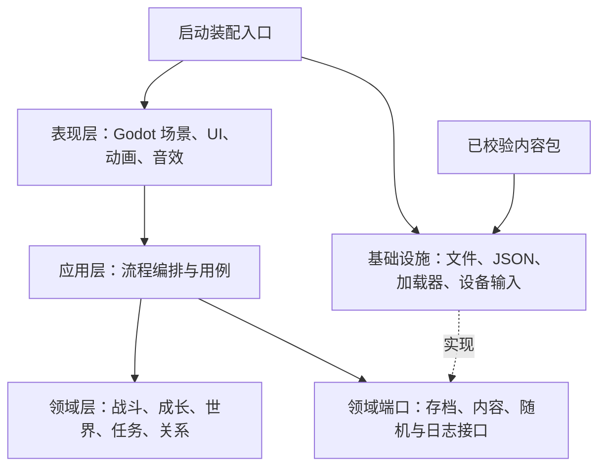

# 武侠世界：游戏架构与系统设计

版本：0.10 · 日期：2026-10-01 · 状态：探索式剧情设计基线；M0 已验收，M1 战斗原型已于 2026-10-01 经用户试玩（刀、枪、弓排入 M4，见 8.3.1），M2 世界规则层第一批已实现（9.4、11）

配套文档：[剧情与任务设计](./STORY.md) · [开发计划](./DEVELOPMENT_PLAN.md)

## 1. 项目定位与已作出的决策

制作一款以金庸小说人物、门派和武学为基础的**高清 2D 单机武侠回合制 RPG**。所有角色生活在同一个架空年代，不同作品人物之间的相遇、合作、冲突与战斗是核心卖点。玩家扮演从现代穿越而来的普通人，在探索、结识人物、学习武学和参与江湖事件的过程中，形成自己的武学流派与人物关系。

核心体验是“进入群侠同世的江湖，见证不同作品人物碰撞，与他们建立关系，并用自己练成的武功参与其中”。地图规模、招式数量与数值上限都服务于这个体验。

| 项目 | 本版决策 | 决策理由 |
|---|---|---|
| 引擎 | Godot 4.7.2 .NET 稳定版 | 原生 2D 工作流适合分区地图，场景编辑与桌面发布链路完整 |
| 语言 | C#；编辑器工具必要时使用少量 GDScript | 战斗、任务、存档可形成独立且可测试的规则库 |
| 运行时 | 优先 .NET 10 LTS；M0 验证引擎及导出兼容性 | 覆盖预计开发周期；版本组合验证是开工关卡 |
| 目标平台 | 仅 Windows x64 | 所有 Demo、测试与发行包均按 Windows 排期 |
| 游戏模式 | 离线单人，本地存档 | 不依赖服务器，不让网络问题进入核心玩法 |
| 画面 | 斜俯视高清手绘场景，正常比例人物，独立侧视战斗场景 | 保持武侠绘画质感，同时控制角色动作制作量 |
| 地图 | 江湖大地图 + 可探索的小地图 + 独立战斗场景 | 场景间加载，支持驿站、骑乘、马车、渡船与剧情传送 |
| 战斗 | 明确轮次、速度排序、队伍站位和武学组合 | 可预判、可规划，兼顾传统回合制与配队深度 |
| 队伍 | 主角 + 最多 3 位伙伴；敌方最多 6 人 | 控制战斗节奏、画面密度与资产成本 |
| 叙事 | 全角色同处一个架空年代，统一江湖中的跨作品事件 | 保留人物辨识度，创造原作中不曾发生的相遇与交锋 |
| 角色年龄与身份 | 原则上保持各自小说主要剧情阶段的年龄与身份；阿青采用明确标注的原著故事后原创延伸阶段，以 18 岁登场；黄蓉、阿朱沿用原著阶段身份、本作年龄设为 18 岁（2026-10-02 用户决定） | 年代融合不得改变原著人生阶段；改编年龄与原文年龄分开记录，不得冒称原著事实 |
| 角色配音 | AI 生成 + 人工试听修整，开发期生成并随包发布 | 固定角色音色，离线播放，降低对白迭代成本 |
| 内容生产 | 稳定 ID、数据配置、场景模板、内容校验器 | 新增武学、任务和地图无需复制系统代码 |
| 第一阶段交付 | 可切换场景与 UI 的视觉 Demo（M0） | 先让用户核对画风、人物比例、探索/战斗视角和界面布局 |
| 第二阶段交付 | 约 60 分钟“相遇—成长—战斗—选择”Demo（M1–M3） | 画风与视角获用户认可后，再实现真实玩法闭环 |

Godot 4.7.2 的发行信息见[官方归档](https://godotengine.org/download/archive/4.7.2-stable/)。使用 C# 需要 .NET 版编辑器与独立 SDK；当前官方文档说明 Godot 4 C# 不支持 Web 导出，因此浏览器版不在本路线内，详见 [C# 官方说明](https://docs.godotengine.org/en/stable/tutorials/scripting/c_sharp/c_sharp_basics.html)。.NET 10 的支持周期见 [Microsoft 官方支持政策](https://dotnet.microsoft.com/en-us/platform/support/policy/dotnet-core)。以上是选型依据，不代表已经在本仓库完成兼容性测试。

### 1.1 本轮规划的默认假设

- 首发简体中文、键鼠操作；架构保留文本本地化和输入映射，手柄完整适配进入后续阶段。
- 买断式内容结构，不设计抽卡、体力付费或日常签到；实际发行方式后续确定。
- 1.0 规划三篇连续故事，共 18 个短主线关口，必做主线暂估 16–20 小时、主动探索与支线合计约 40–55 小时；46 条可选任务分布在地区、门派与伙伴线上。M3、M5 后按实际内容产能重估。
- 所有角色在设定上属于同一个世界；制作按地域和事件批次扩展，不按原著年代隔离，也不要求第一版就实装所有角色。
- 团队按 4–6 人的小团队估算；个人开发方案见开发计划。
- 角色、故事、配乐、字体与美术的来源及可用范围进入资产台账；公开发行所需内容授权是发行准备项，目前状态未确认。

### 1.2 暂不进入首发范围

联网联机、无缝大世界、实时动作战斗、完整物理模拟、自由建造、程序生成主线、运行时在线生成配音、macOS、Linux、移动端、主机平台及开放式模组市场。预留清晰边界即可，不提前建设这些系统。角色 AI 配音按第 10.5 节分阶段建设。

### 1.3 两次 Demo 的实施边界

| 阶段 | 必须交付 | 允许简化 | 暂不实现 |
|---|---|---|---|
| 第一阶段：视觉 Demo，M0 | Windows 可运行展示包；场景目录可直接切换大地图、城镇、客栈、野外、战斗、对话及各主要菜单；高清人物和短动作预览 | 固定样例数据、预设状态切换、有限镜头平移；页面可复用布局 | 真实战斗计算、AI、任务链、成长结算、旅行扣费、存档与完整内容工具 |
| 第二阶段：玩法 Demo，M1–M3 | 约 60 分钟跨作品相遇、学习成长、回合战斗与选择后果；基本旅行及可靠保存 | 有限区域、少量人物、一个完整事件与局部分支 | 全世界实装、全部武学、长篇主线与发行级内容规模 |

第一阶段重点是实际游戏构图：探索与战斗都能直接预览，角色大小、地图细节、文字和 UI 同屏核对。视觉样板须接近目标画风；可简化交互逻辑，不能用粗糙占位画面替代风格验收。范围与页面清单见开发计划第 1.2 节。

第一阶段使用独立 `PreviewSession` 和样例数据驱动 UI；正式规则由第二阶段的应用服务接入相同显示模型，避免假数据逻辑混入战斗或存档。场景切换目录仅用于展示包。后文的完整战斗、任务、旅行事务、存档及自动化规格均属于第二阶段或后续建设，不是 M0 的前置条件。

M0 交付后收集用户对画风与视角的意见；修改展示包并得到认可，再进入 M1。不会在风格尚未确定时先制作整小时剧情和批量角色动作。

## 2. 世界观与叙事规则

### 2.1 原著元素与架空改编的边界

世界设定采用**群侠同世的架空江湖**。角色原则上以各自小说主要剧情中的年龄和身份共同生活在本世界；年代融合是世界设定前提，不能通过让角色变老、变年轻或改变核心身份来实现。阿青是单独注明的改编：本作选择《越女剑》故事结束后的原创延伸阶段，以 18 岁登场，原著故事阶段约十六七岁仍照实记录；其已知经历与牧羊、竹棒身份不得抹去。原著提供人物性格、门派气质、武学特色与关系素材；游戏重新组织世界年表、地理势力和跨作品事件，使人物可以自然相遇。

| 内容层 | 规则 |
|---|---|
| 原著参考 | 记录人物性格、说话方式、武学和代表性关系，作为人物辨识依据 |
| 角色基线 | 为每位角色选定所属小说的主要剧情阶段，锁定对应年龄、身份、已有经历与关系；阿青另记原著故事后 18 岁延伸阶段，黄蓉、阿朱另记本作 18 岁改编年龄，人物档案不得把改编混为原著事实 |
| 架空设定 | 在角色基线之上组织共同世界、门派共存方式与跨作品关系；除阿青的故事后原创延伸阶段与黄蓉、阿朱的 18 岁改编年龄这三项明示改编外，改编不得突破主要剧情阶段的年龄和身份约束 |
| 跨作品事件 | 将不同作品人物的目标、立场与武学碰撞写成原创剧情，支持合作、论武、冲突与对战 |
| 玩家介入 | 主角的选择改变人物关系、事件走向和战斗条件，不预设必须复现原著结局 |
| 世界结果 | 一个持续演化的世界状态记录所有已发生事件，不为不同作品另开平行存档 |

**年龄与身份是硬约束，阿青、黄蓉、阿朱另有明示的改编年龄。** 每位角色先确定“原著主要剧情阶段锚点”；阿青须同时记录原著阶段与本作 18 岁延伸阶段，黄蓉、阿朱须同时记录原文年龄与本作 18 岁（2026-10-02 用户决定，身份与已知经历仍按所选原著阶段），再据此设计外形、对白、配音、武学和人物关系：

- 锚点原则上必须落在所属小说的主要剧情中，不能为了兼容其他角色改取不符合主要剧情的幼年、暮年或身后历史形象。阿青单列原著故事阶段与故事后 18 岁延伸阶段，后者属于本作改编，不伪称原著锚点。
- 主要剧情跨度较大时，档案明确采用哪一段、对应什么身份。原著未给出精确岁数时，记录有依据的年龄范围或年龄段及其来源，不编造精确年龄。
- 同一角色在多部小说中出现时，选定一部及其主要剧情阶段作为本作基线，沿用一个 `CharacterId`；不能把年轻时的外形与晚年才取得的身份、经历无说明地拼接。
- 年龄、门派身份、师承辈分、重要亲缘和已发生经历共同核对。角色不能预先知道锚点之后才发生的原著事件；其后在本作中的成长和身份变化，必须由实际游戏剧情产生并记录。
- 跨作品年代、传承年数或历史先后无法同时成立时，以主要剧情年龄与身份为优先，记录统一世界的架空共存约定，调整跨作品年表及事件连接方式。不得以时间兼容为由改龄、取消核心身份或重写使该身份成立的关键经历；也不要求从现实出生年份推算角色在共同世界的年龄。
- 人物模型、立绘、语气和 AI 音色的年龄感均须与所选阶段一致；阿青使用本作 18 岁延伸阶段的成年表现，黄蓉、阿朱按本作 18 岁表现。首期不以跨章节时间跳跃或自动老化迫使其他角色偏离主要剧情形象。

人物档案包含来源作品、参考版本、主要剧情阶段及章节依据、年龄或年龄范围及依据、身份、代表性格、武学阶段、所属势力、亲缘师承、已知经历、架空共存说明、动机、底线及可参与事件。第一阶段先为展示人物完成年龄、身份及形象所需的简短档案；第二阶段再补齐事件资料，不以全世界考据拖延视觉 Demo。

### 2.2 统一世界与跨作品事件

- `WorldId` 表示唯一的架空世界；`RegionId` 表示地理区域；`ArcId` 与 `ChapterId` 只表示三篇和章节进度，不切换到新世界或新角色实例。
- `SourceWorkIds` 记录角色涉及的参考作品，`AnchorWorkId` 与章节依据确定唯一的主要剧情阶段；例如胡斐、苗人凤可同时关联《飞狐外传》《雪山飞狐》，但只使用一组相容的人物状态。这些字段用于资料检索与内容审核，不限制角色同场、招募或组队。
- 每位角色只有一个稳定 `CharacterId`。人物外观、伤势、武学和剧情变化记录在当前状态中，不能生成多个不同年龄的同名实体同时入队。
- 全世界共用时间、货币、物品、关系与事件事实；角色是否出场由地点、行程、阵营和剧情条件决定。玩家可先探索已开放地区；同一调查组的主线关口可按到访顺序完成，`ChapterId` 只记录世界局势，单项完成以稳定任务事实判断。
- 坐骑、马车、渡船和剧情传送用于地域间旅行。主角从现代进入江湖是故事起点；第三篇最终选择可让主角独自返回现代，属于一次性结局演出，不提供往返或跨年代探索系统。
- 第一篇以“归潮石”异象解释主角来到江湖；第二篇找到最后一次回返的观测依据，第三篇取得所需石纹并在华山论剑后开放留江湖或返现代选择。完整因果见[剧情文档](./STORY.md#72-最终结局与返现代)。
- 不同作品的伙伴可共同入队、参与羁绊和战斗；是否愿意同行由人物动机与关系决定。
- 门派按统一实体建档。同名门派在不同作品中的人物、掌门和传承须统一安排；可明确架空支脉及共存规则，但必须保留角色在主要剧情阶段的身份与地位，不能靠随意撤换职务、修改师承或调整年龄解决冲突，也不能只因作品不同就生成两套互不相认的门派。
- 名剑、秘籍和其他唯一物品也采用统一 ID，归属与转移有明确事件，避免不同故事重复发放。
- 同一 NPC 同时被多个事件需要时，用事件优先级、占用及释放规则调度；持续剧情不得让角色在两个地点同时出现。

第二阶段 Demo 采用第一篇《众路归潮》的第一章“江南会客”：令狐冲、黄蓉与萧峰因同一封求援书在江南相遇，调查假信并在芦湾旧渡共同救人。完整版本由《众路归潮》《烽火未起》《华山前夜》三篇共 18 章组成：先查改信，再阻止粮道私兵冲突，最终经历大战并在华山论剑评出新的五席。第一篇的三种账簿处置是阶段状态，三篇结束后另有留江湖与返回现代的最终结局。完整人物动机、任务 ID 和分支见[剧情文档](./STORY.md)。这些均为原创游戏剧情设计，不是原著情节复述或官方人物强弱排名。

至少有一场剧情与一场实际战斗由跨作品人物的互动引发；人物不能只是放在同一张图里各说一句台词。玩家选择要改变助阵角色、关系反馈或冲突处理方式，并在后续场景可见。

### 2.3 穿越者的能力边界

- 现代经验体现在观察、谈判、推理和基于原著记忆但可能失准的事件推测，不能直接变成万能制造或无敌战斗能力。
- “见闻札记”记录人物、门派、线索与主角推测；已确认事实和不可靠记忆分开展示。
- 初始选择 1 项背景天赋，例如善察言色、善于归纳、体能基础；各自改变对话或成长效率，不替代武学修炼。
- 剧情主轴是找到自身穿越原因、经历友情与爱情的选择，并在三篇终局决定留在江湖或独自回到现代；原著人物拥有各自目标，不围绕主角停止行动。

## 3. 核心循环与游戏状态


```mermaid
flowchart LR
    A[探索城镇与野外] --> B[相遇、线索与选择]
    B --> C[任务、切磋与战斗]
    C --> D[修为、武学与关系变化]
    D --> E[调整流派与队伍]
    E --> F[解锁路线、人物与事件]
    F --> A
```

短循环为 3–8 分钟：发现线索或敌人 → 做出决策 → 获得明确反馈。中循环为 30–60 分钟：完成人物事件、掌握新招式、验证新流派。长循环是章节推进与关系变化。

顶层状态使用显式状态机：

```text
Boot → MainMenu → Loading → Exploration
Exploration ↔ Dialogue / WorldMap / CharacterMenu
Exploration → Battle → Result → Exploration
WorldMap → Traveling → Loading → Exploration
任意安全状态 → Pause → 原状态
```

菜单暂停世界时间；剧情和战斗分别拥有输入锁。`Loading`、结算事务和场景切换过程中不开放手动保存。取消、失败与返回位置都由状态机处理，不由各 UI 自己拼接。

## 4. 引擎与工具链选型

### 4.1 方案比较

以下是基于本项目目标的工程判断，并非对引擎能力的全面排名。

| 方案 | 对本项目的价值 | 本次不选或选用的原因 |
|---|---|---|
| Godot .NET | 场景树、2D 编辑、UI 与规则代码容易拆开；适合小团队 | **采用**；需要尽早验证 C# 导出、骨骼工作流与编辑器工具 |
| Unity | 成熟商业工具和大量现有 2D 工作流 | 可作为团队已有积累时的备选；当前空仓库没有迁移收益 |
| Unreal Engine | 适合重型 3D 表现与相关制作流程 | 当前纯 2D 分区回合制不需要引入这类工程复杂度 |
| 浏览器引擎 | 链接试玩方便 | 当前更重视桌面长流程、资产制作和场景编辑，Web 发布不是需求 |
| 预制 RPG 工具 | 能快速拼出标准回合制原型 | 定制高清人物、复杂规则与长期内容工具会受既有范式约束 |

Godot 采用 MIT 许可，具体分发说明以[官方许可页](https://godotengine.org/license/)为准。

### 4.2 工具清单与冻结方式

| 类别 | 选择 | 约束 |
|---|---|---|
| 引擎 | Godot 4.7.2 .NET + 同版导出模板 | 小版本升级在独立分支回归，不能编辑器与模板混版 |
| 核心代码 | C#，纯 .NET 类库 | Domain 不引用 Godot，也不依赖文件系统或系统时间 |
| SDK | .NET 10 LTS 优先 | M0 完成最小 UI 工程及 Windows 导出运行验证后锁定 `global.json` |
| UI | Godot Control、Container、Theme | 不嵌入 Web UI；风格和尺寸集中配置 |
| 数据 | UTF-8 JSON + Schema + 语义校验 | 数据作为唯一内容源，禁止同时维护手工 JSON 与另一套手工资源表 |
| 动画 | Godot Skeleton2D / AnimationPlayer + 关键帧特效 | 不依赖付费骨骼运行时；M0 仅做短动作预览，完整动作管线在 M1 验证 |
| 角色配音 | AI 语音供应商适配器 + 本地音频资产 | MiniMax、ElevenLabs 作为试听候选；选型后锁定音色及可记录的模型版本，不将 API 接入玩家客户端 |
| 图片制作 | 可输出分层源文件的绘画工具 | 工具不限，统一导出规范、图层命名与授权台账 |
| 测试 | .NET 单元测试 + Godot 集成场景 | 2026-09-30（M1）锁定：xUnit 2.9.3、xunit.runner.visualstudio 3.1.4、Microsoft.NET.Test.Sdk 17.14.1（`tests/Domain/WuxiaWorld.Domain.Tests`）；升级另开分支回归 |
| 版本管理 | Git + Git LFS | 代码与配置进 Git，大型分层源文件和音频进 LFS |
| 构建 | 本地脚本；随后接入仓库 CI | 本地与 CI 使用相同校验和导出入口 |

优先采用 Compatibility 渲染器，先以手绘光影、少量 2D 灯光和粒子实现画面。其目标是降低桌面硬件门槛；具体特效能否满足需求在 M0 样片验证。不同渲染器的后端与能力差异见[官方渲染器说明](https://docs.godotengine.org/en/stable/tutorials/rendering/renderers.html)。若必须切换，M0 完成切换及 Windows 样片测试，之后不同时维护两套未经验证的表现方案。

## 5. 系统架构

### 5.1 分层与依赖方向

采用**单进程模块化架构**，按功能拆模块，不采用微服务或为将来联机提前引入网络协议。


```mermaid
flowchart TB
    P[表现层：Godot 场景、UI、动画、音效] --> A[应用层：流程编排与用例]
    A --> D[领域层：战斗、成长、世界、任务、关系]
    A --> I[领域端口：存档、内容、随机与日志接口]
    X[基础设施：文件、JSON、加载器、设备输入] -.实现.-> I
    B[启动装配入口] --> P
    B --> X
    C[已校验内容包] --> X
```

- `Domain` 拥有规则与可序列化状态，不认识场景节点、动画、音效或窗口。
- `Application` 接受命令、验证条件、执行事务、输出结果和事件。
- `Presentation` 显示只读状态快照，把交互转换成命令。UI 不直接改气血、物品或好感。
- `Infrastructure` 实现加载、保存和平台能力；通过接口注入，不能成为规则隐式依赖。
- `Bootstrap` 是唯一装配入口。全局持久节点只保留应用宿主、场景路由和音频管理，避免每个模块都成为全局单例。

### 5.2 模块边界

| 模块 | 拥有的数据和职责 | 对外接口示例 |
|---|---|---|
| Session | 新游戏、读档、当前玩法状态 | `StartGame`、`ResumeGame` |
| World | 统一世界、地图状态、时辰、旅行与 NPC 所在地 | `Travel`、`ResolveSpawn` |
| Character | 属性、成长、武学装配、队伍 | `Train`、`EquipBuild` |
| Combat | 回合、行动、目标、伤害、效果、胜负 | `SubmitAction`、`AdvanceTurn` |
| Narrative | 对话图、条件、选项与剧情演出请求 | `ChooseDialogueOption` |
| Quest | 目标、任务状态、互斥分支与奖励 | `ApplyQuestEvent` |
| Relationship | 双向关系记录、信任、立场和羁绊 | `ApplyRelationshipChange` |
| Inventory | 物品实例、装备、货币与交易 | `Buy`、`TransferItem` |
| Persistence | 保存快照、版本迁移、备份与恢复 | `SaveSlot`、`LoadSlot` |
| Content | 内容索引、跨表引用、标签和版本 | `GetDefinition` |

领域事件用于传达已发生的事实，例如 `BattleWon`、`CharacterMet`、`ItemGranted`。需要立即得到成功或失败的操作用命令调用。事件按稳定次序处理，禁止用“所有系统监听所有事件”的方式隐藏循环依赖。

### 5.3 未来目录结构

以下是长期目标结构，不表示这些文件都已存在。M0 只创建了 UI 展示、场景预览和 Windows 导出所需文件；M1 起建立规则库、内容编译器、战斗模拟器与测试项目，实际落地情况见本节末尾。

```text
wuxia-world/
├── AGENTS.md
├── README.md
├── docs/
│   ├── ARCHITECTURE.md
│   ├── DEVELOPMENT_PLAN.md
│   ├── STORY.md
│   └── {canon,adr,art,playtests}/
├── global.json
├── WuxiaWorld.sln
├── game/                         # Godot 项目根；仅运行时资产进入这里
│   ├── project.godot
│   ├── WuxiaWorld.Game.csproj
│   ├── scenes/{boot,preview,world,battle,ui}/
│   ├── scripts/{presentation,adapters,preview}/
│   ├── assets/{maps,characters,portraits,vfx,audio,fonts,shaders}/
│   └── generated/content/        # 校验工具生成，禁止手改
├── src/
│   ├── WuxiaWorld.Domain/
│   ├── WuxiaWorld.Application/
│   └── WuxiaWorld.Infrastructure/
├── content/                      # 手工维护的结构化内容源
│   ├── schema/
│   ├── shared/{skills,items,statuses}/
│   ├── characters/              # 跨作品共享角色与关系定义
│   ├── world/new_game.json       # 新游戏初始世界
│   ├── dialogue/arcXX/chapterXX.json  # 逐章对白：唯一可编辑来源
│   └── regions/<region_id>/{maps,routes,events,quests,text}/
├── art_source/                   # 分层绘画、动作源文件；LFS，不导出
├── tools/{ContentCompiler,BattleSimulator,VoiceBuilder}/
├── voice_source/                 # 台词清单、音色档案、发音词典与已选母带；音频进 LFS
├── tests/{Domain,Application,Integration,Fixtures}/
└── build/                        # 构建输出，忽略提交
```

当前 `game/scripts/presentation/` 下分 `App/`（宿主、路由、截图命令）、`Ui/`（主题、字体、控件工厂）、`Art/`（AI 件与全身形象的贴图加载 `PieceArt`、`FigureArt`，2026-09-30 自 preview 迁出）与 `Battle/`（战斗布景、战斗形象与 M1 战斗原型 `BattleScreen`）；M0 展示页及其样例数据在 `game/scripts/preview/`（`Pages/`、`Samples/`），第二阶段随 preview 目录一起退役。

M1（2026-09-30）实际落地的结构：

| 位置 | 内容 |
|---|---|
| `src/WuxiaWorld.Domain/Common/` | `Pcg32`（项目自有随机数）、`Bp`（万分比定点）、`StateHasher`（64 位 FNV-1a 状态哈希） |
| `src/WuxiaWorld.Domain/Characters/` | 五项属性、派生公式 `StatFormula`（含规则版本号）、心法 / 轻功 / 天赋定义、装配校验 `LoadoutRules` |
| `src/WuxiaWorld.Domain/Combat/` | 内容定义（招式、状态、战斗单位模板、遭遇、克制、战斗物品）、`BattleState`、命令、事件、`BattleEngine`（流程、行动、效果、预估四个分部）、`DamageMath`、`Targeting`、`Ai/BattleAi` |
| `src/WuxiaWorld.Application/Combat/` | `BattleSession`：替 AI 决策、逐条记录命令与状态哈希、按记录重放 |
| `src/WuxiaWorld.Infrastructure/Content/` | 内容 JSON 选项、`CombatContentLoader`（读 `content/`）、`CombatContentValidator`（语义校验）、`CombatBundle`（合成包） |
| `content/shared/{skills,statuses,arts,items,combat,text}/` | 招式、状态、心法 / 轻功 / 天赋、战斗物品、克制表、中文文本表 `zh-Hans.json` |
| `content/characters/combat_presets.json` | M1 战斗预设：主角三流派、陆青禾与占位同行者（M2 起由成长状态生成主角模板） |
| `content/regions/jiangnan/{combatants,encounters}/` | 第一章敌人与遭遇（押运队冲突、旧渡水门） |
| `tools/ContentCompiler/` | 校验并写出 `game/generated/content/combat.json`；导出脚本先运行它 |
| `tools/BattleSimulator/` | 固定种子批量模拟，含三个流派挑战场景 |
| `tests/Domain/WuxiaWorld.Domain.Tests/` | 规则、确定性、重放与内容校验测试 |
| `game/scripts/adapters/GeneratedContent.cs` | 经 Godot 文件接口读取内容包（导出包内同样可用） |
| `game/scenes/battle/BattlePrototype.tscn` | M1 战斗原型页，场景目录末尾可进入 |

M2 第一批（2026-10-01，世界规则层）实际落地的结构，规格见 9.4 与第 11 节：

| 位置 | 内容 |
|---|---|
| `src/WuxiaWorld.Domain/World/` | `WorldState`（可存档世界状态、深拷贝与状态哈希）、`Condition` / `Conditions`（条件原语）、`WorldEffect`（效果原语与事务结果）、`Definitions`（任务、对白、地图、地区事件、路线、物品目录、店铺、成长设置、人物、新游戏）、`WorldContent`（索引）、`WorldRules`（效果执行、任务状态机、事件筛选与人物占用、店铺买卖、升级换算与旧档补齐）、`GrowthRules`（潜能、装备、装配、修炼与战斗模板推导）、`DialogueRunner`（对话图执行） |
| `src/WuxiaWorld.Application/World/GameSession.cs` | 一局游戏的会话：对话、交互、场景切换与战斗结算均在副本上执行后整体提交 |
| `src/WuxiaWorld.Application/Persistence/SaveGame.cs` | 存档槽、存档头、`ISaveStore` 端口、读档相容性检查 `SaveCompatibility` |
| `src/WuxiaWorld.Application/Persistence/SaveResume.cs` | 读档后恢复成可玩会话：相容检查、出生点校正、旧档成长补齐与说明汇总（游戏读档与旧档回归测试共用） |
| `tests/Fixtures/saves/` | 旧档回归样本：历史版本真实代码写下的第一章存档（见第 11 节） |
| `src/WuxiaWorld.Infrastructure/Saves/FileSaveStore.cs` | JSON 文件存档：校验和、临时文件替换、备份回退、结构版本迁移 |
| `src/WuxiaWorld.Infrastructure/Content/` | 新增 `ContentFiles`（文件枚举、共用内容版本、文本表合并）、`WorldBundle` 与 `WorldContentLoader`、`WorldContentValidator` |
| `content/world/new_game.json`、`content/characters/characters.json`、`content/characters/anchors.json`、`content/shared/items/catalog.json` | 新游戏、人物定义（经典人物以 `story_anchor` 引用剧情锚点，未选定写 `pending`）、经典人物剧情锚点（`StoryAnchorDefinition`，见 9.4.3）、物品目录（战斗物品须在目录中有条目；装备带固定加成） |
| `content/world/progression.json`、`content/regions/<地区>/shops/` | 成长设置（等级经验表、主角基础属性、熟练度、流派入门武学、开局衣物、旧档追赶）与店铺货单（9.4.2） |
| `content/regions/jiangnan/{maps,routes,events,quests,text}/` | 第一章五张地图（含客栈后院）、两条水路、十个地区事件、主线与失踪渡工支线、地区文本表 |
| `content/dialogue/arc01/chapter01.json` | 第一章对白第一稿（15 段 104 句台词，其中主角心里话 5 句；27 个演出提示；未锁稿）；M0 对话展示页也从这里读取开场 |
| `content/dialogue/arc01/chapter01_battle.json` | 第一章关键战斗语音第一稿（32 句，未锁稿；2026-10-04 起，规格见 9.4.9） |
| `tests/Domain/WuxiaWorld.Domain.Tests/` | 新增世界规则、存档、第一章走查测试 |

M2 第二批（2026-10-02，界面接入）实际落地的结构，规格见 9.4.1：

| 位置 | 内容 |
|---|---|
| `game/scenes/world/Exploration.tscn`、`game/scripts/presentation/Play/ExplorationScreen.cs` | 游戏内探索页：按当前地图选用 M0 布景，由 `GameSession` 驱动落点、交互点、出口、路线、事件、同行者与站位人物；对话、换图、剧情战与菜单都从这里发起 |
| `game/scripts/presentation/Play/PlaySession.cs` | 一局游戏的表现层宿主（`AppHost.Play` 持有）：内容包、`GameSession`、存档端口、待提交的换图票据、跨场景提示与对话记录 |
| `game/scripts/presentation/Play/MapStaging.cs` | 第一章五张地图在布景里的摆放（落点、交互物、出口、路线登船点、事件锚点、群众、目标物）与人物外观 |
| `game/scripts/presentation/Play/{DialogueOverlay,PlayHud,Journal,GameMenu}.cs` | 对话层、探索 HUD（地点时辰、目标追踪、队伍银两）、江湖札记、菜单与存读档槽 |
| `game/scripts/presentation/Play/{PartyPage,FormationCell}.cs` | 队伍页（2026-10-02，M2-06，规格见 9.4.4）：阵位图、同行人物名册与详情 |
| `game/scripts/presentation/Battle/BattleScreen.Story.cs` | 剧情战：按待开战斗与队伍开打，结算经 `SettleBattle` 一次性提交后回探索页 |
| `game/scripts/preview/Pages/ExploreStage.cs` | 新增驱动接口 `IExploreDriver`；M0 展示页不设驱动方时行为不变 |
| `game/scripts/presentation/Play/WorldMapOverlay.cs`、`content/world/world_map.json` | 游戏内江湖大地图（2026-10-02，M2-02，规格见 6.5）：地标、道路与交通面板，启程走换图票据；`WorldMapCanvas` 改为由构造参数给地标位置与道路 |
| `game/scripts/presentation/Audio/VoicePlayer.cs`、`game/assets/audio/voice/` | 台词配音播放（`AppHost.Voice`）与安装好的配音（`<line_id>.mp3` 走 Git LFS、`voice_manifest.json`），由 `tools/VoiceBuilder/install.py` 写入 |

Godot 项目引用 `src` 类库；基础设施中的引擎适配留在 `game/scripts/adapters`，纯文件与 JSON 适配留在 `Infrastructure`。避免将全部源代码塞进引擎项目导致规则测试必须启动编辑器。

## 6. 地图、旅行与世界状态

### 6.1 三类场景

1. **江湖大地图**：绘制山川、城池与路线；节点表示目的地，边表示可旅行路线。支持缩放、标注、路线条件和耗时预览。
2. **小地图**：城镇、客栈、山路、门派、洞窟等独立场景。斜俯视自由移动，键盘移动与点击寻路可并存；碰撞、寻路区域和视觉图分离。
3. **战斗场景**：按发生地点选择背景变体，使用固定逻辑阵位；战后返回原地图的有效安全点。

《STORY》第 0.1 节列出的 19 个门派或组织与 3 个已列背景势力，共 22 个势力地点，是完整游戏的大地图覆盖清单。每个 `map.faction.*` 有稳定节点 ID、可发现的图标或地名、至少一条可解释的进入路线、可步行的公共区域及本势力交互；同一地区可复用地形和场景模板，但不能只用图鉴条目或一段远景代替到访。节点按篇章开放，未接取或错过可选事件仍可到达公共区域。门内限制区域按剧情处理，主线必得证据始终有非门派保底路径。M0 只做大地图视觉样例，M3 只做第一章需要的地图；完整覆盖在 M6–M7 内容批次完成并逐节点验收。

大地图不要求玩家操作角色逐步走完整条路线。选择骑马、马车或渡船后显示行进反馈，按配置消耗银两与游戏时辰，并触发已确定的途中事件。

### 6.2 旅行数据

| 字段 | 含义 |
|---|---|
| `route_id`、`region_id` | 路线身份与所属地域 |
| `from_map_id`、`to_map_id`、`spawn_id` | 出入口与目标落点 |
| `travel_modes` | 徒步、骑乘、马车、渡船或剧情传送 |
| `conditions` | 剧情、天气、通行凭证、门派关系等条件 |
| `costs`、`duration_ticks` | 费用与逻辑时间消耗 |
| `encounter_table_id` | 可选途中事件表 |
| `return_policy` | 取消、失败或事件中断后的去向 |

门派地点还须在地图数据中记录 `faction_id`、`public_scene_id`、`discover_hint`、`open_chapter`、`fallback_route_id` 和 `encounter_ids`。内容校验器检查第 0.1 节清单中的每个 `map.faction.*` 都有可加载场景、有效落点和可往返路线；角色锚点审核失败时可调整事件参与者，不删除已承诺的地图地点。若已发行存档使用节点或事件 ID，改名须提供迁移映射。

坐骑是交通解锁与旅行效率系统。第二阶段玩法 Demo 实现“使用坐骑旅行”和一个明确的骑乘展示，不立刻制作所有角色的全方向骑乘战斗动作。局部地图骑乘只在允许区域开放，室内自动下马；载具不参与首发战斗。

### 6.3 场景切换事务

```text
检查路线条件和费用 → 建立旅行事务及起点快照 → 锁定重复输入
→ 在候选状态扣费、推进时间、确定途中事件
→ 异步加载目的地或途中事件场景 → 校验落点和必要资源
→ 提交候选状态与事务 ID → 自动保存 → 淡入并恢复输入
```

加载失败则丢弃候选状态、回到起点，不重复扣款、不重复推进时间。途中事件一旦提交为当前状态就保存其随机结果，读档继续该事件。事务状态、随机种子和结算标记共同进入存档，避免刷新场景重抽事件。

资源加载使用 `ResourceLoader.LoadThreadedRequest`，轮询就绪状态后再获取资源；未就绪时直接获取仍可能阻塞。场景实例化和场景树修改放在主线程，分帧处理大量节点。依据见[后台加载文档](https://docs.godotengine.org/en/stable/tutorials/io/background_loading.html)。

### 6.4 地图持久化

- 地图模板不可变，运行时只存差异：宝箱已开、机关状态、敌人刷新标记、NPC 状态和掉落物。
- 交互物具有稳定 ID，不使用节点路径作为存档身份。
- NPC 用“地点 + 世界关口 + 时辰 + 事件占用条件”确定位置，不对所有远方 NPC 逐帧模拟；开放地区只展示当前可用的事件入口与传闻提示。
- 出口必须连接有效落点；缺失落点回退到该图安全入口并记录错误。
- 小地图移动不严格按现实分钟流逝；对话阅读暂停时钟，旅行和关键行为推进逻辑时辰。
- 首发主线不设隐形永久过期条件；有时限的支线在接取时明确提示，未接取的地区故事保留后续合理入口或在局势改变后改写，不静默标记为放弃。

### 6.5 江湖大地图（M2-02 实现规格）

2026-10-02 接入游戏（此前只有 M0 样例页）。实际采用的结构：

- **内容**：`content/world/world_map.json`（`WorldMapDefinition`）记设计稿尺寸 `frame`（2880×1600，与 M0 舆图设计稿同一坐标系，表现层按画布缩放）、地标 `nodes` 与图上道路 `roads`。地标 `node.*` 有地域、图标（客栈、渡口、粮仓、河埠、山门、驿站、佛塔、道观、山路、丐帮）、坐标、所属小地图 `maps`、出现条件 `when`（缺省一直可见）与开放条件文本键 `locked_hint`；文本表须有 `<node>.name` 与 `<node>.desc`。道路只供描线（`land` 陆路 / `water` 水路，`via` 为弯折点），能否通行仍由 6.2 的路线定义决定。
- **地标与路线的关系**：每张小地图至多属于一处地标，`WorldContent.NodeOf` / `SamePlace` 据此判断；路线起讫仍是小地图。起点与当前所在属于同一处地标即可启程（人在江南客栈也能从大地图乘船去旧渡，不必先走到码头），到达落点仍取路线的 `spawn`。不同地标之间的路线须在图上有对应种类的道路（渡船要水路，其余方式要陆路）。
- **地标状态**（`GameSession.WorldMapNodes`）：只列条件满足的地标（所在之处总列出）；`Here` 所在、`Visited` 任一所属小地图到过、`Route` 从所在之处去那里且条件已满足的路线；不能前往时 `LockedHint` 先取路线的提示，没有路线再取地标自己的提示。`EventsIn` 合并地标各小地图此刻可开始的地区事件，供“到达后可见”与地标上的泥金菱形。
- **到访记录**：世界状态新增 `visited`（到过的小地图），新游戏记起点，之后每次提交记下当前地图；存档结构版本因此升到 3（第 11 节）。
- **第一章数据**：芦湾（芦湾街、江南客栈、芦湾河滩）与芦湾旧渡两处可往返，路线沿用 `route.jiangnan.luwan_to_old_ferry` / `old_ferry_to_luwan`（渡船 5 两 1 个时辰、沿岸步行 3 个时辰）；江南粮仓、山门路为下一章预告地标，见闻札记有“两条去路”（`clue.ch01.next_leads`，章末获得）后出现，灰淡、写明“下一章开放”，没有可进入的场景。
- **界面**（`WorldMapOverlay`，版式按界面规范 5.6）：探索中按 M 打开，码头乘船点（路线条件满足时）打开并选中目的地；路线条件未满足时码头仍只弹出提示。全屏舆图沿用 `WorldMapCanvas`（构造参数改为地标位置与道路，展示页仍用样例），同一组道路烘焙结果在本局缓存。右侧交通面板列目的地、路线、方式（路线定义里的各方式：时辰、银两；条件不满足或银两不足时禁用并写原因）、同行、到达后可见、抵达时辰与银两前后值；左上所在、时辰与银两，左下图例与按键。滚轮缩放、拖动平移、Tab 跳选、数字键换方式、Enter 启程；Esc 先关面板再关地图，M 直接关地图。
- **启程事务**：先 `BeginRoute` 开票据（校验条件与银两，扣费与推进时辰只在候选状态），再播行旅标记沿路线行进（每时辰约 0.7 秒，1.2–3 秒，期间锁住输入），走完按 9.4.1 的换图事务载入目的地并提交、自动存档；目的地场景缺失时票据中止、地图关闭，世界不变。
- **校验**：`frame` 两个正数；地标 ID 以 `node.` 开头、不重复，名称与说明文本存在，坐标与途经点在 `frame` 内，所属小地图存在且不重复归属，没有场景的预告地标须写 `locked_hint`；每张小地图都须属于某处地标；道路起讫为两处不同的已定义地标；跨地标路线须有对应道路。编译器输出地标数。

## 7. 回合制战斗设计

### 7.1 基本规则

采用**轮次制 + 轮内速度排序**，不是实时读条。每轮开始按当轮有效速度排序，每名存活角色获得一次主行动；速度相同按稳定实体 ID 排序。加速与减速通常下轮生效，避免行动队列被连续重排。

- 每方 2 排 × 3 槽位；我方最多 4 人，敌方最多 6 人。阵位只是目标规则，不引入格子行走战棋。
- 前排保护后排；普通近身攻击优先可接触前排，远程、穿透、轻功突进等技能可打破限制。
- 主行动包括施展招式、普通攻击、防御、调息、使用物品、换位、尝试撤退。
- 每个角色每轮最多 1 次反应，例如反击、护援或招架触发；反应不得再触发另一条反应链。
- 防御减轻下一次有效受击并持续到自身下次行动开始；调息恢复内力但暴露破绽。
- 换位消耗主行动；换人只在战外进行。普通战允许撤退，剧情锁定战明确展示原因。切磋点到为止：谁也不倒下，气血压到认输线即收手，撤退即认输（9.4.17）。
- 普通战目标 3–6 轮、2–4 分钟；首领战目标 6–10 轮、6–10 分钟。这些是试玩调优目标。

首领的关键招式至少提前一轮给出意图，如蓄力、群攻、点穴或召援。AI 根据合法目标和效用评分选择动作，不读取尚未提交的玩家决策。

### 7.2 资源与决策

| 资源 | 用途 | 限制 |
|---|---|---|
| 气血 | 生存 | 战内归零进入失去战斗能力，战后按模式结算伤势 |
| 内力 | 招式和内功消耗 | 调息、药品、部分心法恢复 |
| 架势 | 防守稳定性 | 被破招消耗，归零触发一次破绽；不是第二条无限气血 |
| 势 | 连招、合击与绝招 | 战内积累，0–100，战后清空，不能刷杂兵囤满进首领战 |
| 主行动 / 反应 | 行动经济 | 限制控制、反击和道具连用 |

破绽使下一次伤害提高并取消该轮剩余反应，持续到目标下次行动结束，触发一次后消失；不额外剥夺整轮行动。这样破招有价值，也避免“速度快 + 无限控制”独占答案。

### 7.3 状态与结算顺序

行动流程：

```text
回合开始状态 → 检查存活及控制 → 等待选择或 AI 决策
→ 校验目标、资源和冷却 → 原子扣费 → 生成确定性效果事件
→ 命中/伤害/治疗/状态 → 有上限的反应 → 死亡与胜负检查
→ 自身行动结束状态 → 冷却及持续时间更新 → 下一角色
```

- 状态必须定义触发时点、叠层上限、刷新规则、驱散标签与来源。
- 流血、毒等在目标行动开始结算；同一开始阶段批量结算后统一检查胜负，双方同时失去战斗能力按失败处理，特殊任务可覆盖。
- 冷却 `N` 表示后续 `N` 次自身行动不可再次使用；施放当次不递减，UI 展示下一次可用时机。
- 时长 `N` 表示后续 `N` 次对应触发点；效果刚施加的同一触发点不重复消费。
- 点穴等硬控制最长跳过 1 次主行动；解除后获得 1 次自身行动周期的同类抗性。首领采用控制积累阈值，不直接完全免疫所有控制。
- 对 0 气血目标的治疗、复起、尸体清理与召唤占位分别定义，不能由动画时序决定。

### 7.4 初始数值模型

以下是 v0 平衡模型，供实现和模拟；参数属于配置，不是最终数值承诺。

基础属性：体魄、臂力、根骨、身法、悟性。战斗派生量：最大气血、最大内力、外功、内功、外防、内防、速度、命中、闪避、暴击、架势与状态抗性。

```text
最大气血 = 180 + 22 × 体魄 + 10 × 等级 + 装备固定加成
最大内力 =  80 + 18 × 根骨 +  6 × 等级 + 心法固定加成
外功     =  20 +  3 × 臂力 +  2 × 等级 + 武器攻击
内功     =  20 +  3 × 根骨 +  2 × 等级 + 心法攻击
速度     =  30 +  2 × 身法 + 轻功加成
命中率   = clamp(0.90 + (命中 - 闪避) / 1000, 0.65, 0.98)
基础伤害 = (招式固定值 + 攻击 × 招式倍率) × 100 / (100 + max(0, 防御))
最终伤害 = max(1, floor(基础伤害 × 克制倍率 × 暴击倍率 × 状态倍率 × 浮动))
```

外招使用外功/外防，内劲使用内功/内防；混合技能拆成两段效果，不取两种防御较低者套利。常规克制倍率限定 0.8–1.25；默认暴击倍率 1.5、暴击率上限 35%；浮动 0.95–1.05。固定值、倍率和限制均带版本。

例：攻击 100、招式固定值 20、倍率 1.2、防御 100，基础伤害为 70；克制倍率 1.2 且无暴击和其他效果，浮动前为 84。技能预览显示概率和伤害区间，不偷看随机结果。护盾、防御减伤、伤势加成的计算层顺序固定并纳入测试。

实际实现使用 64 位整数及万分比定点倍率，统一向下取整位置；公式中的小数只是策划表示法。角色升级、装备、百分比增益和临时战斗状态依次计算，避免同类倍率无限乘算。

### 7.5 确定性内核

`BattleState + BattleCommand + RngState → NewBattleState + BattleEvents`

- 输入同样的初始状态、规则版本、随机状态和命令序列，结果必须相同。
- 使用项目自有、固定算法与固定测试向量的伪随机数生成器；不依赖系统时间或运行时默认随机实现。
- 战斗与旅行使用独立随机流；UI 粒子和屏幕震动用表现层随机流。
- 稳定排序实体、效果与目标；禁止依赖哈希表枚举顺序。
- 动画消费事件，不反向决定伤害。跳过动画、倍速和帧率变化不影响战果。
- 每次行动记录状态哈希、种子状态、命令和结算摘要，可重放问题战斗。
- 反应链有单层规则及总事件上限；超限报错并保存诊断快照，不能无限循环。

### 7.6 M1 实现规格

2026-09-30 在 `src/WuxiaWorld.Domain/Combat` 按 7.1–7.5 实现，以下为实际采用、7.1–7.4 未写死的取值与接口；全部属于配置，改动须递增 `StatFormula.RulesetVersion`。当前为规则版本 3（版本 1 → 2：同速先比身法；新增“穿透一列”；首领使用敌方势。2 → 3，2026-10-02：武学熟练度按阶提高主动招式的效果强度，见 9.4.2）。

- **内核接口**：`BattleEngine.Start(BattleSetup)` 开战并推进到第一名待行动单位；`Submit(state, command)` 校验后原子结算，返回事件列表，非法命令不改状态、不扣费、不消耗随机数；`Validate` 给出玩家可读的拒绝原因；`Estimate` 给出命中率、伤害区间（不含 / 含暴击）、架势伤害、是否破绽与护援代受，只读状态。内核不区分玩家与 AI，每名待行动单位都停在 `Pending`；`BattleSession`（应用层）替 AI 调 `BattleAi.Decide` 并逐条记录命令与行动后状态哈希。
- **随机与哈希**：PCG-XSH-RR（64 位状态，参考实现测试向量已入测试），战斗流选择量 `0xB4771E00`；状态哈希为 64 位 FNV-1a，按单位 ID、状态列表、冷却 ID 的固定次序写入。
- **补充派生**：外防 = 10 + 2×体魄 + 等级，内防 = 10 + 2×根骨 + 等级，命中 = 100 + 2×悟性 + 2×等级，闪避 = 50 + 2×身法 + 等级，暴击率 = 5% + 0.3%×悟性，架势上限 = 40 + 2×体魄，控制抗性 = 0.4%×根骨；每级 3 点潜能。心法、轻功、装备只给固定加成；主修与辅修阴阳相冲时辅修加成减半，装配校验以警告说明代价。
- **伤害层次**：基础 → 克制（0.8–1.25，匹配规则相乘后截断）→ 暴击 1.5 倍（率上限 35%）→ 攻方增减伤（加法合计，截断到 −50%～+100%）→ 受方增减伤（加法合计，截断到 −80%～+100%）→ 浮动 0.95–1.05 → 至少 1。每层万分比整数相乘后向下取整；护盾吸收层预留在浮动之后。
- **势**：我方、敌方各一池，0–100，战后清空。命中 +5、打出破绽 +10、受伤一方 +3、招架 +10；我方连环刺、扫堂腿耗 30，周天归元耗 50；敌方由首领唐守亭使用：满 50 蓄力“回澜钩”（扣势在蓄力时，下一次行动钩住意图里写明的一人）。
- **架势与破绽**：架势归零即破绽：受伤 +50%，取消反应，蓄力被打断；受一次有效伤害（同一招全部段数结算后）或到目标下次行动结束时消失，并把架势回满。破绽中不再累计架势伤害。
- **防御 / 调息**：防御受伤 −50%，受一次有效伤害即消失，否则到自身下次行动开始结束，回架势 5。调息回最大内力 20%（静息功 +15%），回架势 10，至下次行动开始受伤 +20%。
- **反应**：反击（反击架势中受近身攻击后以普通攻击七成还手）、护援（护身掌：到护卫者下次行动开始前，同伴受到的单体攻击由护卫者代受）、招架（天赋：防御中受击回架势 10、积势 10）。每人每轮 1 次；反应出招不再触发反应；破绽或被控时不能反应。单条命令事件上限 512 条，超出抛出带状态哈希的诊断异常。
- **状态时点**：持有者行动开始、持有者行动结束、施加者行动开始（护援）三种；施加在当前行动者身上且会在本次行动结束时消耗的状态，本次不计。流血按最大气血 4%×层数在行动开始结算，至多 3 层。
- **控制**：点穴跳过 1 次主行动，被跳过的行动照常计入冷却与持续时间；结束时获得 1 个自身行动周期的免控。首领控制积累阈值（唐守亭 2 次），满阈值才生效并清零。
- **蓄力（首领预兆）**：蓄力招施放时只扣费并亮出意图，下一次自身行动自动出手，冷却从出手时计；架势被破或被点穴即打断；出手时原目标失效则改打第一个合法目标，无目标落空。
- **行动与阵位**：每轮开轮按有效速度排序，同速身法高者先，再同按 ID；速度增减只影响下一轮；换位移到空位或与同伴互换；撤退成功率 = clamp(50% + (我方平均速度 − 敌方平均速度)×1%, 20%, 95%)，剧情锁定战拒绝并说明原因；物品在不会产生任何变化（满血、满内力、无可驱散状态）时拒绝使用。
- **遭遇阶段**：按轮次、指定单位气血低于比例、指定单位倒下触发，一次性执行增援（空位不足时顺延、同位倒下者让位）与状态施加 / 移除；胜利条件为全歼计入胜利的敌人或击倒指定单位；双方同时失去战斗能力判负。
- **遭遇变体**（2026-10-03，规格见 9.4.5）：遭遇定义可带 `variants`，每个变体写生效事实（`when_fact` / `when_value`，缺省 `"true"`）与开局改动（对开局阵容中的单位施加状态、把气血改为上限的万分比）。内核不读世界事实：调用方把生效的变体 ID 放进 `BattleSetup.Variants`，`Start` 在第一轮开始前按遭遇定义的次序套用，每个变体发一条 `PhaseTriggered`（界面与阶段一样写日志、打横幅，文本 `<变体>.name`）；未定义的变体 ID 开战即报错。变体随开战输入写进战斗记录，重放结果不变；规则版本不变（未改既有结算）。
- **选目标规则**：近身单体（对方前排有人只能打前排）、远程单体、横扫可接触一排、穿透一列（任选一名敌人，命中其所在槽位前后两排，前排不挡）、敌方全体、自身、己方单体、同伴、己方全体。护援只拦单体招，穿透一列与群体招不被代受；每名目标单独判定命中。
- **AI**：莽攻（预计伤害占目标剩余气血比例、击倒、破绽、附带状态评分；“穿透一列”按整列合计）、游击（偏好后排、已流血者与远程招）、护卫（同伴低于六成时护援、否则摆反击架势）、唐守亭（敌方势够时先蓄力回澜钩、指向气血比例最低者，否则第 2 轮起蓄力水门冲击，都不可用时按莽攻）、机关（每次行动抬一层）、木桩；同分按招式 ID、目标 ID 取第一个。

## 8. 成长、武学与队伍深度

### 8.1 成长的五个维度

| 维度 | 玩家选择 | 深度来源 |
|---|---|---|
| 等级与基础属性 | 升级分配潜能点 | 生存、外功、内功与先手之间取舍 |
| 武学熟练度 | 练哪些招式、投入多少修为 | 解锁变化式与连招，不仅增加伤害 |
| 内功与经脉 | 主修心法、经脉分支 | 改变资源循环、抗性和战斗节奏 |
| 装备与招式搭配 | 武器、护具、饰物及功能词条 | 强化玩法机制，避免只追战力数字 |
| 人物与门派关系 | 师承、同行、承诺与选择 | 影响武学获取、合击、任务和队伍构成 |

三篇合计等级上限暂定 45，第一篇上限暂定 30，第二阶段 Demo 上限 8；这些数字均需平衡测试，不是经典人物的实力排名。经典高手通过角色模板、天赋和剧情表现体现实力，玩家不能仅凭等级压制一切。

### 8.2 装配规则

- 可学习多个流派，但战斗装配限制为：主动招式 6 个、主修内功 1 门、辅助心法 1 门、轻功 1 门、被动天赋 3 个。第一章讨教只授所选的一种流派；其余流派由后续特定支线授予（2026-10-03 用户决定），以学武学效果写入同一存档，不设城镇“旁听”之类的直接购买途径；主线战斗与保底路径不得要求玩家已学某种流派。
- 主修与辅助心法的阴阳及运功条件可兼容或冲突；冲突时 UI 直接说明代价，不能藏在战斗结算中。
- 武学分为拳掌、剑、刀、枪、棍杖、弓、指爪与暗器等兵器类别标签（内容标签依次为 `fist`、`sword`、`blade`、`spear`、`staff`、`bow`、`claw`、`hidden_weapon`）；第二阶段 Demo 先完成拳掌、剑和内功辅助三类，**刀、枪、弓三类排入 M4**（2026-10-01 用户决定，机制模板见 8.3 节），指爪与暗器按后续内容需要排期。
- 兵器类别与流派是两件事：流派是机制模板（8.3 节），兵器类别决定招式能否施展。持某类兵器的招式须装备同类武器才能使用；拳掌、指爪与内功招式不需武器。每人同时只持一件武器，换武器只在战外进行；主角可兼修多类兵器，同样受“主动招式 6 个”的上限约束。该校验在 M4 随刀、枪、弓一并实现，M1–M3 的三套主角预设不检查兵器。敌方押运打手与唐守亭已在使用 `blade` 招式，陆青禾的长篙招式归 `staff`。
- 招式由目标规则、资源消耗、伤害段、状态段和连携标签组合；新效果原语需要代码，常规新招式只需数据。
- 熟练度设 5 阶，每阶可有二选一变化式；实际数值随模拟调整。全局升级经验与修为点分开，避免同一资源承担所有成长。
- 悟性影响修习效率和领悟分支，设置合理上限，不让低悟性存档永久错过主线必要内容。
- 经脉采用少量有主题的分支，例如破招、调息、护体、疾行；每条都有机会成本，不先做数百个无区别节点。
- 洗点在安全城镇开放，使用可负担的银两或常规材料；不消除不可逆剧情选择。2026-10-03 起实现（M3-04，规格见 9.4.2）：地图标 `town` 的城镇可洗，潜能整体收回、招式熟练度逐门退回第 1 阶并如数返还修为，每次花银“等级 × 1 两”。

### 8.3 三种必须验证的可玩流派

| 流派 | 主要循环 | 强项 | 可被针对的弱点 |
|---|---|---|---|
| 剑术破招 | 识破 → 削架势 → 破绽爆发 | 针对高防单体，行动预判有收益 | 内力消耗与爆发准备期 |
| 拳掌护援 | 前排承伤 → 招架护援 → 反击积势 | 队伍稳定，保护脆弱伙伴 | 后排远程与内伤效果 |
| 内功调息 | 资源恢复 → 驱散支援 → 内劲输出 | 长战和多状态敌人 | 开局爆发、点穴与调息被针对 |

这是机制模板，不提前把任意经典武学硬套到不符合原著的效果上。具体经典招式在资料核对后映射到模板，保持辨识度。

#### 8.3.1 M4 兵器扩展：刀、枪、弓

2026-10-01 用户要求增加刀、枪和弓箭，排入 M4（[开发计划 M4-11](./DEVELOPMENT_PLAN.md#m4系统补全与内容工具w17w24)）。三类沿用现有选目标规则与状态，只为各自的核心手感新增少量规则原语；首批每类 4 招，与 M1 每个流派的招式数相同，招式名采用原创通用名。

| 兵器 | 主要循环 | 强项 | 可被针对的弱点 | 沿用的现有规则 | 需新增的规则原语 |
|---|---|---|---|---|---|
| 刀 | 横扫、连斩积“刀势”→ 流血与削架势 → 收刀重斩兑现刀势 | 前排多敌、架势厚的对手 | 命中略低；被识破或撞上反击架势时损失大 | 横扫一排、流血、削架势、自身叠层状态 | 伤害倍率随自身状态层数提高 |
| 枪 | 穿透一列同时压制前后排 → 摆“拒马”架势反击贴近者 → 挑破架势 | 前后排叠站的敌阵、突进型敌人 | 单体爆发低；重招需蓄力，可被破招或点穴打断 | 穿透一列、反击架势、蓄力 | 反击除近身攻击外，也可由突进类招式触发 |
| 弓 | 蓄力瞄准 → 远程点杀后排 → 射穴造成迟滞 | 后排远程与脆弱目标、需要越过前排的场合 | 气血与防御低；站在前排或被控制时命中下降；蓄力可被打断 | 远程单体、蓄力、迟滞、暴击 | 按施展者所在排修正命中 |

- 弓不设箭矢数量，节奏由内力消耗、冷却与蓄力约束；暗器后续可复用弓的远射模板。
- 克制倍率仍限定 0.8–1.25；新兵器与三流派用同一套固定成长与装备预算比较（[开发计划 6.2](./DEVELOPMENT_PLAN.md#62-平衡验证)），模拟器增加对应挑战场景。
- 美术沿用共享骨架的全身人物管线，每类兵器新增持兵姿势、兵器图层与出手、受击动作；正式动作管线以 M3-02 的结果为准。
- 经典武学候选仅作后续映射方向，资料核对前一律待核，不写入人物数据：刀如胡家刀法、血刀门刀法；枪如杨家枪；弓如郭靖随哲别所学箭术。核对内容包括来源作品、版本、章节与使用者在所选剧情阶段是否已掌握。

### 8.4 伙伴、关系与经济

- 关系拆为好感、信任和立场记录；前两项数值化，立场与承诺使用事件事实。
- 友情与恋爱分别记录。具名、成年且持续互动的女性角色均有可达恋爱路径；原有承诺须经人物自主处理，未解决的严重冲突只能维持友情。开启第二段恋情前，玩家需向已有恋人坦白；每位人物独立决定接受、附条件接受或拒绝。复数恋人状态不堆叠无上限战斗增益。
- 招募条件同时考虑剧情、关系、人物身份和当前事件状态；不允许靠无限送礼解锁所有人。
- 羁绊给予条件型合击或支援，每场有次数或“势”成本，不叠加无限被动百分比。
- 暂时同行、永久可招募、切磋对象、导师分别建模。不同作品的经典人物在第二阶段 Demo 中的参与类型由统一设定与事件动机决定，不默认永久入队。
- 伙伴保留个人武学特色；离队角色获得有限追赶成长，避免长期坐板凳后无法使用（取值与阵位规则见 9.4.4）。
- 装备首发 5 槽：武器、衣甲、鞋、饰物、护符；每件控制 1–2 个功能词条，不做随机词条海。
- 货币主要流向旅行、住宿、训练、装备与药品。关键秘籍通过事件、师承和探索取得，不能全部直接购买。
- 战败提供重试或返回安全点；普通难度无永久角色死亡。剧情死亡须经过明确事件分支。

## 9. 剧情、任务与内容数据

### 9.1 对话与任务

首期采用有限节点类型的 JSON 对话图：文本、选项、条件分流、效果、跳转、结束。表现层处理立绘、镜头和字幕；逻辑层处理条件与结果。不建设任意脚本执行器，也不使用运行时生成文本替代正式剧情。

后续写出的全部台词按三篇 18 章切分为可在仓库中直接阅读、引用和修改的章节文件，包含该章实际发生的主线、支线、关系及地区事件对白和所有可达分支；M0 展示样例也存入对应章节文件，并明确标为未锁稿。跨章事件按实际发生章节拆分，正式对白沿用稳定事件 ID 与逐句 `line_id`。规划阶段文件可放在 `docs/dialogue/arcXX/chapterXX.md`；创建游戏工程后可将正式内容源迁至 `content/dialogue/arcXX/chapterXX.json` 等工程目录，并在 `docs/dialogue/README.md` 保留逐章索引。迁移时只保留一套可编辑的台词源，另一种格式若需要则由它生成或只作为索引，避免两份内容分歧；对白图与语音清单引用同一批 `line_id`。

条件原语包括 `HasItem`、`QuestStateIs`、`RelationshipAtLeast`、`FactEquals`、`CharacterAvailable`、`PartyContains`、`SkillLearned`、`AtRegion`、`AtMap`、`WorldGateReached`，支持受限的 `all/any/not` 组合。效果原语包括授予物品、设置事实、修改关系、推进任务、请求战斗和请求旅行。地点与条件只决定是否出现手工编写的事件，不在运行时自动生成剧情。

任务状态：`Locked → Available → Active → Completed / Failed / Abandoned`。任务目标支持交谈、到达、调查、交付、战胜和复合条件。主线必要物品禁止随意丢弃或出售；失败分支必须有后续或明确终点。

三篇任务图以[剧情文档](./STORY.md)的 18 个短主线关口、38 个地域支线任务、8 个伙伴关系任务为内容基线，共 46 条可选支线；十三位拟按成年阶段持续互动的女性候选，其友情与恋爱事件作为关系节点配置，成年锚点未核验者不得开放恋爱。阿青的关系节点须引用其本作 18 岁延伸阶段，并将原著约十六七岁阶段单独记录，不能把两者混作同一年龄事实。十五部作品与重点人物的[扩展草案](./canon/EXPANSION.md)使用 `encounter.*` 地区事件 ID，不把相遇伪装成已完成的任务，也不凭扩展事件增加主线前置。任务与相遇事件均须显式给出地点触发、开放条件、可见提示、保底线索、角色占用、失败与放弃结果、回收地点和结算事实。主线不允许 `Abandoned`；可选证据、恋爱或证人只调整难度、助阵与后日谈，不作为唯一通关条件。第一篇账簿处置写入跨篇章世界事实，不根据台词是否播过推断选择。

事件触发使用有限状态、局部汇合的规则：进入地图或完成相关事实时，把该地图候选事件按固定优先级评估；只有地点、前置事实、角色占用和未结算状态同时满足才展示交互入口。主线紧急事件优先，已接取限时事件其次，普通地区故事最后；同优先级按稳定事件 ID 排序。事件一旦开始即预留人物与唯一物，完成或中止时原子释放并记录结果；重进地图、读档或并行任务刷新不可重复刷出人物和奖励。若人物被其他事件占用，事件在原地点显示等待或改用已配置替代参与者，不凭空复制同一角色。

同一人物跨两部作品只建一个 `CharacterId`，尤其是《飞狐外传》与《雪山飞狐》的胡斐、苗人凤。人物只有确实出场才写入 `met_character` 一类相遇事实；独孤求败的剑迹、传闻与阿青可能只留下的作品线索使用独立的 `known_legacy` 事实，不伪造在世实体。扩展事件必须记录相遇、人物所在地、门派职位与后续是否愿意参会或助阵；主线、地区事件和华山候选名单读取同一组事实，不靠播放过场判断。

探索顺序只在少量汇合点写入可组合的事实，如救援顺序、证据完整度、人物承诺和地区支援。结局由固定三种终局加条件尾声片段组成，不为每种事件排列制作独立结局线。主线保底线索绑定始终可达的地点或替代 NPC，条件图须检查“任何可选支线均未做”与“任意一个可选证人缺席”情形。未接取事件不会仅因主角旅行自动失败；限时救援只有明确接取、提示期限且篇章推进时才可失效。

第一篇三种互斥篇末状态为 `outcome.part1.public_charter`、`outcome.part1.trusted_custody`、`outcome.part1.destroy_private`；它们全部接入第二篇。第三篇终局状态为 `ending.final.stay_rebuild`、`ending.final.stay_roam`、`ending.final.return_modern`，三种路线在所有可达的终章状态下开放。篇章切换在完成当前终章后结算人物位置、支线时限和持久事实，再原子地写入 `ArcId`、`ChapterId` 与下一章可用区域；不重置成长、物品或关系。每次剧情选择或战斗结算在应用层事务中一起更新相关事实、唯一物归属和任务状态，再由存档系统保存一致快照；重播对白、重试战斗或读档不得重复设置事实或发奖。

大战通过多个战区的世界事实、资源与援军时机表达，实际回合战仍遵守主角加最多三名伙伴的队伍上限。华山论剑是大战后的可重放切磋序列；五席由参会条件和实际结果产生，主角可参会或旁观，不预设官方跨作品实力排行。最终返现代只作为结局状态和演出，读档可回到结局选择前的合法安全快照，不生成现代世界的常规探索地图。

对话选项的不可逆结果通过措辞和必要提示表达；不把所有隐藏人物动机直接显示成“正确答案”。任务日志记录玩家已经获得的线索。

### 9.2 内容对象

| 对象 | 关键字段 |
|---|---|
| `CharacterDefinition` | `id, source_work_id, story_anchor_id, faction_id, profile_id, stats_template, art_id, adaptation_ref` |
| `CharacterStoryAnchor` | `id, source_work_id, edition_ref, main_story_segment, chapter_refs, age_spec, identity, known_events, relationship_refs`；`age_spec` 记录精确值或范围及依据 |
| `SkillDefinition` | `id, tags, inner_cost, momentum_cost, target_rule, effects, cooldown, charged, sure_hit, animation_id`；显示名与说明取文本表 `<id>.name` / `<id>.desc` |
| `StatusDefinition` | `id, harmful, tags, tick, duration, max_stacks, stacking` 与有限的修正字段（受伤 / 造成伤害 / 架势 / 速度 / 回内 / 命中修正、跳过行动、受击即消、取消反应、反击架势、结束回架势、结束授予、免疫标签） |
| `CombatantTemplate` | `id, level, attributes, loadout, equipment, overrides, tags, ai, control_threshold, counts_for_victory, art_id`；M1 的主角与伙伴模板为预设，M2 起由成长状态生成 |
| `EncounterDefinition` | `id, locked, enemies, victory, victory_unit, phases, experience`；阶段含触发条件、增援与状态施加 / 移除 |
| `QuestDefinition` | `id, region_id, trigger_maps, prerequisites, visible_hints, priority, reservation_rules, stages, branches, guaranteed_clue, rewards, exclusive_group, expiry_notice, recovery_location`；记录失败/放弃结果与汇合事实 |
| `DialogueDefinition` | `id, status, entry, nodes`；台词节点含 `line_id, speaker, text, mood`，中文台词直接写在章节对白文件里（该文件即台词唯一来源），配音资产由 `VoiceAssetManifest` 按 `line_id` 对应 |
| `VoiceProfile` | `character_id, voice_profile_version, provider, model_id, provider_voice_id, delivery_defaults, pronunciation_dict_version` |
| `VoiceAssetManifest` | `line_id, locale, text_hash, voice_profile_version, generation_config_hash, asset_path, duration_ms, review_status` |
| `MapDefinition` | `id, region_id, scene_id, spawn_points, exits, encounter_table_id` |
| `RelationshipState` | `character_id, affection, trust, commitments, witnessed_events` |
| `RomanceState` | `character_id, phase, disclosure, consent_to_plural, prior_commitment_resolved, promises`；承诺与退出均需人物事件依据 |
| `WorldState` | `world_id, arc_id, chapter_id, completed_gate_ids, active_region_id, facts, character_states, event_reservations, map_deltas, party, clock`；并行任务是否完成不由 `chapter_id` 数值推断 |
| `ContentManifest` | `content_version, ruleset_version, dependencies, hashes` |

ID 用 ASCII 小写和点分层，例如 `skill.sword.break_guard`；显示名称来自中文文本表。实例 ID 与定义 ID 分开，避免两把同名剑共享耐久或改造状态。ID 发布后不可随意复用。

示例取自现有内容 `content/shared/skills/sword.json`（M1 v0 数值，随平衡调整）：

```json
{
  "id": "skill.sword.break_guard",
  "tags": ["sword", "external", "guard_break"],
  "inner_cost": 12,
  "target_rule": "single_reachable_enemy",
  "cooldown": 1,
  "effects": [
    { "type": "damage", "kind": "external", "scale_bp": 12000 },
    { "type": "stance_damage", "amount": 30 }
  ],
  "animation_id": "anim.sword.thrust"
}
```

### 9.3 内容构建流水线

`编辑 JSON / 场景 → Schema 校验 → 跨表与剧情语义检查 → 编译内容索引 → 运行试玩 → 打包`

校验器必须发现：重复 ID、无效引用、非法数值、缺失文本、孤立对话节点、无条件自循环、无出口地图、不存在的落点、角色重复实例、角色事件占用冲突、缺失资源、互斥任务同时激活、无提示限时条件及缺少汇合出口。复杂分支可达性用固定测试存档与条件图遍历验证；静态校验不宣称能证明所有剧情都无死锁。

M1 已实现战斗部分：`tools/ContentCompiler` 用 `CombatContentLoader` 读取 `content/` 下的招式、状态、心法、物品、克制表、文本表、战斗单位与遭遇，`CombatContentValidator` 检查 ID 格式与重复、跨表引用、内核必需定义（`CoreIds`）、数值范围、阵位、阶段引用与缺失文本，通过后写出单一合成包 `game/generated/content/combat.json`（含 `content_version`：各源文件路径与内容的 SHA-256 前 16 位，及 `ruleset_version`）。游戏只读这份包，规则版本不符即拒绝加载；JSON 采用蛇形小写字段与枚举，未知字段报错。2026-10-01 起地图、路线、地区事件、任务、对白、物品目录与人物也由同一入口校验，写出 `world.json`（见 9.4）。

正式剧情修改要同时评审来源、人物动机、玩家选择和状态变化。人物内容校验检查剧情锚点引用、年龄范围格式及身份字段完整性；原著依据、年龄感和身份是否符合主要剧情由人工审核，不能宣称静态工具能自动判断原著事实。为年代兼容而偏离锚点的改动不得通过审核。M3 后新增普通任务应以数据与场景配置完成；若每个任务都新增专属脚本，说明原语或工具边界需要改进。

### 9.4 M2 实现规格

2026-10-01 在 `src/WuxiaWorld.Domain/World` 与 `Application/World` 按 9.1–9.3 实现世界规则层，以下为实际采用的取值与接口。界面接入（探索、对话、札记、存读档、剧情战）于 2026-10-02 完成第一版，规格见 9.4.1；人物成长、装备与店铺（M2-05）见 9.4.2；队伍阵位与伙伴（M2-06）见 9.4.4；第一章三侠的个人战斗模板与剧情先手的遭遇变体（M3 前置）见 9.4.5。

- **世界状态**：`WorldState` 保存篇章、关口、所在地图与落点、逻辑时辰（1 = 一个时辰）、修订号、事实（字符串键值）、已结算键、线索、相遇人物、队伍（首位主角，上限 4）、人物占用、任务进度、关系（好感、信任、承诺）、银两、可堆叠物品、已学武学、经验、地图差异、待开战斗、途中事件与世界随机流（PCG32，流选择量 `0x57A1D000`，与战斗流分开）。集合全部按序数排序；`Hash()` 以固定次序写入，存档往返与事务比对用。2026-10-02 起另存修为与人物成长构成（等级、潜能、装备、装配、熟练度，见 9.4.2），以及队伍阵位与同行记录（见 9.4.4）。
- **条件原语**：`all / any / not`、`has_item`、`quest_state_is`（可指定阶段）、`relationship_at_least`、`fact_equals`、`character_available`、`party_contains`、`skill_learned`、`at_region`、`at_map`、`world_gate_reached`，另加 `clue_known`、`character_met`、`silver_at_least`。只读状态，不消耗随机数。
- **效果原语**：设 / 清事实，得 / 失物品（不足则整个事务失败），银两增减，关系增减、记承诺，记线索、记相遇，接取 / 完成目标 / 失败 / 放弃任务，入队 / 离队，推进时辰，学武学（招式或心法、轻功、天赋，有空位时自动装上），得经验（跨过等级线时发升级提示），得修为，写关口，切篇章；`request_battle`（附胜利、战败效果与能否重试）和 `request_travel` 只交给应用层处理。
- **一次性结算**：一组效果可带结算键，键已在 `settled` 中则整组跳过。对白效果节点默认键为 `dlg:对白/节点`、选项为 `dlg:对白/节点/line_id`（`repeatable: true` 的节点每次都执行，用于请求战斗等）；任务阶段 `quest:任务:阶段`、奖励 `quest:任务:rewards`；一次性交互 `interact:地图/交互物`；地区事件 `event:事件`；战斗实例 `battle:请求#次数`，胜利效果 `battle:请求:victory` 每个请求只发一次。重进对话、重播台词、重复结算同一战斗都不重复发奖。
- **任务状态机**：锁定任务前置满足即转为可接，可接任务前置不再满足即收回锁定（如支线要救的人已被主线救出）；进行中任务的目标可由条件自动完成或由 `complete_objective` 效果完成，非可选目标齐全即结算阶段效果，按分支条件或 `next` 转入下一阶段，无下一阶段则完成并发奖。推进循环到稳定为止，上限 64 轮，超过视为内容自循环并让事务失败。主线不能失败或放弃；互斥组内已有进行中或已完成者时不能再接。每次提交事务（含换图）都推进一次，“抵达某地”类目标因此即时结算。
- **对话图**：节点 `line / choice / branch / effect / jump / end / stage`。条件不满足的选项隐藏，带 `locked_hint` 的显示为不可选；没有可选项、自动节点超过 256 步都会让事务失败。台词文字直接写在章节对白文件里（该文件即中文文本的唯一来源），说话人只能是人物 ID。
- **不设旁白（2026-10-01 用户决定，旁白出戏）**：场景交代、人物动作和物件细节都交给画面，写成演出提示节点 `stage`：`kind` 为 `scene`（场景建立、镜头）、`action`（人物动作与走位）、`closeup`（物件特写）或 `title`（章节标题卡）；`direction` 是给美术、动画与镜头的制作说明，玩家看不到；特写与标题卡可带 `caption` 和 `caption_id`，显示物件上的文字（告示、木牌）或章节标题，不配音，`caption_id` 与 `line_id` 共用唯一性检查。线索结论不能只靠画面暗示，须由人物说出（例如副页签押与转信章同出一人，由主角说出）。运行时停在 `stage` 上，等表现层播完再 `Continue`；`AwaitingChoice` 区分是否停在选项上。校验器拒绝 `narrator` 说话人、缺 `kind` 或 `direction` 的演出提示、无 `caption` 的标题卡，以及带台词字段的演出提示。
- **心里话（2026-10-01 用户决定）**：台词节点标 `inner: true` 表示没说出口的心里话，只显示字幕、不配音（没说出口的话没有声音）。只允许主角（`origin: hero`）使用，其他角色一律不许；文字不带括号，由表现层以心里话样式显示；单句不超过 30 字（`DialogueNode.InnerMaxChars`），一句心里话之后（越过效果、演出提示与分流）的下一句台词不能还是心里话，全部对白中心里话不超过台词的一成。校验器对以上各条报错，并把整句包在全角括号里却没标 `inner` 的台词当作漏标报错。
- `Transcript` 记录已显示台词与所选选项的 `line_id`，供对话记录与配音覆盖检查（心里话不计入必配台词）；`StagesPlayed` 记录已播放的演出提示，第一章走查要求每句台词和每个演出提示都至少能走到一次。
- **地区事件与占用**：事件按“主线紧急 → 已接限时 → 普通地区故事”与 ID 排序；地点、条件、参与人物未被其他事件占用、一次性事件未结算同时满足才展示；`auto` 事件进图即开始。事件开始时在事务副本里预留参与人物，提交时释放并记为已结算，取消对话则什么都不留下。
- **会话与事务**：`GameSession` 持有已提交状态；对话、交互、换图与战斗结算都先在副本上执行，成功后修订号加一整体替换，失败或取消丢弃副本。进行中的对话或换图期间不能开始另一项；有待开战斗时不能探索，须先打完、重试或放弃（放弃执行战败效果并回到当前图安全入口）。场景切换按 6.3 实现为票据：`BeginRoute`（校验条件与银两，在副本上扣费、推进时辰、按世界随机流抽途中事件）→ 表现层加载 → `CommitTransition`（重复提交、过期票据被拒绝）或 `AbortTransition`（世界不变）。`RepairSpawn` 把缺失的落点改回该图安全入口、缺失的地图改回新游戏起点并返回说明。`CanSave` 在对话、换图或待开战斗期间为假。
- **世界内容包**：`ContentCompiler` 现同时写出 `combat.json` 与 `world.json`；内容版本改为 `content/` 下全部 JSON 文件的哈希，两份包共用（此前只算战斗相关文件）。世界内容校验覆盖：ID 格式与重复，条件与效果引用，落点与出口，无出口地图，交互物须有对白或效果，路线方式与途中事件（事件须在目的地），事件对白与参与人物，任务阶段与分支目标、目标须有完成途径、阶段无条件转回自身，主线不得失败 / 放弃 / 限时且须有保底线索并能在支线之外取得，对白入口、跳转目标、孤立节点、全带条件的选项组、`line_id` 全局唯一、说话人已定义，经典人物须写来源作品与剧情锚点（锚点须已定义、属于该人物与来源作品；锚点字段完整、年龄范围合理、改编年龄写明说明、每个锚点都有人物引用，见 9.4.3），战斗物品须在物品目录中，缺失文本。剧情可达性另由第一章走查测试覆盖（12 种同行者 × 副页 × 支线组合走到章末，且全部台词都能被读到）。

### 9.4.1 M2 界面接入规格

2026-10-02 把探索、对话、任务札记、存读档与剧情战接到 `GameSession`，第一章可在游戏内从开场玩到章末。实际采用的结构与约定：

- **状态流转**（第 3 节）：标题页“新的旅程”建 `PlaySession` 进探索页；“继续旅程”读最近写入的一份存档（按存档头序号），“读取存档”列出 14 个槽位（双击或 Enter 读取），M0 场景目录改由“场景目录”进入。一局进行中任意时刻（探索、对话、剧情战、战斗结算页）按 Esc 开暂停菜单（2026-10-02 用户要求；继续、保存、读取、人物与武学、队伍、行囊、江湖札记、江湖设置、返回标题、退出游戏；2026-10-02 加“队伍”后主页菜单项紧排、面板高 910），探索中 J 札记、C 人物、P 队伍、I 行囊，F5 / F9 快速存读档（2026-10-03 起这四键直接打开分区菜单、暂停页改为左竖栏版式、所有操作键可在设置里改，见 9.4.6）。菜单由 `AppHost` 下常驻的 `PauseMenu`（`CanvasLayer`，层 90，`ProcessMode.Always`，自挂全局主题）承载、内容为 `GameMenu`；打开时 `SceneTree.Paused = true`，行走、逐字、战斗演出、配音一并停住，`SoundDirector` 设为 `Always`，配乐、环境声与界面音效照常；战斗演出计时器改为 `CreateTimer(..., processAlways: false)` 随暂停停住。各页先处理自己要取消的东西（关札记 / 乘船面板 / 章终页、关对话记录、取消物品 / 换位选择），没有可取消的才由 `AppHost._UnhandledInput` 打开菜单；色幕走动期间（`SceneRouter.Busy`）不打开。子页（存读档、札记、设置、确认）按 Esc 或右键回主页，主页 Esc 关闭。对话、换图、战斗进行中“保存进度”置灰，并在按钮下直接写出原因（存档只在稳定点写入，见第 3、11 节）；读档、返回标题前先关菜单、解除暂停；返回标题与退出游戏都经确认页。返回标题时 `AppHost.Play` 清空。
- **布景复用与驱动接口**：`ExploreStage` 新增 `IExploreDriver`，探索页实现之：给出主角落点与同行者排开方向、跟随的同行者（队伍除主角外依次沿足迹相隔 110 排开）、站位人物、交互点、目标指向、说明条与输入锁；布景只管行走、排序、遮挡与镜头。每次提交后刷新交互点、站位人物、HUD，队伍变动时重建跟随者。对话进行时隐去布景自带 HUD（小地图、交互提示、说明条）。M0 展示页不设驱动方，行为不变。布景代码与布局数据目前仍在 `game/scripts/preview/`（`ExploreStage`、三类布景页与 `*Samples` 布局），游戏页直接引用；M3-01 制作正式地图时迁出 preview，届时与 preview 一起退役的只剩展示页样例数据。
- **地图摆放**：`MapStaging` 记录每张地图所用的布局（芦湾街用城镇、江南客栈用客栈；芦湾河滩与芦湾旧渡 2026-10-04 起用河岸专属布景 `StageLayout.River`，见 9.4.11，此前暂借山路布景的溪涧谷底）与各位置的世界坐标，键为 `interact:` / `exit:` / `route:` / `anchor:`。规则数据（有哪些交互物、出口、事件）以内容包为准，摆放表只给位置；缺位置时运行时放到落点旁并记警告，`--check-staging` 逐图核对落点能站人、交互点在交互距离（170）内走得到、摆放表不缺位置，2026-10-04 起另核对剧情人物固定站位与群众站位能站人。固定站位 `Stand` 的键可以是人物 ID，也可以是“事件 ID/人物 ID”（后者优先），同一人物在不同事件里可站不同处。
- **交互点**：可用交互物（动作按种类：查看 / 拾取 / 交谈，对象名读 `<地图>.<交互物>.name`）、可开始的非自动事件（锚点处，提示读 `<事件>.verb` / `.name`）、全部出口（条件不满足时按 E 显示 `locked_hint`）、从本图出发的路线（条件不满足时显示路线的 `locked_hint`，满足时打开江湖大地图并选中目的地，见 6.5；2026-10-02 前为弹出交通方式面板，列出费用与时辰，银两不足的方式不可选）。事件参与者中不在队伍、也不是布景自带人物（客栈掌柜）的，按锚点四周偏移站位；押运队重整等无人物 ID 的群众由摆放表按事件给出。
- **目标指向**：本图有可开始的主线紧急事件就指向其锚点；否则取主线当前阶段第一个未完成的非可选目标——在别处则按当前条件可走的出口与路线广度优先找第一步，在本图则指向摆放表登记的目标物（且该交互物当前可用）。画面外时屏幕边缘箭头指向它，小地图画泥金菱形。
- **对话层**：逐节点显示 `DialogueRunner` 停下的台词、演出提示与选项，结束后由探索页 `FinishDialogue` 整体提交。台词逐字显示（速度按设置：慢 24、中 40、快 70 字 / 秒或立即），姓名读人物文本；有立绘的人物（`res://assets/portraits/<人物>_v1.png`，第一章说话人物都有）说话时亮起立绘：对面人物在左（自 x 200 起），主角立绘 `hero_v1.png` 在右侧镜像站位（锚右缘、水平翻转朝向对面，UI_DESIGN 5.4），一段对话里主角第一次开口（含心里话）时才亮出；谁说话谁亮起、另一位压暗（0.62 / 0.7 / 0.72），换成还没有立绘的人物说话时左侧上一位立绘退下（2026-10-02 修正：此前一律保留压暗，萧峰说话时画面上却是陆青禾），主角压暗留在右侧；场景镜头与标题卡两侧都退下，其他演出两侧都压暗（2026-10-04 起；此前主角不设立绘，主角说话时只压暗对面人物）。心里话不挂姓名牌、淡色显示。`line_id`、“未锁稿”与配音状态一行只在开发信息打开时显示（见下）。演出提示的制作说明不显示：标题卡在黑场上以大字居中显示画面文字、不套纸卡（开篇的章名卡直接黑场，章末从画面淡入黑场），特写的画面文字放在纸卡上，带文字的特写居中显示、等玩家继续；场景、动作与无字特写收起对话框、拉上上下电影黑边停一拍（场景 1.6 秒、开场场景 2.2 秒、动作 1.1 秒、特写 0.9 秒）后自动继续，点击可跳过，以对话开头的场景镜头从黑场淡入；正式镜头与动作属 M3。对话进行时探索页上方通知暂停计时并隐去，结束后继续。对话以选项开头（前面没有台词）时不显示空的对话框与姓名牌。不可选选项灰显并写出 `locked_hint`。对话记录（L）取本局历史，不存档。Enter、空格或鼠标点击画面任意处（含对话框内）推进；对话框不拦鼠标，只有选项与工具栏按钮接收点击。
- **换图事务**（6.3）：出口、路线与剧情换图都先开票据，存进 `PlaySession.Arriving`，重新载入探索页后提交，提交成功即自动存档；目的地场景缺失时中止票据，不扣费、不推进时辰。`SceneRouter` 在幕布未走完时收到的切换请求不再丢弃，记下最后一次、幕布收起后再切（否则已开票据会把输入锁死）。
- **剧情战**：世界状态有待开战斗时，战斗页不显示原型配置，直接按请求的遭遇开打。主角由世界状态现推战斗模板（2026-10-02 起，见 9.4.2；此前按讨教所学取 M1 三套预设之一）；站位取队伍阵位（2026-10-02 起，见 9.4.4；此前写死为主角前排中、陆青禾后排中、其余依次前排右、前排左、后排右，与现行默认格位相同）；陆青禾按同行记录的等级现推模板；令狐冲、黄蓉、萧峰自 2026-10-03 起用各自的角色模板（9.4.5，此前用占位同行者模板）；同行者先手与支线结果按世界事实套用遭遇变体。开战输入统一由 `GameSession.StoryBattleSetup(seed)` 给出（模板、阵位、带入的战斗用药、生效变体），界面与规则测试走同一条路径。种子由 `battle_instance_id` 与世界随机流状态确定。战斗物品读行囊数量，用掉的药随结算一并扣除（`GameSession.SettleBattle` 的 `consumed`，胜负都扣、同一实例不重复扣，超出现有数量的按现有扣完；通知写“用去”）。剧情人物在战斗里用与探索相同的全身形象（`figure.<人物>`），没有形象的才画剪影。结算页对玩家只列“所得 / 用去”与再战说明，种子、内容版本、终局哈希与重放校验只在开发信息打开时附上；按键提示可用鼠标点击（`Ui.KeyActions`）。胜利按 Enter 以遭遇经验结算并回探索页；战败或撤退按 R 再战（实例号递增）、B 暂退（执行战败收束、回本图安全入口，之后由“迎战”事件重新请求）。结算后若无后续剧情换图即自动存档。
- **存读档界面**：菜单“保存进度”只写手动槽，快速槽由 F5 写，自动槽在换图提交与战斗结算后轮换写入；对话、换图或待开战斗期间不能保存。读档先做 `SaveCompatibility` 检查，不相容则只提示、不改当前进度；读到备份、内容版本不同或落点被校正时在探索页提示。槽位卡片显示章节、地图、江湖时辰与写入时间。2026-10-02（M2-07 余项）起标题页存档弹层与游戏菜单存读档页共用 `SaveSlotList`：卡片带存档缩略图，读取页按写入先后列全部槽位，保存页只列手动槽；双击 / Enter / 主按钮执行，Delete 或“删除”按钮删除，删除与覆盖已有存档都在底栏原地确认（问句写在状态行，Esc 先取消确认）。缩略图由 `SaveThumbnail` 取视口上一帧、居中裁 16:9、缩到 448×252 存 JPEG：菜单内保存用打开暂停菜单那一帧（画面里没有菜单），F5 取按键当帧，章终“返回标题”取当帧；换图与战斗后的自动存档写在进图时，那时色幕还盖着，`PlaySession` 记下待补，探索页等色幕收起、进图对话与弹层结束后再画两帧补抓；中途离开则不补。没有或读不出缩略图时卡片退回按地图取色的程序化山水。开发参数 `--saves=目录` 把存档改到别处，走查与界面测试不碰玩家真实存档。时辰显示以新游戏为第一日申时，一个单位一个时辰。
- **HUD 与札记**：左上地点与时辰，左侧追踪进行中的主线（当前阶段与目标勾选）与支线当前阶段，左下队伍印鉴与银两（探索中不显示气血）；不设常驻快捷键栏（2026-10-02 用户要求）；小地图下的“M 大地图”在大地图接入游戏（6.5）后恢复显示；世界提示（物品、银两、关系、线索、入队离队、武学、经验、任务开始 / 可接 / 完成、阶段更新）以上方通知显示、约 4.5 秒后淡出，跨场景的提示经 `PlaySession.PendingToasts` 带到下一页。札记、人物、队伍、行囊与设置自 2026-10-03 起合进分区菜单外框（M3-05，见 9.4.6）；此前札记为一页暗色面板（任务、成长概要、线索与人物）。
- **配音**（2026-10-02，10.5 运行时接入）：对话层显示台词时经 `AppHost.Voice` 按 `line_id` 播放，换句、选择、演出或结束时停止，R 重播；心里话不播放；台词编号旁注明“试听配音 / 缺配音 / 配音过期 / 文件损坏”，后三种只显示字幕、照常推进。自动走查截图时不播放。
- **开发信息开关**：`AppHost.DevInfo` 默认关闭，启动参数 `--dev` 或 F12 切换（各页在下次建立时生效），设置页也可开关。关闭时玩家看不到借景说明条、台词编号与配音状态、剧情战的开发说明与种子、结算页技术记录。
- **取消键**：一局游戏进行中（`AppHost.Play` 非空）取消键一律不经 `AppHost` 回标题（此前换图幕布期间或剧情战结算页按 Esc 会直接回标题、丢掉未存进度）；回标题只经菜单确认或章终页。剧情战中 Esc 先用于取消物品 / 换位选择，其余时候打开暂停菜单（2026-10-02 起，取代原先“须分出结果”的提示）。标题页进入时清空 `Play`。
- **章终回顾**（`ChapterEnd`）：主线完成的那次提交后弹出一次，列讨教、同行与援手、失踪渡工结果、副页处置、结识人物与所得，“继续游历”留在本地自由走动（可补做支线），“返回标题”先自动存档。第二章尚未制作，页底如实写明。
- **鼠标点地行走**（`ExploreStage.Navigation`）：可走区按 24 单位一格采样（格中心与相邻格中点都须站得住人），广度优先寻路。左键点地面走到点下附近；点在交互物附近（屏幕上自交互点地面到原菱形高度的竖条 50 像素内；2026-10-04 起场景里不再画交互菱形，原为菱形 70 像素内）走到“在交互距离内、且最近的交互点正是它”的格子后自动交互，已在范围内则直接交互；按方向键立即接管。被挡 1.5 秒以上重新寻路。点地处画一圈金色扩散环。
- **河岸借景改装**（M2，已取代）：2026-10-02 至 10-04 芦湾河滩与芦湾旧渡借山路布景的溪涧谷底改装（`ExploreWildPreview.Variant`）；M3-01 河岸专属布景接入后删去改装代码，山路展示页恢复 M0 原样。
- **剧情人物站位**：摆放表可按人物给固定站位（`MapStage.Stand`），客栈里三位侠客站在屏风右侧空地，不再被屏风遮住。
- **声音接入**：见 10.5“运行时接入（配乐、环境声与音效）”。设置页 `SettingsPanel`（标题页与游戏菜单共用）调五路音量、全屏、文字速度与开发信息，存 `user://settings.cfg`（`GameSettings`），启动时读取应用；Alt+Enter 切换全屏同样记入设置。
- **开发用走查**：`DevCapture` 新增 `--newgame`、`--continue`、`--autoplay=N`、`--side`、`--lose-first`、`--hold=…`、`--check-staging`（用法见 tools/README.md）。自动走查跟随与玩家相同的目标指向与事务路径（换图票据、对话提交、剧情战结算、自动存档），只在交互前把主角移到目标旁，用于在真实引擎与导出包里回归整章流程；它不代替键鼠实机试玩。2026-10-02 加 `--walk`（`ExplorationScreen.Walk`）：不再瞬移，而用与鼠标点地同一套寻路走到目标，注入真实 E 键、码头打开的大地图注入 Enter 启程、对话注入 Enter / 数字键；走不到、卡住、到了却被别的交互点抢先高亮都记为问题（退出码 4）。`--audio-meter` 每 3 秒打印各音频总线峰值，核对声音确实在播放。2026-10-03 加 `--soak=N`（`ExplorationScreen.Soak`，对应回归场景 T09 与 M2 验收的切图与一次性交互两项）：经剧情换图票据在各地图间轮换 N 次，每到一图核对交互点、站位人物、队伍与上次一致、世界状态（除地图、落点、修订号）在第一轮后不变，再注入真实按键开关札记、人物、行囊、队伍、大地图、暂停菜单并快速存档，界面关闭后采样节点数、对象数、孤立节点、托管内存、私有内存、工作集与常驻对象（场景树、视口、自动加载节点及其子节点、渲染服务器）的信号连接数；前两轮预热不比，同一张图末 3 轮最小值高于首 3 轮最大值记为增长，内存与对象数均值按容差判断；有问题退出码 5，可接在 `--autoplay` 之后从章中状态开始。进程级中断写档由独立工具 `tools/SaveCrashTest` 测（第 11 节）。

### 9.4.2 M2-05 人物成长、装备与店铺规格

2026-10-02 实现（规则在 `Domain/World/GrowthRules.cs` 与 `WorldRules`，事务在 `GameSession`，界面在 `Play/CharacterPage`、`InventoryPage`、`ShopPanel`）。数值属配置，按试玩与模拟调整。

- **成长设置** `content/world/progression.json`（`ProgressionDefinition`）：可养成人物（目前只有主角）、主角基础属性（五项各 5）、战斗形象、升级累计经验表、熟练度消耗、每阶强度、三种流派的入门武学与推荐加点比例、开局衣物、旧档追赶表。校验器要求经验表正且严格递增并与规则等级上限（8）一致、熟练度消耗为正、流派武学都已定义且 ID 前缀与种类相符、开局装备是装备且不同槽。
- **等级与潜能**：累计经验不清零，等级按经验表换算（升到 2–8 级依次需 20 / 50 / 90 / 140 / 200 / 280 / 380），每级 3 点潜能（`StatFormula.PotentialAt`）。存档只记已分配点数（`CharacterBuild` 五项），未分配点 = 当前等级累计点 − 已分配。分配只增不减、合计不超过未分配点；“按流派推荐”按讨教流派的推荐比例用最大余数法分完（未讨教时平均分）。要收回须到城镇洗点（见下文“洗点”）。
- **装备**：首发 5 槽（兵器、衣甲、鞋、饰物、护符）。装备没有随机词条与耐久，按物品定义计数、不建实例 ID：装上时从行囊移入槽位，卸下或被替换时放回行囊，任何时刻“行囊 + 槽位”即拥有总数；出售只卖行囊里的。物品定义新增 `bonus`（固定加成，1–2 个词条），校验器要求装备单件、有加成、有说明，非装备不得带加成。新游戏主角穿着开局衣物（粗布短打）。
- **武学装配**：`WorldState.Skills` 同时记招式（`skill.*`）与心法、轻功、天赋（`art.*`），种类以 ID 前缀区分（校验器保证与定义一致）。学会时有空位自动装上：招式进未满的出手栏，心法在主修空着时装为主修，轻功、天赋同理；不自动装辅修（可能阴阳相冲）。出手栏最多 6 招、天赋最多 3 个，主修与辅修互换时自动对调；合法性用 M1 的 `LoadoutRules`，阴阳相冲作为警告在界面直接写出代价。
- **修炼（熟练度）**：修为与经验分开累计，由讨教（40）、战斗（遭遇定义新增 `cultivation`：押运队 30、旧渡水门 60）与支线（全额 30、迟到 10）获得。熟练度 5 阶，升到 2–5 阶依次花修为 30 / 60 / 100 / 150；每高一阶该招主动施展时效果强度 +5%（模板 `SkillPowerBp`，作用于伤害、架势伤害与治疗，反击沿用原强度；伤害预估同步）。二选一变化式（8.2）属 M4。
- **战斗模板**：剧情战的主角由 `GrowthRules.Template` 现推：等级、基础属性 + 已分配潜能、装配、装备加成合计、熟练度；存档不存派生值（第 11 节）。讨教后按推荐分配、换上流派兵器、脱下开局衣物时，与 M1 的 5 级预设模板数值完全一致（测试锁定），M1 平衡结论因此可直接沿用。同行者的模板见 9.4.4（可招募伙伴随成长现推）与 9.4.5（第一章三侠的个人模板）。
- **店铺**：`content/regions/<地区>/shops/*.json`（`ShopDefinition`：货单、可选改价、收购折率，默认五成）；地图交互物新增 `shop` 类，指向店铺 ID，交互即打开买卖面板，不走对白、不带效果、不是一次性的。店铺交互物可见即开门（`WorldRules.ShopAt`），买卖只在店铺所在地图进行。买入不在货单上或银两不足、卖出主线必要物品或无价物品都整笔拒绝。第一章一处：芦湾街杂货摊（M0 布景里的杂货摊位置），卖三种药、干粮与 6 件基础装备（铁剑、铁护腕、温玉坠、牛皮坎肩、千层底布鞋、平安红绳）。关键秘籍不在店里卖（8.4）。
- **洗点（M3-04，2026-10-03）**：地图定义新增 `town`（城镇，开放洗点等养成设施）；第一章芦湾街与江南客栈为城镇，芦湾河滩与芦湾旧渡不是。成长设置新增 `respec_silver_per_level`（第一章取 1；0 表示不开放），每次洗点花银“等级 × 此值”、至少 1 两。`GrowthRules.Respec(状态, 人物, 种类, 招式?)` 两种：潜能——已分配点全部收回为未分配点，可重新分配（含“按流派推荐”）；熟练度——给定招式退回第 1 阶、返还它升阶花的全部修为（不给招式则全部招式一并退回，界面只用逐门）。只改人物成长、银两与修为，剧情事实、已学武学、出手栏与心法装配不变；不在城镇、没有可收回的、银两不足、非可养成人物都整笔拒绝。`GameSession.Respec` 走与其他养成相同的事务，通知 `respec.potential`（ID 为人物）/ `respec.mastery`（ID 为招式或人物），数量为收回的点数或返还的修为。校验器要求洗点银两不为负，开放洗点时至少一张地图标为城镇。界面：人物页属性栏在加点按钮下方一行“洗点（银 N 两）”，旁边写明收回多少或不能洗的原因（野外时列出可去的城镇）；武学栏选中修炼过的招式时，在“卸下 / 修炼”同一行加“退阶（银 N 两）”（野外显示“退阶须在城镇”并置灰）。两者按下都先在同一行换成问句与“再想想 / 洗点（退阶）”，焦点落在“再想想”，确认才提交；做别的操作时确认自动收起。存档结构不变。
- **事务与时机**：分配潜能、换装备、改装配、修炼、洗点与买卖都是 `GameSession` 上的一次事务（副本上执行，成功才提交、修订号加一），只在对话、换图与待开战斗之外进行（`CanManage`，与存档同条件）；界面在不可操作时只读并写明原因。
- **界面**：人物页（探索中 C，或暂停菜单“人物与武学”）分属性、武学、装备三栏，可切换队伍成员查看（同行者只读：可招募伙伴显示随成长现推的等级、经验与属性，经典人物只列个人武学与效果、不显示等级与属性，见 9.4.5）；行囊页（I，或菜单“行囊”）按类别列行囊与身上装备，可直接给主角换上 / 卸下；店铺面板在店铺交互点按 E 打开，买入 / 卖出两页，写明合计、余额与不能成交的原因。三页都沿用 M0 已验收的人物 / 行囊页版式（绢本、列表行、字形印鉴），放在暂停菜单同款暗色框内。札记的行囊与武学两段移到这两页，札记改列等级、经验、修为与银两概要。升级、修为、熟练度提升以上方通知显示，战斗结算页写出经验、修为与是否升级。
- **旧档**：存档结构升到 v2（第 11 节）；v1 存档读入后由 `GameSession.UpgradeLegacy` 补齐：建立主角构成、穿上开局衣物、按讨教流派补学整套入门武学并装上、按追赶表把经验与修为补到该进度的下限（例：已讨教补到 140 / 40）。只在没有主角构成时执行一次。
- **开发与平衡工具**：战斗模拟器新增 `--hero-level N`、`--no-weapon`、`--unallocated`，按成长规则换算主角；`DevCapture` 新增 `--hold=character|martial|equipment|inventory|shop`，`--click` 与 `--keys` 可多次给出并按命令行顺序交替执行；自动走查在有未分配潜能时按推荐分配（像玩家一样经过分配事务）。

### 9.4.3 M2-10 人物剧情锚点规格

2026-10-02 实现。考据结论与引文见[锚点档案](./canon/ANCHORS.md)，这里只记数据契约。

- **数据**：`content/characters/anchors.json`，每条为 `StoryAnchorDefinition`：`id`、`character`、`work`、`text_source`（所据文本与版本说明）、`chapters`（章节区间）、`canon_age`（原文年龄依据：引文与回目）、`age_min` / `age_max`（本作采用的年龄范围）、`age_adapted` 与 `adaptation`（本作改编年龄及说明，改编时必填）、`identity`、`known`（锚点前已发生、人物知道的经历）、`not_yet`（锚点后才发生、不得预知的事件）、`status`（`text_checked` 已查原文、出版版本未对校；`verified` 已对校出版版本）、`open_items`。`Adult` 由 `age_min >= 18` 得出，供后续恋爱节点的开放条件使用。
- **引用**：人物定义的 `story_anchor` 指向锚点 ID；考据未完成时写 `pending`。锚点只进世界内容包供校验与审阅，运行时规则不读取。
- **校验**（`WorldContentValidator`）：经典人物须写来源作品与锚点；非 `pending` 的锚点须已定义且 `character`、`work` 与人物定义一致；锚点 ID 参与全局重复与格式检查；所据文本、章节、原文年龄依据、身份不得为空；年龄范围须满足 0 < 下限 ≤ 上限 ≤ 120；改编年龄须写改编说明；须列出锚点前经历；每个锚点须有人物引用。原著事实是否正确由人工审核，静态校验只保证档案字段齐全、引用一致。
- **第一章**：令狐冲 `anchor.linghu_chong.xiaoao_27_28`、黄蓉 `anchor.huang_rong.shediao_40`（本作 18 岁，改编）、萧峰 `anchor.xiao_feng.tianlong_21_23`，均为 `text_checked`。测试锁定：第一章经典人物都有已查原文、已成年的锚点，且只有黄蓉为改编年龄。

### 9.4.4 M2-06 队伍阵位与伙伴规格

2026-10-02 实现（规则在 `Domain/World/PartyRules.cs`，由 `WorldRules` 的入队、离队、得经验效果调用；模板在 `GrowthRules`；事务 `GameSession.SetFormation`；界面 `Play/PartyPage`、`Play/FormationCell`）。数值属配置，按试玩调整。

- **同行身份**：人物定义新增 `party`：`temporary`（暂时同行：随事件来去，实力随其原著阶段与角色模板，不随主角成长）或 `recruitable`（可招募伙伴：随主角成长）；不入队的人物不写。切磋对象与导师（8.4）属后续篇章。第一章：陆青禾为伙伴，令狐冲、黄蓉、萧峰为暂时同行。校验器要求 `join_party` 的人物写明同行身份、主角不设同行身份、伙伴须有战斗模板、写了来源作品的人物须有作品名文本（`work.*.name`，队伍页写“出自《……》”）。
- **阵位**：世界状态新增 `formation`（在队人物 → 格位，`排 × 3 + 列`，0–2 前排、3–5 后排，与战斗 `Position(Row, Slot)` 对应）。入队时按默认次序占第一个空位：前排 1 号、后排 1 号、前排 2 号、前排 0 号、后排 2 号、后排 0 号（战斗画面里每排 0 号在上、2 号在下），主角总是第一个、站前排 1 号；离队即让出格位。`PartyRules.SetCell` 把在队人物移到某格，该格有人则互换；`Cells` 只读地给出当前队伍的格位，缺记录、越界或重叠的按默认次序补空位。剧情战按 `Cells` 站位。
- **同行记录**：世界状态新增 `companions`（人物 → `joins` 入队次数、`experience` 经验），第一次入队时建立，离队后保留。可招募伙伴第一次入队时经验与主角持平；之后主角每得一次经验，在队伙伴得同样多、离队伙伴得一半（向下取整）；再入队时若落后主角一级以上，经验补到“主角等级 − 1”的起点并发 `caught_up` 通知（有限追赶，8.4）。伙伴等级按主角同一张经验表换算，不低于其角色模板等级；暂时同行者的经验不使用。
- **伙伴模板**：`GrowthRules.Template` 对非主角返回 `CompanionTemplate`：可招募伙伴每高出模板等级一级，按模板属性高出基础属性（五项各 5）的部分作权重、用最大余数法自动分配该级潜能（保留个人特色，不由玩家加点），招式、心法与装备随角色模板；暂时同行者原样使用角色模板（第一章三侠见 9.4.5），没有模板的人物退回 `combatant.placeholder.companion`。例：陆青禾模板 5 级（高出基础属性的部分为体魄 2、臂力 4、根骨 1、身法 4、悟性 1），到 7 级多 6 点，分为臂力 +2、身法 +2、体魄 +1、根骨 +1。
- **事务与时机**：调换阵位与其他养成操作同为 `GameSession` 上的一次事务，只在 `CanManage` 时进行；界面在不可操作时只读。
- **界面**：队伍页（探索中 P，或暂停菜单“队伍”）左为所选人物立绘，中为阵位图，右为同行人物名册与详情。阵位图与战斗画面同向：我方后排在左、前排在右，敌阵在右侧；每格是一圈淡墨站位印记（笔描椭圆 + 晕染），人物全身形象立在印记上，由远及近绘制、名字压在最上层；悬停或键盘焦点时印记转石青，选中待换位时转朱砂。点一位队员再点另一格即换位，再点一次取消；页底写出前排护住后排的规则。名册列在队（按队伍次序）、离过队与相识而未同行的可同行人物，写身份（主角 / 伙伴 / 暂时同行）、状态（在队与格位 / 另有要事 / 已离队 / 相识）与等级（经典人物不写）；详情写出处、信任与好感、承诺、成长方式与同行次数。
- **旧档**：存档结构升到 v4（第 11 节）：v3 存档按队伍次序取默认格位，在队伙伴记入队一次、经验与主角持平；已离队的人旧档没有记录，按未同行处理。

### 9.4.5 第一章三侠战斗模板与遭遇变体规格

2026-10-03 实现（M3 前置：M3 验收要求“分别以令狐冲、黄蓉、萧峰作为主要同行者完成旧渡战”“援手拥有实际可选行动，敌人的机关机制因此改变”）。数值属第一章平衡配置，按 M3 试玩调整。

- **角色模板**（`content/characters/combat_presets.json`）：三人都是暂时同行、7 级、属性合计与 7 级主角相同（基础 25 + 潜能 18 = 43），按原著阶段的特长分配；不随主角成长（9.4.4）。人物定义 `combatant` 指向 `combatant.linghu_chong` / `combatant.huang_rong` / `combatant.xiao_feng`。
- **个人招式**（`content/shared/skills/canon.json`，ID 按兵器类别前缀，界面的流派标签与图标颜色随之生效）：令狐冲——独孤九剑·破刀式（削架势，对用刀者、披甲者克制）、破索式（可刺后排，对使钩者与水门机关的闸绳克制）、无招（耗势 30 两段，破绽中加伤）；黄蓉——打狗棒法·绊字诀（横扫一排、高几率迟滞）、封字诀（七成几率封住一次行动，首领按控制积累）、引字诀（可打后排，使目标“看破”并积势 10）；萧峰——降龙十八掌·亢龙有悔（重掌，对机关克制）、见龙在田（横推一排），另带主角讨教所学的通用“护身掌”。不装主修心法、轻功与天赋（吸星大法等心法未建模，见锚点档案）。主角讨教学的仍是原创通用武学，不转授三侠独门功夫。
- **克制与标签**：新增克制 `break_blade`→`blade` ×1.2、`break_rope`→`hook` ×1.25、`break_rope`→`mechanism` ×1.25；敌方模板补兵器标签：押运打手 `blade`、飞钩手 `hook`、护院 `blade`、唐守亭 `blade` 与 `hook`。多条克制相乘后仍截断到 0.8–1.25（7.6）。
- **短名与图标字**：文本表可给招式 `<招式>.short`（卡面与图标用，如“绊字诀”）与 `<招式>.glyph`（同门短名首字相同时的图标单字，如破刀式“刀”、破索式“索”）；没有时分别退回全名与短名首字。战斗日志、说明行与人物页写全名。
- **遭遇变体**（7.6）：押运队冲突 `variant.ch01.disguise_seen`（`fact.ch01.disguise_seen`，令狐冲同行时识破伪装）——三名敌人开局“看破”；旧渡水门 `variant.ch01.sluice_jammed`（`fact.ch01.sluice_jammed`，黄蓉同行时松动闸绳）——水门机关开局气血 55%，`variant.ch01.ferryman_freed`（`fact.ch01.ferryman_freed_early`，萧峰同行或支线抢先救出杜三篙）——水门机关开局带“拖住”（新状态 `status.sluice_slack`：跳过下一次行动），水位晚一轮上涨。世界层 `EncounterVariants.Active` 开战时按当前事实现算，不进存档；同一存档重开同一场时事实不变，变体也不变。
- **校验**：战斗内容校验器检查变体 ID 不重复、写了 `when_fact`、至少有一项改动、状态与气血目标都在开局阵容里、状态已定义且不写 `remove`、气血比例在 1–10000、有 `<变体>.name` 文本；世界内容校验器（带战斗包时）检查每个变体的生效事实值都有内容会写出，否则变体永远不会出现。
- **界面**：人物页的经典人物只列个人武学（图标、全名、效果说明），不显示等级与属性，页内写明“经典人物的实力按所选原著阶段体现，不标等级与属性，也不随主角成长”；队伍页等级栏照旧不写。战斗原型页（M1）的旧渡水门改为令狐冲同行、萧峰援手的四人阵容。
- **平衡**（`BattleSimulator --party`、`--variants`，每组 200 局，主角按成长档：押运队 5 级、首领 6 级）：押运队三条路线各流派胜率 100%、平均 2.9–4.0 轮（识破伪装约快 0.3 轮）；旧渡水门令狐冲 + 萧峰、黄蓉 + 令狐冲（闸绳松动）、萧峰 + 黄蓉（提前救人）各流派胜率 100%、平均 5.4–8.7 轮、剩余气血 44–74%。闸绳松动约快 0.4–0.8 轮、剩余气血多 4–11 个百分点，提前救人剩余气血多 3–6 个百分点。四人队打首领只用普通攻击也全胜，难度偏低，按 M3 试玩再调。
- **开发**：`DevCapture --companion=linghu|huang|xiao` 让自动走查在讨教与同行选择中选那位侠客；剧情战开打时打印上场模板与生效变体（`[autoplay] 战斗 …：上场 …；变体 …`）。

### 9.4.6 M3-05 界面与输入规格

2026-10-03 实现，界面版式见[界面设计规范](./art/UI_DESIGN.md) 5.2、5.7 与第 7、8 节。

- **分区菜单外框**（`presentation/Play/MenuFrame.cs`）：人物 · 队伍 · 行囊 · 札记 · 设置五个分区，Q / E 循环切换、立即切换不走色幕；PgUp / PgDn 按下当前页的上一个 / 下一个书法子页签（按主题变体 `SubTab` 在页内查找，页签重建后焦点回到新的当前页签）；在外框里再按人物 / 队伍 / 行囊 / 札记键跳到对应分区，已在该分区则关闭。底为打开前一帧游戏画面的虚化图（Lanczos 缩到约 1/12 再双线性放大回半幅，模糊在图里做完）加玄黛遮罩 72%；标题页的“江湖设置”用同一外框，只有设置一个分区，底为虚化山水。各页面放进竖向滚动区（横向 `ShowNever`，页面最小宽度不往上传、不撑开外框；打开两帧后先回到顶部，焦点项完全看不见时才滚过去）。人物、队伍、行囊三页去掉各自的页头，由外框顶栏统一写页名、说明、地点时辰与银两；顶栏银两在世界修订号变化时刷新（洗点花银、换装），改键时顶栏与底栏键帽刷新。店铺仍是探索页里的独立面板。
- **菜单层**（`PauseMenu`）：探索中人物 / 队伍 / 行囊 / 札记键（`OpenSection`）直接打开分区菜单，Esc 或再按同一键关闭；Esc 打开暂停页（`GameMenu`），暂停页的人物至设置五项进入分区菜单，Esc 回暂停页且焦点回到进入前那一项（暂停页只隐藏、不离开场景树）。两者打开期间场景树都暂停。暂停页左为黛本竖栏（继续、保存进度、读取进度、人物与武学、队伍、行囊、江湖札记、江湖设置、返回标题、退出游戏），右为玻璃面板（所在、篇章、当前主线目标、同行、江湖时辰、游戏时长、银两）；保存 / 读取的存档卡在竖栏右侧展开，Esc 先收确认再收存档卡；返回标题与退出游戏经居中确认框（焦点默认“再想想”，Esc 等于取消）。逐层返回：确认框 → 存档卡 → 暂停页 → 关闭；右键同 Esc。
- **札记**（`JournalPage`）：子页签 任务 · 线索 · 人物 · 见闻 · 对话，左列表 520 宽、右详情玉版。任务按进行中 / 可接 / 已结束分组，详情写描述、可接任务的传闻与进展（✓ 已过、▶ 当前）；线索写说明；人物写出处、信任好感、现况与承诺。**见闻**为本局推过的世界通知（`PlaySession.Notices`，最多 300 条，记逻辑时辰、类别、文字；按时辰分段、新的在上，可按 任务 / 线索 / 物品 / 关系 / 同行 / 武学 / 成长 筛选，“目标”归任务、“银两”归物品）；**对话**为本局显示过的台词与选择（`PlaySession.History`，取最近 300 句，打开时滚到最新）。两者都不存档，读档后从读档处重新记起，页面上写明。只有文字的长内容放在 `KeyScroll`：本身可取焦点，↑↓ 每次滚 64 像素，滚到头不吃按键、焦点照常移出（不成死路），取得焦点时描泥金折角。
- **设置**（`SettingsPanel`）：子页签 声音（五路音量）· 显示（全屏、开发信息）· 文字（正文字号、文字速度）· 辅助（减少动效、受击抖动、战斗默认倍速）· 按键。改动即时生效并写入设置文件；新增 `[text] size`、`[assist] reduce_motion / hit_shake / battle_speed` 与 `[keys]` 节，缺项取默认值。开发运行给了 `--saves=目录` 时设置文件改用该目录下的 `settings.cfg`，走查与截图从默认设置开始、不改动玩家真实设置。
- **字体缩放**（`Ui/FontScale.cs`）：正文字号 20–32（步长 2，默认 24），倍数 = 字号 ÷ 24；32 号及以下的阅读用字（正文、次级文字、小节标题、按钮、页签、对白、提示、键帽）按倍数换算，34 号以上的展示字（页名、印章、标题字）不缩放。所有字号经 `FontScale.Of`：`Ui.Text`、全局主题（`UiTheme.Build`）与各页直接设的字号覆盖都走这里。字号改动后 `AppHost.RebuildTheme` 重建全局主题（菜单层自挂的主题经 `ThemeRebuilt` 换新），承载的菜单框整框重建、焦点回到字号滑杆；启动时设置里的字号不是 24 就在读设置后重建一次主题。列表行（`Ui.ListRow`）行高随倍数放大；可点击键帽（`Ui.KeyAction`）进树后按实际主题重量尺寸。对话选项改为自动折行、选项列与键帽行向上生长；战斗指令区向上生长、招式说明行随中间剩余宽度折行。
- **减少动效**：`Motion.Reduced` 使界面入场（淡入上浮、依次入场）与提示呼吸直接落定；战斗演出、行走等玩法动画不受影响（另有倍速与跳过）。截图模式的 `Motion.Enabled = false` 不变。**受击抖动**关闭后受击只留闪白与音效。**战斗速度**为开战时的默认倍速（1 或 2），战斗中仍可切换。
- **按键设置**（`App/KeyBindings.cs`）：28 项可改键操作分四个场合——探索（行走四向、快跑、交互、人物、队伍、行囊、札记、大地图、快速存档、快速读档）、菜单（上一 / 下一分区）、对话（记录、隐藏、重播配音）、战斗（普通攻击、防御、调息、物品、换位、撤退、自动、倍速、跳过演出、日志）。稳定 ID 如 `open_journal`，按逻辑键码匹配（键帽上写什么就按什么），设置文件按 ID 存键码。同一场合内一键一用：改键撞上同场合另一项时两者互换，不同场合可共用（探索的 E 交互与菜单的 E 下一分区）。固定键不可分配：Esc、Enter、Tab、方向键、PgUp / PgDn、数字键、Backspace / Delete、F12、Alt；空格在对话里是继续键，不能改作对话操作。读设置时无效或同场合重复的回到默认。设置页按键子页左栏探索与固定键说明、右栏菜单 / 对话 / 战斗，改键按钮（`KeyCaptureButton`）按下后等下一个按键、Esc 取消，改过的项旁注“默认 X”，另有“全部恢复默认”。探索、对话、战斗、菜单外框的按键处理与所有按键提示（交互提示、HUD 的札记与大地图键、对话与战斗键帽、分区签两端、升级通知与人物页说明里的“C”）都读 `KeyBindings`；HUD 上常驻的键帽用 `Ui.BoundKeyHint`，改键后自己换新。行走仍保留方向键。
- **焦点**：鼠标悬停即取得焦点（`AppHost` 对所有可聚焦、未禁用的按钮统一挂钩，一个按钮只挂一次），键盘与鼠标共用同一个当前项；页面打开时若页面自己没抢焦点，焦点落在第一个可聚焦控件上，一组单选（页签、筛选签）先落在已选中的那个。焦点走查 `--hold=focus`（`App/FocusAudit.cs`，开发计划 T10）：依次打开暂停页与每个分区的每个子页签，核对打开时有焦点、从初始焦点经引擎的四向与 Tab / Shift+Tab 导航能走到页上每个可见可聚焦控件、没有死路、文字与按钮不越出画面（滚动区内只查横向）；`--text-size=N` 临时改正文字号（不写设置），有问题时退出码为 4。
- **游戏时长**：`PlaySession.PlaySeconds` 由 `AppHost._Process` 在一局进行中逐帧累加（宿主按默认处理模式随场景树暂停，菜单打开时不计），写入存档头新增的 `play_seconds`（只供显示，旧存档缺此项按 0 读入，存档结构版本不变），暂停页显示。

### 9.4.7 M3-07 性能测量与整治规格

2026-10-03 至 10-04 实现（M3 第三批），测量结果见 12.1。只改表现层与布景绘制，规则、内容与存档未动。

- **测量探针**（`App/PerfProbe.cs`，开发用，`--perf=报告.json` 打开）：处理优先级最先的探针与最后的尾节点之间记本帧全部节点 `_Process` 耗时（“逻辑”），逐帧另记帧间隔与视口渲染的 CPU / GPU 耗时（`ViewportSetMeasureRenderTime`），按“场景 · 活动”分段（探索页写地图名、对话中加“/对话”，战斗页写遭遇 ID）统计均值、P50 / P95 / P99、最大值与超过 17 / 33 毫秒的帧数；不计过场帧（色幕走动、新场景载入）与载入后 30 帧预热。每 0.25 秒采样进程工作集、私有内存、纹理与显存、绘制调用 / 对象 / 图元数，过场中逐帧采样工作集以抓切图峰值。`SceneRouter` 在 `ChangeSceneToFile` 前调 `PerfProbe.MarkLoad`：载入耗时为发起切换到新场景第一帧画完，过场耗时为色幕淡出到收起。战斗页把每次规则执行（玩家命令结算、AI 决策并结算）与各表现步骤（播放各类事件、批次校正、入队并刷新指令区、自动选招）的耗时报给 `PerfProbe.Rule` / `Start` / `Stop`（不测时 `Start` 返回 0，只多一次判断）。报告写 JSON 与逐帧明细 CSV。选项：`--perf-seconds=N` 测满即退；`--perf-window=1920x1080`（缺省，`full` 保持全屏）；`--perf-vsync=off` 关垂直同步且不限帧率，测每帧真实耗时。**垂直同步开着时的帧间隔受系统合成与后台窗口限帧影响**（同一场景两次实测分别约 127 与 60 FPS），验收以关垂直同步的帧耗时为准，帧间隔只作参考。
- **测量场景**：`--stroll=秒`（`ExplorationScreen.Perf.cs`）为“典型探索”——每张图用玩家同一套寻路在交互点与进图落点之间来回走（挑离主角最远、不是刚去过的一处），不做交互、不开过场，走满秒数后经剧情换图票据去下一张没到过的图，各图走过后退出；`--stroll-rounds=2` 走两轮，`--stroll-shots=目录` 每到一图在落点截图（核对改动前后画面），`--perf-layers` 在每个停靠点做布景分层归因（世界中的二维节点按 C# 类型分组，逐组隐藏 20 帧，比较绘制调用、对象、图元与渲染耗时）。`--battle-stress`（`BattleScreen.Stress.cs`）为 4 对 6 压测：内存中临时加一场六名敌人站满两排三槽的遭遇（唐守亭领押运打手两名、钩手两名、护院一名，均为第一章已有模板与形象），己方主角（剑术）、陆青禾、令狐冲、萧峰，自动战斗按 1 倍速完整播放，打完停 1 秒结算页换种子再开；这场遭遇不进内容包、不进存档。耐久走查 `--soak` 可同时加 `--perf`。
- **长时稳定性**（2026-10-05 补，`--endure=分钟`，`ExplorationScreen.Soak.cs` 与 `.Perf.cs`）：在耐久走查之上按时长连续跑，用于 M3 验收“连续 2 小时无阻断异常”。每到一图照耐久走查核对交互点、站位人物与世界状态不变，注入真实按键开关札记、人物、行囊、队伍、大地图与暂停菜单并快速存档，再借漫游的寻路在交互点之间走 `--endure-stroll` 秒（缺省 45；漫游段不换图、只记逐帧间隔），之后促回收并采样节点、对象、孤立节点、托管内存、进程私有内存、工作集、常驻信号连接与这段漫游的帧间隔 P99 / 最长；每 `--endure-load` 次到图（缺省 5）改为经 `GameMenu.LoadInto` 读回刚写的快速存档，走新会话、重新载入探索页的读档路径重进本图，其余到图经剧情换图票据去下一张图。到时按耐久走查同样比较首末三轮，另以地图为组扣掉各图自身均值后对采样时间做最小二乘，得私有内存、托管内存、工作集、对象与节点的每小时增长斜率：私有内存超 32 MB / 小时、托管内存超 2 MB / 小时、漫游帧间隔 P99 末三轮均值超过首三轮的 1.5 倍加 2 毫秒都记为问题（退出码 5）。不另开 `--perf`（逐帧明细会随时长自增，干扰内存判断）。此模式强制窗口模式，窗口缩到屏幕宽的五分之二放在右下角。走查各步按逻辑帧（`SceneTree.ProcessFrame`）等待而不按画完的帧：窗口最小化时引擎不绘制、`FramePostDraw` 不发，首次实跑就因窗口被最小化在第 5 次到图后停住；现在最小化期间走查、读档与换图照常推进，只是这段漫游的帧不计入帧耗时，累计最小化时长在结论里单列。
- **战斗页局部刷新**：行动顺序条、指令区招式卡与战斗日志原先每条事件都整块删了重建（4 对 6 时一次批次校正重建上百个控件）。现行动顺序按格键（人物、是否行动中、是否已行动、人多缩小、提示文字）比较，整条不变不动、变了只重建键变了的格，其余格与箭头摘下按新次序挂回；招式卡按（人物、各招能否施展及原因、冷却、键帽）成键，不变则沿用卡面，选中态仍由 `SelectSkill` 同步；行动者大印鉴只在换人时重建；日志复用标签只改文字。
- **布景合批**（`preview/Pages/PolyBatch.cs`）：Godot 2D 每次 `DrawPolygon` / `DrawColoredPolygon` 是一次绘制调用。`PolyBatch` 把同一节点里连续、同纹理的多边形三角化后攒起，换纹理或要画勾线、贴图、变换之前提交成一次 `CanvasItemAddTriangleArray`，绘制先后不变。已用于野外崖壁与溪岸立面（`WildWall`：逐 20 的立面贴图、逐 40 的崖脚阴影与崖沿苔色、程序化垂苔）、河滩沙带（`WildShore`）、远山（`WildBackdrop`：山体与背光、远树与山脚雾）和芦湾街驳岸（`TownGroundDetail`：各面首尾相接、互不重叠，按底色 → 条石纹理 → 苔带与水线白沫 → 背光压暗四组各并一次，局部坐标经面的 `Local` 变换换到画面，无纹理时照旧逐面画）。草丛与矮灌（`Tufts`）启动时把 4 + 1 张精灵按原分辨率拼成一张图集（各张间留 32 像素透明边，远看取低层 mipmap 不串色），翻转改用负宽度矩形，不再每丛前后各设一次变换。
- **贴图缓存按到访代释放**（`Art/PieceArt.cs`）：`PieceArt.Find` / `FindTexture` 的两个缓存记下各项最后取用时的“到访代”；探索页每次进图调 `PieceArt.BeginMap()`，代数加一并放掉上一张图之前就没再用过的项，再促一次回收让引擎释放纹理。只留当前图与上一张图的布景贴图（往回走不用重载）；当前图正在用的项绝不放，不会重演 2026-10-02 的“绘制命令退成白图”。布景类自己用静态字段留着的少数纹理（岩壁、溪岸、溪床沙、驳岸、草丛图集）常驻。人物形象缓存（`FigureArt`）未改。
- **未处理的热点**：芦湾街廊屋的廊柱与坐栏（`TownCorridorPart`，无 AI 出件、按程序化面逐面画：填色、设局部变换贴木纹、背光压暗、抗锯齿勾线）在客栈门口一带共约 2200 次绘制调用，石阶、木桥同理（约 150、230 次）。要合批须自行重现引擎的抗锯齿勾线并给这些件换专用着色器，会波及全部程序化件的画面，留待画面复核时一并决定。

### 9.4.8 M3 多分辨率与画面比例核对规格

2026-10-04 实现（M3 第四批），对应 M3 验收“同一场景在 1080p、1440p、4K 输出下检查清晰度、文字、遮挡和安全区，记录截图”、10.4 节“16:10 与 21:9 验证安全区”与开发计划 6.1 T10“窗口比例变化”。

- **核对工具**：`tools/scripts/capture-play.ps1` 用导出包按 1920×1080、2560×1440、3840×2160（16:9）、1920×1200（16:10）、2560×1080（21:9）五种窗口尺寸截取 14 个游戏内画面（标题、四张探索图、对话选项、剧情战、人物 / 队伍 / 行囊 / 札记分区、暂停页、大地图、章终回顾），探索画面用真实行走（`--walk`；瞬移走查把主角与同行者放在同一点，主角会被同行者挡住），菜单靠走查停稳后注入按键打开；每种尺寸另跑一次焦点与版式走查（`--hold=focus`，17 页：焦点可达、无死路、控件不越出画面），写 `focus.txt`。截图存 `build/review/m3/<尺寸>/`（不入库），`-TextSize 32` 在最大字号下另存一套。镜头清单与核对要点见[多分辨率核对](./playtests/M3_DISPLAY.md)。
- **缩放方式不变**：逻辑画布 1920×1080，`canvas_items` + `expand`。16:9 各档等比放大，界面与笔触按输出分辨率重绘（不是放大低清画面）；16:10 画布增高为 1920×1200，21:9（2560×1080 窗口）加宽为 2560×1080，锚定在四边的界面贴边，多出的画面给场景。探索相机跟随主角，宽屏多看到地图两侧，不拉伸。
- **战斗场上层居中**：站位、范围标记、悬停小窗、预估签与飘字都按 1920 宽的设计坐标排布（`UnitView.Feet`），宽屏时原先整体偏左。`BattleScreen.CenterField` 在画布变宽时把场上层（`_field`，含上述各层）水平移到画面正中，与已按画布中线铺开的远景和地面（`BattleBackdrop`）对齐；拾取按全局变换换算，不受影响。窄于 16:9 时画布只增高、不移动。
- **导出包带断行数据**：项目设置 `internationalization/locale/include_text_server_data=true`，导出包带上 `icudt_godot.dat`（ICU 断行规则与中文词典，约 3 MB）。此前导出包里的中文只能在空格处折行：对话选项“1　这句话……”整句挤不下时把序号单独留在一行，其他自动折行的长句同理；编辑器自带这份数据，所以只在导出包里出现。
- **对话选项栏加宽**：由 740 改为 820 宽，第一章最长选项（24 字）在默认字号下连序号排一行；更长或字号放大时在句中折行。
- **队伍页**：空站位的格名平时不写（上一格的格名正落在下一格人物肩旁），选中队员待换位时全部写出，平时只在悬停或焦点落到该格时写出；底部提示行左缩 28，不压在绢本左下角的卷云角饰上；阵位规则说明由阵位图下方移到右栏底部（正文字号 32 时整页比绢本高，底部操作提示只露半行）。
- **人物画框名签**（`CharacterPage.Portrait`，人物页与队伍页共用）：名签贴画框底边、向上长（`GrowVertical = Begin`），字号放大后不再从画框底边被裁掉。
- **焦点与版式走查加裁切检查**（`App/FocusAudit.cs`）：可见的文字与按钮除不越出画面外，还须落在最近的外层裁切容器（`ClipContents`，滚动区另算）之内。此前画框名签在字号 32 时被画框裁掉半行，控件仍在画面内，查不出。人物属性页在字号 32 时比外框高，按 M3-05 的做法放在可键盘滚动的滚动区里，向下滚动可见，不算问题。

### 9.4.9 M3-06 关键战斗语音与对话自动推进规格

2026-10-04 实现（M3 第五批），对应开发计划 M3-06“关键战斗语音”、M3 验收“关键战斗语音清单完成”与 10.5 节“战斗语音按优先级和冷却控制”“可开启语音结束后自动推进”。台词为第一稿、未锁稿；试听配音于同日经用户确认设计音色后用工作选角生成并装入（32 句，未经人耳审核）。

- **数据**：战斗喊声与对白同样按章保存，第一章在 `content/dialogue/arc01/chapter01_battle.json`（`DialogueChapter` 新增 `barks`，同一读取路径；索引见[对白章节索引](./dialogue/README.md)）。每句 `BattleBarkDefinition`：`line_id`（`chXX.battle.…`，与对白共用唯一性）、`speaker`（人物）、`unit`（敌方单位 ID；我方单位 ID 即人物 ID，省略）、`trigger`（`battle_start` 开战 / `skill` 出招 / `charge` 蓄力预兆 / `phase` 阶段 / `low_hp` 首次跌破三成气血 / `downed` 倒下 / `victory` 胜利）、`encounter`（限定遭遇，可省）、`skill`、`phase`、`priority`（1 普通、2 重要、3 关键）、`cooldown_rounds`（只用于招式句，0 为一场一次）、`text`（不超过 20 字）。第一章 32 句：开战 4（三侠各一句押运队开场、唐守亭水门开场）、三侠个人招式 8、唐守亭两种蓄力 2 与两个阶段 2、重伤 6 与倒下 6（主角、陆青禾、三侠、唐守亭）、胜利 4（三侠与主角）。
- **校验**（`WorldContentValidator.ValidateBarks`）：`line_id` 格式与唯一、说话人已登记、字数、优先级范围、各时机所需字段（招式句必填 `skill`、阶段句必填 `phase` 与 `encounter`、冷却只用于招式句）；有战斗内容时查遭遇、阶段、招式存在，敌方单位在该遭遇（含增援）里登场，我方说话人有战斗模板，经典人物的招式句须在其模板招式表里（主角招式随装配变化，不查）。
- **挑选**（`Application/Combat/BattleBarkDirector`，纯规则、可测试）：表现层按播放次序把事件交给它，返回此刻该说的一句或空。候选限于本遭遇且单位在场、未倒下（倒下句除外）；同一时机取优先级最高、同级按文件次序（胜利句优先给最后出手的我方人物）；每句一场一次，招式句隔够 `cooldown_rounds` 可再说；同一人两句普通句至少隔 2 轮；同一人的回合里后一句须比前一句优先级高（出招、重伤、倒下接连发生时不连喊）。播放档位：正常；倍速只说优先级 3；跳过动画与快进为静默——只记账不说，免得退回正常速度后补喊旧事。只读事件与单位的静态信息（阵营、最大气血），不改变战果，不进存档与战斗记录。
- **表现**（`Battle/BattleScreen.Barks.cs`）：左上战斗名之下一枚薄墨说话签（说话人印鉴：我方石绿、敌方杏红；名字泥金；字幕正文色，随正文字号缩放），淡入右移 0.18 秒，有配音时停留音频时长 + 0.35 秒，没有时按字数停 1.4–3.2 秒；战斗日志记“名字：“字幕””。正在说的一句只被更高优先级打断。起初挂在说话人头侧，截图自查发现会压住相邻人物的血条、读成别人说的，也会撞上首领蓄力横幅，改为固定位置。
- **配音播放**：`VoicePlayer.PlayBark` 走 Voice 总线上的第二个播放器，与对白一样按清单与文字哈希核对（缺音、过期、损坏只显示字幕）；新一句打断旧的喊声，不碰对白那一路；离开战斗页时停止。人声不随战斗倍速加速。喊声出声时配乐与环境声同样压低。
- **配音工具**：`tools/VoiceBuilder/sample.py`、`install.py` 读对白文件的 `barks`，缺省读第一篇全部对白文件（章节对白与战斗喊声）；`sample.py` 写出的清单保留本次没涉及、音频仍在的旧句子（2026-10-05 起，此前只写本次涉及的句子），生成喊声时仍读全部文件、只合成新句（已有句子沿用，不计费）。`tools/scripts/export-dialogue.py` 在阅读版末尾按时机列出同章喊声。
- **对话自动推进**（设置“文字”页，`GameSettings.AutoAdvance`，存 `settings.cfg` 的 `text/auto_advance`，默认关）：整句显示完且配音说完后停 0.6 秒进入下一句；无配音的句子按每秒 6 字留读完的时间（至少 1.5 秒）；标题卡与带字特写按字数停留（至少 2.5 秒）；选项不自动。界面隐藏、开着记录或重播中都不计时；计时器随每句重置，换句、选择与结束时清掉，旧句的计时不会推进新句（10.5 节“播放实例标识隔离旧回调”在此用轮询加逐句重置实现）。
- **开发工具**：`--battle-live` 让自动走查的剧情战开自动战斗按 1 倍速完整演出（而不是跳过动画快进），`--bark-shots=目录` 在每句喊声出现时截图；开发信息开启或自动走查时，喊声与自动推进各打印一行 `[bark]` / `[dialogue]`。

### 9.4.10 开发用跳关与战斗测试台规格

2026-10-04 实现（M3 第六批，用户要求“不能直接跳到特定的关卡玩吗？或者把战斗这种场景单独做一个 demo 用于测试”）。只是开发工具，不进入正式流程、不改存档结构与规则版本。

- **共用路线**（`src/WuxiaWorld.Application/Dev/ChapterOneRoute.cs`）：第一章固定路线，按选择驱动 `GameSession`，对话在规则层直接走完、剧情战默认按胜利结算并按遭遇发经验与修为，不渲染、不行走。可停的位置 `ChapterOnePoint`：开场前、客栈会面前、讨教前、乘船前、到旧渡、押运队战待开、水门对峙前、首领战待开、副页选择前、章末收束前、走完；`RunTo` 可分段接着走，`From` 让读档后的世界从某处接着走。选项：同行者、讨教人选、副页保管、是否做支线（及查证、抢先救人）、先婉拒一次委托、先读告示；`Fighter` 替换结算方式（规则测试用真实内核打），`OnDialogue` 收集走到的台词。`AllocatePotential` 在每场剧情战开打前与停下时按流派推荐分完主角潜能（战斗待开时规则不许调整养成，所以在登岸对话、水门对峙之前分）；`SetHeroLevel` 直接改主角经验到某级门槛（不经事务，只给测试台用）。每步核对主线阶段，走不通抛出写明卡在哪一处的异常。规则测试的第一章走查器改为委托这条路线，测试与游戏只有一份走法。
- **跳关**（`--jump=<位置>`，`App/Boot.cs`）：开新游戏后沿路线走到该处（实测约 17 毫秒），再进探索页；有待开剧情战时探索页照常直接进战斗。走不通时报错并回标题页。可接自动走查继续。
- **战斗测试台**（`Battle/BattleScreen.Bench.cs`，战斗原型页的“剧情路线”组成）：开新游戏沿路线走到开战那段对话之前，按需改主角等级、分潜能，再走进战斗，用 `GameSession.StoryBattleSetup` 取开战输入（同行、援手、阵位、装备、武学、行囊药品与先手变体与正式流程一致），可覆盖变体与种子；不设剧情会话，结算不写回任何存档，结算页 R / N 按同一组成重开。原型页的原有组成（三套流派同等预算）保留，按 C 切换；剧情路线下 1 / 2 / 3 选同行者、Q / E 选流派（即讨教人选：剑术令狐冲、拳掌萧峰、内功黄蓉）、S 切支线、− / ＋ 调等级（0 为按剧情）。命令行 `--battle=escort|sluice` 直接开打，`--battle-auto` 自动打完、打印战果并以胜负为退出码。
- **测试**：`ChapterOneRouteTests` 核对三条路线每个位置停在预期地图与待开战斗、从任一位置接着走到章末与一口气走完的世界状态哈希相同，测试台的等级覆盖与潜能分配，以及路线走不通时的报错。

### 9.4.11 M3-01 河岸专属布景规格

2026-10-04 实现（M3 第九批）。芦湾河滩与芦湾旧渡不再借山路溪涧，改用河岸布景 `ExploreRiverPreview`（`StageLayout.River`，`MapStage.River` 选地点；展示页 `scenes/preview/ExploreRiver.tscn`，`--tab` 0–4 为河滩、5–9 为旧渡固定机位）。

- **布局**（`preview/Samples/RiverSamples.cs`）：与山路同一套画面坐标（A 水平、D 远近，经 `RiverSamples.W` 换成世界坐标，投影后屏幕为 (A, D/2 − 0.87z)）。水线 `Shore` 与泥滩宽 `Beach` 是两个正弦叠加的起伏线（`Wave`，着色器用同一组参数算离岸远近）。江面低于泥滩 8，自水线往远处铺到 D = −850 没入水汽，远岸低丘在远景层；泥滩接草坡，可走区前沿 D = 930，再往前只有压画框的前景芦苇。每张图另有芦苇片（`ReedBed`：中心、宽、纵深、高度、精灵轮换、丛数、是否长在浅水、是否挡路）、借来的柳树与山石、泊船、栈桥、河堤与水门、刻痕石、拖船潮痕与木桩铁链。
- **几何与碰撞**（`RiverGeo`）：高度与可走区全按画面坐标判定——水线以外不可走（留 22 的余量），挡路的芦苇按每丛脚下扁椭圆判定，栈桥面（世界坐标矩形）可走、桥头最后 30 不走；河堤顶与闸桥可走，闸墩、闸桥后的石栏与闸板不可走，堤前沿只能经贴堤石阶上下；引水渠两岸与水门以东的苇荡不可走。沿画面轴摆放的大件换成世界外接矩形会大出一圈，因此这些件不进 `ExploreStage` 的物件占地碰撞（`blocks: false`），只参与前后排序。
- **地面**（`town_ground.gdshader` 新增 kind 6、7）：kind 6 江面——近岸浅水透沙、往外两阶加深，顺流的天光亮带与按行错开的细浪线向下游漂，水线碎白沫与随拍岸进退的浅沫线，远处没入水汽色；水中物件（船、刻痕石、栈桥，`river_obj` 8 个槽）脚下压暗影、朝镜头拖倒影、外圈碎亮涟漪；水门引水渠（`channel_a` / `channel_d`）水朝镜头流，闸口下一道翻白跌水往下游碎成顺流白线。kind 7 雨后泥沙滩——AI 溪床沙纹理为底，近水一条随噪声打碎的湿深带与平行水线的退水沙纹，中段低洼积水映天光，外沿接草坡：草坡与芦湾街草地同一画法（三阶明暗色块、AI 草叶纹理只留亮度细纹），交界参差、草里间或露沙、交界压一道暗边。小路沿用山道土路（kind 4），河堤顶铺石板街纹理（kind 1）。
- **件**（`RiverPieces.cs`）：`RiverReedNode` 芦苇丛（AI 精灵 `river.reed.1–10`，脚底对齐，浅水里的压水影与苇根碎沫，高于 170 的挡住身后行人时淡出；翻转用以脚底为轴的变换——负宽度矩形不是原地镜像，画出的位置会偏离排序外框，曾导致苇丛压到主角头上）；`RiverArtNode` 把城镇柳树、山石、船与刻痕石的出件按原布景锚点挪到新位置，可缩放、翻转，船随水轻晃；`RiverJettyNode` 旧渡栈桥顺世界东向伸进江里（与城镇的桥、船同向，画面上斜向右上才看得出立体；按画面坐标沿 D 伸出的第一版看起来像一堵竖板），两排桩柱、边梁、AI 木板纹理桥面、桥头断半幅，画在贴地层；`RiverLeveeNode` 石砌河堤立面贴 AI 条石纹理、堤脚接触阴影与湿苔、堤沿草丛，门洞里暗的过水孔；`RiverGatePart` 水门排序件——两座高出堤顶的闸墩（盖石出檐）、堤前一侧的石板闸桥（桥后矮石栏）、桥后半开的木闸板、墩顶绞架（木柱、圆木轴、转轮、吊绳）。闸桥放在闸板前面：放在后面时站在桥上的人被绞架挡住；`RiverStakeNode` 锁船木桩与铁链（悬链线、链环、绕桩两圈）与渡船缆桩；`RiverTideMark` 拖船潮痕（加密折线按长度收尖的湿泥槽、槽底船底刮痕积薄水、两侧泥埂）；`RiverTufts` 交界与草坡的 AI 草丛；`RiverChannelBanks` 引水渠岸沿条石。
- **光影**（2026-10-04 起随世界时辰，见 9.4.12）：河滩为雨后初晴（天色青灰、层云带、整体略偏冷 `Modulate (0.97, 1, 1)`、画面右下一层冷色、贴江面的水汽较浓）；旧渡为酉时日落（天边暖、远丘偏紫灰、水汽与天光倒影偏暖、整体压暖 `Modulate (1, 0.9, 0.8)`、自画面左上斜照一层暖光、右下渐暗）。远景 `RiverBackdrop` 为天色、两层江南低丘（近层丘上树影）与地平线水汽，按镜头视差平移；`RiverLight` 与 `RiverMist` 在悬空层。
- **摆放**（`MapStaging`）：河滩醒来处 (1000, 300)、街口落点 (300, 700)、刻痕石 (2050, 40)、潮痕 (2760, 110)；旧渡落点在栈桥根上 (666, 124)，回程码头点在栈桥头 (956, −166)，锁船 (1460, 110)，水门锚点在石阶脚下 (2480, 480)；唐守亭对峙时站在闸桥上，战后与杜三篙在堤前泥地里（按事件分站位）；押运队三人守在锁船旁。
- **核对**：`--check-staging` 四张图问题 0；性能漫游（`--stroll=20 --perf`）河滩、旧渡渲染 CPU 均值约 0.8 / 1.3 毫秒、逻辑约 0.25 毫秒，无超过 17 毫秒的帧。

### 9.4.12 M3-01 城镇与客栈光影规格

2026-10-04 实现（M3 第十批）。芦湾街、江南客栈与两张河岸图的光色改由游戏时辰决定，城镇补投影、接地暗影与夜间灯火，客栈补夜间光色与家具接地投影。只改表现层，规则、内容与存档未动。

- **光色时段**（`preview/Pages/SceneLight.cs`）：`SceneTime` 为白天（卯时至申时）、黄昏（酉时）、夜（戌时至寅时）；`SceneTimes.FromClock` 按 `PlaySession.ClockText` 同一换算（新游戏第一日申时为 0）。驱动方接口 `IExploreDriver` 加 `Light`，`ExplorationScreen` 取 `World.Clock` 换算；展示页取开发参数 `--light=day|dusk|night`，缺省白天，左上时辰改写为“酉时 · 日落”“亥时 · 夜”。第一章里：醒来、客栈会面与芦湾街都在申时（白天），渡船到旧渡为酉时、步行为亥时，保管副页后回客栈为亥时或丑时（夜，章末与章后自由走动都是夜景）。讨教一段的“后院，夜”“练招到后半夜”只是演出提示，规则时辰未推进，光色不随它变。
- **整体调色**：`ExploreStage.TintWorld` 把同一调色乘在贴地层、排序层与悬空层上，交互提示与 HUD 不受影响（此前河岸图乘在整个世界节点上，交互菱形也被调暗）。`town_ground` 着色器原先直接写 `COLOR`，地面不吃调色；改为乘上输入的 `COLOR`，所以河岸图的地面自本批起也随雨后 / 黄昏调色（旧渡地面略偏暖）。取值：城镇白天 (0.97, 1, 1)、黄昏 (1, 0.88, 0.76)、夜 (0.4, 0.47, 0.66)；客栈白天不调、黄昏 (1, 0.91, 0.82)、夜 (0.5, 0.48, 0.58)；河岸夜同城镇。光色层 `SceneWash` 是四角渐变（白天上方湿润天光、下方偏青，与河滩同一套；黄昏同旧渡；夜四角压暗偏蓝），画在悬空层。
- **投影**（`SceneShadows`）：立体件的每个面沿“背着太阳”的方向压到地面（`TownView.Sun` 高约 45°，每单位高度向东北偏北伸出 (0.49, −0.87)，与客栈门口天光同向），所有面放在一个 `CanvasGroup` 里先合成再整体半透明，重叠处不叠深；多边形用 `PolyBatch` 合成一次绘制。城镇白天长度 1、浓度 0.2，黄昏长度 1.7、浓度 0.24，夜 0.5 / 0.14；投影源为房屋、廊棚屋面与廊柱坐栏、桥栏、告示牌、摊位、井台（树、船、人物不算，树与人物有自己的脚影）。平桥桥面另压到河面高度，单独一组画在驳岸与桥面之前，免得压到桥面本身；落地的一组画在地面细节与草丛之后、排序件之前，只落在地上，不落到别的件上。客栈里光多来自头顶吊灯与门口，投影短（每单位高度 (0.14, −0.26)），浓度白天 0.2、夜 0.26，投影源为柜台、楼梯、屏风、柱、桌凳、盆栽、酒坛与剖切墙。
- **接地暗影**（`TownContactShade`）：AI 房屋入库时擦掉了自带的地面阴影，房屋朝镜头的南墙与西墙脚下补一道自墙根向外约 60 渐淡的暗边（白天 0.3、夜 0.2）。
- **灯火**：黄昏起点灯（强度黄昏 0.55、夜 1）。客栈外观的窗纸与灯笼用发光图 `town.house.inn.glow`（`tools/ArtGen/glow_mask.py` 从 AI 件派生：按色相与饱和度取暖色窗纸与红灯笼，颜色取原件、外加一圈柔光；json 记窗块与灯笼在投影坐标中的位置）。发光图作房屋节点的子节点 `PieceGlow`，紧接房屋画出、叠加混合，前面走过的人照样挡住它，房屋遮挡淡出时一起淡出。各窗块与灯笼按所在墙面（南墙或西墙，由投影坐标反求墙面上的高度）在墙前街面铺一片暖光，一层窗光弱、灯笼光强。廊棚檐下的引擎灯笼在挂点加光晕（作屋面子节点，随屋面淡出）、廊下铺光。光斑与光晕都在被调色的层里，用 `SceneTimes.Unlit`（调色的倒数）抵消，灯光不被一起压暗。客栈：吊灯光斑夜里半径 200 → 250、浓度 0.17 → 0.3 并加一圈光心，吊灯本体与光晕不随调色变暗；门口的光白天是雨后天光，黄昏是拉长一倍半的暖光，夜里只剩一缕偏蓝的月色。其余九栋民居的 AI 件没有亮窗纸，夜里不发光。
- **性能**：本批新增的投影、接地暗影、光色层与灯火在芦湾街合计约 7 次绘制调用。分层归因同时查出第八批草地精修的草丛脚影逐丛设变换画圆，芦湾街约 1400 次绘制调用，改为合批后为 2 次（芦湾街最多 4211 → 2768，余下的大头是 M3-07 已登记的廊柱与坐栏，约 2268 次）。导出包内漫游（各图 15 秒，144 Hz 垂直同步）：夜间芦湾街渲染 CPU / GPU P95 3.9 / 2.4 毫秒、客栈 1.7 / 1.8 毫秒，白天芦湾街 4.2 / 3.0 毫秒；四张图夜间无超过 17 毫秒的帧，白天旧渡有 1 帧 18.8 毫秒（其余帧最大 9.7 毫秒，布景未改，记为偶发）。
- **河岸图**：河滩酉时转黄昏，旧渡白天到黄昏都用原设计的日落光（渡船最早酉时到），两处入夜改夜色（夜调色与光色层同城镇，水汽用淡的一套）。另修河滩拖船潮痕：整条外轮廓当一个多边形画，两端宽度收到 0 时三角化失败（报错且整段不画），改为逐段四边形。
- **核对**：展示页 `--light` 三档截图（城镇 `--tab=2/4/7`、客栈 `--tab=0/4`、河岸 `--tab=0/2/6/8`），游戏内 `--jump=departure`（芦湾街申时）、`--jump=epilogue` 与 `--jump=end`（客栈亥时夜景）。

### 9.4.13 M3-02 人物行走帧与战斗关键姿势（主角样板）

2026-10-04 实现（M3 第十一批），只做主角一人的样板，待用户看过再定是否按同法批量制作其余人物（架构文档 10.3“每类资产先做一个样板”）。

- **生成**（`tools/ArtGen/figure_sheet.py`）：单张文生图换个姿势就换了脸与衣纹，改用“参照格局部重绘”——1664×1216 双格画布，左格放已入库形象的生成原图（不重绘），右格按目标骨架（OpenPose，`figure.py` 同一套关节，新增 `back_stand`、`back_walk_a/b`、`walk_front_a/b`、`windup`、`strike`、`hit`、`down`）重绘，两格骨架一起作 ControlNet 引导（`StableDiffusionXLControlNetInpaintPipeline`，Animagine XL 4.0 + xinsir openpose），只重绘右格，模型照着左格画同一个人。提示词须写入库形象的实际外观（此前任务里写的“靛蓝短衫”与入库的米白交领短衣不符，第一轮外衫全丢）；右格以参照图作底、strength 0.9 时配色最稳，但大幅改姿势（迎敌、跪倒）改不动，这两种用 strength 1.0（从底色起）挑仍保持外观的那张。模型画不出大幅后仰，受击帧只有双臂甩开、身形后撤。
- **入库**（`place.py --figure --frame-of figure.hero`）：不按本帧重新量身高，沿用基础形象入库时的缩放比例与 stature（迈步、跪倒时人物变矮，量身高会把它放大）；脚底 x 取两胯中点再加上基础姿势“两踝中点 − 两胯中点”，切帧时人物不横跳。帧 id 为 `figure.<人物>.<帧>`。
- **探索**（`WalkerFigure`）：四个视觉方向 = 正面 / 背面 × 左右镜像（主角服饰近乎对称，允许翻转）；位移在屏幕上明显往上（竖直分量 < −0.4 × 位移，含斜上）转背面，水平或往下（竖直分量 > −0.2 × 位移）转正面，两阈值之间保持原样作回差，停下后保持（2026-10-04 用户反馈“往上走后再左右走朝向不修正”：原规则近乎水平时保持背面，已改，见 9.4.14）。行走四拍一循环：迈左（`walk_a` / `back_walk_a`）、过步（站姿 / `back`）、迈右（`walk_b` / `back_walk_b`）、过步，步相每 π 一步；过步时身体略高 2 像素，不再整张前倾伸缩。所需帧不全的人物照旧用一张站姿起伏（背面帧有则用背面）。人物外框合并全部帧的两个朝向，换帧不裁边、不跳排序。
- **战斗**（`BattleStandee` / `BattleScreen.Playback`）：有 `guard` 帧的人物待机画迎敌架势；出手时先蓄势（`windup`）0.08 秒，冲到目标面前换出手（`strike`），停一拍后收势回待机退回原位；受击换 `hit` 0.34 秒（再绕脚底后仰 0.07 弧度，配合原有闪白与抖动）；倒下先换 `down` 再淡出离场，复起时回待机。缺哪一帧就退回待机 / 站姿，其余人物不受影响。点选与描边按当前所画的帧。
- **主角选定的帧**：正面迈步 `m3_hero_frames_v2` 种子 33 两张、背面站姿 v2 种子 33、背面迈步 v3 种子 22 两张、迎敌 `m3_hero_battle_s100` 种子 11、蓄势 v3 种子 11、出掌 v3 种子 22、受击 `m3_hero_hit_s95` 种子 11、跪倒 s100 种子 11（候选与记录在 `tools/ArtGen/out/`，入库记录在 `art_source/ai/figure/figure.hero.<帧>.json`）。主角学剑术时改用持剑帧组（2026-10-05，见 9.4.16）。
- **核对**：脚底对齐对比图（各帧同一地平线、同一比例）；`--write-movie` 录游戏内真实行走（芦湾街往画面下方、客栈往右上）与战斗测试台（`--battle=escort --companion=xiao --battle-auto`）逐帧看换帧。

### 9.4.14 M3-02 全员行走、跑步、裙摆与战斗帧

2026-10-04 实现（M3 第十二批），起因是用户看过主角样板后反馈四点：往上走后再左右走朝向不修正；Shift 快走仍是走路动作；女性长裙走动时裙子不动；战斗里只有主角有动作。

- **朝向**（`WalkerFigure.TurnToward`）：见 9.4.13 改后的规则——斜上转背面，水平或往下转正面（四分之三正面朝左右），两阈值间回差。
- **跑步帧**：新增骨架 `run_front_a/b`、`back_run_a/b`（上身前倾、步幅大、支撑脚着地、后脚离地后踢、臂屈肘大摆），持篙人物另有 `walk_pole_a/b`、`back_pole`、`back_walk_pole_a/b`、`run_pole_a/b`、`back_run_pole_a/b`（握篙的手不摆）。帧名 `run_a` / `run_b` / `back_run_a` / `back_run_b`。`WalkerFigure.Running` 为真且有跑步帧时每步换一张（偶数步 a、奇数步 b），步中腾空整身抬高约 7 像素；没有跑步帧退回行走帧。主角按住 Shift 或点地自动行走（二者都是快走速度 520）为跑步，步相按 44 单位一弧度推进（走路 32）；同行者追赶速度超过走路与快走的中值（425）换跑步、回落到走路速度 1.05 倍以下才换回。
- **裙摆**（`figure_skirt.gdshader`）：长裙盖住腿，AI 行走帧画不出迈步（陆青禾、黄蓉两轮都几乎是站姿），改由着色器摆裙摆。只作用于贴图下半段：自脚底往上 45% 身高处起按 t² 递增横移，裙摆处横移 `sway`（每步换方向的正弦，走动时整体向后拖一点，跑步摆幅 1.5 倍、拖曳更大），另叠一道沿高度传播的小波纹；停步后以阻尼回正（`_Process` 指数趋近，10/秒）。摆幅按人物：黄蓉 1.3、陆青禾与乔红绡 1、令狐冲（长下摆）0.45，1 为裙摆处 4.5% 身高。贴图按摆幅外扩画出（`FigureArt.DrawPadded`，外扩处 UV 超出 0–1 取透明），摆出原外框不被裁。陆青禾的长篙所在列不横移：`place.py --pole` 入库时按竹青色找篙杆左缘写入 json 的 `keep_x`，着色器在该列以右不动，横移后取样落到篙杆列时改取篙杆左侧的镜像布面，不复制出篙杆虚影。
- **全员帧**：参照格局部重绘的参数沿用 9.4.13（正面 / 背面 / 跑步 strength 0.9 以参照图作底；迎敌、跪倒 1.0 从底色起；受击 0.95）。陆青禾、黄蓉、令狐冲、萧峰：背面站姿、正面与背面迈步、正面与背面跑步；主角补跑步四帧；陆青禾、黄蓉、令狐冲、萧峰、押运打手、唐守亭：战斗蓄势、出手、受击、跪倒（押运打手与唐守亭的基础形象本身就是迎敌架势，不另做 `guard`）。出手按兵器写提示词：陆青禾篙、令狐冲剑、押运打手棍、唐守亭刀、黄蓉与萧峰推掌。押运打手 `.down` 以 `--recut 26 --enclosed 60` 去掉两腿间封闭的灰色地影，萧峰 `.hit` 以 `--erase` 擦掉肩旁一块浮空杂物，入库后另查各帧有无与身体不连通的残块（0 处）。
- **背面迈步**：长裙人物的背面迈步与站姿几乎相同（模型画不出裙下的腿），由裙摆着色器补动感；短打人物背面迈步、跑步可辨。
- **开发参数**：`--drive=wait:2,right:1.5,up:1,shift+left:1.5`（按顺序模拟按住屏幕方向键若干秒，`shift+` 为快走，`+` 连接斜向）、`--zoom=2.2`（镜头倍率，越过游戏内 0.85–1.15 的缩放范围），与 `--write-movie` 一起录近景核对换帧。旧渡空地 `--jump=sluice` 视野开阔，适合录行走。
- **核对**：芦湾旧渡 `--jump=sluice --companion=huang --zoom=2.2 --drive=...` 录像逐帧看转身、跑步与裙摆；战斗测试台 `--battle=escort --companion=linghu --battle-auto` 录像看押运打手与令狐冲的蓄势、出手、受击。
- **飞钩手与护院的独立形象**（2026-10-05，M3 第二十批）：此前 `combatant.enemy.hookman`（飞钩手）与 `combatant.enemy.yard_guard`（护院）的 `art_id` 都是 `figure.escort`，押运队冲突里两名押运打手与飞钩手、水门首领战里押运打手、飞钩手与增援护院在画面上一模一样。现各自改为 `figure.hookman`（瘦削、橄榄绿短打、黑护腕、手挽绳圈与小铁钩）与 `figure.yard_guard`（魁梧、无袖炭黑背心、络腮胡、双手横持单刀），配色避开押运打手的赭红；各带 `windup` / `strike` / `hit` / `down` 四帧，取帧规则同押运打手（`BattleStandee.Frame`）。只换形象，模板、招式、遭遇与存档不变；探索中押运队仍只摆押运打手形象（`MapStaging.Escort`）。出件记录见资产台账。

### 9.4.15 战斗指令区精简与悬停小窗定位

2026-10-05 实现（M3 第十三批），起因是用户截图反馈两点：鼠标移到敌人身上时，信息小窗有时盖住该人物本身；底部指令区占位太大。

- **悬停小窗定位**（`BattleScreen.Popup.cs` 的 `PlacePopup`）：原先按形象控件的当前位置排开，若小窗恰在该人物出手前冲、受击后退的补间途中弹出，位置就跟着偏，事后人物回位、小窗不动，盖住人物。改为按 `UnitView.HomeFrame`：本位画框（不含补间位移）并上当前姿势贴图的外框（`BattleStandee.ArtRect`，刀、篙、甩开的衣袖伸出画框的部分也算），放在其右侧，放不下翻到左侧，两边都放不下贴画面边、压在离人物较远的一侧；下沿不压指令区（按指令区实际上沿算）；每帧校正位置。头顶预估小签除了“并入小窗时收起”，与小窗相互重叠时也收起，不叠两层。
- **指令区**（`BattleScreen.Views.cs` 的 `BuildDock`）：画面底部居中的窄条，宽度随内容、高约 135（原约 290）。只留当前角色名、气血与内力两条细条（势已在顶栏）、招式格（86×80，印字 34、短名、消耗，左上角小字数字键）、五个基本指令小按钮（三列两行）。删去大印鉴、“请下令”、势条、常驻说明行、基本指令键帽与“Tab 换目标 / Enter 施展”提示行（按键在设置里查）。专用描框与黛本同色同笔法，卷云角 30、边距 26 / 12。
- **说明小签**（`BattleScreen.Info.cs`）：替代常驻说明行，挂在指令区上方、对准所指招式格。悬停招式格说明该格（不能用时附原因）；换招时说明新招，2.6 秒后收起（同一招重选或下一人沿用同一招不再弹）；物品、换位模式一直显示直到退出。招式格不再用系统提示框。
- **核对**：战斗原型 `--tab=6`（穿林剑选目标，说明小签对准招式格）、`--tab=10`（横篙悬停押运打手乙，小窗在人物外框右侧）1080p 截图；战斗测试台 `--battle=sluice --battle-auto` 打完无报错。

### 9.4.16 M3-02 主角持剑战斗帧与打击特效

2026-10-05 实现（M3 第十四批）。此前主角三种流派共用一套空手战斗帧，学剑术（令狐冲讨教）时手里没有剑、出手画推掌；战斗里出手与受击只有位移补间、闪白与抖动，没有打击特效。

- **持剑帧组**（`BattleStandee.Armed`）：同一形象可另有一组持兵器的战斗帧 `<形象>.<组>_<姿势>`（主角为 `figure.hero.sword_guard` / `sword_windup` / `sword_strike` / `sword_hit` / `sword_down`）。`BattleScreen.AddView` 看该单位的招式：带 `sword` 标签的招式至少一门即取 `sword` 组；`BodyArt` 先找组内帧，缺帧退回同名空手帧，形象没有这组帧时不受影响（令狐冲基础帧本就佩剑、出剑，不另做组）。探索中不显示兵器。
- **生成**（`tools/ArtGen/weapon.py` → `inpaint.py`）：先试过两种 AI 直接画剑——参照格重绘从底色起（`m3_hero_sword.json`）衣服配色普遍漂移、剑形不一（弯刀、双剑、只有剑柄）；在原帧上沿剑身走廊局部重绘（`m3_hero_sword_inpaint.json`）剑常成木棍、光束，出手帧的手仍是张掌——均未采用。采用的做法：以已入库空手帧的生成原图为底，向右补画布到 1216 宽，由 `weapon.py` 按剑首、剑尖两点贴一把代码画的直剑（全长 520 像素约为身高 0.47：铜色剑首与剑格、缠绳剑柄、刃身以中脊分受光与背光两阶、剑尖收锋、3 像素黑描线，与人物线稿同一画法；`behind` 圆内保留原图手指压在剑柄上），再用 `inpaint.py` 只重绘握剑的手（`m3_hero_sword_hand.json`：出手帧张掌改握拳 strength 0.85，其余三帧轻修 0.5；剑身不进遮罩）。跪倒帧剑横躺在鞋底所在地面线上、两踝取样列之外，不重绘。
- **入库**：`place.py --figure --frame-of figure.hero`，沿用基础形象比例；横向比例改按高度算（补宽画布不影响骨架坐标，原有 832 宽件结果不变）。五帧脚底与对应空手帧一致（横向差值等于剑向左伸出的宽度），切帧不跳。
- **打击特效**（`HitFx`，`BattleScreen.Playback.HitSpark`）：每次 `Damaged` 在受击人物本位外框的 48% 高处播一次，0.36 秒（气环 0.5、水花 0.55 秒）按倍速，放在特效层最底下，不压悬停小窗与飘字。形状按最近一次出招的招式标签：`water` → 水花（12 颗水滴上溅下落 + 贴地水环），内劲伤害或 `inner` → 压扁的三圈气环与回旋气线，`pierce` → 顺出手方向收尖的直光与尖端小环，`sword` / `blade` / `hook` → 斜劈月牙刃光与碎光，`staff` → 压扁宽弧横扫与冲击环，其余（拳掌、基本招式）→ 中心一闪、冲击环与 9 道放射劲线。赛璐璐硬边：白色亮芯外包半透明色晕，色取界面青绿配色（刃光湖蓝、拳掌与棍扫泥金、内劲石青、水花湖蓝）；出手方向按出手者在受击者左还是右镜像，暴击放大 1.35 倍，大小随人物高度。
- **核对**：编辑器内战斗测试台 `--battle=escort --companion=linghu --mentor=linghu --battle-auto` 以 `--write-movie` 录像逐帧看主角迎敌、蓄势、出手三帧与各类特效（胜，第 3 轮）；导出包 `--battle=sluice --companion=linghu --mentor=linghu --battle-auto` 胜（第 6 轮，主角倒下），无报错；同场编辑器录像核对持剑受击帧、拳掌冲击与水花。跪倒持剑帧与内劲气环只核对了入库图与锚点。

### 9.4.17 讨教后的后院切磋

2026-10-05 实现（M3 第十五批）。对应 STORY 第 2.1 节“可与其中一人短切磋”与开发计划 1.4 节“战斗 3–4 场：短教学/切磋、机制战、结局战”——此前第一章只有押运队冲突与水门首领战两场。切磋可选、只打一次，输赢都往下走，不改变主线事实。数值属第一章平衡配置，按 M3 试玩调整。

- **流程**：讨教收尾时那位侠客邀一句（`ch01.mentor_choice.<人>.003`）。选同行者之前（主线 `companion` 阶段），后院里讨教人选的站位上多一个“切磋”入口（事件 `event.ch01.mentor_spar_<linghu|huang|xiao>`，优先级 `timed`、可重复进入，只对讨教人选开放；入口锚点 `anchor:spar_<人>` 与该人物站位相同）。对白 `dlg.ch01.mentor_spar`：选“过几招，点到为止”后侠客提示一句他要教的那一手，请求切磋战（`retry: false`）；选“再练练，过会儿来”可稍后再来。战后自动事件 `event.ch01.mentor_spar_after` 接 `dlg.ch01.mentor_spar_after`，按讨教人选与胜负各一段点评。先有时间在人物页分配刚升的潜能（战斗待开时规则不许调整养成），这是切磋不直接接在讨教对白里的原因。讨教、切磋与战后点评自 2026-10-05 起都在独立的客栈后院地图里演（见 9.4.19），此前借大堂。
- **世界效果**：胜 `fact.ch01.spar = won`、经验 30、修为 20（遭遇定义）；败 `lost`、经验 15、修为 10（写在请求的战败效果里）；两种都给讨教人选信任 +1。事实只用于点评分支与关闭入口，不被主线条件引用。
- **胜负规则**（`VictoryRule.Spar`，内核）：遭遇写 `"victory": "spar"`、`"yield_bp"`（认输线，万分比，第一章 3500）。伤害与持续伤害最多把气血压到 1 点，没有人倒下；每次行动后检查，我方全部压到认输线及以下为败（双方同时也按败），`victory_unit`（未给时为全部计入胜利的敌人）压到认输线为胜；结束前对收手的一方发 `UnitYielded`。切磋里撤退即拱手认输，成功率 100%，按战败效果结算。校验器检查认输线在 1–9999、只有切磋才写认输线。
- **单人与不带药**：遭遇 `"solo": true` 时 `GameSession.StoryBattleSetup` 只让主角上场（前排正中），队伍里的陆青禾不入阵；切磋一律不带行囊里的药。
- **对手**：`combatant.spar.<人>`（5 级，与讨教时的主角同级；闪避 0——“我慢慢出招，你只看”，切磋里不闪不避），各两式：平招（点剑 / 点棒 / 推掌，外招 0.95 倍，略高于普通攻击，AI 才会用）与一式蓄力起手（直刺 1.6 倍、扫棒一排 1.4 倍带迟滞、沉掌 3.2 倍）。架势上限分别为 30、60、70：令狐冲一记破势剑就能削出破绽打断起手，黄蓉要靠点穴手封住，萧峰的沉掌难以打断、要防御或摆反击架势硬接——正对应三人所授的剑术、内功、拳掌。AI `ai.spar`（教招）：第 2 轮起蓄力招一可用就亮出起手、对准气血比例最高的对手，其余按莽攻评分出招。
- **平衡**（`BattleSimulator`，新增 `aware` 策略：破招 / 点穴平时留着，对手蓄力时能打断就打断、打不断就防御，其余贪心；主角 5 级、无流派兵器、潜能按推荐分配，每组 200 局）：令狐冲对剑术 aware 90%、只用普通攻击 13%；黄蓉对内功 aware 95%、普通攻击 1%；萧峰对拳掌 aware 96%、普通攻击 83%；平均 6–8 轮。潜能一点没分时多半输（12–61%）——输了照样往下走，点评提示下回怎么做。
- **布景与声音**：遭遇可写 `"backdrop"`（战斗布景美术 ID，缺省 `battle.ferry_dusk`），战斗页开战时按遭遇换布景。客栈后院夜景 `battle.inn_yard_night`：远景为 AI 整张（`tools/ArtGen/jobs/m3_spar_backdrop.json` 的 `yard_wide`，种子 88：满月、云、两层客栈屋檐、红灯笼、窗光、院中井台），墙根 y 890 对齐屏幕远岸线，二楼以上与月亮出画；近景地面仍由 `battle_ground` 着色器按透视铺，布景 json 可带 `ground`（`texture`、`far_tint`、`near_tint`、`sky_glow`、`sun_x`、`leaves`），后院取客栈方砖 `inn.ground.brick`、月夜冷色、灯笼暖光反照在 x 1225、不飘叶。`place.py --backdrop` 重新入库会覆盖 json，`ground` 须补回。切磋不上战斗配乐、不拔刃，只有后半夜虫鸣 `amb.yard_night`（Freesound 522299 CC0 实录剪 60 秒、−29 LUFS；CLAP 听辨“夜间虫鸣”排第一、逐窗扫描无可疑；最初叠的一层芦苇风声被扫出“飞机”嫌疑，已去掉）。
- **界面**：场景签写“切磋，点到为止”，指令区“撤退”改称“认输”；收手时横幅“<对手>收手”或“输了这一招”；结算页标题“胜了一招 / 输了一招 / 拱手认输”，只有“继续”，输了也列出所得经验与修为。
- **喊声**：新增时机 `interrupted`（本人蓄力被打断）。切磋每位侠客开场、蓄力起手提示（“肩动了——看见没有？”）、被破招时的反应，主角胜后“承让”，共 12 句。挑选规则补两条：同级候选中指定了本遭遇的句子优先（切磋的“承让”压过通用胜利句“赢了……快去救人”）；切磋不说重伤句（认输线高于重伤线）。
- **开发**：路线 `ChapterOneRoute.Spar`（`won` / `lost`）与新位置 `ChapterOnePoint.SparBattle`（讨教之后；切磋时停在开打之前，路线先按推荐分潜能再去找人）；`--jump=spar_battle [--spar=won|lost|none]`、测试台 `--battle=spar --mentor=<人>`（原型配置页第三项“后院切磋”，对手随所选流派）；自动走查 `--hold=result:<遭遇 ID>` 打完这场停在结算页截图（不看步数）。探索页自动走向交互点时，终点须比离其他交互点近出 24 单位（`ArrivalMargin`），黄蓉的切磋入口离“商议”锚点近，此前真实行走会停在分界上、先亮起切磋。
- **测试**（`SparTests`，15 项）：三位侠客各核对单人不带药、12 个种子两种打法都无人倒下且败方压在认输线下、认输紧接结束；照着教的打 30 局至少胜 24 局且胜过只用普通攻击；令狐冲第 2 轮起亮出起手、可被破势剑打断；认输必成；胜负两种结果的经验、修为、信任、点评自动事件与入口关闭；回绝后入口保留到选定同行者；喊声说出起手、被破招与“承让”，不说通用胜利句与重伤句。对白走查补上三人各胜、负、回绝的分支，所有台词与演出提示都可达。

### 9.4.18 剧情演出：镜头、走位与演出音效

2026-10-05 实现（M3 第十六批）。此前对白里的演出提示（`stage` 节点）只拉黑边停一拍，人物不动、镜头不动。

- **导演**（`Play/CueDirector.cs`、`Play/Cue.cs`）：对话层显示演出节点时按“对话 ID/节点 ID”查 `Play/CueScripts.cs`，有脚本就在探索布景上播一条时间线——镜头摇向 / 推近某处（`Pan`）、人物走 / 跑位（`Walk`）、跃起（`Leap`，影子留地）、淡入出场（`Appear`，画面上没有的人物临时加上）、淡出、换姿势帧（`Pose`，如 `down` 跪伏）、转向、音效、水花（`SplashFx`）、黑场转场（`Black`）；`At` / `After` 排时刻。对话层按时间线总长停住后自动继续，点击立即跳到结束状态；有演出的节点两侧立绘退下；减少动效时直接给结束画面。只改画面不改世界：对话结束后交还人物与镜头，剧情人物按世界状态重建。第一章 29 个演出节点中除两张标题卡外均有脚本。
- **布景接口**（`ExploreStage.Cues.cs`）：`CameraFocus` / `CameraRate` / `CameraZoom`（可越过玩家缩放范围）、`Spawn`、`Script`（接管期间不跟随足迹、主角不受方向键驱动）、`PlaceFigure`、`AddEffect`、`ReleaseCues`；镜头对准处被近处物件挡住时该物件同样淡到 0.4。`WalkerFigure` 加 `Pose`、`Lift`。
- **带字特写**：有演出脚本时纸卡移到画面下部，让出镜头推近的告示、船牌。青石刻痕、泥痕、锁链这类布景里已有实物的特写，由镜头推近该物件。
- **文书特写卡**（`Play/DocumentCloseup.cs`，时间线步 `Document`）：布景里没有的纸面物件以界面笔触画法画在画面正中，继续下一句时淡出。转信副页：折过的旧纸、竖排小字、签押与小朱印，随后求援书自右滑入，转信章里的同一笔签押与副页上的叠合，泥金圈提示“笔势相同”；红纸名单：章末客栈门口的红纸，名字一列列写出。字迹为认不出的短笔画、签押为固定控制点的平滑连笔，不写入任何剧情文字。文生图特写插画试过两轮（`tools/ArtGen/jobs/m3_closeups.json`，SDXL 基础模型）：物件常被画成西式门、划艇与挂锁，青石画不出水位刻痕，画法偏照片，未采用。
- **演出音效** 6 个（`cue.*`，Freesound CC0 实录，见资产台账）：拍桌、舱板下咳嗽、木头吱呀、踏浅滩水花、闸板落下、芦苇窸窣；未经人耳试听。
- **开发核对**：`--jump=<位置> --cue=<对话/节点>[,…] [--cue-hero=anchor:sluice]` 不开剧情、直接依次播放演出，配合 `--write-movie` 录像。
- **演出用帧**：唐守亭、押运打手、杜三篙补正面迈步帧（押运打手另有跑步帧），黄蓉补坐姿帧 `sit`（连着一块石墩，水门对峙里摆在闸门西柱外的堤沿上）。唐守亭与押运打手的基础形象就是迎敌架势，行走时两张迈步帧交替、过步不回到架势帧（`WalkerFigure.GuardBase`）。
- **已知不足**：唐守亭迈步帧与战斗帧同为高马尾，与基础形象略有出入。（此前的“客栈后院仍在大堂里演”已由 9.4.19 解决。）

### 9.4.19 客栈后院地图

2026-10-05 实现（M3 第十七批）。对白演出提示写讨教在“客栈后院，夜”、切磋在“客栈后院，后半夜”，此前两段戏都借大堂演；本批新做一张独立地图。

- **内容数据**：新地图 `map.jiangnan.inn_yard`（地名“客栈后院”，布景 `yard`，落点 `back_door`），出口 `to_hall` 回大堂；大堂加出口 `to_yard`（北墙后厨门帘）与落点 `kitchen`。讨教 `event.ch01.mentor_choice`（锚点 `yard`）、三个切磋入口 `event.ch01.mentor_spar_<人>` 与战后点评 `event.ch01.mentor_spar_after` 的地图改为后院，主线目标 `choose_mentor` 的地图同改；选同行者仍在大堂。大地图“芦湾”地标的地图列表加入后院。事件、任务、台词 ID 均未改：旧档若停在讨教阶段或点评待播，到后院即可继续，无需迁移。
- **布局**（`Preview/Samples/YardSamples.cs`）：与城镇、大堂同一投影，院内净 14 × 10 米；南边是大堂后墙（大堂北墙，剖切到齐腰），后厨门洞 x 704–840 与大堂门帘同一处；北面两层客房楼正立面（向两侧伸出院墙），东面盖瓦高院墙开一扇后门，西面齐胸矮院墙。院中有井台、柴堆与劈柴墩、石桌鼓凳、水缸、樟树、两盆盆栽。讨教时三人“各占一角”：令狐冲在柴堆旁、黄蓉在井台边、萧峰在樟树下；切磋入口即该人物站位。
- **布景**（`Preview/Pages/{ExploreYardPreview,YardPieces}.cs`，`StageLayout.Yard`）：客房楼与东院墙是 AI 整面立面（墙面局部坐标，同大堂内墙 `InnWallElevation` 做法），柴堆、劈柴墩、石桌为 AI 出件，井台、水缸、樟树与盆栽借城镇和大堂出件（`RiverArtNode` 挪位）。后院的戏都在夜里而规则时辰不推进（见 9.4.12），本页固定月夜布光：整体压暗偏蓝，两盏檐下灯笼、两扇亮窗与门洞里大堂的灯光铺到地上，四角压暗。地面用城镇石板着色器，新增 `puddles` 参数（缺省 1，城镇不变；后院为 0，只留潮痕）。环境声 `amb.yard_night`（与切磋战斗同一段虫鸣），无配乐。小地图为后院平面。
- **出件**：方案 C，任务 `tools/ArtGen/jobs/m3_yard_pieces.json`，引导图 `PieceGuideExport --region=yard`；选图与参数见资产台账。
- **展示页**：`res://scenes/preview/ExploreYard.tscn`，`--tab` 0 后厨门口、1 井台边、2 石桌旁、3 看全院；大堂展示页的后厨门帘可进后院。
- **演出**：讨教 `dlg.ch01.mentor_choice/cue.001` 扫过令狐冲后，镜头收在三人站位中心偏东（世界 +240, +240，受镜头范围限制实际停在右边界）；讨教锚点 `anchor:yard` 取 (690, 560)，使选项框（占右半屏）不挡任何人。切磋后的点评 `dlg.ch01.mentor_spar_after/cue.001` 要讨教那位侠客与主角各退一步；后院里切磋入口关闭后已没有开放事件摆放这位侠客（在大堂时由选同行者事件摆着），脚本在他不在画面上时让他出现在原站位（离主角太近时沿两人连线推到 90 单位外）。
- **走查路线**：`ChapterOneRoute` 讨教前 `Exit("to_yard")`、点评后 `Exit("to_hall")`；跳关 `SparBattle` 停在后院。

## 10. 高清美术、UI 与音频

### 10.1 视觉方向

**2026-09-24 用户改定：弃用水墨宣纸风，改为蓝绿清新基调、偏写实的卡通人物。** 人物立绘采用写实比例的赛璐璐/轻厚涂：清晰线稿、两到三阶明暗、五官与肌肉结构写实但保留卡通化的眼神和发丝处理（用户参考图 `docs/art/example/` 为同类国风游戏立绘，只作风格参照，不作为图生图输入或训练素材）。整体色调以青绿、湖蓝、竹青与白为主，江南水色与晴光取代宣纸、墨色和旧金；暖色（朱红、杏黄）只做人物服饰点缀。界面在 2026-09-24 第三版起取青绿山水画自身的颜料作暖面与点缀（绢色纸面、朱砂印、赭石、泥金，见 10.4 节），表达数值状态的红色仍只有杏红。人物正常比例约 6.5–7.5 头身，成年角色面部不做低龄化，衣物、兵器和姿态承担门派辨识；不使用像素化滤镜、低分辨率放大或最近邻采样制造风格。

旧方向“工笔人物 + 写意远景”作废；界面配色已按 10.4 节改为青绿山水配色，地图与场景同样以青绿、湖蓝为主调（生产方式见 10.3）。

本次已使用 `ui-ux-pro-max` 技能检查视觉层级与交互原则。其通用检索返回的网站风格不适合本游戏，专项检索也未找到可靠的古典武侠模板；因此不照搬推荐版式，以下是依据本项目约束制定的美术规范。采用技能中的文字对比、焦点可见、颜色以外的状态提示及减少动效原则。2026-09-24 用户指出该技能面向网页设计，界面任务不再使用；检索到的游戏界面技能只讲布局与焦点机制、不涉及视觉风格，因此游戏界面按自行制定的[界面设计规范](./art/UI_DESIGN.md)执行。

### 10.2 画面与资产规格

| 资产 | 首期规格 | 验收重点 |
|---|---|---|
| 逻辑画布 | 1920×1080，支持 2560×1440 和 3840×2160 输出 | UI 随输出缩放，不能只是把整个低清画面拉伸 |
| 窗口 | 启动即无边框全屏（`window/size/mode=3`，按显示器原生分辨率输出，`canvas_items` + `expand` 缩放逻辑画布）；Alt+Enter 在全屏与窗口之间切换（`AppHost._Input`）；窗口不固定像素，取所在屏幕可用区域（扣除任务栏）宽高各 80% 并居中，宽高比随屏幕，逻辑画布按 `expand` 适配；项目不再设 `window_width_override` / `window_height_override`；截图模式（`--capture`）切回窗口并按 `--size` 设尺寸 | 4K 屏启动即铺满，不留桌面边；正式设置页接入后改为读取玩家设置 |
| 地图 | 单图建议 2–6 个屏幕面积，分块纹理 2048² 为主 | 视角、比例、光源一致；近看清楚、边缘无接缝 |
| 关键场景 | 分层前景、中景、远景与可交互物 | 遮挡正确，主角不会藏在大面积树冠下 |
| 探索人物 | 屏幕身高约 120–180 逻辑像素，源资产至少 2 倍 | 面向清楚，轮廓与武器可辨识 |
| 战斗人物 | 屏幕身高约 280–420 逻辑像素，源资产至少 2 倍 | 攻击重心、关节、衣摆与受击反馈可信 |
| 对话立绘 | 建议高度 2048 像素，分层表情与口型预留 | 同一人物不同表情不换脸、不漂移服饰；眼珠须画出虹膜与瞳孔，人设不是盲人一律不许白眼（2026-10-02 用户定），黑发人物默认深棕 / 黑褐眼珠（黄蓉原绿眼珠已改）；服饰不得出现翻领、纽扣门襟、拉链、口袋等现代样式；抠图后在深、浅两种底色上检查底色残留；同一人物的对话立绘与全身形象须外形一致（发须、服饰款式与配色），2026-10-02 萧峰两者统一为短络腮胡 |
| 图标 | 128 / 256 像素，UI 装饰可用矢量源文件 | 相同描边与视觉重量，缩小仍能辨识 |
| 字体 | 正文思源黑体，标题与印章霞鹜文楷（均 SIL OFL 1.1，随包附许可） | 字形覆盖、字号、授权和真实渲染检查 |

“支持 4K 输出”不等于承诺所有探索资产在任意缩放下原生 4K 无损。首期探索相机缩放控制在 0.85–1.15，4K 下 UI 清晰度和场景清晰度分别验收；近景特写使用独立高分辨率资产。

第二阶段探索角色制作 4 个视觉方向，移动允许 8 向；战斗另做侧视骨骼与关键动作（2026-10-04 主角样板改用 AI 关键姿势帧，见 9.4.13；骨骼方案未用）。骨骼重用基础动作，关键绝招加局部逐帧动画和特效；不能靠对整张立绘平移来冒充角色动作。左右翻转仅用于无明显不对称特征的动作。第一阶段只需足够核对比例、视角和短动作效果的样板。

### 10.3 内存与制作管线

- 原始分层文件留在 `art_source`，运行时只导入审核过的纹理与动画。
- 不把整张超大地图烘成一张 16K 纹理；按可见区域和邻接区加载，裁剪空白并管理图集。
- 4096² RGBA8 纹理未压缩约 64 MiB，带完整 mipmap 约 85 MiB；磁盘文件小不等于显存占用小。
- 线性过滤用于高清场景与角色；缩小地图的 mipmap、边缘扩展和图集留白通过样片验证。
- 地图与人物用不同图集；避免为了一个路人加载整章角色贴图。
- PNG、WebP 等是制作与导入格式，运行时内存按实际导入后的纹理格式测量。导入能力见[官方图片导入说明](https://docs.godotengine.org/en/stable/tutorials/assets_pipeline/importing_images.html)。
- 每类资产先做一个样板，锁定视角、密度、命名和导出参数后再批量生产。AI 生成图须经统一设计和人工修整，不默认生成图能直接承担分层动画。

**美术来源（2026-09-24 用户确定）：美术全部采用 AI 生成或免费资源。** 人物、场景、道具与图标由本地 SDXL 系模型生成底稿（`tools/ArtGen`，环境与复现步骤见其 README；人物立绘用 Animagine XL 4.0），人工挑选修整后入 `art_source/`；字体用 OFL 开源字体。画风改定后，博物馆 CC0 水墨古画不再直接作远景，只可作构图参考。简单资源（图标、肌理、UI 装饰、构图小样）在开发笔记本（RTX 4060 8 GB）生成，复杂资源（立绘、三视图、场景大图与高清放大）在家用台式机（RTX 4070 Ti SUPER 16 GB）生成。每项资产的来源、许可与生成记录登记在[资产台账](./art/ASSET_LEDGER.md)；模型或 LoRA 须允许商用。人物跨立绘、探索和战斗形象的一致性是 AI 管线的主要风险，M0 以一位人物的完整样板先验证。两台机器使用同一 Python 3.12 虚拟环境锁定版本（torch 2.11.0+cu128、diffusers 0.40.0）；台式机 16 GB 显存整体加载 SDXL，832×1216、40 步约 9 秒一张。局部修正用同一基础模型的重绘管线（`tools/ArtGen/inpaint.py`，任务文件 `jobs/*_fix.json`），记录源图哈希、全部遮罩参数与种子，修正过程与生成一样可复现。

**地图与城镇的生产方式（2026-09-24 拟定；2026-09-25 用户选定方案 C“引导出件”，见本节后文）。** AI 无法一次画出视角一致、可行走、可拼接的整张地图，因此按“人定布局、AI 出件、引擎拼装”分三层：

1. 布局：每张探索地图先在 Godot 中用色块摆出道路、河道、建筑占位和碰撞，确定可走区域和镜头；布局是事实来源，美术只能贴合它。
2. 出件：地面（石板、泥路、草地、水面）生成可平铺的方形纹理；建筑、桥、树、摊位、船等以固定高斜俯视角逐件生成在纯色底上，抠图后成为独立精灵，同一地区共用一套件库；主菜单、战斗背景、关键剧情特写等不需要行走的画面整张生成，再局部重绘修正。
3. 拼装：在 Godot 中用 TileMap 铺地面、把精灵件按布局摆放，前景件（屋檐、树冠）单独分层做遮挡；统一的色调与光向在引擎内用后期调色补齐，不指望每张 AI 图自己一致。

**第一步已按此落实（2026-09-24 起，城镇样板“芦湾河街”，`ExploreTown.tscn`）。探索视角定为统一的正交斜视投影：水平转 45°、下俯 30°（2:1 等距，斜视角游戏的行业常规），镜头在西南方，东西向街道在画面上自左下延伸到右上（2026-09-25 用户先指出第一版“俯视地面 + 平视房屋”拼接不对，又否定了街道自左上到右下的转向；同日俯角由 45° 改为 30°，因 45° 下地面像朝镜头立起、人物显矮）：** 布局数据 `game/scripts/preview/Samples/TownSamples.cs` 用真实平面坐标（x 东、y 南、z 上，单位约厘米，街区 48 m × 36 m，人高 175）定义河岸曲线、河面高度（-80）、石板街、小巷与井台小场、平桥、渡口石阶、南岸街、每栋房屋的占地 / 檐高 / 样式、廊棚、树、杂件和可交互点；地面多边形、可走区判定与小地图都由 `TownLayout` 从这一份数据派生。`TownView` 是唯一的投影：屏幕 X =（x cos Yaw − y sin Yaw）·k，屏幕 Y =（（x sin Yaw + y cos Yaw）·sin 30° − z cos 30°）·k，Yaw = −45°、k = 1.0；房屋可见南立面、西山墙与屋面。地面着色器按同一参数反投影回世界坐标铺纹样；房屋、廊棚、桥栏、摊位、井台、船由世界坐标的面搭成（`Solid` 盒与挤出体），按法线剔除背面、按受光方向分三阶明暗，墙面与瓦面的窗、门、瓦垄以面内局部坐标贴花；人物、树、石、坛为立着的精灵，高度乘 cos 30°。前后次序：两件在屏幕上重叠时，按占地在镜头方向上是否分离（更南或更西的在前）拓扑排序写入 ZIndex，无法分离时比较占地中心远近；廊棚屋面标为 Overhead，总压在其下行人之上，占地中心落在其占地内的柱、坐栏等也一律排在其下（2026-09-26 修廊柱穿出屋面）。遮挡：排在行人之前的物件，其朝向镜头的面盖住行人头或胸时淡到 40%。碰撞 = 可走区（街、巷、小场、桥、石阶、南岸街）减去各件占地；按屏幕方向输入，换算成地面方向移动，分轴判定以便沿墙滑行；渡口石阶上行人随台阶降低。第二步出件时，AI 件须按同一视角（镜头在西南、水平转 −45°、下俯 30°，光自西南上方）逐件生成，按占地角点对齐替换 `TownPieces` 中的程序化画法，布局与碰撞不动；实际做法见下文“引导出件”。

**室内布景（2026-09-25，客栈样板“江南客栈·大堂”，`ExploreInn.tscn`）沿用同一投影，不另设室内镜头。** 镜头一侧的南墙与西墙剖切到 70（齐腰以下），顶面画深赭剖切面，门洞两侧留门柱残段；北墙与东墙画完整内墙面（木构架、粉壁、裙板，墙上的货架、水牌、门帘、槅窗、字轴为面内贴花），墙顶同样剖切。布局数据 `Samples/InnSamples.cs`：墙内净 13.2 m × 9.4 m、楼板底 330、门洞、柜台、楼梯（十三级沿东墙升到楼板高度）、屏风、立柱、桌凳、盆栽、吊灯与静态人物；室内比例按大堂构图单独取，城镇页客栈外观占地待正式布局时对齐。方砖地与墙面画在排序层之下，剖切墙、柜台、桌凳、楼梯、屏风、立柱与人物进同一套占地拓扑排序；吊灯另放在所有排序件之上的悬空层。灯光为叠加混合的地面光斑（每盏吊灯一处）与门口斜入的天光（按受光方向自西南射入）。遮挡规则不变：屏风等排在行人之前的件盖住头胸时淡出；柜台自然挡住掌柜下半身。

**野外布景（2026-09-25，山路样板“山门路·半山”，`ExploreWild.tscn`）同样沿用这一投影。** 山势用台地表达：溪涧谷底 z 0（溪面 −40；两岸 D 相距约 180，2026-09-26 由 120 加宽，南岸地面挡住其北约 70，可见水面约 110）、半山 150、上台 320，台地之间是朝镜头的崖壁，只能经凿进崖里的石阶上下（石阶上高度按远近连续插值，交互菱形与行人都按所在地面高度抬起）。为便于描山势，布局数据 `Samples/WildSamples.cs` 用画面坐标书写：A 为画面水平方向、D 为离镜头远近，世界坐标 x =（A − D）/√2、y =（A + D）/√2；崖边、溪岸是 D 随 A 变化的曲线，山道是 A / D 折线加宽的色带。`WildLayout` 由这份数据派生台地高度、可走区（崖边两侧 22 不可走，石阶口例外；溪中只有桥面可走）与各层地面多边形。贴地层的画序为：远景 → 溪面 → 北岸 → 谷底 → 南岸沙滩（`WildShore`）→ 山道 → 木桥 → 崖 1 → 石阶 1 → 半山 → 崖沿 1 → 崖 2 → 石阶 2 → 上台 → 崖沿 2 → 山雾；崖沿（顶线、草叶、小丛）拆成单独一层画在高台地面之后。树、石、茶亭、牌坊、路碑进同一套占地拓扑排序，茶亭屋顶与牌坊额枋标为 Overhead。远景（天色与三层远山）按镜头位移的 0.95 / 0.8 / 0.6 / 0.4 倍同向平移形成视差，山脚与上台远处的山雾同色衔接。地面着色器 `town_ground` 增加 kind 4 山道土路、kind 5 山地草坡与水流方向参数 `flow`。

**探索页共用骨架 `ExploreStage`。** 城镇、客栈、野外页只提供世界范围、布景搭建、可走区、地面高度、可交互点、小地图与 HUD 文案；行走、同行者跟随、排序、遮挡、交互提示、镜头与缩放由基类实现一次。页面可另给镜头范围（投影坐标，默认取世界范围四角投影的外框）、目标追踪面板与主线目标（世界坐标 + 高度 + 名称）；目标投影落在避开四角 HUD 的内框之外时，内框边上出现指向它的泥金方向箭头。同行者跟随：主角每走 8 单位记一个足迹点，同行者追向足迹折线（末端接主角当前位置）上距主角 110 单位的连续插值点，速度取 min(快走 × 1.1, 落后距离 × 8)，每帧位移连续 0.15 秒低于 60/秒才转为停步姿态，朝向按实际位移的屏幕水平分量切换，避免走停与朝向在相邻帧间来回切换。可交互点（`TownInteraction`）可带目标场景与到达点：客栈门前按 E 进大堂，大堂门口按 E 回到门前街上；到达点经 `PreviewSession.Arrival` 传一次即清空，不是存档，正式版由旅行 / 场景事务（6.3）取代。

**第二步“引导出件”（方案 C，2026-09-25 用户在 A 逐件出件 / B 整张重绘 / C 逐件出件加几何引导中选定 C）。** 单靠提示词无法让 AI 件对准 2:1 视角，因此每件以占位件自身的渲染作引导：

1. 导出引导图：`PieceGuideExport.tscn`（`game/scripts/preview/Pages/PieceGuideExport.cs`，只做美术生产，不进展示目录）按 `--region=town|inn|wild` 把城镇、客栈大堂或山路的每个件单独渲染成透明底 PNG，与游戏同一投影、同一受光，贴地阴影关闭（`Cel.Shadows`），不读取已入库的 AI 件（`PieceArt.Enabled`）；另出一张结构图 `__shape`（`Face.StructureOnly`：瓦垄、墙面水渍等纹理贴花不画，门窗等开口保留，门洞须与交互点对齐）；多部件件（平桥 = 贴地桥面 + 两道排序栏杆；茶亭 = 屋面 + 四柱 + 两条坐凳 + 石桌；山门 = 两柱 + 额枋瓦顶）按游戏里的画序合成（地面件由远及近、悬空件最后），另出各部件同框 alpha 遮罩；招牌、匾额、碑文、路牌的字属于面的“字层”（`Face.Lettering`，房屋招牌与幌子另由 `TownHouseNode` 补写），引导图里不画，AI 只画空牌；`<id>.json` 记 origin（图像左上角对应的投影坐标）与 px（每投影单位像素数）。
2. 生成：`tools/ArtGen/piece.py` 从结构图取 Canny 边线，经 SDXL ControlNet（`xinsir/controlnet-canny-sdxl-1.0`，Apache-2.0）约束文生图，只在前 60%–70% 步施加约束，材质与笔触交给模型；按引导图 alpha 抠出（树冠等轮廓与占位不同的件改按底色抠图），多部件件按遮罩拆回各层。基础模型用 SDXL 1.0 base：五轮对比中 Animagine XL 4.0 画场景偏平涂卡通、绿色发荧光，SDXL 材质更丰富、符合 10.1 的“偏写实”。地面纹理按同一思路：先按条石尺寸生成可循环的错缝格线作引导，UNet、VAE 与 ControlNet 的卷积改环绕填充生成无缝纹理。
3. 拼装：`tools/ArtGen/place.py` 把选定件复制到 `art_source/ai/<地区>/`（附生成记录）与 `game/assets/art/<地区>/<id>.png` + `.json`；`PieceArt` 按 id 查找，有图的件在 origin 处贴图、其余继续画程序化占位，占位面仍用于遮挡判定，屏幕外框并入贴图画框参与排序；地面由 `town_ground` 着色器按世界坐标循环取样 AI 纹理（`PieceArt.ApplyGround`：`ground_tex` 每 `tex_world` 单位循环一次，带 mipmap；`tex_tint` 逐通道调色、`tex_desat` 收饱和度、`tex_contrast` 向纹理平均色（最低级 mipmap）收拢、`tex_macro` 乘一层大尺度明暗打破循环感）：石板街 `town.ground.flagstone`、城镇草地 `town.ground.grass`、山道土路 `wild.ground.dirt`、山地草坡 `wild.ground.meadow` 已接入，积水反光、土路碎石与嵌石仍由着色器叠加，南岸泥沙地仍为程序化；城镇草地（2026-10-04 精修）不再直接平铺纹理颜色：`town_ground` kind 0 在 `use_tex` 时走 `lawn()`，颜色由域扭曲噪声分出的背阴 / 平光 / 受光三阶色块决定（边缘只留很窄的过渡），AI 草叶纹理只按亮度起伏留作细纹（强度 0.22）；房屋占地经 `lawn_block` / `lawn_blocks`（至多 12 个矩形，取 `TownSamples.Houses`）在草地上压一圈接地暗影；受光成片处按画面坐标格子开三四朵一簇的白 / 浅黄小野花。立着的草丛由 `TownLawn`（地面层，不参与排序）复用山路草丛精灵图集 `Tufts`（`Tufts.Draw` 增加可选调色参数）：150 单位抖动网格四成概率长一簇 2–5 丛、间或一丛矮灌，铺地（街两头、街北沿房屋间隙、南岸街南沿、小巷与小场四周）与街外北岸河沿贴边一溜，青绿草叶调暖到草地黄绿、带穗野草只提亮且减半；房屋朝镜头的西、南两面留 70 单位空地、树脚留 80，免得草丛顶端画进墙面或树干；脚下各压一抹淡影。山路溪水以 AI 溪床细沙纹理 `wild.ground.streambed` 作水底，着色器另撒少量大小不一、压扁斜置的散石（约两成网格，压暗一阶带受光亮边，深水处更淡）（kind 2 且 `use_tex`），着色器按 `stream_n` / `stream_s`（与 `WildSamples.StreamN` / `StreamS` 同一组两岸参数）算离岸远近，叠浅水、深水两阶水色，水底随时间微微折射晃动，顺流亮带与浪线向下游漂移，近岸一道碎白沫；客栈方砖 `inn.ground.brick` 由 `InnShell` 在地面面内平铺，逐砖深浅与缝线由引擎叠加。竖向立面用横向无缝纹理：山路崖壁 `wild.cliff` 由 `WildWall` 沿崖边逐段贴图（u = 崖长 / 纹理覆盖长度，v 自崖顶 0 到崖脚 1），城镇驳岸 `town.embankment` 在驳岸面的贴花里按沿岸累计长度取 u；山路溪涧北岸 `wild.bank`（长苔的不规则岩土岸）同 `wild.cliff` 沿岸贴图，岸高 40 只取纹理上部（v 按纹理宽高比截取），岸脚压暗成湿石；近镜头的南岸立面背向镜头，改由 `WildShore` 在南岸地面贴边铺一条宽窄起伏、向草坡淡出的沙滩（溪床纹理，按画面坐标平铺），水边勾淡墨线、滩外沿散布草丛。溪中山石（地面高度为溪面时）不压地影，改画石根水影、外圈涟漪与压在石脚上的前半圈白沫（`WildSprite.DrawFront`）；木桥桥面 `wild.ground.planks` 以面贴花平铺。城镇河水（2026-09-26）不贴纹理：运河水深看不到底，`town_ground` kind 2 在 `canal` 为真时走 `canal_water`，按 `canal_n` / `canal_s`（与 `TownSamples.NorthBankWave` / `SouthBankWave` 同一组两岸参数）算离岸远近，画贴北岸的驳岸条石暗倒影（宽约 1.22 倍驳岸露出高度，边缘随波碎开）、零星柳荫屋影、河心两阶天光与细浪线（暗处亮、天光里淡），驳岸脚一道暗线与拍岸碎亮光，南岸露出的少许水面收暗；水中物件（`TownSamples.WaterObstacles`：两条乌篷船、渡口石阶、平桥两座桥墩，以圆角矩形给出占地、圆角与露出高度，着色器至多 6 个）脚下压暗影、朝镜头方向拖一片倒影（沿视线扫过露出高度的 √3 倍）、外圈一道碎亮涟漪。细长木构件（2026-09-26）同样保留几何、贴 AI 纹理：`Solid.Prism` 在两点间搭正多棱柱（侧面 + 两端截面，`alongU` 使横纹木纹顺构件轴向），`FaceTexture.Apply` 只贴四边形面、侧面压暗量可调（石阶 0.3，木构件 0–0.12，明暗交给面的三阶受光）；城镇廊柱为八角石础 + 八角朱漆柱（程序化朱漆底色上以 35% 不透明度叠 `town.wood.lacquer`），河沿坐栏为美人靠（裙板、坐板、外倾鹅颈靠条、圆木扶手，贴 `town.wood.weathered`），山路木桥两侧为边梁 + 圆木立柱 + 圆木扶手（同一风化木纹理），仍随桥画在地面层。贴纹理的节点须开 `TextureRepeat` 与 mipmap 过滤，纹理导入时开 mipmap。`PieceArt.Find` 与 `PieceArt.FindTexture` 加载的纹理都进静态缓存、整局常驻：只在 `_Draw` 里画一次的纹理若无人持有引用，C# 包装对象被 GC 回收后引擎即释放纹理，已录下的绘制命令退成缺省白图（2026-10-02 导出包里客栈方砖地发白即此因）。石阶这类平整几何件不走逐件出件：保留程序化几何，由 `FaceTexture.Apply` 给每个面贴石面纹理 `wild.ground.slab`（面局部坐标平铺，偏移取世界坐标，踢面压暗一阶），山路石阶与城镇渡口石阶共用；山路石阶两侧为连续斜顶石栏。崖沿、岸沿与阶脚的草由 AI 草丛精灵（`Tufts`：`wild.tuft.grass.1–4`、`wild.tuft.bush.1`，脚底中心对齐、按屏幕高度缩放、可翻转）沿边随机散布，贴了岩壁纹理时不画程序化垂苔。廊棚屋面 `town.corridor.roof` 为引导出件，檐下灯笼在贴图后由引擎补挂（导出引导图时不画）。贴上 AI 件后，引擎在原位用已登记字体补写字层（客栈幌子连纸色旗面一起补画），汉字不交给模型。件 id：城镇房屋与杂件 `town.<样例 Id>`，树 `town.tree.<种子>`，平桥 `town.bridge.deck` / `.rail_w` / `.rail_e`；客栈 `inn.counter`、`inn.stairs`、`inn.screen`、`inn.pillar.<序号>`、`inn.<桌 Id>`、`inn.plant.<序号>`；山路 `wild.tree.<种子>`、`wild.rock.<种子>`、`wild.shrub.<种子>`、`wild.stele`、`wild.signpost`，多部件件 `wild.pavilion.<部件>`、`wild.gate.<部件>`（部件名见 `TownPiece.Part`）。已入库件需改画风时不重抽，以该件的生成原图作图生图底图（`piece.py` 的 `init_from`，2026-09-26 柳树改得更卡通即用 Animagine 0.4）。树、灌丛与盆栽不按引导图 alpha 抠，而是 `place.py --recut` 按底色抠图、`--soft` 软抠去雾、`--deshadow` 清掉图底部树干根部以外的模型自带地影。客栈内墙（2026-09-30）按**正立面**出件：`InnWallElevation` 在墙面局部坐标（x 沿墙、y 自墙顶 −330 到地面 0，不经投影）画北墙 / 东墙占位立面（木构架、粉壁、裙板、博古架、水牌、后厨门帘、槅窗、字轴），`PieceGuideExport` 以 `inn.wall.north` / `inn.wall.east` 导出，AI 画成正面平视整墙；入库件的 origin / px 以墙面局部坐标计，`InnShell.WallArt` 在墙面贴花里直接按 `PieceArt.Frame` 画，经面的 `Local` 仿射变换即落到斜视画面，面的三阶受光照旧叠加；水牌字（“今日”、菱角 / 黄酒 / 阳春面）与字轴“宾至如归”改为面的字层。文生图材质好但配色常被提示词带偏（整墙染红、粉壁画成木板），图生图又只照描平涂，入库时用 `place.py --regrade light,chroma`（`regrade.py`）按引导图的平涂色块分区，在 Lab 空间把每区平均色拉回布局配色（亮度 0.7、色度 1.0，平移量高斯模糊后叠加，保留 AI 明暗与材质）。吊灯 `inn.lantern` 以灯笼顶为原点、屏幕坐标出件（`--only=inn.lantern --px=8`），`InnLanterns` 六盏共用；剖切矮墙外立面贴粉壁纹理 `inn.wall.plaster`（200 单位一格，乘 1.14 / 1.12 / 1.07 提回暖白），墙脚取驳岸条石纹理 `town.embankment` 最上一行压成 30 高。

试做（2026-09-25，江南水镇样板）：西头民居 `town.house.north.1`、平桥三件、渡口柳树 `town.tree.1` 与石板街纹理已替换，城镇页 `--tab=5` 对准民居；其余件待用户认可画风后批量出件。用户实机认可这一偏写实程度，要求去掉柳树树冠的雾状灰色：该灰层是模型把底色混进后排枝条，入库时按与底色的色差软抠图（`place.py --soft 10,50`），灰层变为半透明枝条并扣除底色成分。AI 自带的地面阴影同样在入库时擦除（`place.py --erase`）。

批量出件（2026-09-25，按试做参数）：城镇其余 25 件、客栈大堂 12 件、山路 59 件全部生成，入库 104 件（城镇房屋 9、树 8、杂件 7；客栈柜台、楼梯、屏风、3 柱、4 桌、2 盆栽；山路 24 树、16 石、15 灌丛 / 蕨 / 草药、茶亭 8 部件、山门 3 部件、路碑、木牌）。未入库、继续画程序化占位的：城镇井台（四个种子都只照描了井圈线框）、廊棚、驳岸与渡口石阶；客栈的墙与吊灯；山路的崖壁、石阶与木桥（2026-09-26 地面纹理另行补齐，见上文拼装一条）。批量中确认的规律：提示词里屋面词须放在最前（“black clay roof tiles in rows”），否则店铺与客栈的屋面被画成木板色或红褐色；铺面写“排门”时负面词不能含 shutters，并须排除卷帘门；弱约束（0.35）适合乔木，但矮丛和山石会被画成满屏素材图集，约束 0.55–0.6 时矮丛又照描占位笔画，最终矮丛取两轮中较好的；苔藓要写“暗橄榄绿苔斑”，否则是荧光绿描边。

**人物形象（2026-09-30，M0-04 样稿）。** 探索与战斗共用同一张 AI 全身图，保证两处形象一致：`tools/ArtGen/figure.py` 按统一的 OpenPose 骨架（`stand` 站立、`stand_pole` 持篙、`guard` 迎敌架势、`sit` 坐凳，关节坐标以 832×1216 画布给出）作 ControlNet 引导（`xinsir/controlnet-openpose-sdxl-1.0`，Apache-2.0），Animagine XL 4.0 文生图、纯灰底；人物服装描述超过 77 token，提示词按逗号分段、两个文本编码器逐段编码后拼接。同一姿势的人物身高、站位一致，出图均为四分之三侧身朝画面右侧（2026-10-01 更正：此前文档误记为朝左，引擎据此把朝右的人物翻转，导致战斗两军与探索走向的朝向全部相反）。`place.py --figure` 只留主体连通块（去掉底色渐变在画框边残留的亮带）、按外框裁边，并按骨架取锚点：脚底 x 为两踝中点（坐姿为两胯中点，与占位坐姿落点一致），脚底 y 为两踝附近列最低的不透明像素，头顶为鼻子附近列最高的不透明像素（长篙、刀尖、棍梢不计入身高），再缩放到头顶—脚底 800 像素（战斗 1080p 下约 2 倍源图），入包为 `game/assets/art/figure/figure.<人物>.png` 与记 `foot`、`stature` 的 `.json`，导入开 mipmap。游戏端 `FigureArt` 按“屏幕身高 ÷ stature”缩放、脚底对齐地面，朝左时水平翻转（第一阶段允许，见 10.2）；`WalkerFigure` 按装束取默认 id（主角、陆青禾、乔红绡、店小二、茶客），屏幕外框并入贴图两个朝向的外框参与排序，走动时只按步频上下起伏、竖向微缩并略前倾，正式行走帧与 4 / 8 向形象放到 M1 起；`BattleStandee` 按单位 id 取图（两名押运打手共用 `figure.escort`），头顶到脚底取立像高度的 92%，我方朝右、敌方朝左；水门机关仍为程序化方框。没有对应图时两处都继续画程序化占位。

**战斗布景（2026-09-30，M0-04 样稿）。** 侧视战斗按“远景整张生成、近景引擎铺设”拼成一幅：AI 只画远岸水线以上的远景（`tools/ArtGen/backdrop.py`，SDXL base 文生图，场景加风格词超过 77 token 时分段编码；放大到 1920×1088 后 strength 0.3 图生图补细节），入包为 `game/assets/art/battle/<id>.png`，`.json` 记远岸水线在图中的 y（`place.py --backdrop`）。`BattleBackdrop`（`game/scripts/presentation/Battle/BattleBackdrop.cs`）把水线对齐到设计坐标 y 430、按宽度铺满（21:9 时放大，水线仍对齐），远景乘 (0.9, 0.9, 0.94) 略压暗；y 505 起为码头近景，由 `battle_ground.gdshader` 按透视铺城镇同一张 AI 石板纹理 `town.ground.flagstone`：屏幕行 y 的深度为 focal·cam_h / (y − horizon)，horizon 取 200（高于画上的远岸，镜头显得更高、地面压缩更缓，两军站位不随远近缩放也不显得浮起），cam_h 600、focal 2065；远端一道 22 像素条石压边（纹理平均色加细碎明暗与竖缝，边沿一线映天光，下压一道阴影），由远及近乘暖灰到冷灰两组系数，落日方向（sun_x）一道湿石板暖色反光，底部两角压暗；上层叠 `Backdrop.LeafFall` 飘叶。两军脚底（M1 战斗原型 y 580–756，M0 展示页 y 540–684）都在近景地面上。整张侧视构图（远景 + 大片前景地面）SDXL 画不稳：前景地面被画成水面或立墙，色块草图图生图与草图边线引导都会照搬平涂，因此前景一律交给引擎。未入库或关闭贴图时退回程序化黄昏山水（`Backdrop`）。战斗道具（`battle.<道具>`，首件为水门机关 `battle.sluice_gate`）不经 Godot 布局：`tools/ArtGen/prop_guide.py` 按任务文件 `props` 里的色块坐标画正立面引导图（透明底，`detail` 色块只进完整引导图、不进结构图），再由 `piece.py` 引导出件；`place.py --prop` 裁边并记底边中点 foot 与整高 stature，与全身人物同一格式，`FigureArt` 按 id 前缀从 `assets/art/<前缀>/` 读取，`BattleStandee` 以底边落地、立像高度为整高贴图。

大地图单独处理：人工画出海岸、江河、山脉和城镇位置的色块草图，再以图生图生成青绿山水风的手绘地图，城镇图标和道路另作可交互的 UI 层。视角、配色和件的尺度先用 M0 的江南水镇样板验证，通过后再作地区件库批量生产。

### 10.4 UI 规范与关键界面

2026-09-24 用户改定为蓝绿清新方向，界面配色取“青绿山水”。同日第二版游戏化界面仍被指出“颜色太单调，到处都是一样的”“线条太规整，像没设计过的草图”，第三版改为 **“绢本青绿”**：山水背景保持青绿，界面改用青绿山水画自身的颜料——暖黄绢色作阅读面，偏蓝的黛色作深色面，朱砂作印章，赭石与泥金作笔线和纹饰——让暖面与冷景互衬；框线、选中与角饰改为笔触（见[界面设计规范](./art/UI_DESIGN.md)第 2、3 节）。表达数值状态的红色仍只有杏红；朱砂属纹饰色，不表达数值。成员名沿用语义名（更早的旧名 `Paper`→`Surface`、`Ink`→`Text`、`OldGold`→`Trim`、`Mountain`→`Boost`；第三版新增的 `Cinnabar` 与最早的旧名同名但含义不同，只作印章色）。对比度按 WCAG 相对亮度实算。

| 语义（`UiPalette`） | 颜色 / 尺寸 | 用途与对比度 |
|---|---|---|
| 绢 `Surface` | `#EFE5CC` | 浅色阅读面（人物、行囊、札记、设置、小地图），带绢纹 |
| 绢影 `SurfaceShade` | `#E2D2AC` | 绢面上的选中、悬停与渐变终点 |
| 墨 `Text` | `#2A2822` | 绢面正文，对绢 11.8:1 |
| 淡墨 `TextMuted` | `#5E5546` | 绢面次级文字，对绢 5.9:1、对绢影 4.9:1 |
| 黛 `PanelDark` | `#1C3042` | 深色面板（存档、对话框、战斗指令区、HUD） |
| 玄黛 `Abyss` | `#0F1B27` | 深色渐变底端、遮罩、投影、转场色幕 |
| 月白 `TextOnDark` | `#F3ECDB` | 深面正文，对黛 11.5:1、对玄黛 14.8:1 |
| 旧绢 `TextOnDarkMuted` | `#C4B899` | 深面次级文字，对黛 6.9:1 |
| 石青 `Accent` | `#1D6A8A` | 主按钮、选中刷痕、内力条、链接色；对绢与绢字在其上均 4.8:1 |
| 石绿 `Trim` | `#5FA792` | 装饰笔线、我方描边，不作正文 |
| 泥金 `Gilt` | `#D8BC78` | 卷云角、菱形、焦点折角、深面笔框与短标签；对黛 7.3:1、对玄黛 9.4:1；不作大面积底色与绢面正文 |
| 朱砂 `Cinnabar` | `#B3382A` | 印章（页名章、姓名章、轮次章、标题落款）与选中项的朱点、绢面子签下划线；绢字在其上 4.8:1；纹饰色，不表达数值 |
| 赭石 `Ochre` | `#8E5A2E` | 绢面笔框、分隔笔线、界格；对绢 4.6:1，可作短标签 |
| 竹青 `Boost` | `#2E6E45` | 提升、增益；对绢 4.9:1，须配 ▲ 等符号 |
| 杏红 `Warm` | `#A9432F` | 气血条、下降、敌方意图与警示，唯一表达状态的红色；对绢 4.7:1 |
| 正文 / 次级 / 标题 | 24 / 20 / 32–40 逻辑像素 | |
| 间距 | 8 / 16 / 24 / 32 / 48 | |

- 探索 HUD 只显示队伍状态、当前目标和交互提示；大段属性放入角色界面。
- 战斗界面上方显示行动顺序与敌方意图，下方为招式栏，目标旁显示状态与预估效果；可展开战斗日志。
- 武学界面显示招式预览、消耗、作用目标、变化式和装配冲突；对比新旧方案的变化，不只给总战力。
- 关系界面用人物列表和事件摘要作为主导航，关系图是辅助，避免复杂连线遮盖信息。
- 所有交互支持鼠标与键盘焦点；关键按钮不只在悬停时出现。状态用图标、名称和颜色共同表达。
- 正文目标对比度至少 4.5:1；透明面板要在实际地图背景上检查。
- 提供字体缩放、字幕速度、文本立即显示、色觉辅助、屏幕震动关闭和战斗加速。
- 16:9 为构图基准，16:10 与 21:9 验证安全区；不拉伸角色，必要时扩展背景或保留边饰。核对工具与结果见 9.4.8。

**M0 实现（2026-09-24，同日两次重做）。** 第一版“册页”界面（纯色深潭底、竖排页签、白色页面）被用户认为像网页、过于粗糙，改为游戏化的“青绿·玉版”；第二版又因配色单调、线条规整改为第三版“绢本青绿”，现以[界面设计规范](./art/UI_DESIGN.md)为准；视觉语言、组件状态、各界面版式、动效与输入以该文件为准，本节只记录结构与接口。语义色与尺寸集中在 `game/scripts/presentation/UiPalette.cs`；`Ui/UiTheme.cs` 以代码生成全局 `Theme`，由 `AppHost` 挂到根窗口，页面只选择类型变体、不各自覆写颜色。

- 纹饰样式框 `Ui/OrnateBox.cs`（继承 `StyleBox`，RenderingServer 绘制）：切角或毛边底（`Ragged`）、两色渐变、绢纹（`Grain`）、晕染（`Wash`）、刷痕（`Swipe`）、笔框与内衬笔线（`Brush`、`Overshoot`）、卷云 / 回纹 / 折角角饰、左侧竖笔、菱形、高光笔线与柔和投影，不依赖贴图。全部面板、按钮、进度条与滑杆状态由它组合。
- 笔触 `Ui/Brushwork.cs`：沿折线生成三角形带的笔画（起笔、行笔粗细随噪声变化、收笔出锋、飞白细丝）、卷云角、墨点、毛边轮廓、晕染与可平铺绢纹贴图；随机量只取决于种子与控件尺寸，入场位移时形状不跳。项目开启 `rendering/anti_aliasing/quality/msaa_2d=2`（4× 2D MSAA），笔画与毛边在 1600×900 等缩放窗口下边缘清晰，不再用 1 像素细线。
- 类型变体：按钮 `PrimaryButton`、`RowButton`、`ChipButton`、`NavTab`、`SubTab`、`DarkButton`、`MenuItem`、`CardButton`、`ChoiceButton`；面板 `SheetPanel`（玉版）、`DarkPanel`（潭影）、`GlassPanel`（薄玻璃）、`InsetPanel`、`SealPanel`、`KeyCapPanel`；标签 `DisplayLabel`、`DarkTitleLabel`、`GiltLabel` 等；进度条 `HealthBar`、`InnerBar`、`ExpBar`。键盘焦点统一为控件外侧金泥折角。
- 组件工厂 `Ui/Ui.cs`：列表行、开关、页名章、字形印鉴、菱形分隔 `DiamondRule`、小节标题、键帽提示、锚点摆放 `Place`、整树忽略鼠标 `IgnoreMouse`。动效 `Ui/Motion.cs`（入场、依次入场、闪烁、淡入淡出；`Motion.Enabled` 为 false 时直接落到终态，截图模式自动关闭）。入场只叠加一段逐渐归零的位移、不缓存终点，父容器中途重排时位移叠到新位置上，避免列表项被拉回旧坐标而重叠。
- 背景 `Presentation/Scenery/Backdrop.cs` + `assets/shaders/landscape.gdshader`：程序化青绿山水（天空、日轮、流云、四重山、流雾、江面、近岸）与柳叶粒子，参数 `defocus`、`veil`、`left_wash`、`parallax`、`world_seed`、`mood`（0 晨昼、1 黄昏）；山脚染赭石、天际为暖绢色；标题页清晰、菜单虚化压暗、战斗用黄昏、存档缩略图按存档时辰取 `mood`。正式场景美术完成前它也作探索与战斗的占位远景。
- `SceneRouter` 改为最上层 `CanvasLayer`，切换场景时经玄潭色幕淡出淡入；`GoTo(path, instant: true)` 立即切换、不走色幕，并置 `ArrivedInstantly` 让新场景跳过入场动效（菜单分区 Q / E 用此方式）；启动进入标题页 `scenes/preview/MainMenu.tscn`，任意展示页 Esc 回标题，标题页的“继续旅程”进入 M0 场景目录（2026-10-02 起“继续旅程”改读最近一份存档，场景目录另设菜单项；幕布未走完时收到的切换请求排队到幕布收起后执行，见 9.4.1）。
- 菜单外框 `preview/PreviewScreen.cs`：虚化山水底、顶栏页名章 + 分区签（Q / E）+ 地点与铜钱、中部玉版与子页签（PgUp / PgDn）、底栏键帽提示。
- 对话展示页读取世界内容包里的开场对白 `dlg.ch01.opening_luwan`（源文件 `content/dialogue/arc01/chapter01.json`，未锁稿；2026-10-01 前为 `game/dialogue/arc01/chapter01.md`，已并入正式对白文件并删除），沿每组选项的第一项展开成线性序列，台词不写进代码；展开逻辑在 `preview/Samples/DialogueSamples.cs`。
- 大地图展示页 `preview/Pages/WorldMapPreview.cs`（`scenes/preview/WorldMap.tscn`）：底图 `WorldMapCanvas` 在 CPU 上生成 768×426 高度图（每格 6 逻辑像素）（`Image.Format.Rf`），由 `assets/shaders/world_relief.gdshader` 在着色器内做三次 B 样条插值（兼容渲染器上 32 位浮点纹理不保证线性过滤）作俯视地面底色，山脉按用户要求以平视山峦矢量绘制（三角形数组，不经多边形三角化），江河、道路与题字同样矢量叠加，画布 4608×2560 逻辑像素（坐标按 2880×1600 设计稿书写，`WorldMapSamples.Scale` = 1.6 整体放大；山体、河宽与地名章不随之放大，世界更辽阔）、基准缩放 0.8 × 玩家缩放（最小值按视口算出、恰好容下全图，最大 1.15），舆图大于视口的方向平移夹在图内、小于视口的方向居中；舆图在进入页面时由离屏 `SubViewport` 画一次，`GetImage` 读回后生成多级纹理，以 `TextureRect`（线性 + 多级纹理过滤）显示，缩放平移只改这张贴图的变换，不再逐帧运行地形着色器与重绘矢量（兼容渲染器不支持 2D MSAA，烘焙视口不开）；地标 `MapLandmark`（`preview/Pages/MapLandmark.cs`）为圆章 + 地点图标（`MapNode.Icon` → `MapIcons` 程序化剪影占位），放在不缩放的图层，按“底图位置 + 地图坐标 × 缩放”摆放，竖排地名印只在悬停或 Tab 跳选时显示；交通面板点空白处或 Esc 关闭；所选路线 `RouteLayer` 随底图缩放。路线按方式在样例路网上求最短路（渡船只走水路、骑马与马车只走陆路，不经未开放节点），时辰与铜钱按路程估算。样例 `preview/Samples/WorldMapSamples.cs` 为第一篇第二章开始时的局势，门派节点沿用 `map.faction.*`，主线地域在 STORY 中尚无稳定节点 ID，暂以 `sample.*` 标出；它不是 6.2 节的正式路线数据，启程也只是表现预览，不走 6.3 节的旅行事务。
- 开关文字同时写“开/关”；状态一律符号 + 名称 + 颜色。
- 字体随包：`assets/fonts/` 下思源黑体 CN（正文）与霞鹜文楷 Medium（标题、印章、页签），`UiFonts` 加载；导出脚本把 OFL 许可与资产台账复制到 `build/windows/licenses/`。
- 物品、招式、见闻来源与队伍头像在正式图标完成前使用“字形印鉴”（切角玉牌、类别色描边、书法单字）示意，不作为图标美术验收。陆青禾立绘以抠图版 `assets/portraits/lu_qinghe_v1.png` 用于标题页、对话与人物页；第一章其余说话人物与主角（`hero_v1.png`，2026-10-04）的立绘用于对话与人物页；没有立绘的人物在人物页用全身形象或显示“立绘待制作”。**立绘统一比例（2026-10-04）**：所有对话立绘入包前经 `tools/ArtGen/portrait_norm.py` 按同一规格摆进 832×1216 画布——头的大小（头顶到下巴与眼线到下巴两种量法的几何平均）按体型取女 235、男 250、魁梧 262、老者 245 像素；两眼中点对齐到 x 440；眼线以 165 厘米为 y 300，每高 1 厘米上移 5 像素（实际身高差按一半体现）。量点与身高记在 `tools/ArtGen/jobs/portrait_norm.json`，输入为入包前原图 `art_source/ai/characters/<人物>_portrait_v1_ingame.png`。新增或替换立绘须先登记量点再运行该脚本，不直接把生成图放进 `assets/portraits/`。引擎各处（对话、人物页、队伍页、标题页）原样使用，不再逐人调整。
- 截图命令：`Godot --path game -- --scene=<场景> --tab=<页签或状态序号> --capture=<png> --size=1920x1080`（游戏默认全屏，截图时切回窗口并按 `--size` 设窗口尺寸，缺省 1920x1080；引擎参数 `--windowed`、`--resolution` 会被项目的全屏设置盖过），由 `Presentation/App/DevCapture.cs` 处理，未传参数时不生效，用于交付截图与布局自查；加 `--motion --settle=<帧数>` 保留动效截取动画中途或落定画面，用于检查入场动画与排版；标题、对话、战斗、探索 HUD 页的 `--tab` 表示界面状态，含义写在各页面类注释中。M0 交付截图由 `tools/scripts/capture-review.ps1` 驱动导出包按镜头清单（48 个页面状态）批量生成到 `build/review/m0/<分辨率>/`，清单与 `docs/playtests/M0_REVIEW.md` 第 3 节对应。

### 10.5 音频与 AI 角色配音

角色对白采用 **AI 生成、人工试听、定稿入库** 的制作方式。语音在开发期生成，作为本地资产随 Windows 游戏包发布；玩家离线即可播放，客户端不保存语音 API 密钥，也不承担生成等待或按次费用。

| 阶段 | 配音范围 | 验收边界 |
|---|---|---|
| M0 视觉 Demo | 可附带 3 位角色、每人约 3–5 句试听，覆盖平静交谈与一种情绪变化 | 音色试听不阻塞画风与视角核对；没有完成的小样移至 M1 |
| M1–M3 约 60 分钟玩法 Demo | 主线对白全配音，覆盖所有可达分支中的实际发言，含主角已写定的发言及关键战斗语音；主角心里话（`inner`）不配音 | 每句可定位、可试听；主线覆盖率和语音质量纳入 M3 验收；菜单标签、任务日志等不要求朗读 |
| M4–M8 | 三篇主线对白和关键恋爱节点全配音，按实际产能扩展其他伙伴支线、普通 NPC 与环境对话 | M4 确定扩展清单，不把所有文字都配音作为无条件承诺 |

**音色与供应商。** 每位主要角色固定一份音色档案，包含音色 ID、语速、咬字、情绪基调和发音词典。例如萧峰浑厚沉稳、令狐冲松弛洒脱、黄蓉清亮机敏，作为本作原创声音的创作方向。参考平台提供的音色设计或可用音色库，同一角色不同场景沿用已选档案。

候选方案：MiniMax 提供中文语音合成及文字音色设计，见[官方介绍](https://www.minimaxi.com/audio)；ElevenLabs 提供多角色对话生成，见[官方文档](https://elevenlabs.io/docs/overview/capabilities/text-to-dialogue)。这些能力是选型依据，尚未完成项目试听，不据此断言哪家中文表演最佳。

2026-10-01 按用户询问补充免费与收费方案的比较（价格与条款以查询当日的官方页面为准，正式选定前再核一次，并随资产台账记录）：

| 方案 | 费用 | 发行可用性 | 定位 |
|---|---|---|---|
| MiniMax（speech-2.8-hd） | 按字符计费：国内站（项目采用，接口 `https://api.minimax.cn`）每万字符 3.5 元，音色设计每个 9.9 元（首次合成时扣）。实测中文约按每字 2 个计费字符计，第一章第一稿 3,522 字生成一遍约 2.5 元 | 付费账号生成的音频用于商业发行的具体条款待核 | **推荐主供应商**：中文模型、按量付费、可用文字设计原创音色，不必克隆真人 |
| CosyVoice 3（本地开源） | 免费，在家用台式机 GPU 上运行 | 代码与权重均为 Apache-2.0，可商用 | **免费方案与对照组**：情绪与稳定性需试听，人工挑句与返工更多 |
| ElevenLabs | 免费档每月约 1 万字符，但不可商用、须署名；商用最低每月 5 美元起 | 付费档可商用 | 备选：中文表现待试听，按月订阅不如按量付费灵活 |
| IndexTTS2 | 免费 | 代码为 Apache-2.0，但模型权重另有许可，要求商用前取得书面授权，官方尚未澄清 | 不采用，除非取得书面授权 |

不使用克隆真人（包括配音演员、影视剧角色）的声音；音色均为文字设计或原创合成，并在音色档案中记录来源。

**表演方向（2026-10-01 用户试听后确定）。** 全部角色以“真实平常的说话”为准：日常口语的语速和抑扬顿挫，不用播音腔、朗诵腔或配音表演腔；情绪由台词本身带出，默认不手动指定情绪参数。音色档案与音色设计描述都按此要求撰写。不再用 `voice_modify` 微调音色（用户试听第三轮微调候选有卡顿）；主要角色用音色设计（每个 9.9 元），次要角色直接选用接近的系统音色，不花设计费。第一章工作选角见 `voice_source/profiles/minimax_cast.json`。每次用设计音色合成都须先经用户确认（用户 2026-10-01 要求）；档案中设计音色标 `designed: true`，`sample.py` 只合成 `--confirm-designed` 逐个列出的设计音色，否则拒绝运行。

**开发工具（M1-09 起）。** `tools/VoiceBuilder/minimax.py` 是国内站接口的最小客户端，密钥从 `voice_source/secrets/minimax.env`（`MINIMAX_API_KEY`、`MINIMAX_API_HOST`，被 `.gitignore` 排除）读取，只放进请求头。`tools/VoiceBuilder/sample.py` 按 `voice_source/profiles/*.json` 音色档案为指定台词生成试听小样，写到 `build/voice/samples/<档案名>/`：每句一个音频、`manifest.json`（`line_id`、说话人、文本 SHA-256、模型、音色与音频参数、时长、计费字符、审核状态）与逐句对照的 `index.html`。文本、音色参数和模型都未变且文件还在的句子沿用旧结果，不重复计费；遇到限流（1002）按 20 秒递增等待重试。`sample.py` 还支持档案里的 `modify`（`voice_modify` 的音高、力度、明暗，各 [-100, 100]）。`tools/VoiceBuilder/design.py` 按 `voice_source/profiles/minimax_design_*.json` 的文字描述设计原创音色，只取回设计试听（按 2 元 / 万字符计费），结果写到 `build/voice/design/<档案名>/result.json`；设计出的 `voice_id` 首次用于合成时才扣 9.9 元，脚本不会自动用它合成。`tools/VoiceBuilder/compare.py` 把几轮试听按角色并排生成 `build/voice/compare.html`。音色设计描述须以“男声 / 女声”开头，档案标 `gender`；实测设计结果的性别并不稳定，`design.py` 用 `tools/VoiceBuilder/pitch.py` 估试听中位基频（男 < 165 Hz、女 > 180 Hz，之间交人工判断），不符自动重设（默认 2 次）；该检查依赖 `tools/VoiceBuilder/requirements.txt`（numpy、miniaudio），未安装时跳过并提示。正式批量生成、母带入库与审核流转仍按上面的流程，在选定供应商后建设。用相同台词对比发音、情绪、角色一致性和返工成本，再选定主供应商；所选音色与套餐的可用范围随资产入账。供应商只影响生成工具，不改变游戏播放接口。

**生成与维护流程：**

```text
台词定稿及稳定 line_id → 角色音色与情绪标注 → 发音词典校对
→ 开发工具批量生成候选 → 人工试听、选句与局部重生成
→ 修剪静音及统一响度 → 已审核母带与清单入库 → 导出运行时音频 → 游戏内连贯试听
```

- 单句或短语义段对应一个稳定 `line_id`；生成请求可携带上下文，最终播放仍按台词行定位，便于分支、跳过和重播。
- 字幕文本与发音标注分开保存；人名、地名、武学名和多音字由词典处理，不能为了发音把字幕改成拼音。
- `VoiceBuilder` 记录文本哈希、音色档案版本、供应商/模型标识、生成参数及审核状态。改词只重生成受影响台词；改音色档案时标记相关语音待复核。
- 只有 `approved` 的音频进入正式包。已审核音频保留母带，不在每次构建时重新生成；相同请求也不假定能得到完全相同的声音。
- 供应商密钥由制作环境读取，不写入 Git、清单、日志或导出包。失败重试、批次字符数和费用估算由开发工具管理。
- 母带保留无损 WAV，运行时对白默认转为单声道 Ogg Vorbis；采样率和压缩参数通过 Windows 游戏内试听后统一，不能仅靠升采样宣称音质提升。
- 录音式拟真口型不进入 Demo 门槛；先以角色高亮、表情与语音时长驱动简单演出。

**配乐生成（2026-10-01 起，样带阶段）。** BGM 用本地开源模型 ACE-Step 1.5（代码与权重 MIT，生成物可商用；仓库外 `C:\code\ACE-Step-1.5`，环境见 `tools/MusicGen/README.md`）在家用台式机生成：MiniMax 音乐接口自 2026-08-20 起不对新用户开放，MiniMax-Music3 开放权重的许可说法不一，HeartMuLa、YuE 偏带歌词的歌曲，MusicGen 权重不可商用。选它还因为有局部重画、续写与风格 LoRA，便于修小节、剪循环和统一全作配乐。`tools/MusicGen/sample.py` 按任务文件（`jobs/*.json`：英文描述、只含段落标签的结构、BPM、调式、时长、种子）批量生成到 `build/music/samples/<任务名>/`，附 `manifest.json`（参数、种子、SHA-256、耗时、显存设置、审核状态）与试听页；脚本关闭 LM 对描述、节拍与调式的改写。16 GB 显存实测：XL turbo 不卸载时显存峰值 18.5 GB、溢出到共享内存，120 秒一首约 19 分钟；开 INT8 量化时加载 19 GB 权重耗尽 32 GB 内存；XL 不量化、VAE 与文本编码器卸载到 CPU、不加载 LM 时峰值约 12 GB，100 秒一首 5–7 秒。2B turbo 约 20 秒一首，但用户试听认为 2B 转音生硬、结构随意拼凑，XL 更有整体性、更像人作的曲子（2026-10-01），**正式配乐一律用 XL**，2B 只可用于快速找方向。Windows 上 LM 采样不随种子复现（同一种子重跑波形相关 < 0.1），不能靠“记下种子再换模型”保住选中的曲子；选中的 2B 结果改用 cover 任务（`task: cover`、`src_audio` 指向选中音频、跟随强度 1.0）由 XL 重新渲染，结果另存为 `.codes.txt` 的 LM 音乐编码可供日后沿用。第一轮选定：芦湾水镇探索为 XL 种子 11；普通战斗为 2B 种子 11、旧渡首领战改用普通战斗 2B 种子 33，两者以 XL cover 重渲染（任务 `jobs/m1_bgm_xl.json`）。2026-10-02 用户复听后改为剪辑：普通战斗以 XL cover 种子 11 为底、1:00–1:33 换成种子 22 的同段，两处接缝用 XL 重画；首领战 XL cover 偏离原意，改回 2B 种子 33 原稿，0:00–0:29 与 0:54–1:20 原样保留，只用 XL 重画 0:29–0:54 与 1:20–1:40。剪辑由 `tools/MusicGen/edit.py` 按任务文件执行：由起音包络估节拍、把时间点对齐拍点，段落替换做等功率交叉淡化，重画用 ACE-Step repaint（区间外拼回原波形，实测逐采样一致，仅整首随峰值归一化变轻）；结果在 `build/music/edits/m1_bgm_edit/`。同日用户定稿普通战斗为“仅交叉淡化拼接”（接缝基本听不出）；首领战选重画种子 11，再改两处（任务 `jobs/m1_bgm_edit2.json`，结果在 `build/music/edits/m1_bgm_edit2/` 待用户试听）：0:03–0:09 的乐器音色不好、由它衍生的 0:29–0:35 同样，用 XL cover 加噪重渲染（`cover_noise_strength` 0.5 / 0.7，以底稿加噪为起点，保留音符与节奏、只换音色质感；两段取自同一次渲染、等功率淡化落在区间内）；0:48 进入的乐句收得太急，参照种子 44 在 0:36–0:48 的留白，重画整句或只重画后半句。repaint 的强度只影响区间边界的保留与过渡，区间内总是从噪声重新生成、旋律会变，所以“只换音色”须用 cover 加噪而不是 repaint。节拍网格取自原稿（`grid_from`），含重画段的底稿估出的相位偏差约 40 毫秒。第三次试听（2026-10-02）：换音色 4 版都不好——开头弹拨乐太薄太亮、听不清，且不能换成琵琶（0:29–0:35 已用琵琶）；实测 turbo 的 cover 换不了乐器（保留度 ≥ 0.4 时中阮与古筝两种描述的结果波形相关 0.99 以上，≤ 0.2 时乐器会变但音高与原稿相关从 0.85 降到 0.45），改用 XL sft 的 flow-edit（按“原稿描述 → 目标描述”改编，`jobs/m1_bgm_edit4.json`），模型下载中。“留白”指参考种子 44 在 0:36–0:48 的呼吸律动（旋律中间留空白）做一个小过渡，且本意就是整段重画；只改描述词重画 12 个种子，10 个仍每拍都有旋律，于是借种子 44 自 0:39.97 起 5.63 秒（短句加空白，同调同网格，平移整 20 拍）放到 0:48.01–0:53.64，再用 XL 加噪重渲染 0:47.6–0:53.64 融合（`jobs/m1_bgm_edit5.json`）。用户选定“保留度 0.5 · 种子 22”，并要求删去 0:53 处突兀高音：实测为 0:53.20–0:53.35 约 727 Hz、高出空白区约 9 dB 的一个音，只重画 0:52.84–0:53.64 两拍（描述为旋律休止，`jobs/m1_bgm_edit6.json`），8 个种子中种子 3 去掉了该音（+9 → 0 dB）且鼓与低音的律动逐半拍不变，作为当前工作稿（`build/music/edits/m1_bgm_edit6/picks/`）。ACE-Step 重画的边界波形淡化会伸出区间约 25 毫秒，`edit.py` 对 `inner` 区间把淡化收回区间内、区间外强制取底稿。用户复听指出 0:53 仍有一个突然冒出的“类似二胡”的声音：实测为约 585 Hz 的拉弦长音，0:53.18 起、延续到 0:54.5，是 0:53.64 起保留段第一个音被模型提前接入（前面改成留白后更显突兀）。改用不经 AI 的定点衰减 `tools/MusicGen/note_gate.py`：STFT 逐帧跟踪基频，只在基频与前若干次泛音上按时间增益曲线衰减，处理段外逐采样不变；出两版（`build/music/edits/m1_bgm_edit7/`）：A 删掉该音（0:53.1–0:54.55，伸进用户保留的 0:54 后约 0.55 秒、只动这一个音，音高线本身压低 26–31 dB），B 不删、从 0:53.1 渐强到 0:54.0 恢复原音量（不碰 0:54 之后）；鼓、低音与同时进入的和声不变。用户试听 A 确实删掉了该音，但有“裂缝感”：实测该长音是 0:53.7–0:54.5 的主要声部，删去后中高频最低处掉到 −15 dB；频谱修补（`note_gate.py --fill`，凹口削到相邻背景而非挖空）不能填平，A 版上用 XL 重画 0:52.84 / 0:52.4–0:54.0 共 24 个种子也无一同时满足“长音不复现、0.1 秒跳变 ≤ 10 dB、无低于 −15 dB 的空洞”。另出 C（0:53.65 前无该音、之后渐强到 0:54.4）与 D（全程压低 12 dB）对照；B（渐强到 0:54.0）最连贯（最低 −5 dB）。该长音延续到 0:54.55、下一句自 0:54.55 起，要真正圆润须由其他声部接替，重画须延伸到 0:54.55，用户允许延伸后，以 A 版为底重画 0:52.4 / 0:52.84–0:54.45（下一句自 0:54.45 起音）共 24 个种子，种子 36 填平了凹陷（最低 −5 dB）且长音不复现（`jobs/m1_bgm_edit9.json`）；但用户试听后决定直接用 A 版（裂缝不细听听不出，且该段本是呼吸式），A 版定为首领战当前工作稿 `build/music/edits/m1_bgm_edit7/picks/bgm.boss.old_ferry_master.wav`。XL sft 改由 ModelScope 下载（Hugging Face 卡在 0 KB/s，ModelScope 约 37 MB/s）。flow-edit（XL sft，50 步，每版约 35 秒，显存峰值约 12 GB）能把开头弹拨乐改得更厚更暗（2–8 kHz 占比 0.228 → 0.17–0.19，150–500 Hz 占比 0.57 → 0.74–0.80，节奏与音高相关 0.90–0.96），但分不清“中阮”和“古筝”两种描述（结果波形相关 0.998）；三版候选装进工作稿后用户反馈“还是听不清，好像没换乐器”，要求直接换成古筝或大提琴。实测 0:03–0:09 约 89% 能量在 65–260 Hz（战鼓与低音），开头弹拨乐在混音中占比很小，模型改编主要作用于鼓与低音；flow-edit 加大到 0.8 / 0.9 后大提琴与古筝两种描述的重心开始分开（327 / 426 Hz，原 542 Hz），音高保留 0.93–0.97，但频谱相关仍 0.994、乐器是否改变无法用数据确认；重画 0:03–0:09 为大提琴 / 古筝独奏时主旋律更突出（低频占比降到 0.65–0.70），但乐句换新（音高保留 0.31–0.58）。四版装进工作稿后用户选定“重画 → 大提琴独奏”（种子 22，任务 `jobs/m1_bgm_edit11.json`）。三首选定工作稿的母带入库 `audio_source/music/`（`.wav` 走 Git LFS），每首旁的 `.json` 记录逐步生成与剪辑过程，资产台账“AI 配乐”一节登记；循环点、响度统一与运行时 Ogg 在接入游戏时再做。`edit.py` 的 `splice` 为此支持 `src_start`（从来源的另一时间取段落，按整拍平移）。选定曲目的母带（WAV）与运行时 Ogg、循环点和来源记录的入库方式在正式制作时确定，并登记资产台账。

**配乐与音效的使用法则（2026-10-01 用户确定）。** BGM 不滥用：不是每个场景都要有 BGM，次要场景、室内与野外过场可以只有环境音，只给主要场景（主要城镇、关键地区、战斗、首领战）配乐。剧情演出中默认不放 BGM，只在有作用的节点进入——剧情急转、高潮或明显的情绪变化；音乐的进入与退出由对白图的演出提示节点显式给出，不随对话自动铺底，平常对话只保留当前场景的环境音。音效则要做足、做逼真：环境、脚步与衣料、器物交互、兵器与拳掌的命中 / 格挡 / 破绽、机关与水声等都要有，按材质与动作区分并带随机变体，不用通用占位声凑数。

**播放与交互。** 音频分音乐、环境、技能、UI、角色语音五条总线，独立音量与静音。地图音乐支持淡入淡出；对白播放时可适度降低背景音乐。按句显示字幕，默认玩家手动推进，可开启语音结束后自动推进；第一下确认可显示完整文本，已显示完整时继续会停止当前语音并进入下一句。重播当前句不重新执行对话效果，跳过或静音也不影响剧情条件和奖励。

切场景、取消对话和退出到菜单时停止对应语音；暂停时语音跟随暂停。快速点击用播放实例标识隔离旧回调，防止上一句结束后误推进新对话。战斗语音按优先级和冷却控制，避免多人同时喊话；倍速战斗可截短或省略非关键喊声，不默认加速人声改变音色。读档恢复到合法对话节点并从完整句开始，不保存解码器或音频播放对象。

**运行时接入（2026-10-02，试听版）。** `tools/VoiceBuilder/install.py` 读 `build/voice/samples/<档案>/manifest.json` 与当前章节对白，只安装生成时文字 SHA-256 与当前台词一致的句子，复制为 `game/assets/audio/voice/<line_id>.mp3`（Git LFS，由 Godot 导入为 `AudioStreamMP3`），并写出 `voice_manifest.json`（`status`：`trial` 试听版 / `final` 正式；每句记文件、说话人、文字哈希、音色与审核状态）；文字已改的句子不安装、列出待增量重生成，台词删除或改为心里话后旧文件随之删除。导出预设把该清单加入 `include_filter`。`VoicePlayer`（`AppHost` 子节点，运行时建 Voice 总线并接 Master）读清单，播放前再用当前台词文字算一次哈希，不符视为过期、不播放；同一时刻只播一句。试听版沿用 MiniMax 工作选角 `voice_source/profiles/minimax_cast.json` 的 mp3，锁稿后的正式母带与运行时 Ogg 仍按上文流程制作。2026-10-04 补上语音结束后自动推进（设置开关，默认关）与关键战斗语音的数据、挑选和播放（喊声试听配音同日生成并装入，清单共 131 句），规格见 9.4.9。

**运行时接入（配乐、环境声与音效，2026-10-02）。** `SoundDirector`（`AppHost` 子节点）建 Music、Ambience、Sfx 三条总线（Voice 由 `VoicePlayer` 建；上文规划的技能与 UI 两条总线暂合为 Sfx 一条），音量由设置决定；台词播放时配乐压低 7 dB、环境声压低 4 dB，说完回升。配乐：`tools/AudioBuild/bgm_runtime.py` 把 `audio_source/music` 三首母带做成循环 Ogg（`game/assets/audio/music/`）——在开头 2–24 秒内逐 10 ms 找循环起点、循环长度取整数小节附近 ±60 ms，比较起点与终点前后各 1.5 秒的对数频谱余弦相似度取最像的一对，终点前后 0.25 秒等功率交叉淡化，按 BS.1770 统一到 −18 LUFS、峰值不超过 −1 dBFS，循环起点写 `music_manifest.json`、运行时设 `AudioStreamOggVorbis.LoopOffset`。实测接缝相似度：芦湾 0.97；普通战斗 0.70、首领战 0.72，等于或高于该曲所有“整小节间隔”位置对的最大值（0.71 / 0.65），即曲中最好的接缝，仍待用户试听。环境声与音效（2026-10-02 用户试听合成版后要求重做，改为实录）：`tools/AudioBuild/freesound.py` 只取 Freesound 上 CC0 授权的实录（检索过滤 + 详情页复核授权，素材与来源记录缓存在 `audio_source/sfx/freesound/`），`sfx_build.py` 按 `sfx_recipes.json` 剪辑（截段、按起音切出单步 / 单击并按峰值剔除过响过轻的、高低通、变调、叠层、淡化、统一峰值；不含随机数），环境声取段混合后首尾交叉淡化成 60 秒立体声循环、按 BS.1770 定响度：河水 −24、风吹芦苇 −27、水镇街巷 −27（鸟鸣 + 远处低通河水）、客栈大堂 −28 LUFS（低通人声嘈杂、炉火、碗盏，人声压到听不清字）；音效 51 个：界面（木键、木鱼式确认、纸页、卷轴、翻页）、通知（铜钱入袋 / 木鱼一叩 / 小锣 / 铃，分别对应物品、线索、任务、武学）、脚步（泥石路、木地板、石板各 6 变体）、交互（衣料）、战斗（开战拔刀、兵刃破空 4、劈砍入肉 3、拳掌击中 3、兵刃相格 3、倒地、运气呼吸、衣料、蓄力、胜锣、败鼓）与旅行（摇橹入水、衣袂）；`sfx_manifest.json` 每条记来源 ID、作者与听辨结果。验收用 `sfx_check.py`：CLAP 零样本听辨（`laion/larger_clap_general`，开发机本地，不入包）对 40 余条描述打分（含钢琴、电子音、人声、交通等错类），期望描述须排第一；脚步按 0.42 秒步频把变体连成一串再判；环境声按 5 秒窗口扫人声、音乐、交通、警笛、狗叫。当前 0 个不符、环境声可疑窗口 0 个；CLAP 只是粗筛，人耳 / 用户试听仍是正式验收（M3-06）。使用：标题页与芦湾街放芦湾曲（主要场景），河滩、客栈、旧渡只有环境声；战斗按遭遇换普通战 / 首领战曲，第一章两场战斗都在河边，配乐下留河水环境声，开战响拔刀声，结算时淡出并响胜锣 / 败鼓，回探索页换回本图声景；同一首跨场景不重开。所有按钮取得焦点、按下时由全局挂钩响界面声；脚步按布景材质随步幅响（音高随机 ±7%）；通知按一批中最要紧的一类响一声；按 E 交互时响一下衣料声。实录音效同样未经人耳试听，按上文“做足做逼真”的法则在 M3-06 由人耳复核、补素材变体与材质细分。

**校验与降级。** 构建时检查必配台词是否漏音、资源是否存在、文本哈希是否过期、角色音色版本是否匹配及审核是否通过。第二阶段主线任一分支的必配对白缺失或过期，不能算配音验收通过。运行时遇到损坏或缺失音频则保留字幕和正常推进，并记录诊断信息，不能让对话卡死。

音频验收包括专名发音、情绪与人物一致性、句首句尾完整性、字幕匹配、无削波、相邻句响度和衔接。生成费用之外，要统计每分钟成品所需试听、剪辑和重生成工时；不把 AI 配音视作零成本素材。

## 11. 存档、版本与恢复

存档用 UTF-8 JSON 快照作为首版实现，包含 `save_schema_version`、`game_version`、`content_version`、`ruleset_version`、校验信息及创建时间。时间戳只做显示，不能参与规则计算。

保存内容包括主角、统一世界状态、篇章与章节进度、角色事件占用、伙伴、物品实例、已结算事件、任务、友情与恋爱承诺、华山论剑结果、地图差异、随机流、游戏时钟和有效出生点；不保存 Godot 节点、资源实例或缓存后的派生属性。

- 10 个手动存档槽、1 个快速存档槽、3 个轮换自动槽，每槽保留上一份有效备份。
- 安全探索状态可保存；战斗首版保存战前快照和命令诊断日志，不开放任意动作中途读档。
- 战斗结束以 `battle_instance_id` 一次性提交奖励、伤势和剧情事件；重复处理不重复发奖。
- 内存状态先复制到快照；后台写临时文件，完成校验和必要落盘后替换正式文件。平台文件替换语义由适配器实现并做断电式中断测试。
- 写入失败显示原因并保留现有有效存档；允许重试，不让已经获得的奖励从当前会话消失。
- 迁移按 `vN → vN+1` 顺序执行，迁移前备份；未知新版本拒绝加载并解释原因。
- 缺少内容包、删除的 ID 或规则不兼容不得静默丢物品。显示具体问题，使用显式 ID 映射或要求匹配内容版本。
- 槽位缩略图与存档数据分开；缩略图坏了不影响存档加载。校验和用于检测损坏，不宣称具备防作弊能力。

首期不接入云存档，后续在文件适配器上增加同步，不改变领域存档结构。

M2 第一批实现（2026-10-01，`FileSaveStore`）：存档文件为 `{"checksum":…,"payload":{"header":…,"world":…}}`，校验和为 payload 原文的 SHA-256，存档头另记世界状态哈希，读档后复核。槽位文件 `manual_01`–`manual_10`、`quick`、`auto_1`–`auto_3`，各带 `.bak`；自动槽取空槽或写入序号最旧者。写入顺序：写 `.tmp` 并落盘 → 回读复核 → 正式文件有效时用 `File.Replace` 把它转为 `.bak`，正式文件已损坏时直接覆盖、不让坏文件顶掉有效备份；任何失败保留原有效存档并返回原因。读取：正式文件损坏、截断或被改动时退回 `.bak` 并在结果中说明；结构版本更新者拒绝加载；旧版本按 `ISaveMigration` 逐版迁移 JSON，原文件另存 `.vN.bak`（2026-10-02 起当前结构版本 4：v1 → v2 补世界状态的 `cultivation` 与 `builds` 空字段，读档后再按内容补齐旧档成长数据，见 9.4.2，迁移样本测试用 v1 结构的讨教后存档；v2 → v3 补到过的小地图 `visited`，旧档只能补上当前所在的地图，其余地标下次到达时记下，见 6.5，迁移样本测试用 v2 结构的选好同行者后存档；v3 → v4 补阵位 `formation` 与同行记录 `companions`，按队伍次序取默认格位、在队伙伴经验与主角持平，见 9.4.4，迁移样本测试用 v3 结构的章末另加一名同行者的存档）。`SaveCompatibility` 列出当前内容中已不存在的地图、物品、任务、任务阶段、人物与途中事件，读档界面据此拒绝或要求映射。时间戳只作显示；断电式中断以截断文件模拟，真实掉电与缩略图尚未测试。2026-10-02 存读档界面接入（9.4.1）：存档目录为 `user://saves`（Windows 下 `%APPDATA%\Godot\app_userdata\武侠世界\saves`），存档头的游戏版本暂记 `m2-dev`。2026-10-02 补删除与缩略图：`ISaveStore.Delete` 删除槽位的正式文件、`.bak`、`.tmp`、迁移前原件 `.vN.bak` 与缩略图（槽位主干互不为前缀），空槽再删也算成功；`WriteThumbnail` / `ReadThumbnail` 读写 `<槽位>.s<写入序号>.jpg`，按序号对应存档，正式存档已换而缩略图没跟上时不会张冠李戴，写缩略图时只留正式存档与备份对应的两张；缩略图先写临时文件再改名，写不成或读不出只影响卡片显示，不影响存档加载。2026-10-03 进程中断实测（M2 第十三批）：`tools/SaveCrashTest` 让子进程用 `FileSaveStore` 对同一槽位连续写档、每写成一份打印确认，父进程随机时刻强杀后读槽位，要求读得出、校验通过且写入序号不小于最后确认的一份；Windows 上 `File.Replace` 被打断时正式文件可能缺失，此时由 `.bak` 接上（200 轮中出现 3 次），残留的 `.tmp` 由下次写入覆盖。进程强杀不等于掉电，系统缓存未落盘的情形仍待真实断电测试。2026-10-03（M3-05）存档头加 `play_seconds`（累计游戏时长，只供显示）：属可选字段，旧存档缺此项按 0 读入，结构版本仍为 4；但旧版程序按“不认识的字段即拒绝”读不了新写的存档（结构版本本就不承诺向旧版程序兼容）。

2026-10-05 旧档迁移回归（M3 第十八批，对应 M3 验收“存档恢复和旧档迁移回归通过”与 12.3“涉及老档必须带迁移样本”）：

- **样本**：`tests/Fixtures/saves/v{结构版本}.{位置}.json` 共 19 份，是用历史版本的真实代码沿第一章写下的快速存档（在临时工作树检出旧提交，用当时的走查器 / `ChapterOneRoute` 走到各处后以当时的 `FileSaveStore` 写档，生成代码不入库）。v1 取自 `1523447^`（加入成长之前）、v2 取自 `3e7f6ff^`（加入大地图与伙伴之前），各 7 处：会面后、讨教后（大堂）、河滩做完支线查证、码头启程前、押运队战后、副页保管前、章末；v4 取自 `7e8b810`（后院地图之前，讨教与切磋都在大堂），5 处：会面后、讨教后（大堂）、码头启程前、副页保管前、章末。v3 只在 `3e7f6ff` 一次提交内存在过，玩家手里没有，不设样本。样本按原始字节入库（`.gitattributes` 设 `-text`，校验和不受换行转换影响），一经入库不再改写；以后升结构版本或改动会影响旧档的内容（地图、事件搬家、任务阶段）时，用改动前的代码补一组样本。
- **读档共用一段**：读档后的相容检查、出生点校正、旧档成长补齐与说明汇总从游戏层 `PlaySession.Load` 抽到 `src/WuxiaWorld.Application/Persistence/SaveResume.cs`（`SaveResume.Resume` → `SaveResumeResult`），游戏与测试走同一段代码。
- **回归测试** `OldSaveRegressionTests`：每份样本读入 → 断言迁移与否、迁移前原件 `.vN.bak`、内容版本说明、v1 的成长补齐说明，以及迁移补出的主角构成、到过的地图、阵位与同行记录 → 用当前内容从样本所在处走到章末（主线与支线均完成）→ 当前版本另存再读，不再迁移、世界哈希不变；另有一项核对后院改版前在大堂的讨教后存档读入后，切磋入口在后院可找到。`ChapterOneRoute` 为此在“回大堂选同行者”一步只在人确在后院时才出后院。
- **导出包实测**：v1 讨教后、v2 河滩支线查证后、v4 讨教后三份样本放进临时存档目录，以 `--continue --autoplay=80 --walk` 真实行走读档续玩，均读入并给出迁移说明、主线走完、无行走问题。

## 12. 性能、测试与工程约束

### 12.1 目标预算

以下是待测目标，不是现有性能结果。M0 在可获得的 Windows 参考机上记录视觉 Demo 基线，M1–M3 逐步加入真实玩法性能测量，记录实际硬件与发布构建版本。

| 项目 | 首期目标与测量方式 |
|---|---|
| Windows 参考档位 | 4 核 CPU、16 GB 内存、4 GB 独立显存、SSD；具体型号在 M0 登记 |
| 1080p 帧时间 | 典型探索及 4 对 6 战斗目标 60 FPS，P95 ≤16.7 ms、P99 ≤33.3 ms |
| 内存 | Windows 进程工作集目标 ≤2 GB，GPU 纹理预算 ≤1 GB；分别报告进程内存与纹理显存 |
| 加载 | SSD 相邻地图热加载 P95 ≤3 秒、首次冷加载 P95 ≤5 秒，显示真实阶段反馈 |
| 切图峰值 | 旧图释放与新图装载重叠时，Windows 工作集目标 ≤3 GB；峰值单独测量 |
| 规则执行 | 典型单次战斗行动逻辑 P95 ≤5 ms，不含动画 |
| 稳定性 | 连续 2 小时探索及 100 次切图无持续内存增长趋势、无阻断异常 |

2026-10-03 首次实测（本机导出包、`--soak=100`，见 12.3）：100 次切图并开关各界面，节点数、对象数与常驻信号连接无增长，托管内存与私有内存无增长趋势；界面关闭后的进程工作集最高约 0.96 GB，私有内存（提交量）最高约 2.0 GB。切图瞬间峰值、帧时间、加载时间与 2 小时稳定性尚未测量，参考机型号尚未登记。

2026-10-04 M3-07 实测（工具见 9.4.7；**本机为开发机，远高于参考档位**：i7-14700KF 20 核 28 线程、RTX 4070 Ti SUPER、32 GB、990 PRO SSD、144 Hz 4K 屏，Godot 4.7.2 兼容渲染器，导出包发布构建，1920×1080 窗口；帧耗时按关垂直同步测）：

| 项目 | 整治前 | 整治后 |
|---|---|---|
| 4 对 6 自动战斗 60 秒 | 523 FPS，帧 P99 4.5 毫秒，最长 30 毫秒；批次校正均 6.0、最长 18.7 毫秒（编辑器内） | 541 FPS，帧 P95 2.5 / P99 4.2 毫秒，最长 23 毫秒，超 17 毫秒 6 帧；批次校正均 1.2 毫秒 |
| 规则执行（同上） | — | AI 决策并结算 P95 1.2、最长 1.2 毫秒；玩家命令结算 P95 0.8、最长 3.3 毫秒（目标 P95 ≤5） |
| 芦湾河滩（落点） | 绘制调用 3541，渲染 CPU 5.8 / GPU 4.2 毫秒 | 511，1.2 / 1.1 毫秒；漫游 20 秒 464 FPS，帧 P99 3.1 毫秒 |
| 芦湾旧渡（落点） | 3779，6.3 / 5.0 毫秒 | 749，1.6 / 1.1 毫秒；漫游 391 FPS，帧 P99 5.1 毫秒 |
| 芦湾街 | 落点 1057，漫游中最多约 3100 | 落点 340；漫游 639 FPS，帧 P95 3.8 / P99 4.6 毫秒，客栈门口一带仍约 2600（廊柱坐栏，见 9.4.7） |
| 江南客栈 | 516 | 516（未改）；漫游 827 FPS |
| 纹理显存 | 只增不减，四图走过后 695 MB | 只留当前与上一张图，四图漫游最高 599 MB，100 次换图最高 677 MB |
| 换场景（100 次耐久） | — | 载入 P95 0.92 秒、最长（首次冷载）1.17 秒；过场 P95 1.32 秒；进程工作集峰值 1.09 GB；稳定段私有内存首末轮 −408 MB，托管内存 +1.3 MB，节点与信号连接不增长 |

2026-10-05 本机 2 小时稳定性（导出包、`--endure=120`，工具见 9.4.7）：连续 7214 秒，换图 123 次、快速读档重进 30 次，每到一图开关各界面、快速存档并漫游 45 秒，无阻断异常；按地图分组的每小时增长斜率私有内存 +3.9 MB、托管内存 +0.02 MB、工作集 +4.3 MB，节点、对象与常驻信号连接不增长；漫游帧间隔 P99 首末均 16.9 毫秒（垂直同步 60 Hz）。

结论只说明本机远超目标；参考档位（4 核、4 GB 显存）上的帧时间、2 小时稳定性与按参考机复测仍未做，验收以参考机为准。

只保留当前地图及受限缓存；共享资源集中引用。过量透明叠加、骨骼节点、逐帧分配和全量扫描 NPC 都要在 Profiler 中证明合理。

### 12.2 验证层次

1. **领域测试**：伤害边界、回合次序、效果持续期、反应上限、同归于尽、资源不为负、技能限制。
2. **应用测试**：旅行失败回滚、战利品幂等、任务互斥、跨作品事件占用与关系一致性、队友离队与回归。
3. **内容校验**：ID、引用、数值、路径、条件和资源完整性。
4. **集成场景**：Godot 加载、输入、UI 焦点、场景树销毁、动画中断与存读档。
5. **模拟与重放**：固定种子的战斗批次比较胜率、轮数、资源消耗及流派表现。
6. **人工试玩**：画面、角色动作、人物可信度、策略可读性、探索节奏和任务理解。

Headless 构建用于自动化检查，不能代替真实 GPU 画面与性能验收；命令行能力见[官方说明](https://docs.godotengine.org/en/stable/tutorials/editor/command_line_tutorial.html)。

### 12.3 工程纪律

- 规则、内容和存档变更分别更新版本；涉及老档必须带迁移样本。
- 不在资源加载回调内偷偷发奖励；所有奖励经过应用事务。
- 内容源文件和场景文件采用小粒度拆分；大型源资产使用 LFS 并明确编辑负责人。
- 发布构建移除调试入口；日志默认本地保存，不自动上传玩家数据。
- 如后续工具使用 Node，遵循本机 fnm 环境规则，显式配置 PATH；不能通过跳过提交钩子规避环境问题。

## 13. 关键决策与修改影响

| 决策编号 | 当前结论 | 改动影响 |
|---|---|---|
| ADR-001 | Godot .NET + C# 规则核心 | 更换引擎可复用规则与 JSON，场景、UI、加载和动画需重做 |
| ADR-002 | 全角色同处一个架空年代 | 跨作品人物可共同参与剧情与战斗，统一维护前史、关系与门派 |
| ADR-003 | 轮次与阵位制 | 改为战棋或实时战斗将重做行动系统、AI 和战斗表现 |
| ADR-004 | 高清 2D 分层资产 | 改为全 3D 会改变美术管线、角色制作与性能预算 |
| ADR-005 | 离线单机 | 联机需要重新定义状态权威、同步与存档，不能视作小功能 |
| ADR-006 | 先视觉 Demo，再约 60 分钟玩法 Demo，最后按三篇扩展 1.0 | 第一阶段视觉获用户认可后才推进完整玩法；三篇连续世界状态与人物关系按批次生产 |
| ADR-007 | 仅 Windows x64 | 当前无其他桌面平台的兼容、签名、公证及发布任务 |
| ADR-008 | AI 配音在开发期生成，人工审核后离线发布 | 第二阶段主线对白全配音；语音供应商不进入客户端运行依赖 |
| ADR-009 | 角色年龄与身份原则上以各自小说主要剧情阶段为硬约束；阿青单列故事后 18 岁原创延伸阶段；黄蓉、阿朱本作 18 岁（2026-10-02 用户决定） | 世界年代及跨作品事件服从人物基线，不为兼容年表改龄或改换核心身份；改编年龄与原文年龄（阿青约十六七岁、黄蓉十五岁、阿朱约十六七岁）分别保存 |
| ADR-010 | 1.0 采用三篇 18 个短主线关口、探索触发与局部汇合、第三篇大战及华山新五绝 | 任务状态、人物调度、内容校验和存档须覆盖 46 条支线、并行调查顺序、五席结果及所有最终结局；M0 展示范围不因此扩大 |
| ADR-011 | 成年女性持续互动角色可发展恋情，支持知情同意的复数恋人关系 | 原有承诺需由人物事件解决；关系状态、同场对白、暂离、告别和存档均须反映选择 |
| ADR-012 | 最终可一次性独自返回现代 | 返现代是第三篇结局，不扩展常规穿越或现代地图系统；返乡线索与情感代价需提前铺垫 |

已确定：全角色同代架空江湖、先视觉后玩法、仅 Windows。第一阶段优先让用户核对画风、探索及战斗视角、人物比例和 UI；确认后再按三篇规划细化队伍、成长、爱情和大战内容。

## 14. 文档边界

本文是可执行的架构基线与玩法初案。具体故事、任务、人物动机和结局以[剧情文档](./STORY.md)为准；交付范围、负责人和验收以[开发计划](./DEVELOPMENT_PLAN.md)为准。仓库当前有已验收的 M0 视觉展示工程（2026-09-30 用户认可画风与视角）和 M1 战斗规则内核、内容编译器、战斗模拟器与战斗原型页；探索、任务、旅行、存档等玩法系统、性能实测与正式动作美术尚未完成。M1–M3 按开发计划继续验证真实玩法与完整内容规范。
