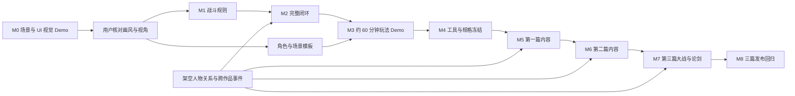

# 武侠世界：开发计划与交付标准

版本：0.12 · 日期：2026-10-01 · 状态：M0 已于 2026-09-30 经用户验收（画风、视角与主要界面全部认可）；M1 战斗原型已于 2026-10-01 经用户试玩、按当前打法推进，余项为 AI 配音选型（待供应商账号与试听）与正式动作，第二台设备确定性复核由用户决定暂缓（进度见 M1 进度记录）；刀、枪、弓排入 M4；M2 已提前开始不依赖试玩结论的规则层（见 M2 进度记录），M3 起尚未开始

设计依据：[游戏架构与系统设计](./ARCHITECTURE.md) · [三篇剧情与任务](./STORY.md)

## 1. 交付策略

按用户确定的顺序开发：**先展示场景与 UI，核对画风和视角；风格认可后，再交付约 60 分钟“相遇—成长—战斗—选择”Demo。** 所有交付仅面向 Windows x64。

所有金庸角色生活在同一个架空年代。不同作品人物的合作、冲突和战斗必须进入第二阶段的实际体验，不以按小说或年代切换世界的方式隔离人物。

**角色年龄与身份原则上须符合各自小说主要剧情阶段。** 为每位角色记录来源作品、版本、主要剧情阶段锚点、年龄依据与身份；原著岁数不明确时使用有依据的范围。世界年表、门派共存及事件安排服从这一基线，不能因时间兼容而将角色改成不符合主要剧情的年龄或身份。阿青单独采用《越女剑》故事结束后的原创延伸阶段，本作以 18 岁登场并安排恋爱线；原著故事阶段约十六七岁须另行记录，版本、时间间隔与后续经历待核。黄蓉、阿朱经用户决定（2026-10-02）沿用原著阶段身份、本作年龄设为 18 岁并保留恋爱线，原文年龄另行记录。

### 1.1 两阶段 Demo 与后续路线

| 交付 | 对应里程碑 | 玩家可以检查什么 | 完成边界 |
|---|---|---|---|
| 第一阶段：场景与 UI 视觉 Demo | M0 | 高清画风、地图细节、人物比例、探索与战斗视角、所有主要界面 | 可点击切换的 Windows 展示包，固定样例数据即可 |
| 第二阶段：约 60 分钟玩法 Demo | M1–M3 | 跨作品人物相遇、成长、回合战斗、选择及其后果 | 一段从开场到事件结局的可玩闭环，含基本存读档、主线对白全配音与关键战斗语音 |
| 后续：三篇完整 1.0 | M4–M8 | 同一架空世界中的 18 个短主线关口、46 条支线、最终大战、华山论剑和爱情结局 | 暂估必做主线 16–20 小时、主动探索与支线合计 40–55 小时；第二阶段完成后重估 |

M1 的战斗原型与 M2 的系统闭环是第二阶段内部步骤。第一阶段交付后，依据用户的画风/视角反馈修订并得到认可，才进入第二阶段。长期系统与内容规模不构成第一阶段验收前提。

角色配音采用 AI 生成与人工试听修整，开发期生成后随 Windows 包离线发布。第一阶段可附少量音色小样；第二阶段主线对白全配音；三篇主线及关键恋爱节点维持全配音，其他支线和普通 NPC 按产能扩展。供应商先做小样比较，尚未绑定，具体架构见[架构文档第 10.5 节](./ARCHITECTURE.md#105-音频与-ai-角色配音)。

### 1.2 第一阶段：场景与 UI 展示清单

Demo 打开后提供场景目录，每个页面可直接进入、返回和重复预览，不需要先跑教程、打怪或解锁剧情。目标是 10–15 分钟内浏览主要画面，不设置剧情时长要求。

| 页面 / 场景 | 展示重点 | 最小交互 |
|---|---|---|
| 主菜单与存档页 | 标题、背景、菜单层级、存档卡片 | 切换菜单、查看固定槽位示例 |
| 江湖大地图与交通面板 | 山川城镇、路线、标记、目的地与坐骑/载具信息 | 缩放、选点、切换骑马/马车/渡船预览 |
| 城镇 / 街道探索 | 斜俯视、建筑比例、人物大小、探索 HUD | 镜头平移或短距离移动、显示交互提示 |
| 客栈 / 室内探索 | 遮挡、室内构图、近景材质与灯光 | 镜头平移、遮挡预览或选中交互物查看提示 |
| 山路 / 野外探索 | 植被、山石、前后层次与路径辨识 | 镜头平移、目标提示预览 |
| 探索 HUD（界面层，2026-09-24 增补） | 地点与时辰、目标追踪、小地图、交互提示、通知、队伍 | 已叠加到三类探索布景；界面层页自 2026-09-30 叠在城镇布景上查看，进入时推样例通知 |
| 人物对话 | 不同作品人物同场、立绘、姓名、文本、选项 | 切换几句样例台词及选中状态 |
| 回合战斗 | 独立侧视、双方比例、站位、行动条、技能栏、状态 | 选招选目标、播放一段攻击/受击短预览、切换胜负结算面板 |
| 角色 / 武学 / 成长 | 属性层级、招式说明、装配和升级反馈 | 切换角色、页签、技能详情及固定前后对比 |
| 背包 / 装备 / 商店 | 道具图标、分类、装备对比、交易面板 | 切页、选择物品、切换比较状态 |
| 任务 / 关系 / 见闻 | 目标说明、人物关系与已知信息层级 | 切换条目和详情 |
| 暂停 / 设置 | 文字大小、音量、分辨率选项与返回路径 | 页面切换，文字大小预览，展示选中/禁用状态 |

实现量限制：3 个代表性探索布景（城镇、客栈、山路）、1 张大地图、1 个战斗布景，加上可复用的菜单面板。探索场景可只制作一个镜头范围，先不铺成长地图。立绘、探索形象和战斗形象至少用一套完整人物样板核对一致性；跨作品同场构图用少量展示角色即可，不要求全部角色动作集。

交付物：Windows 可运行包、场景目录、关键页面截图、简短操作说明及画风/视角反馈记录。截图方便核对，但不替代可切换的实际展示包。

可附带 3 位角色、每人约 3–5 句 AI 配音小样，在对话页试听音色和情绪。此项为 P1，不增加完整配音工具链前置要求；未完成的声音小样移至 M1，不延后视觉 Demo 交付。

不要求真实战斗计算、敌方 AI、任务链、成长结算、自动寻路、旅行扣费、存档迁移、完整四方向动画或复杂内容编辑器。样例值和预设结果在说明中标注；画面质量应接近目标风格，不能靠占位方块验收画风。

### 1.3 第二阶段：约 60 分钟玩家旅程

玩法 Demo 使用[第一篇《众路归潮》的第一章“江南会客”](./STORY.md#21-第一章江南会客完整-demo-流程)：令狐冲、黄蓉和萧峰因同一封求援书相聚，主角介入调查假信，并在芦湾旧渡共同救人。第一章完成后提供明确的事件收束和第二章线索；其余 17 章不进入这一小时 Demo 的制作范围。陆青禾与主角建立可信的友情起点，恋爱承诺留到后续篇章充分铺垫。

| 时间段 | 玩家体验 | 验证的问题 |
|---|---|---|
| 0–5 分钟 | 在芦湾醒来，遇陆青禾，进入客栈并记录旧渡石痕 | 快速说明主角处境，区分亲见事实与猜测 |
| 5–15 分钟 | 与令狐冲、黄蓉和萧峰围绕求援书核对纸张、水位和船牌 | 三人有共同事件动机，也有不同判断 |
| 15–25 分钟 | 选择一位人物的基础战术教学，可短切磋；可接失踪渡工支线 | 成长方案在战斗中有可见作用 |
| 25–35 分钟 | 选择主要同行者，乘渡船前往芦湾旧渡 | 旅行、人物行程和队伍安排衔接 |
| 35–50 分钟 | 识破唐守亭的陷阱，解锁水门并救人；另一部作品人物加入机制战 | 跨作品人物实际协作，救援目标影响出招 |
| 50–60 分钟 | 选择公开或密封转信副页，看到获救名单、人物评价和第二章线索并保存 | 两种结果都可继续主线，选择有即时与后续反馈 |

目标首次游玩约 60 分钟，允许阅读与探索差异；不靠重复战斗凑时长。原著素材与原创事件分别标记，不把人物对战结果当成原著结论。

### 1.4 第二阶段内容清单

| 类别 | 目标数量 | 说明 |
|---|---|---|
| 大地图 | 1 张，3–4 个目的地节点 | 同一世界，至少一条交通路线可用 |
| 小地图 | 3–4 张 | 复用并扩展第一阶段城镇、客栈、山路；按事件需要补充终点 |
| 战斗背景 | 1–2 套 | 复用已确认的战斗构图 |
| 经典人物 | 3 位，来自至少 2 部作品 | 有实质互动；暂定组合来自 3 部作品 |
| 可操作队伍 | 主角 + 最多 3 位伙伴 | 事件中至少有 2 位来自不同作品的角色同场参战，可暂时同行 |
| 其他 NPC | 3–5 位 | 只服务本事件与必要探索 |
| 敌人 | 2–3 类 + 1 名机制首领 | 不用大量敌人美术撑场 |
| 成长内容 | 等级 1–8；8–12 招、3 门内功、1–2 门轻功 | 能体验剑术、拳掌、内功辅助三种基础方案 |
| 任务 | `quest.main.01.jiangnan_guest` + `quest.side.01.missing_ferryman` | 1 次副页保管选择，改变关系、后续查证和路线戒备；陆青禾关系线只埋伏笔 |
| 战斗 | 3–4 场 | 短教学/切磋、机制战、结局战；可选内容不重复凑数 |
| 交通 | 徒步 + 骑乘或渡船的一种完整实现 | 第一阶段可预览更多交通 UI，真实功能逐步补齐 |
| 物品 | 10–15 个定义 | 招式与成长演示需要的装备、消耗品和任务物品 |
| 结局 | 旧渡救援同一终点、2 种副页保管反馈 | 局部分歧后汇合；三种第一篇处置和三种最终结局均属后续制作 |
| AI 配音 | 主线实际发言的所有可达分支 + 关键战斗语音 | 包括主角写定发言；逐句人工审核。UI、任务日志、可选支线不计入本阶段必配范围 |

资料与数量围绕这一小时的体验收敛。完整世界后续按地域、势力和事件扩展，所有角色始终属于同一个架空年代。

## 2. 人力、工期与估算方法

### 2.1 基准团队

| 职责 | 投入建议 | 主要责任 |
|---|---|---|
| 技术负责人 / 玩法程序 | 1 人全职 | 架构、战斗、存档、构建 |
| 客户端 / 工具程序 | 1 人全职 | 地图、UI、内容工具、集成 |
| 场景 / UI 美术 | 1 人全职 | 场景模板、地图制作、界面 |
| 角色 / 动画美术 | 1 人全职 | 人设、立绘、骨骼、招式动作 |
| 剧情 / 系统策划 | 1 人全职或由主创承担 | 原著资料、任务、数值和关卡 |
| 测试与音频支持 | 0.5–1 人阶段投入 | 回归、试玩组织、AI 音色筛选、对白试听剪辑、声音制作 |

基准为 4–6 人可覆盖上述职责，允许兼任，但不能把同时发生的多个全职工作当成同一个人的产能。大量高清角色和场景制作是主要排期约束。

### 2.2 时间基线

按正式启动后的相对周数计算；T0 是开始第一阶段 M0 的第一周，不强行假定今天就有完整团队开工。

| 里程碑 | 基准周次 | 阶段长度 | 主要产物 |
|---|---|---|---|
| M0：第一阶段视觉 Demo | W1–W2 | 2 周 | 可切换场景和主要 UI 的 Windows 展示包，交用户核对画风与视角 |
| M1：第二阶段内部战斗原型 | W3–W6 | 4 周 | 可重放的战斗、三种基础方案、首领原型 |
| M2：第二阶段内部系统闭环 | W7–W10 | 4 周 | 地图旅行、对话任务、成长和可靠存档 |
| M3：第二阶段玩法 Demo 交付 | W11–W16 | 6 周 | 约 60 分钟跨作品相遇—成长—战斗—选择及试玩报告 |
| M4：探索事件工具与排产 | W17–W24 | 8 周 | 地点条件触发、事件占用、汇合校验、三篇任务图与关系状态 |
| M5：第一篇内容完成 | W25–W48 | 24 周 | 《众路归潮》六个短关口、22 条支线和三种篇末处置 |
| M6：第二篇内容完成 | W49–W72 | 24 周 | 《烽火未起》六个短关口、12 条支线、人物关系与大战前局势 |
| M7：第三篇与全篇 Alpha / Beta | W73–W100 | 28 周 | 《华山前夜》六个短关口、12 条支线、最终大战、论剑五席和返现代结局 |
| M8：发行质量收尾 | W101–W112 | 12 周 | 探索顺序与三篇存档回归、候选发布包、档案兼容与发布资料 |

以上周次是假定第一阶段顺利通过风格核对的旧工作量基线；用户核对及画风调整时间另计，M1 必须在认可后开始。新增 22 处势力地点后，表内 M6–M8 周次仅供对照，须由 M4 地图与资产排产重新确定，不能作为现行交付日期。

三篇原以 **112 周**为工作量基线，另预留 16–32 周用于人物考据、高清资产、关系线、探索顺序回归、配音与外部依赖，得到过 **128–144 周**的早期估计。新增门派后，完整游戏须有 22 处势力地点的可进入公共区域及相应交互；上述数字**未计入这批固定地图覆盖与新增事件，不能再作为 1.0 总工期估算**。M4 应在地图表、复用方案、资产报价和人员工时明确后重排 M6–M8，M5 再以实际产能校准。第一阶段视觉 Demo 与第二阶段第一章玩法 Demo 的交付顺序不变。

- 第一阶段小团队估算 1–2 周，若需完全新制高清资产及多轮调风格，预留至 3–4 周；这是独立的首次交付，不等到 W16。
- 第二阶段在画风认可后约 14 周，预留至 16–18 周；M1–M3 是内部拆分，不增加用户必须先验收的交付层级。
- 单人全职、配合必要美术外包：第一阶段约 2–4 周，第二阶段在认可后约 4–6 个月；三篇完整 1.0 不能沿用此前单篇 24–36 个月估算，需在第一篇完成后按实际产能单独重估。
- 兼职开发先按每周可投入工时重算任务容量，不直接使用上述日历工期。
- 4–6 人 × 约 26 个基线月，为约 104–156 人月量级；含缓冲约 120–198 人月。该范围只是资源规划，不是报价。

费用估算采用“各岗位实际人月成本 × 投入月数 + 美术/音频外包报价 + 工具/设备 + 内容授权 + 发行与测试支出 + 预备金”。M0 拿到视觉样板实际工时、M1 拿到完整动作实际工时后再细化金额预算，不在没有报价时给出虚假的精确总价。

配音预算单列“实际请求字符/时长 × 当前计价 + 音色创建费用 + 候选与返工费用 + 人工试听剪辑工时”。约 60 分钟游戏体验不等于 60 分钟语音，需统计分支台词量及实际成品时长。M1 小样记录通过率、重生成次数和每分钟成品工时，M3 按台词锁定后的数量复算；现有时间基线纳入音频岗位工作，但未测产能前不保证增加配音后工期完全不变。

### 2.3 关键路径

美术、资料整理和音频可与程序推进并行，但批量角色不能在骨骼规格未验证前开工，主线分支不能在任务状态与存档规则未确定前大量堆积。

### 2.4 探索式剧情的可行性与成本

**结论：可实现，复杂度中高，主要风险在剧情内容、人物占用和存档回归。** 本案采用“到达地点 + 少量可见条件”触发手写事件，第一篇 02/03、第二篇 08/09/10、第三篇 14/15 在同组内可换顺序，之后汇合。结局仍为既定三种终局，救援、关系、门派支援和证据完整度决定尾声片段。若要求 46 条支线的每种先后排列都有独立剧情和独立结局，内容与配音组合会迅速失控，现有小团队估算不适用。

| 增量工作 | 暂估基线增量 | 核查点 |
|---|---:|---|
| M4 地点条件索引、可见提示、事件预留与汇合校验 | 约 2 周 | 用 02→03 / 03→02 两条测试档证明同一线索和人物可正确汇合 |
| M5–M7 新增 12 条地区支线、人物档案与关系节点，复用地图模板 | 合计约 12 周 | 逐批实测每条支线的剧本、地图、资产、配音和回归工时 |
| M8 更多探索顺序、读档、限时与结局片段回归 | 约 2 周 | 固定存档覆盖无支线、关键顺序、证人缺席和多恋人组合 |

上述约 **16 周**是将旧版 96 周基线调整为 112 周的工作量差值，不包含 16–32 周风险缓冲。探索触发系统本身不要求模拟全世界所有 NPC 的实时行程；同一 NPC 的地点由世界关口和事件占用确定。M3 的一小时 Demo 只验证第一章实地调查和一条可选支线，M4 再验证并行调查与汇合。若 M4 的双顺序样例仍产生主线死锁、重复角色或无法维护的条件表，应减少可并行的主线组数，再重估而不是把问题留给 M7。

### 2.5 逐章对白生产与锁稿

三篇先确定章节事件、人物动机、任务分支、保底线索与结算事实；正式台词按实际制作批次逐章完成，不以全篇台词预先写完作为开工条件。每章或同组可互换章节遵循“核对人物依据与任务条件 → 写出全部可达分支的对话初稿 → 接入可玩流程并试玩修订 → 锁定本批台词与 `line_id` → 制作并审核配音 → 游戏内复测”的顺序。锁稿前核对说话者、触发条件、选择后果、人物占用、字幕和专名发音；锁稿后改词须同步更新文本及音频清单，标记并重做受影响的音频，不复用过期配音。

每批台词完成后须写入仓库，按章节分别保存为可阅读、可引用、可修改的文件；每章文件覆盖该章主线、支线、关系与地区事件的全部已写台词及可达分支，并保留事件 ID、说话者、条件和 `line_id`。文件位置与逐章索引按《ARCHITECTURE》第 9.1 节执行；跨章事件按实际发生章节拆分，不能只保留在聊天记录、音频清单或编辑器内部。移入游戏工程目录时更新索引，不维护两套独立可编辑的正文。

- M0 只写场景展示和音色试听所需的少量样例句，不把样例视为第一章正式对白。
- M1 为第一章“江南会客”写可玩对话初稿；M2 将其接入一条主线和一条可选支线；M3 依据试玩修订并锁定第一章所有可达主线对白，批量配音后再核对实际游戏节奏、字幕和分支覆盖。
- M4 将其余 17 章及可选内容拆成分篇制作批次，核定人物依据、对话范围、关系节点与配音预算；此时确定内容规格，不要求写完后三篇的逐句台词。
- M5–M7 按内容批次逐章重复初稿、接入、试玩、锁稿和配音流程。下一批章节可提前写初稿，但批量配音以该批可玩流程与台词锁定为前提；M3、M5 的实际台词与配音产能用于复估后续排期。

## 3. 分阶段工作包

任务优先级：P0 是本阶段通关条件；P1 是本阶段期望完成、必要时可顺延的项目。负责人为职责，不是已指定的具体人员。

### M0：第一阶段场景与 UI 视觉 Demo，W1–W2

**目标：尽快交出可看的、可切换的展示包，让用户确认画风与视角。** 页面范围按第 1.2 节执行，完整游戏系统不进入本里程碑。

| 任务 | 优先级 | 负责人 | 交付物 / 完成判据 |
|---|---|---|---|
| M0-01 展示工程 | P0 | 客户端 | 最小 Godot .NET 工程、场景目录、页面切换和返回 |
| M0-02 Windows 导出 | P0 | 技术 | Windows x64 包在目标设备启动；记录引擎和 SDK 组合 |
| M0-03 三类探索布景 | 进行中（城镇、客栈大堂、山路布局样板已做；2026-09-25 生产方式定为方案 C 引导出件，试做经用户认可后三类布景批量出件，入库 104 件待用户实机核对；2026-09-26 补齐客栈方砖、城镇草地、山道土路、山地草坡 4 张地面纹理，并补崖壁、驳岸、桥面、石阶纹理与井台、廊棚屋面；2026-09-26 起廊柱、桥栏、溪水与河水陆续换成 AI 纹理与着色器；2026-09-30 客栈内墙、吊灯与剖切矮墙换成 AI 件，三类布景只剩人物为占位） | 2026-09-24 用户否定水墨宣纸风，改为蓝绿清新；此前 `m0_simple`（纸墨肌理、工笔图标）与 `m0_complex` 场景提示词按旧画风编写，结果作废，CC0 古画只留作构图参考。场景生产方式拟为“Godot 色块布局 → AI 逐件生成地面纹理与建筑精灵 → 引擎拼装分层”，大地图用色块草图图生图（架构文档 10.3）；2026-09-25 用户选定方案 C（逐件出件 + 占位件渲染作 ControlNet 引导），以江南水镇样板先行 |
| M0-04 人物与战斗画面 | 进行中 | 旧工笔立绘（`m0_complex` / `m0_fix`）作废。立绘改用 Animagine XL 4.0（`tools/ArtGen/jobs/m0_portrait.json`，台式机每张 4–7 秒），经五轮提示词迭代与多次图生图、补光、扩图尝试后，**2026-09-24 用户选定 `lu_qinghe_v3_from505_7`（以 v2 半身 505 为底图生图）为陆青禾立绘 v1**，已入 `art_source/ai/characters/` 并登记资产台账；为半身构图，未修整。用户曾要求全身构图，以该图扩图的尝试出现背景矩形与裙摆接缝，按用户指示停止，全身版本暂缺。教训：频繁改提示词重新生成会逐轮偏离已认可的样子，定稿后的修改应以选定图为底局部处理。2026-09-30 用户定展示主角为青年男子、本地短打；探索与战斗改用同一张 AI 全身样稿（统一骨架出图，7 人入库），待用户核对；同日战斗布景“旧渡水门”换成 AI 远景 + 引擎透视码头石板，水门机关换成 AI 道具图，待用户核对 |
| M0-05 主要 UI | P0 | UI、客户端 | 第 1.2 节所有主要界面可进入，使用固定示例内容 |
| M0-06 风格参数与资料 | 进行中 | 2026-09-24 UI 配色改为青绿山水（石青、石绿、水白、深潭、杏红），`UiPalette` 成员改为语义名，对比度实算见架构文档 10.4；同日在家用台式机装好 .NET SDK 10.0.401、Godot 4.7.2 .NET 与同版导出模板后，`dotnet build` 通过（0 警告 0 错误），目录、角色、商店、见闻、设置等页 1080p 截图自查新配色正常。字体为随包 OFL 字体（思源黑体、霞鹜文楷）；展示人物档案未开始，令狐冲、黄蓉在角色页标为“档案待核”且不显示数值 |
| M0-07 交付核对 | P0 | 主创 | 展示包、截图、操作说明；收集用户意见并修订画风和视角 |
| M0-08 角色声音小样 | P1 | 音频、主创 | 3 位角色各约 3–5 句 AI 配音试听；可顺延至 M1，不阻塞画风核对 |

验收关卡：

- 展示包在 Windows 启动；用户能从目录直接访问所有主要画面，不需要玩完前置流程。
- 实际游戏画面中核对高清材质、人物比例、场景视角、战斗视角、立绘一致性及文字可读性。
- 展示角色的外形与年龄感符合其原著主要剧情阶段，身份称谓与档案一致；如附配音，音色年龄感也按同一基线检查。不得因共同世界年表冲突而改龄。
- 页面切换、页签、物品/技能选择、关闭返回均可用；样例按钮展示选中、悬停及禁用状态。
- 1080p 和 1440p 检查布局与文字；4K 先检查清晰度和缩放，不要求完整游戏性能压测。
- 简化动画可以采用关键帧或预设播放；完整骨骼、全部角色方向和技能动作放到第二阶段。
- 用户认可画风与视角后进入 M1；仍有意见则继续修改此展示包，不先批量制作剧情和角色资产。

本阶段不建立战斗模拟器、不做伤害平衡、不要求任务可通关或存档可用。界面中的升级、结算和交易用固定状态演示，不能在进度记录里标记对应玩法已完成。

#### M0 进度记录

只记录实际运行过的构建、导出与画面检查；“完成”指该任务的 M0 交付物，不代表对应玩法已实现。

**2026-09-30 验收结论：** 用户核对 M0 核对包后表示“M0 已经验收通过了，全部认可”，画风、人物比例、探索与战斗视角及 12 个主要界面按当前状态认可，进入 M1。下表各行“进行中 / 待用户核对”的记录保留为过程记录，状态以本结论为准；M0-08 声音小样顺延到 M1-09 一并做。

| 任务 | 状态 | 记录 |
|---|---|---|
| M0-01 展示工程 | 完成 | 2026-09-23 工程骨架、场景目录与 Esc 返回；2026-09-24 增加共用册页框架（印章标题、竖排页签、PageUp/PageDown 切页）；同日改为启动进入标题页、Esc 回标题、场景切换经色幕淡出淡入，菜单外框改为顶栏分区（Q/E）+ 玉版子页签 |
| M0-02 Windows 导出 | 完成 | 2026-09-25 修正导出脚本：`GODOT_BIN` 指向 GUI 版编辑器时 PowerShell 不等其退出，脚本在导出写完前就返回，紧接着启动的导出包会读到上一版（本日两次截到旧画面即此原因）；现优先用同目录 `_console.exe` 并 `Start-Process -Wait` 检查退出码，修正后导出约 9 秒、脚本返回即可截到新版。2026-09-24 加入大地图页后再次执行 `tools/scripts/export-windows.ps1` 通过（0 警告 0 错误），导出包内截图确认大地图页与目录页（已完成 9 / 12）；同日界面重做后在家用台式机再次执行 `tools/scripts/export-windows.ps1` 通过（0 警告 0 错误），导出包启动进入标题页，并在导出包内截图确认对话页能读取打包的 `dialogue/*.md`；.NET SDK 10.0.401 + Godot 4.7.2 .NET；2026-09-24 再次执行 `tools/scripts/export-windows.ps1` 通过（0 警告 0 错误），导出包启动并可进入已完成页面；同日家用台式机（winget 安装 `Microsoft.DotNet.SDK.10` 10.0.401 与 `GodotEngine.GodotEngine.Mono` 4.7.2，`GODOT_BIN` 设为用户环境变量）执行导出脚本通过，导出包启动并截图目录页。2026-10-01 按用户要求把启动窗口改为自适应屏幕的无边框全屏（`project.godot` `window/size/mode=3`），Alt+Enter 切换全屏 / 窗口；引擎参数 `--windowed` / `--resolution` 会被全屏设置盖过，截图命令改为用户参数 `--size=宽x高`（`DevCapture` 切回窗口、待模式切换落定后设尺寸；`capture-review.ps1` 与文档同步），1920×1080、2560×1440、2560×1080 三种尺寸截图实测尺寸正确；M0 设置页样例的窗口模式默认改为“无边框全屏”。`tools/scripts/export-windows.ps1` 通过（0 警告 0 错误），在 3840×2160 屏上直接启动导出包：画面 3840×2162 铺满（Godot 无边框全屏多出 2 像素属正常），Alt+Enter 后为居中的 1600×900 窗口。同日用户问窗口为何固定 1600×900：该尺寸来自早期 `window_width_override`，已去掉；窗口改为所在屏幕可用区域宽高各 80% 并居中（`AppHost.EnterWindowed`，等模式切换落定后再设尺寸）。`tools/scripts/export-windows.ps1` 通过（0 警告 0 错误），3840×2160 屏上导出包全屏 3840×2162、Alt+Enter 后窗口 3094×1726 位于 (373,164)、画面 3072×1670，再按回到全屏；`--size=2560x1440` 截图尺寸正确 |
| M0-03 三类探索布景 | 完成（2026-09-30 用户验收），3 / 3 布局样板（城镇、客栈大堂、山路）；正式件按方案 C 批量出件，三类布景的房屋、树石植被、杂件与家具共 104 件入库，待用户实机核对 | 2026-09-26 补地面纹理：新任务文件 `tools/ArtGen/jobs/m0_ground_textures.json`，`piece.py` 的格线引导增加 `stagger: false`（直缝方砖）；台式机每张约 7 秒，三轮共 34 张。方砖首轮即可用（取 g1·11）；土路提示词里一出现碎石 / 卵石就铺满整面成卵石路（两轮 10 张均如此），改取素土 g5·44 作底、碎石与嵌石仍由着色器稀疏叠加；草地首轮多出石块、方格或巨型叶簇，第二轮负面词排除 cobblestone / tiles / rocks 后取 g6·44（草坡）、g7·44（城镇草地）。`town_ground` 着色器把石板街专用纹理参数推广为每块地面可接的 `ground_tex`（调色、收饱和度、向平均色收拢对比、大尺度明暗），`PieceArt.ApplyGround` 统一接入；客栈方砖在 `InnShell` 地面内平铺（开 mipmap 过滤），原逐砖深浅改为半透明叠加。首次截图草地叶簇粗大、对比过强（像满地蕨叶），把两张草地的循环尺度由 420 缩到 200、对比收至 0.5 后自然。`dotnet build` 0 警告 0 错误；客栈 `--tab=0`、城镇 `--tab=0/4`、山路 `--tab=0/4` 1080p 截图自查；`tools/scripts/export-windows.ps1` 通过（0 警告 0 错误），导出包内客栈与山路截图确认纹理载入。仍为占位：崖壁、墙面、石阶、廊棚、驳岸、井台、水面。 同日用户核对：地面纹理认可，其余件画风认可；指出山路竹子简陋、柳树偏写实，要求“再卡通一点点”。竹子：占位竹丛由 6–8 竿细竹改为 10–13 竿粗细高矮不一、叶簇加密，重新导出引导图（`out/guides/wild_bamboo`），SDXL 按 control 0.5 重出（种子 66 竹竿偏青蓝不选），9 丛竹子全部替换；柳树：按“选定后以选定图为底修改”的约定不重抽，`piece.py` 增加 `init_from`（以旧件生成原图作图生图底图），对比 SDXL 0.4–0.6 与 Animagine 0.3–0.5 后取 Animagine 0.4（树冠成团、树干带勾线、造型不变；种子 11 树冠顶有亮斑，改取 22），6 棵柳树全部替换。`dotnet build` 0 警告 0 错误；山路 `--tab=0/4`、城镇 `--tab=0/4` 1080p 截图自查；`tools/scripts/export-windows.ps1` 通过（0 警告 0 错误），导出包内城镇与山路截图确认新件载入。 同日用户认可后继续补占位：山路崖壁改贴 AI 岩壁纹理（`wild.cliff`，横向无缝，沿崖边按崖长取 u、按崖高取 v，程序化岩块与石台不再画，垂苔、崖脚阴影与勾线照旧叠加）；木桥桥面贴 AI 木板纹理，桥栏仍为程序化圆木；石阶与木桥加入引导图导出（`WildStepsNode` / `WildBridgeNode` 补 `Seal` 与 `UseArt`），但石阶文生图在游戏里像一整块深色石板、看不出踏步，图生图又只照描平涂占位，木桥文生图在框内另画小桥，三者均未采用、石阶保留程序化占位；城镇驳岸立面改贴 AI 条石纹理（`town.embankment`），井台第二次出件成功（改写提示词、control 0.6，取 c1·66），廊棚屋面按引导图出件（首轮瓦垄像刷痕，第二轮强调成行弧瓦取 c2·88），灯笼仍由引擎挂在檐下、引导图不画灯笼。`dotnet build` 0 警告 0 错误；城镇 `--tab=0/2/3/4`、山路 `--tab=0/1/5` 1080p 截图自查；`tools/scripts/export-windows.ps1` 通过（0 警告 0 错误），导出包内城镇与山路截图确认。仍为占位：山路石阶、桥栏、溪水，城镇渡口石阶、廊柱与坐栏、河水，客栈墙面与吊灯，全部人物。 同日用户指出山路占位石阶“太粗糙”：改为程序化几何贴 AI 石面纹理（`wild.ground.slab`，赛璐璐花岗岩，首轮照片噪点式不采用、改用带明暗与勾线的提示词取 g13·11），新增共用 `FaceTexture.Apply`（按面局部坐标平铺、纹理偏移取世界坐标使相邻面连续）；踏面与踢面在当前光向下同为受光面，踢面单独压暗一阶才分出层次；两侧石栏由逐级方块改为一整条随坡升高的斜顶石栏；加踏面前沿受光倒角、零星缺角、贴栏墙角的小撮苔与阶脚草叶（首版苔为规整圆点，像纽扣，改为不规则小团并减量）。城镇渡口石阶同法贴石面纹理。用户随后指出廊柱穿出廊棚屋面：排序时廊柱占地落在屋面占地内、镜头方向上分不出前后，按中心远近河沿一排柱排到了屋面之前；`DepthSort.Compare` 增加规则——占地中心落在悬空件（Overhead）占地内的非悬空件一律排在其下，茶亭亭柱与山门门柱同样受益；城镇新增截图机位 `--tab=6`（廊棚西头外侧，屋面不淡出），山路 `--tab=4` 核对茶亭与山门无回退；两页底部说明文字缩短（山路页已超出屏宽）。用户再指出崖沿、溪岸的草仍是占位（直线草叶、椭圆矮灌）：新任务 `tools/ArtGen/jobs/m0_grass_tufts.json`（SDXL 文生图、纯色底、每张约 7 秒）出草丛与矮灌精灵，首轮草丛多带金黄麦穗，第二轮负面词排除穗头后得纯绿草丛；入库草丛 4 种（`wild.tuft.grass.1–4`）、矮灌 1 种（`wild.tuft.bush.1`），另两种矮灌因渐变底与实心地影抠不净弃用。崖沿、岸沿改为沿边错落散布草丛（间距、大小、左右翻转随机，崖沿间或一丛矮灌），石阶脚下两角各一丛；贴了 AI 岩壁纹理时不再画程序化垂苔（像三角贴纸）。`dotnet build` 0 警告 0 错误；山路 `--tab=0` 截图与局部放大自查；`tools/scripts/export-windows.ps1` 通过（0 警告 0 错误），导出包内截图确认。溪岸卵石仍为程序化椭圆，待与溪水一起处理。 同日按约定处理溪岸卵石与溪水：新任务 `tools/ArtGen/jobs/m0_creek.json`（SDXL 文生图、环绕填充，每张约 7 秒，3 组 × 6 种子）。溪岸立面取 k1·66 入库为 `wild.bank`（11 号偏贴纸卡通、44 号空底多），`WildWall` 北岸改沿岸贴图，岸高 40 只取纹理上部使卵石不被压碎，岸脚压暗成湿石，程序化椭圆卵石只在无纹理时画；水面提示词出图几乎全是水底卵石，改取溪床卵石 k2·44 入库为 `wild.ground.streambed`，`town_ground` kind 2 在有纹理时走新 `creek`：水底微折射晃动、浅水 / 深水两阶水色（按离岸远近，交界随噪声起伏）、顺流亮带与细浪线向下游漂移、近岸碎白沫；离岸远近起初用 Polygon2D 顶点色传入，截图调试发现三角化后插值错乱、整片出白沫，改为把两岸函数参数（`WildSamples.StreamN` / `StreamS`）传给着色器直接计算。原溪面可见仅约 20 像素、像水沟：北岸北移 60、两岸 D 距由 120 加宽到 180，北段山道起点随之北移；原在北岸边的两块矮石（`wild.rock.5/6`）落入溪中，贴图 origin 按溪面高差下移 34.64，溪中石不压地影，改画石根水影、外圈涟漪与压在石脚上的前半圈白沫（`WildSprite` 新增 `DrawFront`）；近镜头的南岸新增 `WildShore`：宽窄起伏、向草坡淡出的卵石滩，水边淡墨线，滩外沿散布草丛。城镇河水仍为程序化。`dotnet build` 0 警告 0 错误；山路 `--tab=0/1/5` 1080p 截图与局部放大自查（首轮水面偏白、浪线连成大片，收暗水色、浪线改为细而稀后正常）；`tools/scripts/export-windows.ps1` 通过，导出包内 `--tab=0` 截图确认溪岸、溪水与溪中石载入。 同日用户认可溪水效果，指出溪岸与水底“全是规整鹅卵石”：同一任务文件加两组岸（土岸 + 树根、苔岩）与一组细沙水底各 6 种子，溪岸换为长苔不规则岩土 k5·44、溪床换为细沙 k6·11；着色器在水底稀疏撒大小不一、压扁斜置的散石（约两成网格，压暗一阶带受光亮边，深水处更淡）；南岸滩改用溪床细沙纹理按画面坐标平铺。`dotnet build` 0 警告 0 错误；山路 `--tab=0/5` 1080p 截图与局部放大自查（散石首版在水色下几乎看不见，改为在水色之后压暗并加大后可辨）；`tools/scripts/export-windows.ps1` 通过，导出包内 `--tab=0` 截图确认。`dotnet build` 0 警告 0 错误；山路 `--tab=0/5`、城镇 `--tab=0` 1080p 截图与局部放大自查；`tools/scripts/export-windows.ps1` 通过（0 警告 0 错误），导出包内山路石阶截图确认。 同日处理城镇河水占位（原为高饱和湖蓝加粗白浪线，与溪水不在一个档次）：运河水深看不到底，不出纹理，`town_ground` 新增 `canal_water`，按两岸参数（`TownSamples.NorthBankWave` / `SouthBankWave`，两岸函数改由同一组参数计算）画北岸驳岸条石的暗倒影（边缘随波碎开）、零星柳荫屋影、河心两阶天光、细浪线与驳岸脚暗线和拍岸碎亮光；船、渡口石阶与桥墩（`TownSamples.WaterObstacles`）脚下压暗影、朝镜头拖倒影、外圈碎亮涟漪（首版倒影偏移太短被船身挡住，改为沿视线扫过露出高度的 √3 倍）。`dotnet build` 0 警告 0 错误；城镇 `--tab=0/4` 1080p 截图与局部放大自查；`tools/scripts/export-windows.ps1` 通过（0 警告 0 错误），导出包内 `--tab=0` 截图确认。仍为占位：山路桥栏，城镇廊柱与坐栏，客栈墙面与吊灯，全部人物。 同日用户认可河水后处理剩余几何占位（山路桥栏、城镇廊柱与坐栏）：沿用石阶做法——几何保留（占地、排序与遮挡不变）、外观换 AI 纹理。新任务 `tools/ArtGen/jobs/m0_wood.json`（2 组 × 6 种子）出朱漆木 `town.wood.lacquer`（w1·55）与风化木 `town.wood.weathered`（w2·11）；新增 `Solid.Prism`（两点间正多棱柱，可选木纹顺轴向），`FaceTexture.Apply` 增加侧面压暗参数并只贴四边形面。廊柱改为两级八角石础 + 八角朱漆柱（纹理整贴像蛇皮、且节点未开纹理重复出现横条，改为朱漆底色上以 35% 不透明度叠纹理并开重复）；坐栏改为美人靠：裙板、坐板、向河面外倾的鹅颈靠条与圆木扶手（靠条描边会吃成墨色，改为不描边、压暗一阶）；山路木桥两侧改为边梁 + 圆木立柱 + 圆木扶手（桥栏竖直面恰好侧对镜头，立柱与扶手叠成一线，扶手压低、柱头略冒出）。两页底部说明文字同步。`dotnet build` 0 警告 0 错误；城镇 `--tab=3/6`、山路 `--tab=0/1` 1080p 截图与局部放大自查；`tools/scripts/export-windows.ps1` 通过（0 警告 0 错误），导出包内城镇 `--tab=3`、山路 `--tab=0` 截图确认。仍为占位：客栈墙面与吊灯，全部人物。 2026-09-30 处理客栈墙面与吊灯：北墙、东墙按正立面出件——新增 `InnWallElevation`（墙面局部坐标、不经投影）供 `PieceGuideExport` 导出 `inn.wall.north` / `inn.wall.east` 引导图，AI 画整面墙，`InnShell.WallArt` 在墙面贴花里贴回、经面的仿射变换落到斜视画面；水牌菜名（“今日”与菱角 / 黄酒 / 阳春面，与交互提示一致）和字轴“宾至如归”改为字层，引导图不画字。新任务 `tools/ArtGen/jobs/m0_inn_walls.json`：文生图材质好但整墙被“朱漆”染红、或粉壁画成木板，图生图 strength 0.75–0.92 只照描平涂；新增 `tools/ArtGen/regrade.py`（`place.py --regrade`）按引导图平涂色块分区、在 Lab 空间把 AI 图各区平均色拉回布局配色，保留材质与明暗，取北墙 a2·11、东墙 a2·33。吊灯文生图画不进画框，取图生图 a2·66（`inn.lantern`，六盏共用）；剖切矮墙外立面贴 AI 粉壁纹理 `inn.wall.plaster`、墙脚取驳岸条石纹理。页面底部说明同步。`dotnet build` 0 警告 0 错误；客栈 `--tab=0/4` 1080p 截图与局部放大自查（墙面件与柱、楼梯、门帘位置对齐，字层落在空白牌面上）；`tools/scripts/export-windows.ps1` 通过（0 警告 0 错误），导出包内 `--tab=0` 截图确认新件载入。仍为占位：全部人物（探索剪影）、吊灯光斑。 2026-09-25 按试做参数批量出件：`PieceGuideExport` 增加 `--region=town|inn|wild`（客栈 12 件、山路 59 件引导图；茶亭、山门按部件出遮罩，合成时悬空件最后画），客栈与山路各件接入 `PieceArt`（`UseArt`，多部件用 `TownPiece.Part`），城镇杂件也接入贴图；招牌、匾额、碑文、路牌的字改为面的字层（`Face.Lettering`），引导图不画字，贴图后引擎用登记字体补写，客栈幌子整面补画；`place.py` 增加 `--deshadow`（清掉图底部树干根部以外的模型自带地影）。台式机每张约 18 秒，共生成约 500 张（城镇 `b1_`–`b4_` 四轮、客栈两轮、山路两轮），入库 104 件：城镇房屋 9、树 8、杂件 7，客栈柜台、楼梯、屏风、3 柱、4 桌、2 盆栽，山路 24 树、16 石、15 灌丛 / 蕨 / 草药、茶亭 8 部件、山门 3 部件、路碑、木牌（逐件记录见资产台账）。未达标、继续用占位的：城镇井台（四个种子都只照描井圈线框）；另有质量一般、待用户定夺的：店铺 north.2 门面偏现代、客栈外观偏暗且未画匾额（匾字由引擎补写）、茶亭柱子为灰色而非红漆、部分蕨与矮丛偏亮绿、同形矮丛出图相同。`dotnet build` 0 警告 0 错误；城镇 `--tab=1/2/4`、客栈 `--tab=4`、山路 `--tab=0/2/4/5` 1080p 截图自查：件与布局、占地、交互点对齐，排序与遮挡淡出正常，字层落在空白牌面上；据截图修正了蕨与山石底色残留成的半透明方块（改用更高阈值按底色抠）；`tools/scripts/export-windows.ps1` 通过（0 警告 0 错误），导出包内山路与客栈截图确认 AI 件载入。 2026-09-25 用户在三种出件方式中选定 C（逐件出件 + 几何引导），按架构文档 10.3“引导出件”搭好管线并在芦湾河街试做：Godot 端 `PieceGuideExport.tscn` 导出 28 件引导图（含结构图与平桥部件遮罩），`tools/ArtGen/piece.py`（SDXL + `xinsir/controlnet-canny-sdxl-1.0`，Apache-2.0）生成、`place.py` 入库，引擎端 `PieceArt` 按 id 贴回原位、`town_ground` 石板街改取 AI 纹理。台式机 RTX 4070 Ti SUPER 每张 8–16 秒，共六轮对比：图生图 strength 0.7–0.95 几乎只照描占位；改为结构线约束的文生图后材质才出来；Animagine 画场景偏卡通荧光，改用 SDXL base；结构图去掉门窗时模型画出西式窗，改为保留开口只去纹理；树只能弱约束（control 0.35）后按底色抠图。选定并入库：民居 `r5_house_g_44`、平桥 `r4_bridge_55`（拆桥面与两道栏杆）、柳树 `r3_willow_22`（擦除自带阴影）、石板纹理 `r6_flagstone_11`（错缝格线引导、无缝平铺）。试做中顺带修正占位民居的绘制次序错误（远侧马头墙压在南墙上）。`dotnet build` 0 错误；城镇 `--tab=0/4/5` 1080p 截图自查：件与布局、占地、交互点对齐，平桥栏杆前后排序与行人正确，纹理按投影压扁、积水保留；`tools/scripts/export-windows.ps1` 通过（0 警告 0 错误），引导图导出场景已从发行包排除（`export_presets.cfg` 的 exclude_filter），导出包内 `--tab=5` 截图确认 AI 件与纹理正常载入。同日用户实机认可画风，要求去掉柳树树冠的雾状灰色：`cutout.py` 增加按色差的软抠图，柳树以 `--soft 10,50` 重新入库，灰层变为半透明枝条，城镇 `--tab=0` 截图确认；下一步按同一参数批量出件（城镇其余件，再客栈、山路）。画风一致性（AI 件偏写实厚涂，与占位件、人物剪影混排差异明显）待用户实机核对后再批量出件。 2026-09-25 完成山路 / 野外探索页 `ExploreWild.tscn`“山门路·半山”（第三类布景，布局一步；STORY 第三章 `quest.main.03.mountain_pass` 的地点，只做溪涧—半山茶亭—山门一段，药庐与抄写房未做）：与城镇、客栈同一个 2:1 等距投影，山势做成三层台地——溪涧谷底（z 0，溪面 −40）、半山（150）、上台（320），崖边在画面上大致水平、向远处层层升高，崖壁为宽窄不一的岩块（每块斜折痕分受光 / 背光两面）、裂隙、横向石台、垂苔与崖沿草叶小丛，崖脚压接触阴影；只能经凿进崖里的两段石阶（9 级、10 级，两侧石栏）上下，行人高度随石阶连续变化；跨溪木桥、半山茶亭（四柱攒尖顶、“半山亭”匾、坐凳与石桌，屋顶压在亭下行人之上并在遮住行人时淡出）、上台石牌坊“山门”、路碑、岔路木牌（北山门、东药庐）、一串脚印；植被为山松（层层平展的针叶团）、竹丛、槭树（唯一暖色点缀）、山石与矮丛 / 蕨 / 草药；地面着色器新增山道土路与山地草坡两种纹样，溪水沿画面水平流；上台远处没入山雾，远景天色与三层赛璐璐远山按镜头移动做视差，最上层几缕薄雾缓慢横移。7 处交互（下山回大地图、采草药、路碑、茶亭歇脚、脚印线索、岔路木牌、山门）；目标追踪换成本页样例（第三章主线“过山门，找到抄写房”、支线 `quest.side.04.herb_debt` 药庐欠账，均为样例文字）。为此 `ExploreStage` 增加：镜头范围可由页面直接给出（台地沿画面水平展开，不按世界轴）、交互菱形高度加所在地面高度、页面可换目标追踪、主线目标在画面外时屏幕边缘出现泥金方向箭头（避开四角 HUD，城镇指旧渡石痕、客栈指雅座、山路指山门）。布局数据 `WildSamples`（以画面坐标 A / D 书写山势并换算世界坐标），几何派生与碰撞 `WildLayout`，布景件 `WildPieces`。`dotnet build` 0 警告 0 错误；`--tab=0–5`（山脚入口、木桥、茶亭内屋顶淡出、岔路木牌交互提示、缩到 0.85 看山门与远山、石阶半途）1080p 截图自查，据此修正崖壁垂苔重复顶点导致的三角化报错、崖壁像挡土墙（改为岩块折面并加高台地）、崖沿草边被高台地面盖住（拆出崖沿层后画）、山松遮住牌坊匾额、方向箭头压在小地图上与城镇页箭头文字看不清；城镇 `--tab=2` 截图确认方向箭头；`tools/scripts/export-windows.ps1` 通过（0 警告 0 错误），导出包内截图山门状态。行走手感待用户实机确认。 同日完成客栈 / 室内探索页 `ExploreInn.tscn`“江南客栈·大堂”（第二类布景，布局一步）：与城镇同一斜视投影，镜头一侧的南墙、西墙剖切到齐腰（深赭剖切面、门柱残段），北墙与东墙为完整内墙面（木构架、粉壁、裙板、柜台后博古货架、水牌、石青门帘的后厨门、两扇透天光的槅窗、“宾至如归”字轴）；方砖地、柜台（算盘、账本、茶壶）、三张八仙桌与屏风后雅座（桌上三封信的道具占位）、四扇青绿山水屏风、三根漆柱、沿东墙十三级楼梯接楼上平台、青花盆栽、酒坛；六盏吊灯在悬空层，地面叠加暖光斑，门口斜入天光，门外一段石板街渐隐进暗场。静态剪影：掌柜乔红绡（柜台后，被柜台挡住下半身）、店小二、坐姿茶客（不写台词）。6 处交互（出门、询问掌柜、水牌、旁听茶客、雅座、上楼），行人进屏风后屏风淡出；城镇客栈门前按 E 进大堂、大堂门口按 E 回门前（经色幕切换，到达点只传一次、不写存档）。为此把城镇页的行走、跟随、排序、遮挡、交互与镜头抽成共用基类 `ExploreStage`，城镇页改为继承；`WalkerFigure` 增加装束（掌柜、店小二、坐姿）。布局数据 `InnSamples`，室内比例单独取、城镇外观占地待正式布局时对齐。`dotnet build` 0 警告 0 错误；客栈 `--tab=0–4`（进门、屏风后遮挡、柜台前交互提示、楼梯口、缩到 0.85 看全堂）与城镇 `--tab=0/2` 1080p 截图自查，据此把地砖压暗、柜台吊灯移开不挡掌柜、灯绳缩到楼板高度；`tools/scripts/export-windows.ps1` 通过（0 警告 0 错误），导出包内截图屏风遮挡状态。E 键进出门的切换只经代码检查，尚未在运行中按键实测；行走手感待用户实机确认。2026-09-24 按架构文档 10.3“人定布局、AI 出件、引擎拼装”的第一步完成城镇 / 街道探索页 `ExploreTown.tscn`“芦湾河街”（生产方式仍待用户确认，布局一步与出件方式无关，先行）：布局数据 `TownSamples`（约 3.5 屏：北岸临街铺面与客栈、小巷井台、沿河廊棚、平桥、渡口石阶与旧渡石痕、南岸街与南岸民居），地面由 `town_ground` 着色器按世界坐标画石板街（雨后积水）、河水（流动浪线）、北岸条石驳岸、草地；房屋（民居、马头墙、铺面、两层客栈）、廊棚、垂柳与樟树、告示牌、杂货摊、井台、乌篷船为程序化赛璐璐占位，勾线、硬边明暗、粉墙黛瓦。WASD 行走（Shift 快走）、碰撞与沿墙滑行、陆青禾沿足迹跟随、按脚底 y 排序、行人在物件背后时该件淡出、镜头跟随与 0.85–1.15 缩放；5 处可交互点（E 推一条通知，不写存档）；HUD 与探索 HUD 页共用新提取的 `ExploreHudKit`，小地图按布局实时绘制；M / C / I / J 跳到大地图、人物、行囊、札记页。探索形象为 168 逻辑像素高的占位剪影。`dotnet build` 0 警告 0 错误；`--tab=0–4`（石痕旁交互提示、南岸被屋顶遮挡、客栈门前、廊棚下遮挡、缩到 0.85 看平桥）1080p 与 2560×1080 截图自查，修正了廊棚遮挡外框偏移、积水过多、客栈幌子被邻屋遮住；`tools/scripts/export-windows.ps1` 通过（0 警告 0 错误），导出包内截图南岸遮挡状态（导出后首次启动编译着色器，需 `--settle=120` 才能截到画面）。2026-09-25 用户指出城镇视角“像俯视 + 平视的拼接”，要求做成 45 度斜视角：改为统一的正交斜视投影（新增 `TownView`，布局改用真实平面坐标，房屋、廊棚、平桥、驳岸、石阶、摊位、井台、船由立体面搭成并按法线剔除、分阶受光，地面着色器反投影取纹样，前后次序改为按占地拓扑排序），默认转 45°、俯 45°，V 键可切到俯 30°（2:1）与正向俯 45° 供比较；`dotnet build` 0 警告 0 错误，三种视角与 `--tab=1–4` 1080p 截图自查（遮挡、桥栏前后、HUD 层级正常）。`tools/scripts/export-windows.ps1` 通过（0 警告 0 错误），导出包内截图平桥状态确认为新视角。同日用户明确“斜 45 度指垂直方向，水平方向不需要斜”：视角固定为正南下俯 45°、水平不转，去掉 V 键与另两种预设；`dotnet build` 0 警告 0 错误，`--tab=0–4` 1080p 截图自查（石痕交互提示、南岸屋身遮挡、客栈门前、廊棚下遮挡、平桥）。随后用户更正：要的是水平方向 45° 倾斜但换个方向——街道自左下延伸到右上（此前为左上到右下）；改为转 −45°、下俯 45°（镜头在西南），西山墙补窗、客栈西侧补腰檐，排序的分离判定支持负方向，靠镜头一侧的马头墙压在屋面上；`dotnet build` 0 警告 0 错误，`--tab=0–4` 截图自查。行走手感与帧率待用户实机确认。2026-09-25 同日按用户反馈“45° 看起来奇怪”把探索俯角由 45° 改为 30°（2:1 等距，斜视角游戏常规取值；水平转角与镜头方位不变），`TownView.Scale` 由 1.2 调为 1.0 使人物屏幕身高仍约 152 逻辑像素；`dotnet build` 0 错误，城镇与客栈默认视角 1080p 截图自查通过，`tools/scripts/export-windows.ps1` 重新导出通过（0 警告 0 错误），待用户实机确认。用户实机确认新视角“好多了”，并反馈陆青禾跟随时抖动：原因是跟随目标按 8 单位一个的足迹点跳格、以快走速度追到即停，走停与起伏动画每秒切换约 27 次；改为沿足迹折线连续插值距主角 110 的点、速度随落后距离平滑、停步缓冲 0.15 秒、朝向按实际位移（`ExploreStage.FollowTrail`/`TrailPoint`），算法离线模拟 10 秒走停切换由 202 次降为 2 次；`dotnet build` 与 `tools/scripts/export-windows.ps1` 通过，跟随手感待用户实机确认。待做：AI 出件替换程序化件（待用户确认生产方式）。此前记录：美术来源已定为 AI 生成 + CC0 古画（架构文档 10.3）；本地 SDXL 生成环境 `tools/ArtGen` 已在笔记本建立并实测出图（约 30 秒一张），环境与复现步骤见其 README；简单资源首批（`m0_simple`，11 项 × 4 种子）正在笔记本生成，完成后挑选；场景大图与人物样板（`m0_complex`）归家用台式机生成；克利夫兰美术馆 CC0 手卷 2 幅下载中，拟作远景层 |
| M0-04 人物与战斗画面 | 完成（2026-09-30 用户验收；行走帧与战斗动作按计划放到 M1–M3） | 家用台式机 `tools/ArtGen` 环境已建立（2026-09-24，约 9 秒一张）；陆青禾立绘已跑两轮（6 + 8 个种子）：第二轮调整提示词后短衣、短靴、较窄袖与空白纸底基本稳定；选 v2 种子 303 用 `inpaint.py` 局部重绘，换成触地长篙并调为晒肤（`tools/ArtGen/out/m0_fix/lu303_skin_1.png`），待用户素材核对；新篙笔触偏平、下颌旁垂绳与角落小印待入库修整。2026-09-30 全身人物形象：新增 `tools/ArtGen/figure.py`（统一 OpenPose 骨架 + Animagine XL 4.0，长提示词分段编码，每张约 10 秒）与 `place.py --figure`，任务 `jobs/m0_figures.json` 7 人 × 6 种子，主角另跑一轮；入库主角 hero·66、陆青禾 lu_qinghe·33、乔红绡 qiao_hongxiao·22、店小二 waiter·22、茶客 tea_guest·22（坐姿）、唐守亭 tang_shouting·11、押运打手 escort·44（迎敌架势），见资产台账。无引导试跑教训：风格词写 `hanfu` 会让主角短打也变长袍，不写朝代词会出现棒球帽和运动鞋；首轮骨架引导下主角 6 张仍全是长袍，负面词另加 `hanfu, skirt, wide sleeves, flowing robe` 后才是短打；openpose 权重 2.5 GB 经 HF 下载时 Xet 通道卡住，改为分块并行下载并核对 SHA-256。游戏端 `FigureArt` 让探索人物（`WalkerFigure`）与战斗立像（`BattleStandee`）共用同一张图，探索形象与战斗形象一致；走动仅以起伏、微缩和前倾示意，行走帧与多方向放到 M1 起，水门机关仍为程序化方框。同日 `dotnet build` 通过（0 警告 0 错误），`tools/scripts/export-windows.ps1` 导出通过（0 警告 0 错误），编辑器内截图核对客栈、城镇、山路与战斗页（人物比例与朝向正常，敌方朝左），导出包内截图核对客栈页人物显示正常；待用户核对画风与人物外形。同日战斗布景：新增 `tools/ArtGen/backdrop.py`（整张布景：按设计坐标画色块草图，可选文生图 / 图生图 / canny 引导，长提示词分段编码，放大到 1920×1080 后低强度图生图补细节）。四轮对比的结论：带大片前景地面的整张侧视构图，SDXL 总把地面画成水面或立墙，色块草图图生图（strength 0.8–0.96）与草图边线引导都会照搬平涂、画成矢量风，提示词里的 `cel shading, clean lineart` 也把 SDXL base 推向平涂；改为 AI 只画远景（`anime background art, scenery` 风格词文生图，12 个种子按构图挑选），取 `m_far`·99（黄昏琥珀天际、远岸白墙黛瓦、敌方一侧亮灯的旧渡屋）入库为 `battle.ferry_dusk`（`place.py --backdrop` 记远岸水线），近景码头由新着色器 `battle_ground.gdshader` 按透视铺城镇同一张 AI 石板纹理（远端条石压边映天光、由远及近暖灰转冷灰、落日方向湿石板暖色反光、底角压暗），`BattleBackdrop` 负责水线对齐与宽屏铺满，并叠飘落柳叶。水门机关：新增 `prop_guide.py` 按任务文件色块画正立面引导图，`piece.py` 出件（图生图 0.72 仍照描平涂，取文生图 `b_sluice_txt`·66），`place.py --regrade 0.7,1.0 --prop` 调回石柱与瓦顶配色、记底边与整高，`FigureArt` 改按 id 前缀查 `assets/art/<前缀>/`，`BattleStandee` 画机关时贴图并压暗一阶。`dotnet build` 0 警告 0 错误；`--tab=0/1` 在 1080p、2560×1080、1440p 截图自查（远景按宽度铺满、水线对齐，结算弹层正常）；`tools/scripts/export-windows.ps1` 导出通过（0 警告 0 错误），导出包内截图战斗页确认新布景；待用户核对画风、码头地面与水门机关外形 |
| M0-05 主要 UI | 完成（2026-09-30 用户验收），12 / 12 页可进入（2026-09-24 加城镇探索页、2026-09-25 加客栈大堂页与山路野外页，见 M0-03；均为样例与占位，待用户核对） | 2026-09-24 用户认为第一版界面“粗糙得没法看”（像网页表单），当日按[界面设计规范](./art/UI_DESIGN.md)“青绿·玉版”整体重做：纹饰样式框 `OrnateBox`、新主题与类型变体、程序化青绿山水背景与柳叶、色幕转场与入场动效、键帽提示。已完成：标题页（按键开始 / 主菜单 / 存档弹层，陆青禾立绘）、人物对话（读取未锁稿样例 `game/dialogue/arc01/chapter01.md`，逐字显示、选项、对话记录）、回合战斗（行动顺序、意图、目标预估、招式栏与冷却、攻击预览、胜利结算；战斗形象为剪影占位）、探索 HUD 界面层（新增页），以及重做后的角色、背包、札记、设置四页。`dotnet build` 0 警告 0 错误；1080p、1440p、2560×1080（21:9）截图自查布局与文字。均为固定样例状态，不代表玩法已实现。同日用户认可整体性，但指出“颜色太单调”“线条太规整、像草图”，并报告存档列表重合、边框发虚、标题页立绘上下移动卡顿；当日改为第三版“绢本青绿”：界面改用绢、黛、朱砂、赭石、泥金，山水加赭石山脚与暖色天际、战斗改黄昏；框线、选中与角饰改为程序化笔触（新增 `Ui/Brushwork.cs`：笔画、飞白、卷云角、毛边、绢纹、晕染）；修复——存档弹层内容超出面板高度压到标题页底栏（改为固定高度 + 滚动区，弹层打开时隐去底栏），入场动画改为只叠加位移、容器重排时不被拉回旧坐标，开启 4× 2D MSAA 并弃用 1 像素细线，立绘去掉亚像素缩放“呼吸”改为鼠标视差。`dotnet build` 0 警告 0 错误；`tools/scripts/export-windows.ps1` 通过（0 警告 0 错误），导出包启动并截图存档弹层；12 个展示页 1080p 截图自查；标题页、背包、战斗页实测 144 帧（显示器上限）。存档列表重合未能在 1920×1080 下按“打开—关闭—再打开”复现为卡片互叠，按截图所见的“面板撑出、压住底栏”修复，需用户在原环境复核。同日（晚）完成江湖大地图与交通面板页 `WorldMap.tscn`（设计规范 5.6）：舆图由 `WorldMapCanvas` 程序化绘制绢本青绿占位（海、江河、湖、青绿山峰、丘陵树丛、题字），正式舆图仍待按架构文档 10.3 以色块草图图生图；11 个地名章地标（第一篇第二章开始时的样例局势：已到访 / 未到访 / 未开放三态、事件菱形、所在双圈），右侧交通面板（路线途经点、骑马 / 马车 / 渡船的时辰与铜钱、同行、到达后可见事件、启程），滚轮缩放 0.85–1.15、拖动平移、Tab 跳选、1–3 换方式、Enter 启程播放行进预览（只在本页推进时辰与扣铜钱，不写存档）。`dotnet build` 0 警告 0 错误；`--tab=0–4` 五种状态 1080p 截图自查（含 `--motion --settle=110` 截取行进途中）。样例路程与费用为估算，不是正式路线数据。同日用户看过后认为舆图“太卡通”，改为高度图 + 写实晕渲后又认为“太实景”，要求取中间、有山水细节并与立绘画风一致；现改为半写实赛璐璐地形（真实起伏与河谷、三阶硬边明暗、青绿色带、勾线、赛璐璐树冠与白浪，见设计规范 5.6）；用户再指出山脉“像俯视图带高度信息”，要求平视画出起伏的山峦，现改为俯视地面 + 平视赛璐璐山峦（见设计规范 5.6）；用户认可画风后又指出山峦“太规整”、地图“太小”，已加山梁层叠、峰形不对称、大小错落、山脚薄雾与平原低丘，并把世界尺度放大 1.6 倍（画布 4608×2560，旅行时辰按比例不变）。`dotnet build` 0 警告 0 错误，`tools/scripts/export-windows.ps1` 通过并在导出包内截图大地图页，`--tab=0/2/3` 截图自查，待用户确认。同日用户反馈大地图缩放、平移卡顿，缩不到全图，交通面板点空白处应关闭，并要求成品每个地点放对应图标、悬停才显示地名印（现有地名印可暂作占位）：舆图改为进入页面时离屏烘焙一次成多级纹理贴图，缩放平移不再逐帧运行地形着色器和上万个矢量三角形；最小缩放按视口计算到恰好见全图（1080p 约 0.52），滚轮每格 1.1 倍；点空白处（非拖动）或 Esc 关闭面板；地标改为圆章 + 十类地点剪影图标（`MapIcons` 程序化占位，正式图标待美术），地名印悬停或 Tab 跳选时显示。`dotnet build` 0 警告 0 错误；`--tab=0/3/5`（5 为全图、面板关闭、模拟悬停）1080p 截图自查；流畅度改善尚未实测帧率，待用户在原环境确认。山路野外页已于 2026-09-25 加入（见 M0-03）。2026-09-30 用户要求菜单分区（人物 / 行囊 / 札记 / 设置）切换“不要渐隐渐显，快速立刻切换”：`SceneRouter.GoTo` 增加 `instant`，分区签与 Q / E 立即切换、不走色幕，`PreviewScreen` 据 `ArrivedInstantly` 跳过顶栏、绢页与第一屏内容的入场动效（子页签仍保留轻微入场）。`dotnet build` 与 `tools/scripts/export-windows.ps1` 均 0 警告 0 错误；在导出包内实按 E 从人物切到行囊，按下后约 96 ms 起连续 8 帧（至 623 ms）截屏均为完整行囊页，无色幕与淡入 |
| M0-06 风格参数与资料 | 完成（风格参数；展示人物档案转入 M2-10 人物剧情锚点审核） | UI 配色、字号、间距与主题变体已落实到代码（架构文档 10.4；2026-09-24 第三版“绢本青绿”新增朱砂、赭石两色，改定绢面与黛面色值，对比度已重算）；字体已换为随包 OFL 字体（思源黑体、霞鹜文楷，见资产台账）；展示人物档案未开始，令狐冲、黄蓉在角色页标为“档案待核”且不显示数值 |
| M0-07 交付核对 | 完成（2026-09-30 用户验收，全部认可） | 2026-09-30 新增 `tools/scripts/capture-review.ps1`（用导出包按 48 个页面状态批量截图到 `build/review/m0/<分辨率>/`）与[M0 交付核对](./playtests/M0_REVIEW.md)（启动与操作说明、截图清单与每页核对要点、人物形象一致性表、反馈表、已知未做）。`tools/scripts/export-windows.ps1` 通过（0 警告 0 错误），导出包 1920×1080 与 2560×1440 各 48 张截图全部生成并逐张自查。自查修正：探索目标追踪的长目标折行时 ○ 单独留在上一行（✓ / ○ 与文字改为分列、悬挂缩进）；山路小地图镜头缩小时东北角露出深色底；探索 HUD 页原为程序化山水 + 剪影占位，按第 1.2 节“布景完成后并入”改为继承城镇页、直接叠在芦湾河街上；角色页主角以 AI 全身样稿代替空立绘框（标“全身样稿　立绘待制作”）。修正后 `dotnet build` 与导出均 0 警告 0 错误。4K 清晰度抽查、声音小样与用户反馈尚未进行 |
| M0-08 角色声音小样 | 顺延至 M1-09 | P1；不阻塞 M0 验收 |

### M1：第二阶段内部——战斗与成长原型，W3–W6

**目标：让玩家不依赖美术包装也能感到策略差异。**

| 任务 | 优先级 | 负责人 | 依赖及交付 |
|---|---|---|---|
| M1-01 战斗状态模型 | P0 | 玩法程序 | 依赖 M0 风格认可；建立规则类库及角色、阵位、轮次、命令与事件 |
| M1-02 属性与伤害 | P0 | 玩法、系统策划 | 固定计算层顺序、边界测试、伤害示例核对 |
| M1-03 行动与效果 | P0 | 玩法程序 | 攻击、防御、调息、药品、换位、撤退、状态持续期 |
| M1-04 确定性与日志 | P0 | 玩法程序 | 固定随机算法、命令重放、状态哈希 |
| M1-05 招式与装配 | P0 | 系统策划、工具程序 | 8–12 招基础数据及 3 种可区分方案 |
| M1-06 AI 与首领 | P0 | 玩法、关卡策划 | 2–3 类普通行为 + 1 名带明确预兆的首领 |
| M1-07 战斗表现连接 | P0 | 客户端、动画美术 | 正式动作管线与事件驱动画面，替换预设结果，接入队列、预览、日志和倍速 |
| M1-08 模拟工具初版 | P1 | 工具程序 | 批次跑战斗，输出轮数、胜负和资源曲线 |
| M1-09 音色选型与制作规范 | P0 | 音频、剧情 | MiniMax、ElevenLabs 作为候选，以同组台词比较并选定主供应商；建立角色音色档案和专名发音词典，记录成本与试听结果 |

验收关卡：

- 同一状态与命令序列重复执行 100 次，最终哈希一致；不同 Windows 测试设备上的相同数据也一致。
- 1 倍、2 倍和跳过动画得到相同战果；过程中切出窗口不会多扣资源或多执行行动。
- 4 对 6 战斗能正常结束；双重死亡、目标失效、被控、资源不足、反应链上限均有测试。
- 三种方案都能在同等成长预算下通过至少一种适合自己的挑战；差异能被玩家用自己的话解释。
- 内部试玩发现的“永远普攻即可”“无限控制”“无限回内”必须在进入 M2 前处理。

#### M1 进度记录

只记录实际运行过的构建、测试、模拟与画面检查。规则实现规格见[架构文档 7.6](./ARCHITECTURE.md#76-m1-实现规格)。

| 任务 | 状态 | 记录 |
|---|---|---|
| M1-01 战斗状态模型 | 完成（规则版本 2） | 2026-09-30 在 `src/WuxiaWorld.Domain/Combat` 建立 `BattleState`（单位、阵位 2×3、轮次与行动次序、双方势、物品、已触发阶段）、6 种命令、30 类事件与 `BattleEngine`；内核不区分玩家与 AI，应用层 `BattleSession` 替 AI 决策并记录。`Application` 首次有代码 |
| M1-02 属性与伤害 | 完成 v0 | 派生公式按架构文档 7.4，补充外防、内防、命中、闪避、暴击、架势、控制抗性的 v0 取值；伤害六层固定次序、万分比整数逐层向下取整。测试覆盖文档例题（基础 70、克制后 84）、至少 1、克制与增减伤截断、逐层取整次序、命中率上下限、暴击率上限 |
| M1-03 行动与效果 | 完成 | 同日按用户要求升至规则版本 2：同速先比身法、新增“穿透一列”选目标规则（穿林剑改为穿透一列，倍率 0.9 → 0.75）；测试补同速比身法、穿透一列只中同槽前后两人。招式、普通攻击、防御、调息、物品、换位、撤退；流血、内伤、看破、迟滞、点穴、免控、反击架势、护援、破绽、蓄力等状态；反击、护援、招架三种反应。测试覆盖同速排序、倒下者不行动、速度下轮生效、冷却 N 次、防御消耗与到期、破绽持续与回满、点穴与免控、首领控制积累、反击仅近身且每轮一次、反应不连锁、护援代受、同归于尽判负、流血结算胜负、非法命令不改状态（内力不足、够不着、满血用药、剧情战撤退、非当前行动者、未装配）、物品扣数、换位、蓄力目标失效改选、破招打断蓄力 |
| M1-04 确定性与日志 | 完成（单机验证） | 项目自有 PCG32（参考实现测试向量通过）、FNV-1a 状态哈希、命令逐条记录与重放。测试：旧渡水门同一输入自动打完 100 次终局哈希一致；记录重放逐条哈希一致；换种子的伪造记录在开战即被识别。**不同 Windows 设备间一致尚未验证**（需在笔记本上跑同一测试）；2026-10-01 用户决定先不测，此项暂缓，在 M3 试玩前或首次在其他设备运行时补做 |
| M1-05 招式与装配 | 完成 v0 | 主角 12 招（剑术、拳掌、内功各 4）、陆青禾长篙 2 招、敌方与首领 8 招、机关 1 招；心法 3 门（静息功阴、铁布衫阳、灵台诀中性）、轻功 1 门、天赋 1 个；装配校验（招式 ≤6、天赋 ≤3、类型、重复、阴阳相冲减半并以警告说明）。三套主角预设同为 5 级、12 点潜能、12 点装备预算（测试核对）。名称与说明在文本表，招式名为原创通用名，不借经典人物独门绝学 |
| M1-06 AI 与首领 | 完成 v0 | 同日按用户要求让首领使用敌方势：唐守亭新增“回澜钩”（耗敌方势 50，蓄力一轮后钩一人，外招 2.1 倍、削架势 35、流血两层；意图写明目标，可护援、换位、防御或破招、点穴打断），AI 在势够时优先使用并指向气血比例最低者；测试核对扣势、意图目标与护援代受。普通行为三类：莽攻（押运打手）、游击（飞钩手）、护卫（护院）；首领唐守亭：第 2 轮起“水门冲击”蓄力一轮后横扫一排（意图提前一轮显示，破招或点穴可打断），控制积累阈值 2；水门机关每次行动水位 +1、满 3 层冲击我方前排；遭遇阶段：开战水门掩护（唐守亭受伤 −20%）、机关被毁改为“失去掩护”（受伤 +15%、架势伤害 +25%）、唐守亭半血喝来护院增援。测试核对蓄力与出手相隔一轮、满三层开闸、毁机关后状态切换 |
| M1-07 战斗表现连接 | 部分完成 | 新增 `scenes/battle/BattlePrototype.tscn`（场景目录末尾“战斗原型（M1）”）：版式沿用已验收的战斗页，数值与结果全部来自内核；事件队列逐条播放（出手前冲、受击闪白与震动、飘字、横幅、倒下压淡、增援淡入、换位移动），招式栏显示消耗、冷却与不可用原因，预估显示命中率、伤害区间、暴击上限、架势与破绽、护援代受与可否打断蓄力，战斗日志（L 展开），1× / 2×（F）、跳过（Space）、自动战斗（P），结算页显示种子、内容版本、终局哈希与重放校验。事件播放期间不接受命令；倍速、跳过只影响播放。同日按用户要求：选中目标由固定方框改为沿人物轮廓描边（新着色器 `figure_outline.gdshader`，剪影占位直接描线，呼吸闪动；敌方泥金、己方石绿）；群体招式在地面铺范围标记（横扫一排、穿透一列、全体按阵位外扩取外轮廓成一整块地带，被命中者脚下实心光圈，空位细环）；悬停架势格、我方势 / 敌方势、行动顺序标题与各人印鉴给出规则说明（敌方势够首领施展大招时顶栏标 ⚠ 变色）。用户反馈选中“不跟手”（原为每人一个矩形点选区，唐守亭的矩形盖住押运打手）后，改为按人物轮廓拾取：光标下由前往后取第一个不透明像素命中者，悬停即选中；`--tab=9` 在两人重叠处的押运打手身上验证拾取为押运打手。用户又指出连片的横竖范围外框难看、倒下者半透明留在场上碍眼：范围标记改为轮廓描边为主、脚下柔光加断开细环为辅，去掉连片地带；倒下者淡出后从场上与行动顺序中移除。之后用户认为状态签与意图横签太散：状态条去掉状态文字，意图横签改为头顶一枚圆印（蓄 / 危 / 闸带层数），全部说明收进悬停信息小窗（数值、速度、意图全文、各状态层数、剩余次数与说明；文本表补 15 条状态说明）；随后按用户要求把小窗放到人物右侧（跟随人物，右边放不下时翻到左侧），脚下状态条改为头顶一条血条加一道细架势线（去掉名称、数值与内力条）；`--tab=2/7` 截图核对圆印与小窗，`--tab=4 --motion` 自动战斗核对倒下者淡出后不留残影。导出通过（0 警告 0 错误），导出包内 `--tab=5` 截图确认。M0 战斗展示页保留为已验收的视觉基准。**正式骨骼动作管线未开始**（出手、受击仍为补间占位，依赖 M3-02 动作美术）；键鼠实机操作手感待用户试玩，试玩说明与反馈表见 [M1 战斗原型试玩](./playtests/M1_BATTLE.md)。2026-10-01 按用户截图反馈：① 两军整体偏上、彼此太挤——站位改为最远槽脚底 y 580、同排每槽下移 88 / 向外 100，我方前后排 x 820 / 480、敌方 1100 / 1440（M0 展示页脚下有名牌，保留旧站位）；② 我方与敌方朝向相反——AI 全身图实为朝画面右侧，此前文档与 `FigureArt` 按朝左处理并把朝右者翻转（M0-04 记录里“敌方朝左”的截图核对有误），改为朝左时才翻转，战斗与探索走向一并更正，`figure.py`、ArtGen 说明与架构文档同步；③ 顶栏下方常驻的预估大框冗余——改为挂在目标头顶的小签，只写命中率、伤害区间与暴击、架势、代受、打断等后果，不再重复招式名与目标名，对自身与无数值辅助招不显示。`dotnet build` 0 警告 0 错误；编辑器内 `--tab=1/2/5`（单体、首领蓄力带圆印、横扫一排）1080p 截图核对朝向、站位与预估签，客栈页截图核对茶客朝向桌子；`tools/scripts/export-windows.ps1` 导出通过（0 警告 0 错误），导出包内 `--tab=1` 截图确认新站位、朝向与头顶预估签。同日用户要求把头顶预估与悬停信息小窗整合：鼠标停在所指目标上时预估并入小窗顶部（名字下方、数值之前），头顶小签隐去，移开后复现；Tab 换目标等未悬停时仍只显示头顶小签。`dotnet build` 0 警告 0 错误，`--tab=9`（悬停押运打手）、`--tab=7`（悬停唐守亭）1080p 截图核对；`tools/scripts/export-windows.ps1` 0 警告 0 错误，导出包内 `--tab=9` 截图确认。同日用户报告范围技能下的缺陷：横扫一排、全体等不需指定目标的群体招，悬停时不换预估所按的人（预估固定按第一名候选），悬停其他被波及者时预估没有并入小窗、头顶小签仍在并被小窗压住；改为群体招同样悬停即换预估所按的人（出招不传目标，结算不变），新增截图状态 `--tab=10`（横篙横扫一排时悬停押运打手乙）。`dotnet build` 0 警告 0 错误，`tools/scripts/export-windows.ps1` 0 警告 0 错误，编辑器与导出包内 `--tab=10` 截图确认预估按押运打手乙计算并并入其小窗 |
| M1-08 模拟工具初版 | 完成 | `tools/BattleSimulator`：场景 × 主角流派 × 策略（流派人工策略 / 贪心评分 / 只普攻）跑连续种子，输出胜率、平均与 P90 轮数、剩余气血、内力消耗、用药与超时，可写 CSV（`build/sim/`）。含三个只在模拟器里的挑战：铁甲护卫（高防单体、蓄力重击、第 7 轮狂暴）、飞钩围攻（保护后排）、车轮缠斗（长战多状态） |
| M1-09 音色选型与制作规范 | 未开始 | 2026-10-01 用户再次确认配音采用 AI 生成（方式不变：开发期生成、人工审核、离线随包）。同日用户询问免费方案，比较结论见[架构文档 10.5](./ARCHITECTURE.md#105-音频与-ai-角色配音)：候选增加本地开源的 CosyVoice 3（Apache-2.0，可在家用台式机免费生成）；收费方案推荐 MiniMax 为主供应商，ElevenLabs 免费档不可商用、中文表现待试听，降为备选。同日用户开通 MiniMax 国内站账号，密钥放在 `voice_source/secrets/minimax.env`（不入库）；建立 `tools/VoiceBuilder`（接口客户端与试听小样生成）与临时档案 `voice_source/profiles/minimax_trial.json`（说话人全部借用系统音色，非正式）。实际运行：拉取音色列表成功（系统音色 303 个，其中中文约 50 个）；`speech-2.8-hd` 为第一章 9 位说话人各生成 2 句共 18 句（526 字，计费约 970 字符、约 0.34 元），中途一次触发每分钟限流，加入重试与断点续跑后补齐；18 个 MP3 文件头校验通过，试听页 `build/voice/samples/minimax_trial/index.html` 已交用户试听。同日删去旁白后，档案去掉旁白音色，试听页剩 8 位说话人 16 句（沿用已生成音频，未再计费）。用户试听后认为“太端着”，要求声音和语速更真实平常、抑扬顿挫更多、不要表演味；第二轮做两组对比：① `minimax_natural.json` 换用偏日常的系统音色，语速提到 1.05–1.12，不指定情绪，部分角色用 `voice_modify` 调力度与明暗，16 句计费 879 字符；② `minimax_design_v1.json` 用文字描述为 8 位说话人各设计一个原创音色（统一要求“日常随口说话，不是播音腔、朗诵或配音表演腔，语速自然略快，有轻重缓急与停顿”），只取设计试听，未用于合成，因此尚未扣音色费。两轮合计约 0.5 元；三组并排的对比页 `build/voice/compare.html`（`tools/VoiceBuilder/compare.py` 生成）已交用户试听。用户指出设计音色性别不对：实测试听中位基频，主角 195 Hz、杜三篙 235 Hz 成了女声，陆青禾 160 Hz 成了男声（其余 5 人相符）。原因是描述没把性别写在开头，且统一要求里带“气声”。改为描述以“男声 / 女声”开头、去掉“气声”，档案加 `gender`，`design.py` 用新增的 `pitch.py`（numpy + miniaudio 自相关估基频，男 < 165 Hz、女 > 180 Hz）检查，不符自动重设。重设 8 人：即使写明性别，主角仍两次、陆青禾一次出成相反性别，经自动重设后全部相符（主角 137、陆青禾 246、乔红绡 239、杜三篙 131、唐守亭 92、令狐冲 119、黄蓉 262、萧峰 135 Hz），对比页已刷新。音色设计的性别并不稳定，正式定稿前每个音色都须过音高检查并经人工试听。用户听完两组后选定工作选角，记入 `voice_source/profiles/minimax_cast.json`（非最终定稿）：陆青禾、乔红绡、令狐冲取第二轮系统音色，主角、唐守亭取设计音色；黄蓉第二轮表现好但音色太柔弱，要更硬朗；萧峰第二轮胜出但太圆润，要更粗犷；乔红绡再妩媚一些但不过头；杜三篙两版都听不出六十岁左右的江南老汉。第三轮：`sample.py` 支持同一说话人多个候选（键名 `人物ID@候选名`），`minimax_round3.json` 在第二轮音色上用 `voice_modify` 给乔红绡（放柔）、黄蓉（加力度、提亮）、萧峰（压低、加力度、去圆润）各做 3 档，18 条计费 1197 字符；`minimax_design_v2.json` 为杜三篙设计 3 版（写明老年、沙哑、气息不足、说话慢、江浙口音，统一要求去掉“略偏快”），黄蓉、萧峰各加 1 个设计候选，音高检查全部相符（杜三篙 125 / 145 / 119 Hz，黄蓉 320 Hz，萧峰 118 Hz）。本轮约 0.5 元；对比页 `build/voice/compare-round3.html` 已交用户试听。用户结论：黄蓉改用设计第二版 d；杜三篙属次要角色，不花设计费，直接用系统老年男声（搞笑大爷）；第三轮 `voice_modify` 微调候选听感卡顿，全部弃用，之后不再做微调，乔红绡、萧峰按第二轮原样使用。工作选角定为 8 人（`minimax_cast.json`），其中主角、唐守亭、黄蓉为设计音色（首次合成各扣 9.9 元）。随后开始用这套选角生成第一章全部 105 句，生成到 33 句时用户提出“每次使用设计音色都要先确认”，当即中止：主角（8 句）、黄蓉（3 句）的设计音色已用于合成，各 9.9 元已扣；唐守亭尚未使用、未扣费。已生成的 33 句补写清单以便续跑不重复计费；`sample.py` 增加确认闸门：档案中标 `designed: true` 的音色不在 `--confirm-designed` 中逐个列出就拒绝合成。用户随后决定唐守亭不用设计音色，改用系统音色“霸道青年”（`male-qn-badao`，不微调），确认主角、黄蓉两个设计音色用于其余句子；以 `--confirm-designed char.hero char.huang_rong` 续跑其余 72 句：72 句新生成（计费 3357 字符，约 1.2 元，期间多次限流自动重试），33 句沿用；105 个 MP3 文件头校验通过，逐句音高按角色统计与性别相符（陆青禾中位 281、黄蓉 302、乔红绡 189、主角 151、令狐冲 119、杜三篙 117、唐守亭 117、萧峰 87 Hz）。整章试听页 `build/voice/samples/minimax_cast/index.html` 已交用户。至此 M1-09 累计花费约 23 元（设计音色费 19.8 元：主角、黄蓉；其余为字符费）。仍属试听：第一章台词未锁稿，锁稿后按改动增量重生成，正式母带（WAV）、发音词典与逐句审核尚未开始。下一步：用户试听系统音色的效果；若认可 MiniMax，再为主要角色用音色设计生成原创音色（每个 9.9 元，先经用户同意）；同组台词再用本地 CosyVoice 3 生成对照；M0-08 声音小样并入本项 |

2026-09-30（规则版本 2 与界面改动后）复验：`dotnet test` 48 项全部通过；`tools/scripts/export-windows.ps1` 0 警告 0 错误；`--tab=1/5/6/7/8`（单体描边、横扫一排、穿透一列、架势说明、敌方势说明）1080p 截图自查，据截图把范围标记由逐格椭圆改为整块外轮廓（逐格椭圆几乎全被人物遮住）；导出包内 `--tab=5` 截图确认描边与范围标记。穿透一列在画面上是横向一带，大半落在状态条之下，只靠描边、光圈与预估文字辨认，待试玩反馈。此前首轮验证：`dotnet test tests/Domain/WuxiaWorld.Domain.Tests` 45 项全部通过；`dotnet run --project tools/ContentCompiler` 校验通过并写出内容包；`tools/scripts/export-windows.ps1`（已加入内容编译步骤）通过，0 警告 0 错误；Godot 编辑器内 `--tab=0–4` 1080p 截图自查（配置页、押运队冲突选招、旧渡水门首领蓄力、结算、`--motion` 自动战斗播放过程），据截图修正人物形象用 ZIndex 排序后穿透结算弹层、预估框压住主角、占位同行者误用押运打手形象、键位提示超出指令区；导出包内 `--tab=2` 截图确认内容包随包读取。

v0 平衡基线（规则版本 2，内容版本 ebfb5a53c1907952；`--runs 500`，种子 1–500；胜率依次为流派策略 / 贪心 / 只普攻，轮数为流派策略的平均轮数；陆青禾固定贪心出招，首领战第三人为占位同行者；拳掌策略加入“首领蓄力指向同伴时先护援”）：

| 场景 | 剑术破招 | 拳掌护援 | 内功调息 |
|---|---|---|---|
| 押运队冲突（3 人：押运打手两名、飞钩手一名；2026-10-01 曾改为满编 6 人供看站位，两人队 300 局胜率 0–1%，同日改回，复测见 M2 进度记录） | 100% / 100% / 99%，6.0 轮 | 100% / 100% / 100%，5.4 轮 | 100% / 100% / 98%，5.9 轮 |
| 旧渡水门（三人） | 54% / 96% / 36%，11.4 轮 | 73% / 95% / 60%，13.8 轮 | 97% / 99% / 52%，10.6 轮 |
| 铁甲护卫（高防单体） | 95% / 94% / 78%，**8.3 轮** | 100% / 90% / 94%，12.0 轮 | 88% / 81% / 46%，10.9 轮 |
| 飞钩围攻（保护后排） | 87% / 93% / 58%，7.9 轮 | **100% / 99% / 96%**，7.1 轮 | 56% / 84% / 27%，8.0 轮 |
| 车轮缠斗（长战多状态） | 25% / 49% / 14%，7.9 轮 | 98% / 95% / 76%，8.6 轮 | **92%** / 41% / 4%，8.5 轮 |

结论与遗留：三流派各有明显更合适的挑战（剑术在高防单体里最快、耗内最少；拳掌保护后排最稳；内功在长战中靠疗伤驱散，贪心打法只有 41%，说明需要按流派思路操作）；只普攻在首领战与多数挑战中明显落后，但在第一场押运队冲突和拳掌打外功近战敌人时仍能过——前者按入门战处理，后者是拳掌“前排承伤”的设计强项，其弱点（后排远程、内伤）待 M3 加入更多内劲敌人后复核。首领战仅主角与陆青禾两人全负，符合“援手实际参战”的设计。**首领战平均 10.3–13.8 轮，高于 6–10 轮目标**。版本 2 首领改用敌方势后，回澜钩每次要占两个行动（蓄力与出手），贪心打法的首领战胜率反而由 80–93% 升到 95–99%，人工剑术策略只有 54%，说明首领压力与人工策略都需在试玩中再调；首领战难度拟在用户试玩后与轮数一起收。“差异能否被玩家用自己的话解释”“永远普攻 / 无限控制 / 无限回内”须经用户与内部试玩判断，尚未进行。

**2026-10-01 用户试玩结论：** 用户表示战斗体验已经完成，按当前做法推进；同时要求增加刀、枪和弓箭，排入 M4（机制模板见[架构文档 8.3.1](./ARCHITECTURE.md#831-m4-兵器扩展刀枪弓)，任务见 M4-11）。用户未逐项填写[试玩反馈表](./playtests/M1_BATTLE.md)，也没有就首领战轮数（10.3–13.8 轮，高于 6–10 轮目标）和首领难度单独表态，因此 M1 不改数值；这两项和“永远普攻 / 无限控制 / 无限回内”的判断转入 M3-08 的多人试玩复核，届时有正式同行者与内劲敌人，再一起调整。M1 仍未关闭的是：第二台 Windows 设备上的确定性复核（M1-04，用户决定暂缓）、正式骨骼动作（M1-07，依赖 M3-02）、AI 配音选型（M1-09）。

### M2：第二阶段内部——探索、任务、旅行和存档闭环，W7–W10

**目标：能完整经历一次“探索—相遇—战斗—成长—旅行—保存”。**

| 任务 | 优先级 | 负责人 | 依赖及交付 |
|---|---|---|---|
| M2-01 地图框架 | P0 | 客户端 | 扩展已认可的 M0 布景，先打通 3 张可探索地图 |
| M2-02 大地图与交通 | P0 | 客户端、玩法 | 路线条件、骑乘或渡船一种完整实现、时间和费用、失败回滚 |
| M2-03 对话图执行 | P0 | 工具、剧情 | 条件、选项、效果、文本表和立绘连接；接入第一章可玩对话初稿，供分支与节奏验证，按第 2.5 节迭代 |
| M2-04 任务状态机 | P0 | 玩法、剧情 | 1 条主线、1 条分支；地点进入与线索条件触发、奖励幂等、互斥结局 |
| M2-05 角色与物品 | P0 | 玩法、客户端 | 背包、装配、升级、修炼、简单商店 |
| M2-06 关系与伙伴 | P0 | 玩法、剧情 | 跨作品人物会面、临时组队、信任变化、事件占用与离队状态保留 |
| M2-07 保存与迁移 | P0 | 技术 | 基本槽位、备份、校验和损坏恢复；本阶段产生版本变更时提供迁移样本 |
| M2-08 内容编译校验 | P0 | 工具程序 | Schema、ID、引用、资源路径、出生点检查 |
| M2-09 语音资产与播放 | P0 | 工具、客户端、音频 | 稳定台词 ID、生成清单、审核状态、增量重生成；接入本地播放、字幕、重播、跳过、独立音量及缺音降级 |
| M2-10 人物剧情锚点审核 | P0 | 剧情、主创 | 补齐登场人物的主要剧情阶段、年龄/身份依据、已知经历与关系；审核跨作品事件不会通过改龄或改换核心身份解决年代冲突 |

验收关卡：

- 新游戏走完主线、回到安全点保存、退出、重新启动后读取，任务与物品一致。
- 连续点击传送、加载失败、目标地图缺失时不重复扣费；故障恢复后仍能旅行。
- 重复消费同一场战斗结算、重复进入对话完成节点，不重复领取奖励。
- 人为中断写档或损坏当前槽位后能恢复上一份有效备份；不覆盖最后有效文件。
- 室内与室外往返、人物离队、重进地图不会刷新一次性宝箱或复活剧情移除的 NPC。
- 战斗失败、撤退、任务失败都有可继续的路径，不留下无法操作的世界状态。
- 第一章可选渡工支线通过实地调查触发；未接取或先去旧渡都可走通主线，重进地图与读档不重复开事件。

#### M2 进度记录

M1 余项（用户试玩、第二台设备复核确定性、配音供应商账号）都要等用户，2026-10-01 先做 M2 中不依赖战斗手感结论的规则层与内容数据；战斗数值、首领节奏与正式动作仍按 M1 收口，M1 验收结论若要求改动，世界规则层不受影响。只记录实际运行过的构建与测试；规格见[架构文档 9.4 与第 11 节](./ARCHITECTURE.md#94-m2-实现规格)。

| 任务 | 状态 | 记录 |
|---|---|---|
| M2-01 地图框架 | 界面接入（借用布景） | 第一章四张地图的数据（芦湾河滩、芦湾街、江南客栈、芦湾旧渡：落点、安全入口、出口、交互物、地区事件）。2026-10-02 游戏内探索页 `scenes/world/Exploration.tscn` 接上 `GameSession`：按地图选用 M0 已验收布景（芦湾街用城镇、江南客栈用客栈；芦湾河滩与芦湾旧渡暂借山路布景的溪涧谷底，木桥北岸代水门，底部说明条写明借景），落点、交互物、出口、路线登船点、事件锚点与站位人物来自内容数据加 `MapStaging` 摆放表；同行者按队伍跟随，进图自动开始途中事件与过场事件。`--check-staging` 核对四张地图的落点都能站人、交互点都走得到、摆放表不缺位置。专属河滩、旧渡与水门布景属 M3-01。2026-10-02 用户试玩反馈后：河滩与旧渡改装借景（去掉茶亭、山门、路碑、木牌，河滩去掉与剧情矛盾的木桥、只走南岸；加渡船、刻痕石、锁船与水门闸架），令狐冲、黄蓉、萧峰、杜三篙换成 AI 全身形象（视觉草案，待 M2-10 核验），客栈三侠改为固定站位不再被屏风挡住；加鼠标点地寻路行走 |
| M2-02 大地图与交通 | 大地图接入（第一章 2 处可往返 + 2 处预告），渡船完整实现；骑乘未做 | 路线条件、交通方式（费用、时辰、条件）、途中事件按世界随机流抽取；场景切换票据：加载失败中止不扣费不推进时辰、重复提交与过期票据被拒绝、连点被锁。第一章只有街南码头 ↔ 旧渡一条水路（渡船 5 两 1 个时辰、步行 3 个时辰）。2026-10-02 探索页的出口、码头登船点与剧情换图都走票据：开票据 → 重新载入探索页 → 提交并自动存档；码头弹出交通方式面板（费用、时辰，银两不足不可选），路线未开放时显示 `locked_hint`；`SceneRouter` 幕布未走完时的切换请求改为排队执行（原先会被丢弃，已开的票据因此卡住，由 `--check-staging` 连续换图发现）。2026-10-02 江湖大地图接入游戏（第十批，见下文与[架构文档 6.5](./ARCHITECTURE.md#65-江湖大地图m2-02-实现规格)）：探索中按 M 打开，码头乘船点打开并选中目的地，同一处地标的任意小地图都可启程；M0 大地图页仍是样例 |
| M2-03 对话图执行 | 规则完成，第一稿接入，界面接入 | 2026-10-02 游戏内对话层 `DialogueOverlay` 接上 `DialogueRunner`：版式沿用已验收对话页，逐字显示、选项（不可选项灰显并写提示）、对话记录、隐藏界面；心里话不挂姓名牌、淡色并标“不配音”；演出提示的制作说明不显示，标题卡与带文字的特写居中显示画面文字，场景与动作镜头短暂标“演出待制作”后自动继续；走完整体提交，中途不提交。七种节点（2026-10-01 新增演出提示 `stage`，取代旁白；台词可标 `inner` 为主角心里话，不配音）、条件选项（隐藏或带提示不可选）、效果一次结算、对话记录用 `line_id`。第一章对白第一稿 15 段 129 句（同日删旁白后为 105 句台词、26 个演出提示）（`content/dialogue/arc01/chapter01.json`，未锁稿）；M0 对话展示页改从这里读取开场，原 `game/dialogue/arc01/chapter01.md` 并入后删除，台词只剩一份来源。2026-10-01 新增 `tools/scripts/export-dialogue.py`，把章节 JSON 导出为供审阅的阅读版 `build/review/dialogue/arc01-chapter01.md`（生成物，不入库；按场景排列，标出地点、触发、选项、条件分流与效果，每句附 `line_id`），已交用户审阅 |
| M2-04 任务状态机 | 完成 | 锁定 / 可接 / 进行 / 完成 / 失败 / 放弃，阶段、目标（条件或效果完成，可选目标）、分支、互斥组、奖励幂等、可接任务随局势收回；主线不能失败放弃。第一章主线九个阶段与失踪渡工支线（全额 / 迟到两种收束） |
| M2-05 角色与物品 | 完成（主角），待用户试玩 | 2026-10-02 完成（M2 第七批，规格见[架构文档 9.4.2](./ARCHITECTURE.md#942-m2-05-人物成长装备与店铺规格)）：等级 1–8 按累计经验换算、每级 3 点潜能由玩家分配（可按流派推荐）；5 个装备槽，装备按定义计数、装上从行囊移入槽位；出手栏 6 招与心法 / 轻功 / 天赋装配；修为与熟练度 5 阶（每阶效果 +5%）；芦湾街杂货摊买卖；剧情战主角由世界状态现推模板，不再套 M1 预设；人物页（C）、行囊页（I）与店铺面板接入，暂停菜单加“人物与武学”“行囊”。物品目录 15 条（新增 7 件装备，在 1.4 节 10–15 个范围内）。二选一变化式与同行者装备属后续（M4）；洗点已于 2026-10-03 随 M3-04 补上（见 M3 进度记录）。此前记录：物品目录（8 条，主线必要物品不可售）、可堆叠物品、银两、已学武学与经验已入世界状态。2026-10-02 剧情战曾按讨教所学选主角流派预设（第七批起改为由世界状态现推主角模板），战斗用药读行囊数量，同日改为战后消耗随结算回写世界（胜负都扣、重复结算不重复扣）；札记曾列行囊与武学（第七批起移入人物页与行囊页） |
| M2-06 关系与伙伴 | 完成（第一章），待用户试玩 | 好感、信任、承诺，相遇事实，队伍上限主角 + 3，事件开始预留人物、结束原子释放；第一章同行者与援手入队、章末离队。2026-10-02 探索中队伍成员依次跟随，剧情战按队伍上场（经典人物用占位模板、显示真名），札记列人物信任与好感。同日补上同行身份（暂时同行 / 可招募伙伴）、队伍阵位、伙伴随主角成长与离队有限追赶、离队后保留同行记录，以及队伍页（P）（第十一批，见下文与[架构文档 9.4.4](./ARCHITECTURE.md#944-m2-06-队伍阵位与伙伴规格)）。2026-10-03 提前做 M3 前置：令狐冲、黄蓉、萧峰的个人战斗模板与剧情先手的遭遇变体（第十二批，见下文与[架构文档 9.4.5](./ARCHITECTURE.md#945-第一章三侠战斗模板与遭遇变体规格)；武学分式名待对校） |
| M2-07 保存与迁移 | 界面接入，删除与缩略图完成，进程强杀实测通过，真实断电测试未做 | 10 手动 + 1 快速 + 3 轮换自动槽，校验和、临时文件替换、备份回退、坏文件不顶掉有效备份、更新版本拒绝、逐版迁移并另存原文件、读档相容性检查。2026-10-02 接入界面：标题页“继续旅程”读最近存档、“新的旅程”开新游戏、“读取存档”列真实槽位；探索菜单保存到手动槽、读取任意有效槽，F5 / F9 快速存读档，换图提交与战斗结算后自动存档；读档先做相容性检查，读到备份、内容版本不同或落点校正时提示。2026-10-02 存档结构升到 v2（新增修为与人物成长构成），附 v1 → v2 迁移与迁移样本测试，旧档读入后补齐成长数据。2026-10-02（M2 第八批）补删除存档与缩略图：标题页与游戏菜单共用带缩略图的存档卡，删除与覆盖都先确认；缩略图按写入序号单独存 JPEG，坏了只退回程序化山水。2026-10-03（第十三批）人为中断写档实测：`tools/SaveCrashTest` 随机强杀写档进程 300 轮无一读不回最后确认的存档，导出包运行中强杀 8 轮后均能继续旅程。真实断电测试未做 |
| M2-08 内容编译校验 | 完成（世界部分） | 编译器同时写出 `combat.json` 与 `world.json`，内容版本改为全部内容文件共用一个；世界内容校验项见架构文档 9.4。Schema 文件仍未建立（语义校验先行） |
| M2-09 语音资产与播放 | 试听版接入，正式母带未做 | 2026-10-02 按用户要求把 M1-09 工作选角生成的第一章试听配音接进游戏：`tools/VoiceBuilder/install.py` 读试听清单与当前章节对白，只安装生成时文字哈希与当前台词一致的句子到 `game/assets/audio/voice/<line_id>.mp3`（Git LFS），写出 `voice_manifest.json`（状态 `trial`）；第一章需配音 99 句（104 句台词去掉 5 句心里话）全部安装，过期 0、缺音 0，沿用已生成音频，未计费。游戏端 `VoicePlayer` 挂在 `AppHost` 下，走独立 Voice 总线：对话层显示台词即播放，换句、选择、演出或结束时停止，R 重播（只重放声音，不执行对话效果）；心里话不播放；缺音、文字已改（哈希不符）或文件损坏时只显示字幕并在台词编号旁注明。2026-10-02 同日补上音量设置界面（五路音量）与台词播放时压低配乐 / 环境声。尚未做：锁稿后的正式 WAV 母带与运行时 Ogg、逐句审核流转、发音词典、语音结束后自动推进、关键战斗语音 |
| M2-10 人物剧情锚点审核 | 第一章完成（已查原文，出版版本待对校） | 2026-10-02（M2 第九批）：令狐冲取《笑傲江湖》第二十七至二十八章（已被逐出华山、接任恒山掌门前），黄蓉取《射雕英雄传》第四十回之后（本作 18 岁，用户决定的改编，原文十五岁），萧峰取《天龙八部》第二十一至二十三回（已改称萧峰、与阿朱同行）；锚点写入 `content/characters/anchors.json` 并由校验器检查，档案见 `docs/canon/ANCHORS.md`。第一稿台词与三个锚点相容，未改。任盈盈、阿朱、郭靖随锚点联动，登场前建档；出版版本对校、丐帮帮主序列的共存约定、黄蓉年龄感复核待做 |

**2026-10-02 界面接入（M2 第二批）：** 把探索页、对话层、任务札记、菜单与存读档、剧情战接到 `GameSession`，第一章可在游戏内从开场玩到章末（规格见[架构文档 9.4.1](./ARCHITECTURE.md#941-m2-界面接入规格)）。内容侧：地区文本表补交互物对象名与 5 个需按 E 开始的事件的动作 / 对象名，校验器要求 `<地图>.<交互物>.name` 与非自动事件的 `.verb` / `.name`。另修正 `SceneRouter` 丢弃幕布期间切换请求的缺陷，删去已无引用的 `SaveSamples`，测试项目两处 xUnit 分析器警告改写。验证：`dotnet test tests/Domain/WuxiaWorld.Domain.Tests` 91 项全部通过（新增 1 项：缺交互提示文本时校验器报错）；`dotnet run --project tools/ContentCompiler -- --check` 通过；`dotnet build WuxiaWorld.sln` 0 警告 0 错误；`tools/scripts/export-windows.ps1` 0 警告 0 错误。在编辑器与导出包里用自动走查（`--autoplay`，跟随与玩家相同的目标指向、换图票据、对话提交与剧情战结算，只在交互前把主角移到目标旁）实际运行：① 新游戏主线（选令狐冲讨教并同行）走 8 步、打赢两场剧情战，回客栈主线完成，银两 55（30 + 30 − 5 船钱）、经验 260，队伍回到主角与陆青禾；② 带支线：接委托、查船牌与潮痕、抢先救出杜三篙，支线“全额”收束，银两 85，与规则层走查的预期一致；③ 第一场剧情战按战败暂退后由“迎战”事件以第 2 个战斗实例重开并取胜，主线照常完成、经验不重复发放；④ 走 5 步后退出，新进程“继续旅程”读最近自动存档续玩到章末；导出包内重跑 ② 与 ④ 结果相同。`--check-staging` 四张地图问题 0 处。截图自查 `build/review/m2/`（开场对话、河滩、芦湾街、客栈议事选项、讨教前的客栈、押运队与水门两场剧情战、旧渡、札记、菜单、存档槽、乘船面板、标题页与读取存档弹层），并复查 M0 城镇、客栈、山路、探索 HUD 展示页未受影响；据截图修正对话时布景小地图压住对话工具栏、目标追踪框撑满固定版位、存档槽文字在暗底上看不清、读取存档弹层把最新存档滚出视野、缩略图取色种子每次运行不同。**尚未进行键鼠实机试玩**（自动走查不代替手感与可读性判断）；验收关卡中的“切图 100 次”“人为中断写档”“室内外往返不刷新一次性交互”仍只由规则层测试覆盖，未在界面上专门操作。

**2026-10-02 试听配音接入（M2-09 部分）：** 用户试玩前问“为什么配音没有配上”——此前对话层只显示字幕，生成好的 99 句试听配音只在不入库的 `build/voice/samples/minimax_cast/`。按用户要求接入（见上表 M2-09）。验证：`install.py` 安装 99 句、过期 0、缺音 0；Godot 无界面导入生成 99 个 `.import`；`dotnet build WuxiaWorld.sln` 0 警告 0 错误；`tools/scripts/export-windows.ps1` 0 警告 0 错误，打包日志含 99 个导入后的音频与 `voice_manifest.json`；编辑器与导出包内开场第一句截图台词编号旁显示“试听配音”（清单读取、文字哈希核对与音频加载都通过并开始播放）。声音本身未经人耳在游戏内试听，请用户试玩时一并确认音量与衔接。

**2026-10-02 用户反馈：对话框内用鼠标点击不能下一条。** 原因是对话框底板（`PanelContainer`）默认拦截鼠标，点在框内的点击到不了推进台词的输入处理，只有点框外画面才有效；M0 对话展示页同样如此。改为对话框（含姓名牌、按键提示）与顶部演出小签不拦鼠标，展示页根节点一并放行；退出时释放正在播放的配音（原先在播放中退出会报“1 resources still in use”）。`DevCapture` 新增 `--click=x,y` 在截图前注入真实鼠标点击。

**2026-10-02 用户反馈：上方通知不会自动消失，右下角快捷键栏不应存在。** 通知条改为停留 4.5 秒后淡出移除（同批几条依次错开 0.25 秒；M0 探索 HUD 展示页同用此部件）；游戏内探索 HUD 去掉常驻快捷键栏，小地图下的“M 大地图”在游戏模式不再显示（大地图尚未接入，按了没反应）。M0 展示页的快捷键栏作为已验收基准保留。验证：`dotnet build` 0 警告 0 错误；编辑器内走到客栈后约 0.5 秒截图有三条通知、约 6.9 秒截图通知已全部消失，两张都无快捷键栏与“M 大地图”。验证：`dotnet build` 0 警告 0 错误；编辑器内游戏页与 M0 对话展示页、`tools/scripts/export-windows.ps1`（0 警告 0 错误）导出包内游戏页，点击对话框内 (1450, 950) 后截图均已推进到下一句。

**2026-10-02 用户试玩反馈“BUG 太多、做得太粗糙”，自查与打磨（M2 第三批）。** 用户没有列出具体问题，要求接着做、完成度高了再试玩。做法：先补一个“真实行走”走查（`--walk`，见架构文档 9.4.1），用与玩家相同的寻路、按键与鼠标路径走整章，再逐屏截图自查。修正的缺陷：① 无立绘的人物（萧峰等）说话时画面上仍是陆青禾的立绘；② 进图通知在对话开始后压在立绘后面；③ 一局进行中按 Esc 会在换图幕布期间、剧情战结算页落到 `AppHost` 直接回标题、丢掉未存进度；④ 剧情战里 Esc 取消选物品 / 换位被“剧情战须分出结果”拦下；⑤ 战斗用药不回写行囊（可无限用药）；⑥ 标题页“江湖设置”进入的是 M0 样例数据页（“360 文”“M0 没有存档功能”）；⑦ 芦湾河滩借景里有一座木桥与剧情“芦湾从来只有渡船”矛盾，还有“山门路”路碑与“半山亭”；⑧ 客栈里令狐冲被屏风挡住；⑨ 任务目标写“到后院选一位侠客讨教”，客栈并无后院（改为“选一位侠客讨教”，事件名改“三位侠客”）；⑩ 以选项开头的对话（讨教）摆出空对话框与无字姓名牌；⑪ 自查中新引入的进图无通知时抛异常、探索页中断（当场修正）。打磨：开发说明（借景说明条、台词编号 / 锁稿 / 配音状态、剧情战说明与种子、“演出待制作”标签、结算页技术记录）默认隐藏，F12 / `--dev` / 设置页可开；演出提示改为收起对话框、拉上电影黑边停一拍，开篇新增黑场章名卡（对白新增 `cue.000`，画面文字 `ch01.opening_luwan.caption.chapter_start`，演出提示 26 → 27），章末从画面淡入黑场；新增章终回顾页；剧情战结算页改为“所得 / 用去”且按键可点；鼠标点地寻路行走与点交互点自动交互；接入三首 BGM 循环版、四段环境声与 41 个合成音效（配音时压低配乐，详见架构文档 10.5）；真正的设置页（五路音量、全屏、文字速度、开发信息，存 `user://settings.cfg`）；河滩与旧渡借景改装（去掉茶亭、山门、路碑、木牌，河滩去桥、只走南岸，加渡船、刻痕石、锁船与水门闸架）；令狐冲、黄蓉、萧峰、杜三篙的全身形象（探索与战斗共用，战斗中不再画剪影锥形）与乔红绡、令狐冲、黄蓉、萧峰、杜三篙、唐守亭的对话立绘（经典人物为视觉草案，待 M2-10 核验与用户审看）。验证：`dotnet test tests/Domain/WuxiaWorld.Domain.Tests` 92 项全部通过（新增“战斗用药随结算扣除一次”1 项）；`dotnet run --project tools/ContentCompiler -- --check` 通过；`dotnet build WuxiaWorld.sln` 0 警告 0 错误；`tools/scripts/export-windows.ps1` 0 警告 0 错误。编辑器内真实行走走查主线、带支线、第一场战败暂退三条路线均走到章末、问题 0 处，读最近自动存档续玩到章末问题 0 处；`--check-staging` 四张地图问题 0 处；导出包内主线、支线、战败暂退三条真实行走走查问题 0 处，`--audio-meter` 显示配乐、环境声、音效与配音总线均有电平。**仍未经键鼠实机试玩**；合成音效、BGM 循环接缝与新人物形象均未经人耳 / 用户审看。遗留：河滩与旧渡仍是借景改装（专属布景属 M3-01），河滩的“河”仍是山路溪涧的宽度；经典人物外形待 M2-10；音效为程序合成先行版。

**2026-10-02 用户反馈“音效太烂，只有一下钢琴声”“很多男角色立绘眼珠子是白的”，整改（M2 第四批）。** ① 音效：先用 CLAP 零样本听辨（新增 `tools/AudioBuild/sfx_check.py`，模型 `laion/larger_clap_general`，Apache-2.0，开发机本地）给旧的程序合成版定量——通知声被听成“钢琴 / 警笛”，脚步、击打被听成“鼓”，四段环境声都被听成“静音”，与用户反馈一致；旧合成版与 `sfx_synth.py` 作废，改用 Freesound CC0 实录：新增 `freesound.py`（只取 CC0，详情页复核授权，不需要账号）下载候选 93 个（全部 CC0），`sfx_build.py` + `sfx_recipes.json` 剪成 51 个音效与 4 段 60 秒环境声（成品用到 47 个素材，来源逐条记入资产台账与 `sfx_manifest.json`）；新增开战拔刀声、按 E 交互的衣料声，战斗中配乐下保留河水环境声（第一章两场战斗都在河边）；环境声响度由 −27 至 −34 提到 −24 至 −28 LUFS。成品 CLAP 听辨 0 个不符（每条期望描述排第一，三种路面脚步按步频连走判定），环境声 5 秒窗口扫描未见人声、音乐、交通、警笛。② 立绘：逐张放大核对眼部，萧峰（眼白 + 极小瞳点，最明显）、唐守亭、令狐冲（虹膜极浅，像白眼）、杜三篙（一眼无虹膜）四张非盲人设定的男角色有白眼问题；新增 `tools/ArtGen/jobs/m2_eye_fix.json` 只重绘眼部（各 4 种子），`eye_place.py` 把选定结果压暗为深棕后贴回，其余像素与抠图不变（萧峰入包立绘是缩放版，按求得的变换对位）；顺带发现唐守亭立绘下半截渐变天色没抠掉（游戏里露出浅蓝色块），`cutout.py` 加 `--gradient` 逐行取底色后重抠。全身形象 11 张核对后未见白眼。架构文档 10.2 立绘验收加“非盲人设定不得白眼”。验证：`dotnet build WuxiaWorld.sln` 0 警告 0 错误（顺手消掉 `SoundDirector` 两处 CA1822）；`dotnet test` 92 项全部通过；内容编译 `--check` 通过；`tools/scripts/export-windows.ps1` 0 警告 0 错误；编辑器内真实行走走查主线、支线、第一场战败暂退三条路线均到章末、问题 0 处，无缺音频警告；导出包内主线真实行走走查问题 0 处，`--audio-meter` 显示环境声、音效、配音、配乐总线均有电平；游戏内截图确认萧峰对话立绘已是深棕眼珠。**新音效与修过的立绘均未经人耳 / 用户审看**；CLAP 只是粗筛，“脚步踩泥土”一类它分不出（泥石路以“碎石路”为合格）。另注意到萧峰立绘的上衣是带翻领与纽扣的现代衬衫样式，与时代不符，属 M2-10 人物外形核验时一并重做的项，本批未改。

**2026-10-02 立绘复核两处，用户要求一并改（M2 第五批）。** ① 萧峰对话立绘的翻领加纽扣门襟（现代衬衫样式）改为交领短打：新增 `tools/ArtGen/jobs/m2_portrait_fix.json`，以已修过眼睛的现有立绘为底只做局部重绘，三步串联——领口先抹掉旧翻领、粗涂交领 V 形与颈下肤色后重绘（strength 0.85，选种子 33），再抹掉下段门襟与纽扣（0.6，选 33），最后把颈后残留的浅灰旧领改为深棕领缘（0.6，选 44），右肩领口一小片底色残留压成墨线色；脸、发型、体型、袖口、腰带与轮廓不变。② 黄蓉立绘的绿眼珠改为深棕：同一任务只重绘两眼（strength 0.75，选 33），再按眼部修正同样压暗。`eye_place.py` 加 `--set`、`target`（串联任务套回同一人物）与 `iris: false`（非眼部任务不调色），按入包变换套回 `game/assets/portraits/` 与抠图源，透明通道不变；改前的入包图与抠图留在 `tools/ArtGen/out/m2_portrait_fix/before/`（不入库）。两张立绘各在深、浅底色上放大核过；全身形象（探索与战斗共用）核对后萧峰为圆领短打、黄蓉为深色眼珠，未改。验证：Godot `--headless --import` 重新导入资源成功；编辑器内 `--newgame --autoplay=3 --hold=choice` 截图确认萧峰对话立绘已是交领；黄蓉只核了资源图，未截到游戏内她说话的画面。用户指出改动后须重新打包：`tools/scripts/export-windows.ps1` 0 警告 0 错误，导出包内 `--newgame --autoplay=3 --hold=choice` 截图确认萧峰对话立绘已是交领。顺带发现并修复一个与本批无关的缺陷：导出包走正式流程进江南客栈后方砖地变成白底黑缝（取色约 234–255），灯笼光斑也看不见；同一导出包单开 M0 客栈页、编辑器内同一流程都正常。加诊断输出确认纹理本身无误（同一 `CompressedTexture2D`、像素正常）且地面只在 `_Draw` 里画一次；原因是 `PieceArt.FindTexture` 每次 `GD.Load` 后不留引用，C# 包装对象被 GC 回收后引擎释放了方砖纹理，已录下的绘制命令退成缺省白图——正式流程分配多、必然触发 GC，单开页面截图时还没来得及回收，所以只在导出包流程里出现。修复：`FindTexture` 与 `PieceArt.Find` 一样进静态缓存（同一做法一并覆盖客栈粉壁、城镇木料、山路石阶 / 木桥等只在绘制时取用的纹理）；诊断输出已删。验证：`export-windows.ps1` 0 警告 0 错误；导出包第 3、5 步与章末客栈截图地面为青灰方砖（约 156,165,157）、灯笼光斑恢复，河滩、旧渡截图正常；导出包内主线、支线、第一场战败暂退三条真实行走走查（`--walk`）均到章末、问题 0 处；`dotnet test` 92 项全部通过。**修改后的两张立绘未经用户审看**；经典人物外形整体仍待 M2-10 核验。

**2026-10-02 用户审看反馈：黄蓉眼睛认可；萧峰立绘涂抹感重、胡子与场景全身形象对不上；游戏需在任意时刻按 Esc 弹出含保存、退出、设置等选项的菜单（M2 第六批）。** ① 萧峰外形：经用户选定，对话立绘与全身形象统一为短络腮胡（原著第十四回只写“浓眉大眼，高鼻阔口，一张四方的国字脸，颇有风霜之色”，未写胡须，属本作视觉处理）。立绘作废第一轮的领口局部修补，以现有立绘为底先加贴脸短络腮胡、再以较高强度重绘整个上身（领口到腰带，不含两臂），去掉涂抹感；用新整图重新抠图，入包图按透明通道比对求得的变换（缩 0.8 倍、贴到 (82,53)）整张生成——此前任务里记的 0.805 /(81,53) 有偏差，区域贴回在腰部附近错开数像素，也是入包图发糊的原因之一，已在 `m2_eye_fix.json`、`m2_portrait_fix.json` 中更正。全身形象在 832×1216 原图上涂掉长须重绘短须，沿用原裁框与缩放（脚底与身高不变），抠图加 `--enclosed` 顺带去掉原先残留在两腿之间的灰底；其余 10 张全身形象在浅底上核对未见同类残留。两人的发型（立绘脑后束发、全身形象头顶挽髻）与上衣款式（交领 / 圆领短打）仍不完全一致，留待 M2-10 外形核验一并统一。② 暂停菜单：新增 `PauseMenu`（`AppHost` 下常驻层），一局进行中探索、对话、剧情战、结算页任意时刻按 Esc 打开，打开期间暂停场景树（配乐与环境声照常）；菜单项为继续、保存进度、读取进度、江湖札记、江湖设置、返回标题、退出游戏（新增），对话 / 换图 / 战斗中保存置灰并直接写明原因；子页按 Esc 回主页，返回标题与退出游戏经确认。原先对话中吞掉 Esc、剧情战中 Esc 只提示“须分出结果”的处理去掉；各页仍先用 Esc 取消自己的弹层或选择。截图工具新增 `--keys` 注入按键。验证：`dotnet build WuxiaWorld.sln` 0 警告 0 错误；`dotnet test` 92 项全部通过；`tools/scripts/export-windows.ps1` 0 警告 0 错误；编辑器内用 `--keys` 截图核对探索、对话、剧情战中按 Esc 均弹出菜单、子页 Esc 回主页、主页 Esc 关闭、札记页与退出确认页正常；导出包内截图确认新立绘、新全身形象与对话 / 战斗 / 探索三处 Esc 菜单，主线、支线、第一场战败暂退三条真实行走走查均到章末、问题 0 处。**改后的萧峰立绘与全身形象、暂停菜单均未经用户审看**；编辑器内按键走到“退出游戏 → 退出”，游戏随即正常退出（退出码 0）。

**2026-10-02 M2-05 人物成长、装备与店铺（M2 第七批）。** 会话清空后按第 10 节默认顺序继续，补 M2-05 的升级、潜能、装备、装配、修炼与简单商店。① 规则：世界状态新增修为与人物成长构成（`CharacterBuild`：已分配潜能、5 槽装备、出手栏与心法装配、熟练度），`GrowthRules` 负责合法性与战斗模板推导，`GameSession` 新增分配、换装、装配、修炼、买卖事务（对话、换图、待开战斗期间拒绝）；新效果 `grant_cultivation`，学武学时有空位自动装上，得经验跨过等级线发升级提示；战斗内核按熟练度提高主动招式强度（规则版本 2 → 3）。② 内容：`world/progression.json`（经验表 20 / 50 / 90 / 140 / 200 / 280 / 380，熟练度消耗 30 / 60 / 100 / 150，三流派入门武学与推荐加点、开局衣物、旧档追赶）；讨教三选一改为学到所选流派的整套入门武学（4 招 + 心法与轻功或天赋，与 M1 预设一致，台词未改）；主线醒来 / 会面 / 讨教阶段给经验 20 / 30 / 90（讨教另给修为 40），两场战斗与支线给修为，支线另给经验；新增 7 件装备与药品、干粮说明文字；芦湾街杂货摊（`shop.luwan.general`）。整章走完到 8 级。③ 平衡：讨教后按推荐加点、换上流派兵器、脱下开局衣物，与 M1 的 5 级预设数值完全相同（测试锁定）。`BattleSimulator --runs 200` 新增成长档参数后对比：押运队冲突各档胜率均为 99–100%；旧渡水门三人队按流派策略，M1 预设 5 级为剑 57% / 拳 71% / 内功 97%，新流程首领战时主角 6 级带兵器为 72% / 80% / 100%、不带兵器 68% / 78% / 100%，5 级未分配潜能也有 38% / 95% / 93%；首领战略易于 M1 基线，按 M3 试玩再调。④ 界面：人物页（属性与加点、武学与修炼、装备对比）、行囊页、店铺面板沿用 M0 已验收版式；探索中 C / I 打开，暂停菜单加两项；札记的行囊与武学段移入新页。⑤ 存档：结构 v2 与 v1 迁移，旧档读入后补齐武学、开局衣物与追赶经验。截图自查中发现并修正：列表预选行在建立时触发回调导致无限重建（装备、行囊、店铺页）、人物页状态行重复挂载、店铺“买入”与行囊“换上”按钮被拉满整行、武学页右栏溢出页底（改为可滚动并压紧招式详情）；走查停住截图时探索页被标为离场、按键被忽略（改用单独标记，截图前注入的按键与点击走真实路径）；截图工具的 `--click` 与 `--keys` 改为按命令行顺序交替执行。验证：`dotnet build WuxiaWorld.sln` 0 警告 0 错误；`dotnet test` 107 项全部通过（新增 15 项：成长 14、迁移样本 1；第一章走查加断言整章走完到 8 级）；内容编译器校验通过（物品目录 15、店铺 1、内容版本 5feb464e8639a5be）；`--check-staging` 四张地图问题 0 处；编辑器内与 `tools/scripts/export-windows.ps1`（0 警告 0 错误）导出包内，主线、支线、第一场战败暂退三条真实行走走查均到章末、问题 0 处、主角 8 级；编辑器内用注入点击实测买铁剑（银 30 → 6）、Esc 关店铺、C 开人物页、换上铁剑（外功 60 → 72）、修炼破势剑到第 2 阶（修为 40 → 10），暂停菜单进人物页与 Esc 回主页正常；导出包内截图确认装备页。**人物、行囊、店铺三页与新的成长节奏均未经用户试玩**；截图存 `build/review/m2-05/`（不入库）。

**2026-10-02 M2-10 第一章人物剧情锚点（M2 第九批）。** 按第 10 节顺序做 M2-10，规格见[架构文档 9.4.3](./ARCHITECTURE.md#943-m2-10-人物剧情锚点规格)，引文与结论见[锚点档案](./canon/ANCHORS.md)。① 查原文（hx5q.cn 网络全文，出版版本未对校）：黄蓉《射雕》第二十一回“黄蓉还只盈盈十五”，全书只跨约两年，找不到剧情文档要求的“已成年且与郭靖结伴”阶段；萧峰第十四回“三十来岁年纪”，第二十一回止观寺“从今而后，我是萧峰，不是乔峰了”，到第二十三回阿朱身亡前是唯一“已知身世且与阿朱同行”的区间；阿朱第十一回“盈盈十六七年纪”；令狐冲第三章“不过二十来岁年纪”、第十八章被逐出华山，任盈盈第十七章“十七八岁”、第二十七章“十八九岁”。② 冲突交用户决定：黄蓉取《射雕》少女阶段、本作 18 岁、恋爱线保留；令狐冲取第二十七至二十八章；阿朱本作 18 岁、恋爱线保留。黄蓉的具体区间取第四十回之后（按原文推算约十七岁，改龄幅度最小，未婚，已于第二十七、二十八回接掌丐帮；第三十七回郭靖仍称“黄姑娘”，第一章称呼可用）。③ 规则文档同步：`AGENTS.md`、README、架构文档 2.1 与 ADR-009、开发计划第 1 节把黄蓉、阿朱列为与阿青同类的明示改编（原文年龄另记，不冒称原著）；剧情文档第一篇人物阶段表与恋爱人物表改为锚点结论。④ 数据与校验：新增 `StoryAnchorDefinition` 与 `content/characters/anchors.json`，人物定义 `story_anchor` 从 `pending` 改为锚点 ID，校验器检查引用、字段、年龄范围与改编说明，编译器输出锚点数。⑤ 第一章 36 句三人台词逐句核对：称呼“令狐大哥”“黄姑娘”“萧大侠 / 萧兄”与锚点相合，未写具体原著事件，无须修改。验证：`dotnet build WuxiaWorld.sln` 0 警告 0 错误；`dotnet test` 111 项全部通过（新增 2 项：第一章经典人物都有已查原文、已成年的锚点且只有黄蓉为改编年龄；校验器报出未定义锚点、人物不符、年龄范围、缺改编说明、缺字段、无人引用）；内容编译器校验通过（人物 8、剧情锚点 3，内容版本 5d2f13709e723766）；`tools/scripts/export-windows.ps1` 0 警告 0 错误，导出包内主线真实行走走查到章末、问题 0 处（游戏启动时的内容校验含新的锚点检查）。**遗留：** 出版版本逐字对校（含黄蓉第八回年龄句）；任盈盈、阿朱、郭靖登场前建档；丐帮帮主序列（萧峰卸任、洪七公、黄蓉）的统一世界共存约定须在第一篇第二、三章前定稿；黄蓉立绘、全身形象与试听音色按 18 岁复核年龄感；经典人物正式战斗模板属 M3。

**2026-10-02 M2-07 删除存档与缩略图（M2 第八批）。** 按第 10 节默认顺序补 M2-07 余项（规格见[架构文档 9.4.1 与第 11 节](./ARCHITECTURE.md#941-m2-界面接入规格)）。① 存储：`ISaveStore` 加 `Delete`（正式文件、`.bak`、`.tmp`、迁移前原件与缩略图一并删除，空槽再删也算成功）与 `WriteThumbnail` / `ReadThumbnail`（`<槽位>.s<写入序号>.jpg`，按序号对应存档，只留正式存档与备份对应的两张）。② 缩略图：`SaveThumbnail` 取视口上一帧，裁 16:9、缩到 448×252 存 JPEG；菜单内保存用打开暂停菜单那一帧（画面里没有菜单），F5 与章终“返回标题”取当帧；换图与战斗后的自动存档等色幕收起、进图对话与弹层结束后补抓（自查时第一版在客栈过场对话刚开场时抓图，改为等对话结束）。③ 界面：新增 `SaveSlotList`，标题页存档弹层与游戏菜单存读档页共用（游戏菜单原为纯文字行，改为与标题页同一套存档卡，面板加宽到 1180）；保存页只列手动槽、覆盖已有存档先确认，读取页按写入先后列全部槽位；双击 / Enter / 主按钮执行，Delete 或“删除”按钮删除（含读不出的坏档）；确认在底栏原地进行，问句写在状态行（第一版写在底栏，换行后压到面板左下纹饰，自查时改掉），Esc 先取消确认；标题页关闭弹层时按删除后的存档刷新“继续旅程”。④ 开发：`DevCapture` 加 `--saves=目录`，走查与存档界面测试改读写临时目录——此前走查的自动存档都写进了玩家真实存档目录。验证：`dotnet build WuxiaWorld.sln` 0 警告 0 错误；`dotnet test` 109 项全部通过（新增 2 项：删除只清本槽且可重写、缩略图随序号对应并只留两张且坏图不影响读档）；内容编译器校验通过（内容版本 5feb464e8639a5be，未改内容）；`--check-staging` 问题 0 处；编辑器内用临时存档目录实测：菜单保存到手动 01 后卡片出现无菜单的游戏画面缩略图，自动存档缩略图在进图对话结束后补上，标题页弹层 Delete → 确认 → 只删掉手动 01 的文件，游戏内读档页 Delete 后 Esc 只取消确认，保存页覆盖手动 01 先确认、覆盖后缩略图换新而备份那张保留，Enter 在卡片上直接读档进入游戏，无缩略图的旧存档卡片显示程序化山水。编辑器内主线、支线、第一场战败暂退三条真实行走走查均到章末、问题 0 处（各写出 5–6 张自动存档缩略图）；`tools/scripts/export-windows.ps1` 0 警告 0 错误，导出包内复查游戏菜单读档页的存档卡与删除确认、标题页删除后焦点回到最新一份。截图存 `build/review/m2-07/`（不入库）。**删除与存档卡的手感未经用户试玩。**

**2026-10-02 M2-02 江湖大地图接入（M2 第十批）。** 会话清空后按第 10 节继续：M2 验收前剩下的 P0 缺口里，大地图旅行界面是唯一完全没接的一项（第 1.4 节要求 1 张大地图、3–4 个目的地节点、至少一条交通路线可用），先补上。规格见[架构文档 6.5](./ARCHITECTURE.md#65-江湖大地图m2-02-实现规格)。① 内容：新增 `content/world/world_map.json`——芦湾（芦湾街、江南客栈、芦湾河滩）与芦湾旧渡两处可往返地标，江南粮仓、山门路两处下一章预告地标（章末得到“两条去路”线索后出现、灰淡、写明“下一章开放”，无可进入场景），四条图上道路；文本表加 10 条地标名称、说明与开放条件。② 规则：`WorldMapDefinition` / `WorldNodeDefinition` / `WorldRoadDefinition`，`WorldContent.NodeOf` / `SamePlace`；`GameSession.WorldMapNodes`（所在、到访、可走路线、开放条件）与 `EventsIn`；路线起点与当前所在同属一处地标即可启程（不必先走到码头）。世界状态新增到过的小地图 `visited`，存档结构版本 2 → 3，迁移只补当前所在地图（迁移样本见测试）。校验器新增大地图检查（坐标、文本、地图归属唯一且每张小地图都有归属、预告地标须写开放条件、道路起讫、跨地标路线须有对应水路 / 陆路），编译器输出地标数。③ 界面：`WorldMapOverlay` 沿用已验收的 M0 大地图版式（舆图、圆章地标、右侧交通面板、左上所在时辰银两、左下图例），数据全部来自会话；`WorldMapCanvas` 改为由构造参数给地标位置与道路（展示页不变）；启程先开换图票据再播行旅标记，走完按原换图事务载入、提交、自动存档；HUD 小地图下恢复“M 大地图”。④ 顺带修正 `Motion.Enter` 的既有隐患：入场动画途中控件被释放、父容器重排时回调到已释放的控件，抛 `ObjectDisposedException`（开着动效截取行进画面时发现，正式游玩默认开动效同样会触发），现跳过并断开回调。验证：`dotnet build WuxiaWorld.sln` 0 警告 0 错误；`dotnet test` 118 项全部通过（新增 7 项：新开局地标状态与旧渡开放提示、在客栈里即可乘船且只扣一次船钱并记到访、他处路线仍被拒、章末预告地标出现且不可前往、到访记录存读档一致、v2 存档迁移、大地图校验报错）；内容编译器校验通过（大地图地标 4，内容版本随内容更新）；`tools/scripts/export-windows.ps1` 0 警告 0 错误；导出包内真实行走走查主线、带支线各走到章末，问题 0 处（码头一步改经大地图注入 Enter 启程）；`--check-staging` 四张图问题 0 处；截图自查开局、选中旧渡、行进途中、章末四个画面（`build/review/m2/worldmap/`，不入库），据此把两处地标挪到江岸、改了两处折行。**未做：** 骑乘与马车（第 1.4 节只要求骑乘或渡船之一，渡船已完整实现）；舆图与地标图标仍是 M0 程序化占位；大地图未经用户实机试看。

**2026-10-02 M2-06 队伍阵位与伙伴（M2 第十一批）。** 按第 10 节继续：M2-06 余下的“离队成长与伙伴界面”是 M2 里最后一项未开始的 P0 功能，先补上。规格见[架构文档 9.4.4](./ARCHITECTURE.md#944-m2-06-队伍阵位与伙伴规格)。① 内容：人物定义新增同行身份 `party`——陆青禾为可招募伙伴，令狐冲、黄蓉、萧峰为暂时同行；文本表加三部作品名。② 规则：`PartyRules`——阵位（6 格，入队占默认空位、离队让位、调换时互换；默认格位与此前剧情战写死的站位相同）与同行记录（入队次数、伙伴经验）；可招募伙伴第一次入队时经验与主角持平，在队同得经验、离队得一半，再入队若落后一级以上补到“主角等级 − 1”起点并发通知；伙伴等级不低于其模板等级，高出的每级潜能按模板特长自动分配（`GrowthRules.CompanionTemplate`）；暂时同行者原样用角色模板。`GameSession.SetFormation` 调换阵位。存档结构版本 3 → 4，迁移按队伍次序补默认格位、在队伙伴经验与主角持平（迁移样本见测试）。校验器新增：入队人物须有同行身份、主角不设、伙伴须有战斗模板、来源作品须有名称文本；编译器输出伙伴与暂时同行人数。③ 界面：队伍页 `PartyPage`（探索中 P，或暂停菜单“队伍”）——左立绘，中阵位图（与战斗同向：后排在左、前排在右、敌阵在右；`FormationCell` 画淡墨站位印记，人物全身形象立于其上，名字压在最上层），右同行人物名册与详情（身份、状态、等级、出处、信任好感、成长方式）；点一位队员再点一格即换位。剧情战改按阵位与伙伴现推模板上场；人物页的同行者栏改为显示伙伴随成长的等级、经验与属性。暂停菜单多一项后超出 1080 画面，主页菜单项改为紧排、面板高 860 → 910。验证：`dotnet build WuxiaWorld.sln` 0 警告 0 错误；`dotnet test` 127 项全部通过（新增 9 项：主角与陆青禾的默认格位、整章陆青禾与主角同级且离队者留有记录、换位与非法请求被拒、缺失与重叠的阵位记录按默认补齐、离队得一半与再入队追赶、伙伴模板按特长成长而暂时同行者不变、存读档一致、v3 存档迁移、同行身份校验）；内容编译器校验通过；`tools/scripts/export-windows.ps1` 0 警告 0 错误；编辑器内真实行走走查主线、带支线、先败各走到章末，问题 0 处，导出包内主线、带支线走查问题 0 处；`--check-staging` 四张图问题 0 处；截图自查队伍页（开局、章末、选中、换位后）、暂停菜单与剧情战站位（`build/review/m2/party/`，不入库），据此把阵位格从深色卡片改为站位印记、名字移到最上层、修正菜单溢出。**未做：** 经典人物的个人战斗模板（M3，第一章三侠仍用占位同行者模板，队伍页与人物页不显示其数值）；切磋对象与导师两类关系（后续篇章）；伙伴招募与劝离的玩家操作（第一章入队离队均由剧情决定）；队伍页未经用户实机试看。

**2026-10-03 第一章三侠战斗模板与先手遭遇变体（M2 第十二批，M3 前置）。** 会话清空后用户要求“继续开发”，按第 10 节默认顺序做“第一章三侠的个人战斗模板”：此前令狐冲、黄蓉、萧峰在剧情战里共用占位同行者模板，同行者先手（识破伪装、松动闸绳、提前救人）与支线结果只写进世界事实、不影响战斗，而 M3 验收要求以三人分别为主要同行者完成旧渡战、援手有实际可选行动并改变机关机制。规格见[架构文档 7.6 与 9.4.5](./ARCHITECTURE.md#945-第一章三侠战斗模板与遭遇变体规格)。① 内核：遭遇定义新增 `variants`（生效事实 + 开局施加状态 / 调整气血），`BattleSetup.Variants` 由调用方给出，开战时套用并发阶段提示；规则版本不变。世界层 `EncounterVariants.Active` 按事实现算、不进存档（存档结构不变）。剧情战的开战输入改由 `GameSession.StoryBattleSetup` 统一给出，界面与测试同一路径。② 内容：三人 7 级角色模板（属性合计与同级主角相同）与 8 招个人武学——令狐冲独孤九剑破刀式 / 破索式 / 无招，黄蓉打狗棒法绊 / 封 / 引三诀，萧峰降龙十八掌亢龙有悔 / 见龙在田（另带通用护身掌）；新增三条克制（破刀对用刀者、破索对使钩者与水门闸绳）与敌方兵器标签；三个变体：识破伪装（押运队开局被看破）、闸绳松动（水门机关开局气血 55%）、提前救人（新状态“拖住”，水门晚一轮开闸）；招式可给卡面短名与图标单字。③ 校验：战斗校验器检查变体（ID、事实、改动、目标在开局阵容、状态、气血比例、文本），世界校验器检查变体的生效事实有内容写出。④ 界面：剧情战用三人各自的模板与招式；人物页的经典人物改为列出个人武学与效果，仍不显示等级与属性（不被读作实力排名）；战斗原型页旧渡水门改为令狐冲 + 萧峰；技能卡长名溢出（自查截图发现“打狗棒法·绊字诀”压到相邻卡面）改用短名。⑤ 考据：本机环境拒绝外网抓取，本批没能重新查原文；只用锚点档案已记载的独孤九剑、打狗棒法，降龙十八掌与全部分式名在[锚点档案](./canon/ANCHORS.md#第一章战斗武学映射)标为待核，并写入三个锚点的 `open_items`；吸星大法未建模。⑥ 工具：模拟器加 `--party`、`--variants`；`DevCapture --companion=linghu|huang|xiao` 让走查选指定侠客，剧情战开打时打印上场模板与变体。平衡（每组 200 局）：押运队三条路线全胜、平均 2.9–4.0 轮；旧渡水门三种组合全胜、平均 5.4–8.7 轮、剩余气血 44–74%；变体使首领战约快 0.4–0.8 轮或多留 3–11 个百分点气血。四人队只用普通攻击也全胜，首领战偏易，留待 M3 试玩再调。验证：`dotnet build WuxiaWorld.sln` 0 警告 0 错误；`dotnet test` 134 项全部通过（新增 7 项：三侠模板与个人招式且不随主角升级；三条同行者路线与“令狐冲 + 支线”用真实内核打完两场剧情战，核对上场模板、生效变体与胜利；变体改动开局且水位晚一层、未定义变体报错；变体校验报错。另把“主角可学招式 8–12”改为按主角预设计数、占位模板断言改为令狐冲模板）；内容编译器校验通过；`tools/scripts/export-windows.ps1` 0 警告 0 错误；导出包内真实行走走查（`--walk`）令狐冲、黄蓉、萧峰、令狐冲 + 支线、萧峰先败后胜五条路线均到章末、问题 0 处，日志确认各场上场模板与变体符合预期（如黄蓉路线首领战带闸绳松动、萧峰路线带“拖住”）；改用短名并补锚点备注后重新导出（0 警告 0 错误），最终导出包内黄蓉路线真实行走走查复走到章末、问题 0 处；截图自查黄蓉与萧峰路线首领战、令狐冲路线押运队战、令狐冲人物页（`build/review/m2/canon/`，不入库；萧峰路线那张是改短名之前截的）。**未做：** 武学原著依据对校；正式动作（仍为补间占位）；经典人物的关键战斗语音；援手的合击（羁绊，8.4）。**三侠的手感与难度未经用户试玩。**

**2026-10-03 M2 验收补测：100 次切图、人为中断写档、重进地图不刷新一次性交互（M2 第十三批）。** 第十二批提交（`16dfe9b`）后，用户再次要求“继续开发”，按第 10 节做 M2 验收关卡中尚未在游戏内实测的三项（规格见[架构文档 11 与 12.3](./ARCHITECTURE.md#123-工程纪律)）。① 耐久走查 `DevCapture --soak=N`（`ExplorationScreen.Soak`）：经剧情换图票据在四张地图间轮换 N 次（与出口、路线同一条换图路径：色幕、重新载入探索页、提交、自动存档），每到一图先核对交互点、站位人物、队伍与上次来时一致、世界状态（除所在地图、落点、修订号）在第一轮之后不变，再注入真实按键开关札记、人物、行囊、队伍、大地图、暂停菜单并 F5 快速存档，界面关闭后采样节点数、对象数、托管内存、进程私有内存与工作集、常驻对象的信号连接数；跳过前两轮预热，同一张图末 3 轮最小值仍高于首 3 轮最大值才算增长（单次采样会碰上正在播放的音效播放器），托管内存、私有内存、对象数均值增长分别以 4 MB、64 MB、200 为容差，有问题退出码 5；可接在 `--autoplay` 之后从章中状态开始。自查：临时注入每图挂一个节点、订阅一个信号、改一条世界事实，三类问题都被报出，注入代码已删。走查过程中发现从 M 打开的大地图默认选中所在地、交通面板开着，Esc 要按两下（先关面板再关地图），属既定的两级返回，未改。② 人为中断写档工具 `tools/SaveCrashTest`：子进程用游戏同一套 `FileSaveStore` 对同一槽位连续写档并逐份确认，父进程在随机时刻强杀（`TerminateProcess`），随后读槽位，要求读得出、校验通过、序号不小于最后确认的一份。③ 结果：`SaveCrashTest` 200 轮（存档 33 KB，40–600 ms 后强杀，累计写成 5770 份）失败 0 轮，其中 3 轮正好杀在替换文件的瞬间、读档自动退回 `.bak`，194 轮留下 `.tmp` 不影响下次写入；大存档 100 轮（约 1 MB）失败 0 轮。导出包耐久走查两遍各换图 100 次、问题 0 处：新游戏起点（主线 wake）与 `--autoplay=8 --walk --side` 之后的章中状态（主线 training，已查石痕、船牌、潮痕，接了支线，陆青禾在队）；稳定段同一张图的节点数、对象数逐轮持平（如芦湾河滩 179 与 191、江南客栈 124 与 135，唯一的波动是 ±1 个仍在播放的 AudioStreamPlayer），常驻信号连接始终 12，托管内存首末轮均值变化 −1117 KB 与 −5 KB，私有内存 −2.8 MB 与 −53 MB；工作集最高 933 MB 与 957 MB（架构文档 12.1 目标 ≤2 GB），私有内存最高约 1.8–2.0 GB。真实游戏进程强杀：导出包跑耐久走查时随机 6.6–17.9 秒强杀 8 轮，每轮之后 `--continue` 都读到最近存档并进图、未留 `.tmp`（真实存档约 1.3 KB，写入极快，强杀多落在两次写之间，中途截断由 `SaveCrashTest` 覆盖）。验证：`dotnet build WuxiaWorld.sln` 0 警告 0 错误；`dotnet test` 134 项全部通过；`tools/scripts/export-windows.ps1` 0 警告 0 错误。**未做：** 真实断电（进程强杀不等于掉电，系统缓存未落盘的情形没有覆盖）；连续 2 小时稳定性（M3 验收）；切图瞬间的内存峰值（采样在界面关闭之后）；耐久走查不含战斗页往返与人物离队后重进地图（离队、读档不复活人物由领域测试覆盖）。

2026-10-01 验证：`dotnet test tests/Domain/WuxiaWorld.Domain.Tests` 88 项全部通过（新增 40 项：世界规则 16、存档 6、第一章走查 18——12 种同行者 × 副页 × 支线组合均走到章末、迟到救人、战败放弃后重新开战、中途存读档续玩、全部 129 句台词至少被一条走查读到、校验器能报出断引用 / 死路选项 / 孤立节点 / 无途径保底线索）；`dotnet run --project tools/ContentCompiler -- --check` 校验通过（内容版本 8462925008e95430）；`tools/scripts/export-windows.ps1` 0 警告 0 错误，导出包内 `Dialogue.tscn --tab=0/1/2` 1080p 截图确认对话展示页从新的内容包读到开场台词、选项与对话记录，与 M0 验收画面一致。M2 验收关卡中“新游戏走完主线—保存—重启读取”“连续点击传送与加载失败不重复扣费”“重复结算不重复发奖”“坏档回退”“往返不刷新一次性交互”“战败有可继续路径”“支线未接或先去旧渡都能走通”已在规则层由测试覆盖；在游戏内实际操作验证须等探索、对话、存档界面接上 `GameSession` 后进行，尚未进行。

2026-10-01 按用户要求把押运队冲突从满编 6 人改回 3 人（押运打手两名在前排中、右，飞钩手一名在后排中，经验 60 不变；战斗原型配置页说明同步改回）。`dotnet test` 88 项全部通过；`BattleSimulator --runs 500 --scenario battle.01.escort_skirmish`（内容版本 faa28dbfa91fde95，主角与陆青禾两人）按流派策略 / 贪心 / 只普攻：剑术胜率 100% / 100% / 99%（平均 6.0 / 4.4 / 5.8 轮），拳掌 100% / 100% / 100%（5.4 / 5.2 / 5.4 轮），内功 100% / 100% / 100%（6.1 / 5.1 / 7.2 轮），与原 3 人版基线一致（内功策略平均轮数 5.9 → 6.1）。

2026-10-01 按用户要求删去旁白（用户认为旁白出戏，改用画面体现）：对话图新增演出提示节点 `stage`（场景 / 动作 / 特写 / 标题卡，制作说明不显示、不配音；特写与标题卡可显示物件文字），运行时停在演出提示上等表现层播完；校验器拒绝 `narrator` 说话人。第一章 26 句旁白全部改为演出提示：告示原文、木牌“乙三”与章末标题改为画面文字，副页签押与转信章同出一人的结论改由主角说出（新增 `ch01.copy_custody.hero.003`），迟到救人分支补陆青禾认出师傅的一句（`ch01.copy_custody.lu.003`）；原 `ch01.*.narr.*` 的 `line_id` 未锁稿、无正式配音，直接删除。对话展示页去掉旁白专用样式。验证：`dotnet test tests/Domain/WuxiaWorld.Domain.Tests` 89 项全部通过（新增“第一章无旁白”1 项；走查改为要求每个演出提示也至少走到一次；校验器测试补旁白、缺 kind / direction、标题卡无 caption 四种报错）；`dotnet run --project tools/ContentCompiler -- --check` 通过（15 段 105 句，内容版本 1b6a13050c1b5c01）；`dotnet build WuxiaWorld.sln` 0 警告 0 错误；`tools/scripts/export-windows.ps1` 0 警告 0 错误；导出包 `capture-review.ps1 -Only 6` 截取 `Dialogue` 页 3 张 1080p 截图，确认开场从陆青禾的台词开始、对话记录无旁白。演出提示的画面表现（镜头、特写卡、标题卡）待对话界面接入 `GameSession` 时实现。

2026-10-01 按用户要求处理心里话：没说出口的话不配音；只允许主角有心里话，其他角色不允许；篇幅不宜过多。台词节点新增 `inner` 标记（只显示字幕、不配音）；校验器规定心里话只限 `origin: hero` 的人物、文字不带括号、单句不超过 30 字、不连续、全部不超过台词的一成，并把整句带全角括号却未标 `inner` 的台词当漏标报错。第一章原 6 句括号心里话改为 5 句：各句压到 20–24 字，船牌一段的两句合并为一句（删除 `ch01.side_ferry_tags.hero.002`，去河滩找潮痕的方向由支线阶段提示给出）。配音工具跳过心里话，并删除这 6 句的已生成音频；`sample.py` 的设计音色确认改为只拦真正要合成的句子（沿用旧音频不计费，不需确认）。验证：`dotnet test` 90 项全部通过（新增“第一章心里话只属主角且不超长”1 项，校验器测试补非主角心里话、超长、连续、带括号、漏标五种报错）；内容校验通过（15 段 104 句，内容版本 7e1458acb343ba2d）；`dotnet build WuxiaWorld.sln` 0 警告 0 错误；`tools/scripts/export-windows.ps1` 0 警告 0 错误；整章配音试听页刷新为 99 句（全部沿用，未计费）。

遗留：正式流程登岸时是主角、陆青禾与同行者三人，3 人版押运队冲突对三人队偏易，接入战斗时按试玩再调；同行者先手（识破伪装、松动闸绳、先救渡工）与支线对首领战“少一轮水门压力”的影响尚未做成遭遇变体；本章战斗目前 2 场，低于 3–4 场的目标，可选切磋待 M3 依试玩节奏决定。

### M3：第二阶段约 60 分钟玩法 Demo，W11–W16

**目标：给出足以判断项目是否值得继续扩大的完整体验。**

| 任务 | 优先级 | 负责人 | 交付 |
|---|---|---|---|
| M3-01 事件地图完成 | P0 | 场景美术、关卡 | 3–4 张地图完成光影、碰撞、遮挡与交互点 |
| M3-02 人物与动作 | P0 | 角色、动画 | 本 Demo 所需人物与动作达到第一阶段确认的视觉标准 |
| M3-03 任务与人物事件 | P0 | 剧情策划 | 第一章主线、失踪渡工可选支线、三侠互动、旧渡机制战与两种副页反馈；完成保底线索、人物占用配置和可达主线对白的试玩修订与锁稿 |
| M3-04 三流派完整化 | P0 | 系统策划 | 武学、内功、轻功、成长及洗点闭环 |
| M3-05 UI 和输入 | P0 | 客户端、UI | 完整菜单、日志、焦点、快捷键、字体缩放 |
| M3-06 音频与 AI 角色配音 | P0 | 音频、剧情、客户端 | 按锁稿文本制作主线所有可达分支对白配音、关键战斗语音、环境及交互声音；逐句审核、字幕核对与游戏内混音 |
| M3-07 性能整治 | P0 | 技术 | 典型探索和 4 对 6 战斗达到玩法 Demo 性能目标 |
| M3-08 试玩与修订 | P0 | 主创、测试 | 两轮 6–10 人试玩；锁稿前验证对白节奏与分支，配音接入后复测并完成一轮修订，改词按第 2.5 节更新音频 |

验收关卡：

- 完成第 1.4 节内容清单，关键场景不保留明显占位图、调试文案或缺失动画。
- 首次进入的测试玩家中，至少 80% 能在无需现场解释的情况下完成第一场非教程战斗和第一次旅行；样本较小，只作为问题发现门槛。
- 大多数测试者能指出至少两种可用战术，且愿意尝试另一套武学或另一种关系选择。
- 至少两部作品的角色直接互动并同场参战；玩家选择实际改变助阵、关系或后续反馈。
- 分别以令狐冲、黄蓉、萧峰作为主要同行者完成旧渡战；另一部作品人物都能加入实际战斗，三条路径均取得签押副页并到达同一事件终点。
- 完成或不接失踪渡工支线、公开或密封副页都能保存并开启第二章线索；救出者名单、人物评价与下一章查证提示按选择变化。
- 登场人物的年龄、身份、外形、音色和已有经历符合所选原著主要剧情阶段；后续身份或关系变化有明确游戏事件依据，不混用同一人物不同年龄阶段的设定。
- 同一场景在 1080p、1440p、4K 输出下检查清晰度、文字、遮挡和安全区，记录截图。
- 连续 2 小时及 100 次切图无阻断异常；存档恢复和旧档迁移回归通过。
- 主线所有可达分支的必配台词覆盖率为 100%，包括主角已写定发言；没有未审核、漏音、错配角色或文本变更后未更新的语音。关键战斗语音清单完成。
- 人名、地名和武学名发音正确，角色情绪与音色一致，字幕与音频匹配；离线播放、跳过、重播、语音音量和缺音降级均通过。重播不重复执行奖励或其他对话效果。
- 没有会阻止主线继续的缺陷；遗留问题按严重级别和修复责任人登记。

若战斗和跨作品人物互动仍不能成立，下一周期继续迭代第二阶段 Demo。不得以新增更多地图代替解决核心体验问题。

#### M3 进度记录

M3 的试玩、锁稿、正式配音与专属布景都要等用户试玩反馈或素材决定；在此之前先做不依赖这些结论的系统项。只记录实际运行过的构建与测试。

| 任务 | 状态 | 记录 |
|---|---|---|
| M3-04 三流派完整化 | 洗点完成，待用户试玩 | 2026-10-03（M3 第一批）：城镇洗点——潜能整体收回、招式熟练度逐门退阶并返还修为，每次花银“等级 × 1 两”，规格见[架构文档 9.4.2](./ARCHITECTURE.md#942-m2-05-人物成长装备与店铺规格)。武学、内功、轻功与成长此前已在 M2-05 完成；二选一变化式与同行者装备仍属 M4。讨教只学一种流派；另两种流派由用户决定后续经特定支线获取（见下文） |

**2026-10-03 M3-04 城镇洗点（M3 第一批）。** M2 各项已完成或接入、余项都等用户试玩，用户再次要求“继续开发”，按第 10 节先做 M3 中不依赖试玩结论的系统项：M3-04 要求“成长及洗点闭环”，而架构文档 8.2 的“洗点在安全城镇开放”此前未做（人物页写着“洗点待后续在城镇开放”）。① 规则：地图定义新增 `town`（芦湾街、江南客栈为城镇），成长设置新增 `respec_silver_per_level`（取 1）；`GrowthRules.Respec` 洗潜能（全部收回为未分配点）或洗熟练度（给定招式退回第 1 阶并返还它花的全部修为，不给则全部），只改成长、银两与修为，不碰剧情事实、已学武学与装配；`GameSession.Respec` 为一次养成事务，发 `respec.potential` / `respec.mastery` 通知；校验器要求开放洗点时至少有一张城镇地图。② 界面：人物页属性栏加“洗点（银 N 两）”一行并写明收回多少或不能洗的原因（野外列出城镇名）；武学栏选中修炼过的招式时在“卸下 / 修炼”同一行加“退阶（银 N 两）”；两者都先在同一行确认（“再想想”得焦点）再提交。截图自查中改了三处：熟练度重置起初是全部招式一并重置、放在武学栏左列底部，挤得已习得列表只露三行半，挪到右栏又被挤出可视范围，改为逐门退阶并入招式详情的按钮行；确认态里被替换掉的“卸下 / 修炼”按钮行没进场景树也没释放，退出时报文本资源泄漏；招式详情在一次重建中建两遍，先建那份确认行的延迟抢焦点报 `!is_inside_tree()`。均已修正，复测无报错。验证：`dotnet build WuxiaWorld.sln` 0 警告 0 错误；`dotnet test tests/Domain/WuxiaWorld.Domain.Tests` 138 项全部通过（新增 4 项：城镇洗潜能、逐门与全部退阶、野外 / 银两不足 / 对话中拒绝、校验器缺城镇报错）；内容编译器校验通过（内容版本 039f939ee8951dd1）；编辑器内用注入点击实测：芦湾街按推荐分配 12 点后洗点（银 30 → 25，潜能 12 / 12 可重新分配）、破势剑修炼到第 2 阶后退阶（修为 10 → 40、银 30 → 25），芦湾旧渡的洗点按钮置灰并列出“江南客栈、芦湾街”；`tools/scripts/export-windows.ps1` 0 警告 0 错误。导出包内以令狐冲、黄蓉、萧峰为讨教 / 同行人选的三条真实行走走查（`--walk`）均走到章末、问题 0 处。**洗点的价格与入口位置未经用户试玩**；截图存 `build/review/m3/`（不入库）。

用户决定（2026-10-03）：讨教时三选一只学到一种流派的整套入门武学；另外两种流派后续通过特定支线任务获取，不在第一章加补授或城镇“旁听”。具体由哪几条支线授予、在第几章开放，在 M5 设计第一篇支线时确定（见 M5 任务行）；主线不以学会某种流派为前提。第二阶段 Demo 内尝试另一套武学仍靠重开或读档，M3 验收“愿意尝试另一套武学”按此口径观察。

### M4：系统补全与内容工具，W17–W24

**目标：把“做一段”转为“能稳定制作多段”。**

| 任务 | 优先级 | 负责人 | 交付 |
|---|---|---|---|
| M4-01 内容编辑工具 | P0 | 工具程序 | Godot 编辑器面板或小型独立工具，支持校验、定位错误和预览 |
| M4-02 模板库 | P0 | 关卡、美术、剧情 | 城镇/野外/室内地图模板，任务及人物事件模板 |
| M4-03 成长系统补全 | P0 | 玩法、系统策划 | 经脉分支、羁绊、师承条件、伙伴追赶与经济消耗 |
| M4-04 多人物事件调度 | P0 | 玩法、剧情 | 复用角色的并行任务、事件占用、跨作品羁绊和冲突分支验证 |
| M4-05 三篇内容排产 | P0 | 主创、全组 | 将 18 个短关口、46 条支线、十五部作品及新增九派的 `encounter.*` 事件拆成分篇任务图与第 2.5 节所述的逐章台词批次；为《STORY》第 0.1 节全部 22 个 `map.faction.*` 建节点、路线、可进入公共场景、交互、角色占用、资产报价与责任表；逐人核定版本、章节、年龄、身份和既有关系，并单列阿青 18 岁延伸阶段的四类关系节点、立绘、对白、配音和回归成本，不合格候选先改剧情再复估 |
| M4-10 探索触发与汇合校验 | P0 | 玩法、工具、测试 | 地点加条件的事件索引、可见提示、固定优先级、保底线索和条件图检查；配置 02/03 双顺序样例 |
| M4-09 恋爱状态与篇章迁移 | P0 | 玩法、剧情、测试 | 验证友情、单人/复数恋爱、坦白与退出；三种第一篇处置均可进入第二篇，篇章切换不丢成长和角色位置 |
| M4-06 输入与设置补全 | P1 | 客户端 | 手柄原型、可重绑定按键、更多分辨率与音频设置 |
| M4-07 诊断与回归工具 | P0 | 技术、测试 | 测试存档生成、战斗重放、缺陷附带版本与日志 |
| M4-08 配音覆盖扩展 | P0 | 剧情、音频、主创 | 持续覆盖主线，以 Demo 的实际产能排定伙伴支线、普通 NPC 和环境对话配音清单、费用及工时 |
| M4-11 兵器扩展：刀、枪、弓 | P0 | 系统策划、玩法程序、角色动画、工具程序 | 2026-10-01 用户要求。按[架构文档 8.3.1](./ARCHITECTURE.md#831-m4-兵器扩展刀枪弓)实现兵器类别校验（持兵器招式须装备同类武器）、三条新规则原语（叠层加倍率、突进触发反击、按所在排修正命中）、每类 4 招与对应武器；模拟器增加三个挑战场景并在同一预算下与三流派比较；主角持刀、持枪、持弓姿势与出手、受击动作沿共享骨架制作。经典刀法、枪法、箭术的映射先完成资料核对 |

多人物事件调度必须验证：同一角色不重复入队或同时出现在两处；角色参与一个事件时，其他相关事件能等待、替换参与者或合理改写；事件结束后正确释放占用，关系与物品归属在各区域保持一致。探索触发须验证第一篇 02→03 与 03→02 都能取得两份核心证据，未做四条门派支线仍可开启第四章；进入同一地图或读档不会重复结算奖励。

兵器扩展验收：刀、枪、弓各能在同等成长与装备预算下通过至少一种适合自己的挑战，且没有一类在多数场景同时更安全、更快、更省资源；未装备对应武器时招式不可用并说明原因，旧存档读入后不丢失已学武学。M4 原排期未包含这项工作，M3 后按第 9 节重估时一并计入。

内容生产验收：策划用已有原语完成一个 10–15 分钟支线，程序不新增专属脚本；美术使用地图模板完成一个新区域，既有存档和导入规则无须改写。若工具建设超过实际收益，优先使用结构化表单和 JSON，不为好看而制作大型节点编辑器。

### M5：第一篇内容生产，W25–W48

**目标：完成《众路归潮》可独立收束、又能进入第二篇的六章。**

| 阶段 | 周次 | 工作与退出条件 |
|---|---|---|
| 前半篇 | W25–W32 | 第一至第三章正式化，02/03 双顺序、相关地域与伙伴任务按批次验收 |
| 后半篇 / Alpha | W33–W42 | 第四至第六章、22 条支线及三种篇末处置可走通；门派候选考据与资产入库 |
| 第一篇平衡 | W43–W48 | 核对无支线保底、人物占用、恋爱伏笔与三种处置对第二篇的差异 |

第一篇生产目标（沿用原先单篇规模，作为 M5 的分篇预算）：

| 内容 | 第一篇目标量（包含第二阶段 Demo） |
|---|---|
| 大地图 | 1 张统一江湖地图，约 14–18 个目的地节点；不要求每节点都有独立关卡 |
| 小地图 | 22–30 张，含室内；少林、武当、峨眉、丐帮事件优先复用沿途公共地图，专属地图按产能决定 |
| 战斗背景 | 6–8 套，允许光照与天气变体 |
| 主角与可同行伙伴 | 主角 + 6–8 位伙伴候选；同时出战最多 4 人 |
| 经典人物 | 首章 3 位；全篇原有 8 位加 4 位考据后候选，先以对话或地区助阵实现 |
| 其他 NPC | 约 25–35 位具名角色，允许共用路人动作模板 |
| 敌人视觉原型 | 10–14 类，包含 4–6 名具有专属机制的首领 |
| 武学 | 30–40 个主动招式、8–10 门内功、4–6 门轻功 |
| 任务 | 《众路归潮》6 个短关口、22 条支线（14 条地域任务 + 4 条各两步的伙伴关系线）；其中须有支线授予第一章未选的另两种入门流派（2026-10-03 用户决定），具体任务在设计支线时指定 |
| 剧情文本 | 暂估 8–12 万中文字，M3 后按实际阅读时长校准 |
| AI 配音 | 主线对白全覆盖，支线和其他对白范围按 M4 清单；不把全部剧情文字字数直接当作配音字数 |
| 战斗遭遇 | 25–35 场设计战斗，包含可选切磋与支线；不以重复刷怪延长主线 |
| 篇末状态 | 1 条主轴的 3 种账簿阶段处置，全部进入第二篇 |

第一篇按[剧情文档](./STORY.md)组织六章：江南会客、两封真信、山门借道、北路断信、归潮旧石、众路公证。四条伙伴线分别围绕令狐冲、黄蓉、萧峰和陆青禾；篇末可选择公议开路、托管守路或焚私断链。M5 完成少林、武当、峨眉、丐帮 4 处势力地点的公共区域与既定地区事件；M6–M7 才逐批开放其余 18 处。[十五部作品扩展草案](./canon/EXPANSION.md)不挤入首章或 M5 已列的经典人物预算。剧情文档给出事件设计和任务 ID，正式对白、人物档案、关卡脚本及配音清单仍需在对应内容批次按第 2.5 节流程制作。

验收：第一篇六个短关口和 22 条支线均有可达路径；02→03 与 03→02 均能进入第四章，三种篇末处置可从合适的新档/测试档到达并进入第二篇。放弃任意可选支线、失去可选证人或选择任一第一章同行者均不锁死主线；三种状态的事实、唯一物、人物所在地和篇末对白在读档后保持一致。每种推荐流派在同等预算下至少有一条可行通关路径；正式登场人物的年龄与身份须完成原著锚点核验。

### M6：第二篇内容生产，W49–W72

**目标：让《烽火未起》的失信、粮荒与人物关系变化成为可玩的后果，而非几段过场说明。**

- 制作第七至第十二章短关口及 12 条地域支线；第八、九、十章可按探索顺序推进，第一篇三种处置均能获取顾闻策关键罪证并进入第三篇。
- 制作沈槐受胁迫改账、白河两军对峙和公共仓被毁等关键场景；玩家能改变救出者与补给，不能让悲剧被一个高数值选项全部抵消。
- 为原定十名及新增李文秀、萧中慧两名拟按成年阶段持续互动的女性候选制作友情与可达恋爱路线的必要节点；先完成成年阶段、原有伴侣关系及门派身份核验，若锚点不成立则先调整剧情和预算；建立第二段恋情前提供坦白和个人同意的选择。
- 将陈家洛、胡斐与苗人凤、袁承志、石破天、狄云、韦小宝等作品入口及慕容复、丁春秋、岳不群、任我行、东方不败等重点人物，按[扩展草案](./canon/EXPANSION.md)接入可探索地区事件；同一人物跨作品只建一个实体，事件需要可见选择与后续反馈。
- 制作 M6 开放的 16 处势力地点：明教、古墓派、华山派、日月神教、星宿派；血刀门、恒山派、崆峒派、青城派、天山派、全真教、五毒教、红花会；桃花岛、白驼山、姑苏慕容。每处有大地图节点、可往返路线、可进入公共区域和势力交互；新增九派中的八派按《STORY》第 1.6 节结算可见后果。
- 按第 2.5 节逐章完成第二篇主线与关键恋爱节点的对白、配音、可达性测试和人物原著阶段复核。

退出条件：第七至第十二章可通关，12 条支线均有可达完成与明确失败/放弃结果；上述 16 处势力地点能从大地图发现、进入、离开并产生至少一种交互反馈，未接可选事件仍可到访公共区域；第八、九、十章的代表性不同顺序及无支线存档都能进入白河与第三篇，无恋人、单恋人与复数恋人存档均可继续。

### M7：第三篇、大战与全篇 Alpha / Beta，W73–W100

**目标：完成《华山前夜》的战区大战、华山新五绝和三种最终结局。**

| 阶段 | 周次 | 工作与退出条件 |
|---|---|---|
| 大战前半 | W73–W82 | 第十三至第十五章、12 条地域支线、江南与峡口双顺序及关系场景 |
| 战区与决战 / Alpha | W83–W90 | 第十六至第十七章的多战区状态、真实小队机制战、顾闻策结局及战后安置 |
| 论剑与结局 / Beta | W91–W100 | 第十八章五席选拔、参赛/旁观、留江湖两种路线与独自返现代；跨三篇存档回归 |

M7 地区事件按考据和 M4/M5 复估结果安排金轮法王、李秋水、黄药师、欧阳锋、一灯大师及《越女剑》剑术传承入口；独孤求败以遗迹和记载呈现，不做在世战斗或参赛角色。若阿青的原著结尾与本作 18 岁延伸阶段核验成立，制作第十三章后的相遇、互信、本人表态、战前承诺和战后兑现或告别节点，友情与恋爱都可达；否则作品入口明确标为传承线索，不计作阿青登场，也不虚报恋爱路线完成。重点人物不自动归入顾军，论剑资格也不由名气保证。对白、场景及战斗动作需求均在资产表中逐项核价。

第十三至第十八章及结局关系节点的对白按第 2.5 节逐批接入、试玩、锁稿和配音；返现代告别与多恋人知情同意等可达分支须在锁稿前核对，改词后复测对应存档。

M7 还须开放逍遥派山谷旧院外道与侠客岛公共岸区两处势力地点。侠客岛必须有可执行的船路、合法落点、返航与一次核查假邀约的交互；错过事件后公共岸区仍可到达。至此 M5 的 4 处、M6 的 16 处和 M7 的 2 处共 22 个 `map.faction.*` 节点全部可访问，且不以加入门派或完成支线作为旅行前置。

三篇 1.0 暂定内容基线：18 个短主线关口、46 条可选支线、十三名拟按成年阶段持续互动的女性候选的友情与可达恋爱路线、三种最终状态，以及 22 处可进入的势力地点。第十三名阿青在第三篇采用本作 18 岁原创延伸阶段，其关系节点与相关资产是新增工作量。小地图约 48–64 张、战斗背景约 15–20 套、设计战斗约 65–85 场、剧情文字约 30–44 万中文字均是**扩充门派前的旧排产假设**；新增 `encounter.*` 事件、地图公共区和关系节点尚未计入，须在 M4 逐节点报价、M5 按实际产能重排 M6–M8。新增人物不等于全部常驻或全都有独立地图与战斗动作；公共区域可复用场景模板，但 22 个节点均须实际可到达。主线对白与关键恋爱节点全配音；其余支线及相遇事件的配音范围在 M4 按产能确定。

验收：三篇 18 个短关口、46 条支线及三种最终结局从合适的新档和节点档可达；第一篇 02/03、第二篇 08/09/10、第三篇 14/15 的代表性不同顺序都能汇合，无支线存档也能完成大战。22 处势力地点逐个从大地图发现、进入、交互、离开并读档回访；任务未接取时公共区域仍可进入，经典人物锚点不成立也不删除地图。华山论剑在主角参赛、旁观和返现代路线中均评出五个有记录的席位；留江湖与返现代的恋爱告别、人物位置、唯一物和存档状态一致。普通难度无恋人存档也能通关，复数恋人不产生重复人物或无限战力增益。

叙事验收逐关口及地区故事检查“人物想要什么、与谁冲突、玩家在何处选择、付出什么代价、后续何时兑现”。大战前须已见顾闻策的货仓、私兵、粮价操纵和救援理念；华山五席有实际切磋记录；返现代限制与情感代价在终章前铺垫。十三条拟持续互动女性的恋爱路线各有至少四类情感节点和友情结局；阿青线另须核对 18 岁延伸阶段与原著年龄记录分离、初遇补救、本人拒绝、多恋人逐人同意和返现代告别。原有关系变化须有当事双方独立场景。十五部作品覆盖须逐部核对实际可交互人物或明确标注的传承线索、事件结算及后续反馈，不能把人物名单当作完成；独孤求败只作为传承线索，不占华山席位。新增经典人物只有考据档案通过后才进入正式制作。试玩记录玩家是否能自主发现地区事件、理解关键冲突并记得选择后果；有普遍困惑时调整地图提示与事件入口。

### M8：发行质量收尾，W101–W112

**目标：把能通关的版本变成可以交给普通玩家的版本。**

- 修复阻断、崩溃、丢档、重复奖励、严重显示和输入问题。
- 在 Windows 实际目标设备运行发行包；签名、安装、卸载和首次启动按发行渠道要求准备。
- 验证旧版存档迁移、长时间游玩、频繁切图、最复杂战斗、字体放大和极端背包数据。
- 完成字幕、输入设置、清晰度、画面档位与声音设置的回归；核对必配台词清单、音频审核状态和文本版本一致性，在断网环境验证所有正式语音可播放。
- 完成内容来源、可用范围、第三方许可说明、制作名单及发行材料的整理。
- 准备候选包、版本号、校验信息、更新说明、已知问题及回退方案。
- 发布渠道和实际公开发布由项目后续发行安排决定；本轮交付只包含规划文档。

退出条件：无已知 P0/P1 缺陷；核心性能目标满足或有清晰的硬件要求调整；所有正式内容可达；保存恢复通过；正式包与测试通过的版本一致。

## 4. 第一阶段前两周安排

这两周只服务视觉 Demo，先把用户需要看的画面做齐。若美术返工或风格调整需要更多时间，继续调整 M0，不自动进入玩法开发。

| 工作日 | 程序 / 集成 | 视觉制作 | 当天可检查的结果 |
|---|---|---|---|
| D1 | 最小 Godot 工程、场景目录与 Windows 导出 | 明确高清画风、人物比例和视角草案 | 展示框架可启动 |
| D2 | 探索视口与短距离镜头控制 | 城镇背景、主角探索形象 | 第一张探索画面 |
| D3 | 布景切换、HUD 与交互提示 | 客栈和野外代表镜头 | 三类探索构图 |
| D4 | 对话面板、选项状态 | 跨作品人物立绘与同场构图 | 可点击对话样板 |
| D5 | 战斗面板和预设短动作播放 | 侧视战斗布景、人物、攻击特效样板 | 探索与战斗视角可直接对比 |
| D6 | 大地图缩放、节点选择、交通面板 | 大地图与载具 UI | 地图与交通预览 |
| D7 | 角色/武学/背包/装备/商店共用面板 | 图标、字体与面板修整 | 成长与物品界面齐备 |
| D8 | 任务/关系/见闻、主菜单、设置和存档示例 | 各页面细节统一 | 主要界面目录齐备 |
| D9 | Windows 运行、分辨率与导航检查 | 文字、遮挡和比例调整 | 无导航阻断的展示包 |
| D10 | 打包、截图与操作说明 | 整理待核对的画风和视角项 | 第一阶段交付用户核对 |

没有 Windows 测试设备时，导出包可以先制作，但 Windows 实际运行验收保持未完成。开发主机的操作系统不等于支持平台；当前没有其他平台适配、签名、公证或发布工作。

## 5. 美术与内容生产管理

### 5.1 每件资产的生命周期

`需求卡 → 概念草图 → 风格确认 → 分层制作 → 动画/导出 → 引擎集成 → 实机验收 → 入库`

需求卡至少包含：资产 ID、地域、来源作品、角色/场景用途、视角、屏幕尺寸、源文件规格、动作与表情清单、允许复用范围、来源、负责人及验收状态。角色视觉与音色资产另附主要剧情阶段锚点、年龄依据和身份，作为制作与审核的共同基线。

- 场景不是只有背景图，还包括遮挡层、碰撞、寻路、交互物与音频区域。
- 人物不是只有立绘，还包括探索方向、战斗动作、头像、表情与受击反馈。
- 完成定义以集成运行结果为准；源文件画完但没有进入游戏不算完成。
- 每周检查资产数量、返工率和平均制作工时，更新剩余产能估算。
- 地图套件、路人动作和通用特效可以复用；关键人物面部和标志性武器不能随意互换。

### 5.2 第二阶段玩法 Demo 资产台账

| 资产组 | 需要列出的最小项目 | 完成条件 |
|---|---|---|
| 主角 | 设定图、探索 4 向、战斗动作、头像、对话立绘 | 三个界面中的人物外观一致 |
| 本事件所需伙伴 | 同上；各自至少一种有辨识度的招式 | 可区分武器、动作和战斗角色 |
| 经典人物 | 经资料核对的形象要点、立绘、所需场景或战斗动作 | 行为与视觉不违背人物档案 |
| 3–4 张地图 | 背景分层、交互点、遮挡、落点与路径 | 主线可走通，入口可见，无卡点 |
| 2–3 类敌人与首领 | 探索或遭遇展示、战斗动作与状态反馈 | 机制预兆和招式范围易辨识 |
| UI | HUD、对话、战斗、背包、成长、地图、关系、设置、存档 | 鼠标与键盘均可操作 |
| 音频 | 地图/战斗音乐、环境、命中/格挡/破绽、菜单反馈 | 音量平衡，无缺音或叠播失控 |
| AI 角色配音 | 音色档案、逐句台词清单、发音词典、审核母带、运行时音频 | 主线全部分支必配台词及关键战斗语音完成，声音、字幕与角色对应正确 |

上述完整资产台账适用于第二阶段。第一阶段只要求第 1.2 节的代表性布景、展示人物及界面；资料整理按“展示或事件是否马上会用到”排序。

### 5.3 AI 配音制作流程

1. **音色小样**：使用固定台词集测试平静交谈、情绪变化、长句和武侠专名。选定原创合成音色或可用音色库，记录角色、供应商、模型标识、音色 ID、参数及可用范围。
2. **台词锁定**：每个说话节点分配稳定 `line_id`，记录角色、字幕、情绪和发音标注；分支对白也进入清单。主线文本与音色确认后再批量生成。
3. **生成与审核**：AI 生成候选，由音频与剧情人员试听，处理错读、情绪不当、杂音、截断和音色漂移；选定母带并标记审核通过。
4. **游戏内集成**：修剪静音、统一响度、导出音频，绑定台词 ID；连贯试听完整对话及混音，检查字幕和跳过操作。
5. **变更维护**：修改文本、发音词典、音色或参数时，标记受影响资产并增量重生成。保留已审核成品及生成记录，避免构建或模型更新时无意换声。

配音完成以游戏内播放和人工审核为准，不能把“API 返回成功”视为成品。第一阶段只做小样，第二阶段再建立批处理工具；密钥只存在于制作环境，不进入仓库与游戏包。

## 6. 测试、平衡与质量标准

第一阶段按 M0 的视觉、导航和 Windows 运行标准验收。以下战斗、事务和存档标准从第二阶段对应功能开始实施，不作为视觉 Demo 的完成门槛。

### 6.1 第二阶段起持续保留的回归场景

| 编号 | 场景 | 应保证的结果 |
|---|---|---|
| T01 | 同速角色排序、死亡后轮到其行动 | 次序稳定，死亡者不会行动 |
| T02 | 持续效果同时使双方最后角色倒下 | 结果按规则一致，不受动画先后影响 |
| T03 | 点穴、驱散、免控、反应同时出现 | 持续期正确，无无限控制或反击 |
| T04 | 满血治疗、内力不足、目标在提交前失效 | 拒绝或修正行为明确，不无故扣费 |
| T05 | 连点旅行、途中遇敌、目标加载失败 | 单次扣费、状态回滚或继续正确 |
| T06 | 战斗奖励、任务奖励事件重复处理 | 奖励只发一次 |
| T07 | 写档中断、校验失败、迁移失败 | 最后有效档可恢复，不静默丢物品 |
| T08 | 跨作品组队、角色被两个事件需要、离队后返回 | 无重复角色，占用正确释放，关系与世界状态一致 |
| T09 | 100 次切图、反复开关 UI | 无持续内存增长或重复信号订阅 |
| T10 | 字体放大、窗口比例变化、键盘操作 | 无关键文字遮挡或焦点死路 |
| T11 | 分支选择后读档、放弃支线、移除 NPC | 主线不锁死，任务状态和人物位置合理 |
| T12 | 调速、跳过动画、窗口失焦 | 战果不变，输入与音频可恢复 |
| T13 | 断网播放、缺失或损坏音频、快速切换台词 | 本地语音可播放；缺音可继续看字幕；旧回调不误推进新台词 |
| T14 | 重播、静音、暂停、切场景和倍速战斗 | 不重复触发剧情效果，语音可正确暂停或停止，战斗喊声不失控叠播 |
| T15 | 修改台词、音色档案或发音词典后构建 | 过期音频可定位；未审核或缺失的必配对白阻止配音验收通过 |
| T16 | 人物外形、身份称谓、音色或跨作品前史改动 | 数据检查锚点引用和字段；人工核对年龄、身份及经历符合原著主要剧情阶段，无为兼容年表而改龄 |
| T17 | 第一章三种同行者、支线完成/未接、副页公开/密封 | 均可救人并取得签押副页；跨作品人物实际参战，选择反馈及存档一致 |
| T18 | 第三章任一救援优先级、第五章任一石室结果、任意可选证人缺席 | 保底底账与公事罪证可得，第一篇三种处置可选，不出现重复人物或唯一物 |
| T19 | 第一篇三种账簿处置切入第七章、第二篇两种白河救援次序切入第十三章 | 篇章、任务、人物位置、物品与成长连续；旧地区可返回且过期支线有明确状态 |
| T20 | 无恋人、单恋人、复数恋人、未坦白或已坦白回返意向 | 各角色有独立同意、拒绝、暂离与告别状态；不产生重复角色、隐藏恋情自动成立或无限合击增益 |
| T21 | 大战两种作战次序、主角参赛/旁观论剑、三种最终结局 | 战区可达，五席名单始终为五人并与战斗记录一致；返现代不触发普通旅行系统 |
| T22 | 第一篇先粮仓后山门与先山门后粮仓；门派事件全未接取或任一已完成 | 两份核心证据都可得，第四章入口出现一次；门派人物占用与奖励不重复 |
| T23 | 第二篇 08/09/10 代表性不同顺序、第三篇江南/峡口双顺序；跨地图读档 | 汇合点只在条件满足时开启，已知与未接取支线状态有区别，结局片段对应已发生事实 |
| T24 | 按《STORY》第 0.1 节逐个走访 22 处势力地点；可选事件未接、已结算、角色候选缺席各存档回访；侠客岛往返乘船 | 每处有可发现的大地图节点、可进入公共区域、至少一项势力交互与安全返程；读档不复制人物或奖励，无支线存档仍可完成主线 |

### 6.2 平衡验证

- 建立固定成长预算、固定装备预算、固定对手的测试集，不能用不同等级比较流派强弱。
- 首先由人工制定每种流派的基本策略，再用批量模拟观察趋势；弱 AI 的失败不能直接说明玩家流派无用。
- 每轮数值改动比较胜率、平均轮数、药品消耗、内力压力、控制覆盖率与失败原因。
- 若一种策略在大多数场景同时更安全、更快、更省资源，应检查机会成本和敌人机制；不只削伤害。
- Boss 难度来自信息、资源与时机选择，避免隐藏必败、无提示秒杀和过长血条。
- 加入故事/标准/挑战难度时，优先调敌人策略、容错与资源供给，并明确差异；不影响主线内容可达性。

### 6.3 缺陷分级

| 等级 | 示例 | 发布原则 |
|---|---|---|
| P0 | 丢档、必现崩溃、无法启动、大范围状态损坏 | 立即处理，阻止交付 |
| P1 | 主线卡死、核心系统不可用、重大重复奖励 | 阻止里程碑和发行交付 |
| P2 | 可绕过的支线问题、局部严重显示或性能问题 | 评估影响，明确修复周期 |
| P3 | 轻微穿模、错字、非关键布局问题 | 汇总修整，不无限延期主里程碑 |

缺陷报告包含构建版本、平台、最小复现步骤、相关存档、随机种子或命令日志。无需记录测试者个人身份信息。

## 7. 风险与应对

| 风险 | 早期信号 | 应对与影响 |
|---|---|---|
| 十五部作品与 22 处势力地图超出产能 | 人物相遇、公共区域、路线、动作、对白与配音增加，却仍沿用旧工期和资产估算 | 按[扩展草案](./canon/EXPANSION.md)及《STORY》门派表逐节点核价，优先复用地形与公共区域模板；M4 排产、M5 依据实际产能调整 M6–M8，完整保留地图覆盖承诺并明确尚未制作的事件 |
| 架空关系自相矛盾 | 统一年表要求角色改龄、改换核心身份或混用不同人生阶段 | 原著主要剧情年龄与身份优先；调整跨作品年表、事件连接和共存说明，不以原著年代禁止相遇 |
| 高清资产产能不足 | 一个角色样板多次返工，动作始终纸片化 | M0 先确认画风，M1 验证完整动作再批产；优先减少角色数和动作变体 |
| C# / SDK / 导出组合有问题 | 编辑器可跑但导出崩溃 | M0 Windows 展示包验证；选择可证实的版本组合 |
| 架构过度建设 | 视觉 Demo 之前就搭建大量玩法工具 | M0 只做展示；M1–M3 再建设支撑一小时体验的最小系统 |
| 战斗只有堆数值 | 普攻和单一套路解决全部遭遇 | M1 通过三流派与首领机制验证，不等待更多内容 |
| 剧情分支爆炸 | 每次探索顺序都要求独立地图、全新对白和结局 | 采用地点条件、有限并行组与汇合节点；固定三种终局并按事实组合尾声片段 |
| 人物与门派考据不成立 | 新候选与原著年龄、职务或已有关系冲突 | 制作前核验版本、章节、年龄与已知事件；改本作事件，不改龄或生成两套同名门派 |
| 三篇剧情量与配音超出产能 | 第二篇开始对白、关系分支和场景工时持续超出 M5 基线 | M3、M5 按实际产能重估；先减少重复场景和低作用支线，保留三篇冲突、爱情节点、大战与华山终局 |
| 爱情线缺少可信变化 | 原有伴侣突然消失、靠送礼表白、复数恋人互不知情 | 为每位当事人写独立抉择与拒绝路径；同场对白及返回现代告别进入试玩与状态测试 |
| 存档后期难以兼容 | ID 频繁改名，保存节点路径 | 稳定 ID、版本迁移与固定旧档样本从 M2 开始 |
| 跨作品联动停留在摆角色 | 人物同场却互不影响剧情和战斗 | 第二阶段至少一场事件与实际战斗由跨作品互动驱动，验收选择后果 |
| AI 配音错读或人物声音漂移 | 同一角色跨句音色变化，专名读错或情绪失真 | 固定音色档案、发音词典及人工逐句试听；不合格句局部重生成 |
| 配音返工或供应商变化 | 剧本频繁修改，模型更新、音色不可用或费用超预期 | 台词定稿后批量生成，保留已审核音频与元数据；增量重做受影响句，按实测产能重估排期 |
| 发行内容可用范围未确认 | 关键人物/字体/配乐来源无记录 | 台账前置，发行前完成确认；不擅自把本项目改成另一套原创世界 |
| 优化推迟导致重画 | 单图占用接近全部纹理预算 | 持续测纹理与峰值内存，分块和裁剪从样片执行 |

## 8. 范围调整规则

每次新增需求回答四件事：它改善哪一段玩家体验、影响哪些系统、增加多少内容资产、替换哪项现有工作。未完成评估的想法进入后续清单，不直接进入当前里程碑。

延期时按以下顺序缩减：

1. 额外表情、天气变体、非必要过场和超出已承诺清单的路人/环境配音；保留第二阶段主线对白全配音与关键战斗语音。
2. 重复功能的装备、普通 NPC、支线和地图数量。
3. 额外地域、门派和战斗流派（用户已排入 M4 的刀、枪、弓不在此列）；保留跨作品人物联动。
4. 各篇额外任务与场景变体；必须保留三篇连续因果、最终大战、华山新五绝、可达返现代结局，以及友情与爱情主线的完整铺垫。

第一阶段必须保留主要场景与 UI 的高清风格核对。第二阶段及后续必须保留：高清且统一的画面、跨作品人物的可信互动与战斗、大小地图旅行、回合制策略、多种有效成长方案、可靠存档及完整事件结局。不能为了赶进度把用户的核心要求降为像素风或纯文字战斗。

## 9. 日常协作与完成定义

- 每周提供可运行构建及一次短演示；每两周做一次实际试玩与任务调整。
- 程序、剧情和美术都提交可评审产物；重要系统或世界规则变更更新架构决策记录。
- 第一阶段页面完成定义：目标风格画面齐备、样例交互可用、导航正常、用户意见已记录；不得等同于对应玩法完成。
- 第二阶段功能完成定义：行为符合设计、相关异常路径已处理、需要的测试通过、资源集成完毕、无阻断缺陷、文档同步。
- 内容的完成定义：资料核对，角色年龄与身份符合原著主要剧情锚点，人物动机成立，条件和奖励正确，相关分支可到达，运行中无缺图缺音，资产来源入账；必配对白的文本与音频版本一致，并经人工试听及游戏内验收。
- 记录实际耗时、返工原因和遗留问题；不以提交次数、代码行数或素材张数代替进度。
- M3 与 M5 后根据真实资产、对白、配音和试玩产能重新估算 M4–M8；估算变化要说明原因及范围影响。

## 10. 下一步的默认执行顺序

M0 视觉 Demo 已于 2026-09-30 经用户验收，当前执行 M1（进度见 M1 进度记录）。用户已于 2026-10-01 试玩战斗原型，确认按当前打法推进，刀、枪、弓排入 M4。M1 的下一步：用户审阅第一章对白阅读版（`tools/scripts/export-dialogue.py` 生成）；取得 MiniMax 账号后做 M1-09 AI 音色选型，并与本地 CosyVoice 3 对比；第二台设备的确定性复核由用户决定暂缓；首领战节奏转入 M3 试玩复核，正式动作管线随 M3-02 推进。等待期间已提前完成 M2 的世界规则层与第一章数据第一稿（见 M2 进度记录）；2026-10-02 已把探索、对话、任务札记、存读档与剧情战接到 `GameSession`，第一章可在游戏内从开场玩到章末（芦湾河滩与旧渡借用山路布景，经典人物为占位形象）。M2 的下一步：请用户键鼠实机试玩第一章并反馈手感、节奏与可读性；第一章试听配音已接入（M2-09 部分），试玩时一并听；M2-05（升级、潜能、装备、装配、修炼与杂货摊）已于 2026-10-02 完成，试玩时一并核对人物页、行囊页与店铺的手感及成长节奏；M2-07 的删除存档与缩略图已于同日补上（第八批），M2-10 第一章人物剧情锚点同日完成（第九批，出版版本待对校）；M2-09 的正式母带流程待台词锁稿；M2-02 江湖大地图同日接入（第十批），试玩时一并核对 M 键大地图与码头启程；M2-06 队伍阵位与伙伴同日完成（第十一批），试玩时一并核对 P 键队伍页与换位后的剧情战站位；第一章三侠的个人战斗模板与先手遭遇变体已于 2026-10-03 完成（第十二批），试玩时一并核对三人的招式手感与首领战难度；M2 验收关卡中切图 100 次、人为中断写档（进程强杀）、室内外往返不刷新一次性交互已于 2026-10-03 在导出包实测通过（第十三批，`--soak` 与 `tools/SaveCrashTest`）；同日起进入 M3 不依赖试玩的系统项，先补 M3-04 城镇洗点（M3 第一批，见 M3 进度记录），试玩时一并核对洗点价格与入口；另两种流派经用户决定后续由特定支线授予（M5 设计第一篇支线时落到具体任务）；随后可做的是 M3-05 的界面与输入余项（焦点导航、字体缩放）、三侠武学的原著对校（须能访问原文）、黄蓉年龄感复核，以及等用户试玩反馈。

| 项目 | 当前决定 | 当前需要核对的部分 |
|---|---|---|
| 世界组织 | 所有角色生活在同一个架空年代，保持各自小说主要剧情的年龄与身份 | 先确定人物剧情锚点，再细化兼容其身份的世界前史、门派共存与跨作品事件 |
| 交付顺序 | 场景与 UI 视觉 Demo → 用户认可 → 约 60 分钟玩法 Demo | 第一阶段先验证画面，不提前堆完整玩法 |
| 画面视角 | 暂定斜俯视探索 + 独立侧视战斗 | 在第一阶段直接预览，由用户反馈调整 |
| 事件入口 | 《众路归潮》第一章“江南会客”，三侠因假求援书相遇并共同救人 | 制作前完成人物原著阶段核验、正式对白和可玩节奏验证 |
| 队伍 | 主角 + 最多 3 位伙伴 | 队伍在探索、战斗与菜单中的显示密度 |
| 目标平台 | 仅 Windows x64 | Windows 包启动、画面和交互验收 |
| 角色配音 | AI 制作、人工审核、离线播放；第二阶段主线对白全配音（2026-10-01 用户再次确认采用 AI） | M1 用同组第一章台词比较 MiniMax（推荐主供应商）与本地免费的 CosyVoice 3，ElevenLabs 为备选，由用户试听选定供应商与主要角色音色；M3 验收覆盖和质量 |
| 配乐与音效 | BGM 由本地 ACE-Step 1.5（MIT）XL 模型生成（用户试听认为 2B 生硬、拼凑），人工剪循环与统一响度；BGM 只配主要场景，剧情中只在急转、高潮或情绪变化处进入，其余用环境音；音效以 CC0 / 免版税音效库为主、AI 补缺，要做足做逼真（均为 2026-10-01 用户确定，见架构文档 10.5） | 三首工作稿已于 2026-10-02 选定并入库 `audio_source/music/`（LFS，附逐步来源记录，资产台账已登记）：芦湾水镇探索 XL 种子 11；普通战斗 XL 11 中段换 XL 22 的交叉淡化拼接稿；旧渡首领战以重画种子 11 为底，0:48–0:53.6 留白过渡、删去 0:53 两处突兀音、0:03–0:09 重画为大提琴独奏。下一步剪无缝循环、统一响度并导出运行时 Ogg；归入 M3-06 |
| 兵器类别 | 第二阶段 Demo 为拳掌、剑、内功三流派；刀、枪、弓排入 M4（2026-10-01 用户决定） | M4 按同一预算平衡三类新兵器，并核对经典武学的映射依据 |
| 开发规模 | 小团队基线，提供个人估算 | 实际人数与资产产能确定后重估 |

第一阶段的成功标准是用户能看清各类场景与 UI，并认可画风和视角；第二阶段的成功标准是这一小时的跨作品江湖体验让玩家愿意继续探索。
